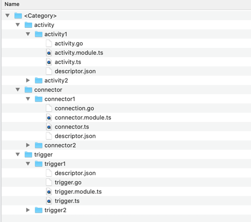

---
date: 2016-04-09T16:50:16+02:00
title: trigger.go
weight: 59
---

We are as excited as you to help you develop new cool contributions that will enable application developers do better integration with hundreds of services.

Before we start, you should

* Create an account on TIBCO Cloud Integration(TCI). Just sign up for free trial account.
* Read Flogo documentation. Get familiar with key concepts like Application, Flow, Activity, Trigger, Connection.
* Read about Go Programming Language (1.7 and above). The Flogo runtime is powered by Open Source Project Flogo.
* Read about Angular TypeScript concepts like NgModule, Service, fat Arrow Functions, ReactiveX
* Read about JSON
* Read Flogo Typescript SDK

You can add following contributions:

* Activity - Add new activity to Flogo. An activity takes one or more inputs and construct one or more output values.
* Trigger - Add new trigger to Flogo. An trigger can receive event and trigger flows
* Connector - Add new connection type to Flogo. A connector defines one or more configurations and makes connection with external services e.g. Salesforce, Database etc.

Sounds exciting? Want to jump to coding?

Before that, lets quickly look at files that you would be creating for your contribution.

|Component|Technology|Activity| Trigger| Connector |Description|
|---------|----------|-----------------|----------|-------|-------|
|Model|	JSON |	descriptor.json| descriptor.json|descriptor.json|Every contribution must define the model in JSON format.|
|UI(Optional)|	Angular 2.x TypeScript|activity.ts activity.module.ts|trigger.ts trigger.module.ts|connector.ts connector.module.ts|In situations where the value or display of a field is dependent on values of preceding fields, the contribution should provide typescripts. It consists of *.module.ts (Angular Module) and *.ts (Angular Service) We do not support third-party libraries in typescript code. Recommended using HTTP module wherever possible.|
|Runtime|Golang|activity.go activity_test.go|trigger.go *.test.go|connection.go *.test.go|Every contribution must write the runtime code in Go (activity.go).<./br>You can leverage Go testing framework for writing unit test cases(activity_test.go) for your contribution runtime. |

Contribution layout

Your contributions must follow below folder layout.

**Where**
* <Category> - Name of category defined in the model
* <ActivityX> - Lower case activity name (In accordance with Golang package naming convention)
* <TriggerX> -Lower case trigger name
* <ConnectorX> -Lower case connector name

**Note**
In the folder layout above the following items are optional
* Any ts file -> ts file requires if UI fields need dynamic set values or set visibility
* Under each category you can have only one activity or one trigger or just have one connection.

Activity Contribution
It is very easy to develop an activity for Flogo. Just create the model and runtime files that adhere to following templates:

{
//Unique activity name without spaces or special characters
"name": "demo",

    // Name of the author
    "author": "TIBCO Software Inc.",
    
    // Indicates that it is an activity model
    "type": "flogo:activity",

    // Version of the activity 
	"version": "1.0.0",

    // Display name
	"title": "Demo Activity",

    // Mandatory activity display configuration
	"display": {
       // Activity description 
	   "description": "This is demo activity",
       // Category under which this activity will be displayed
       "category": "TIBCO", 
       // Make this activity visible/invisible under given category
       "visible": true,
       // Path to the small icon file.
       // Size Limit:1KB
       // Format: PNG, SVG
       "smallIcon": "demo-small-icon.png",
       // Path to the small icon file. 
       // Size Limit: 2KB
       // Format: PNG, SVG
       "largeIcon": "demo-large-icon.png"
    },

    // This value is used by runtime to load the activity implantation. 
    // It must follow below naming scheme. 
    // Add your Github repository path in case you are hosting your contributions on github.com
    // e.g. "github.com/<GITHUB USERNAME>/wi-contributions/<CATEGORY SPECIFIED IN DISPLAY CONFIGURATION>/activity/<LOWER CASE ACTIVITY NAME>",
	"ref":  "<CATEGORY SPECIFIED IN DISPLAY CONFIGURATION>/activity/<LOWER CASE ACTIVITY NAME>",
    
    // One or more activity inputs
	"inputs": [
           {
            // Name of the field that would be set in the activity input.
			"name": "field1",

            // Runtime datatype of the field. Supported types are: string, integer, boolean, complex_object
			"type": "string",

            // Is required field. 
			"required": true,
            
            // Optional field display configuration.
            // If present, determines layout of this field.
            “display”: {
			  ....
            },
            
            // Default value for the field based on the type.
			"value": "this is default value"
		  }
          ..... 
	],

    // One or more activity outputs
	"outputs": [
           {
            // Name of the field that would be set in the activity input.
			"name": "field1",

            // Runtime datatype of the field. Supported types are: string, integer, boolean, complex_object
			"type": "string",

            // Is required field. 
			"required": true,
            
            // Optional field display configuration.
            // If present, determines default layout of this field.
            “display”: {
			  ....
            },
            
            // Default value for the field based on the type. This can be overridden at runtime.
			"value": "this is default value"
		  }
          .....
	]
}

package demo

import (
"github.com/TIBCOSoftware/flogo-lib/core/activity"
"github.com/TIBCOSoftware/flogo-lib/logger"
)

// Create a logger for the Sample Activity
// Logger Name : <category>-activity-<type>
var activityLog = logger.GetLogger("tibco-activity-demo")

// This must be defined by the activity implementation.
type DemoActivity struct {
metadata *activity.Metadata
}

// Creates an activity instance with the metadata defined in the activity.json
// This must be defined by the activity implementation.
// It is called during package initialization.
func NewActivity(metadata *activity.Metadata) activity.Activity {
return &DemoActivity{metadata: metadata}
}

// Metadata returns the activity's metadata.
// This must be defined by the activity implementation.
func (a *DemoActivity) Metadata() *activity.Metadata {
return a.metadata
}

// Eval is called when an Activity is being executed.  
// Returning true indicates that the activity is done.
// Activity Name, Flow Name, Input(s) and Output(s) can be accessed through activity.Context.
// Refer https://github.com/TIBCOSoftware/flogo-lib/blob/master/core/activity/context.go for more details.
func (a *DemoActivity) Eval(context activity.Context) (done bool, err error) {
//Return true for successful execution else false indicating error
return true, nil
}

The activity UI is divided into following 5 main sections. Based on definition in the model(activity.json), fields will be displayed on the appropriate section.

Section	Description	Example
Configuration	Any input field with display configuration.	{
"name": "field1",
"type": "string",
"required": true,
“display”: {
....
}
}
Input	Any input field with no display configuration. It is mapper section where output values from previous activities can be mapped to the field value.	{
"name": "field1",
"type": "string",
"required": true
}
Input Settings	Any input field that has a display configuration and contributes a schema to the Input section for the value mapping. The mappable flag must be set to true.
{
"name": "field1",
"type": "string",
"required": true,
“display”: {
....

"mappable": true
}

}

Output	Any output field with no display configuration. This field value can be used in the Input section of downstream activities in the flow.	{
"name": "output",
"type": "string",
"required": true
}
Output Settings	Any output field that has a display configuration and contributes a schema to the Output section. This field value can be used in the Input section of downstream activities in the flow.
{
"name": "output",
"type": "string",
"required": true,
“display”: {
....

}

}

Now that you are familiar with the templates and UI sections, let's create a simple activity(we will call it Concat) that takes two input strings and returns a concatenated string.

Create a folder named concat in the TIBCO category with following files:

{
"name": "concat",
"title": "Concat Activity",
"version": "1.0.0",
"type": "flogo:activity",
"author": "TIBCO Software Inc.",
"display": {
"category": "TIBCO",
"visible": true,
"smallIcon": "concat-small-icon.png",
"largeIcon": "concat-large-icon.png",
"description": "This activity returns concatenation of two strings",
},

    "ref": "TIBCO/activity/concat",
    "inputs": [
           {
            "name": "firstString",
            "type": "string",
            "required": true
           },
           {
            "name": "secondString",
            "type": "string",
            "required": true
           }
    ],
  
    "outputs": [
           {
            "name": "result",
            "type": "string"
          }
    ]
}

package concat

import (
"github.com/TIBCOSoftware/flogo-lib/core/activity"
"github.com/TIBCOSoftware/flogo-lib/logger"
)

const (
ivField1    = "firstString"
ivField2    = "secondString"
ovResult    = "result"
)

var activityLog = logger.GetLogger("tibco-activity-concat")

type ConcatActivity struct {
metadata *activity.Metadata
}

func NewActivity(metadata *activity.Metadata) activity.Activity {
return &ConcatActivity{metadata: metadata}
}

func (a *ConcatActivity) Metadata() *activity.Metadata {
return a.metadata
}
func (a *ConcatActivity) Eval(context activity.Context) (done bool, err error) {
activityLog.Info("Executing Concat activity")
//Read Inputs
if context.GetInput(ivField1) == nil {
// First string is not configured
// return error to the engine
return false, activity.NewError("First string is not configured", "CONCAT-4001", nil)
}
field1v := context.GetInput(ivField1).(string)

    if context.GetInput(ivField2) == nil {
      // Second string is not configured
      // return error to the engine 
      return false, activity.NewError("Second string is not configured", "CONCAT-4002", nil)
    }
    field2v := context.GetInput(ivField2).(string)  
    
    //Set output
    context.SetOutput(ovResult, field1v+field2v)
	return true, nil
}

Let's write runtime unit test cases for Concat activity. We will use Golang testing package.

package concat

import (
"testing"
"github.com/TIBCOSoftware/flogo-contrib/action/flow/test"
"github.com/TIBCOSoftware/flogo-lib/core/activity"
"github.com/stretchr/testify/assert"
"io/ioutil"
)

var activityMetadata *activity.Metadata

func getActivityMetadata() *activity.Metadata {
if activityMetadata == nil {
jsonMetadataBytes, err := ioutil.ReadFile("activity.json")
if err != nil {
panic("No Json Metadata found for activity.json path")
}
activityMetadata = activity.NewMetadata(string(jsonMetadataBytes))
}
return activityMetadata
}

func TestActivityRegistration(t *testing.T) {
act := NewActivity(getActivityMetadata())
if act == nil {
t.Error("Activity Not Registered")
t.Fail()
return
}
}

func TestEval(t *testing.T) {
act := NewActivity(getActivityMetadata())
tc := test.NewTestActivityContext(act.Metadata())
//setup attrs
tc.SetInput("firstString", "Hello ")
tc.SetInput("secondString", "World! ")
done, err := act.Eval(tc)
assert.Nil(t, err)
result := tc.GetOutput("result")
assert.Equal(t, result, "Hello World!")
}

You can test your runtime code against Open Source Flogo code.

Ensure $GOPATH variable is set
Ensure your <Category> folder is added to the $GOPATH
Pull Flogo code:
go get github.com/TIBCOSoftware/flogo-lib
go get github.com/TIBCOSoftware/flogo-contrib
Run 'go test ./..' from your <Category> folder.

And your Concat activity is ready for the use in Flogo. Wasn't that easy?

In next section, we will see how to upload and test your contribution in Flogo applications.

Upload your contribution to TIBCO Cloud Integration
Once contribution is ready, you can upload it using your TCI account.

WIP

Advanced Configuration
What we have seen so far is a very simple contribution. How about an activity that displays a dropdown list or displays input/output structure based on a JSON schema?

Do you remember optional display configuration in the model json? Well, that is the place where you can configure display settings for your fields.

Lets understand runtime datatypes that you can set to your fields in the model json.

Datatype	Golang Datatype	Description
string	string	string field
integer	int64	64 bit integer field
boolean	bool	boolean field
number	float64	float64 field
complex_object
data.ComplexObject

Refer https://github.com/TIBCOSoftware/flogo-lib/blob/master/core/data/data.go

It has two part:

Metadata - A stringified JSON schema that can be used for the data validation
Value - A JSON data that is being passed to the runtime
Use this type when you need schema and data together for given field.

To use this type, import package github.com/TIBCOSoftware/flogo-lib/core/data into your code.

array
[]map[string]interface{}

A JSON array value like '[{"a":"1", "b":"2"},{"a":"2", "b":"3"},{"a":"4", "b":"5"}]' can be set to array field.
object	map[string]interface{}	A JSON object

Now, lets understand various display configurations that are applicable to contribution(activity, connector) fields.

Configuration	Description	Model Configuration	Example
Invisible	Make field invisible in UI
“display”: {

"visible": false

}

{
"name": "method",
"type": "string",
"required": true,
“display”: {
“visible”:false
}
"value": "GET"
}
Readonly	Make field readonly in UI
“display”: {

"readonly": true

}

{
"name": "method",
"type": "string",
"required": true,
“display”: {
“readonly”:true
},
"value": "GET"
}
Text Field
Render field as a text field.

The field type must be string.

“display”: {
"name": <DISPLAY LABEL>,
"description":<DESCRIPTION>
}

{
"name": "url",
"type": "string",
"required": true,
“display”: {
"name":"URL",
"description": "Enter service URL"
}
}
Choice
Render field as a choice field.

The field type must be boolean.

Users will be presented with True or False choice.

“display”: {
"name": <DISPLAY LABEL>,
"description":<DESCRIPTION>

}

"value": <DEFAULT CHOICE>

{
"name": "logheaders",
"type": "boolean",
"required": true,
“display”: {
"name":"Log Incoming headers ",
"description": "Log incoming headers"

}

"value": false
}

Checkbox
Render field as a checkbox field.

The field type must be string.

The field value would be a comma separated string of all options selected by the user.

“display”: {
"name": <DISPLAY LABEL>,
"description":<DESCRIPTION>,

"type": "checkbox"
}

"allowed": ["OPTION1","OPTION2","OPTION3" ],

"value": "OPTION2,OPTION3"

{
"name": "days",
"type": "string",
"required": true,
“display”: {
"name":"Select a day ",
"description": "Select a day for the audit",

"type": "checkbox"

}

"allowed": ["Monday", "Wednesday", "Friday"]

"value": "Monday"
}

Dropdown
Render field as a dropdown list.

The field type must be string.

“display”: {
"name": <DISPLAY LABEL>,
"description":<DESCRIPTION>,
"type": "dropdown",
"selection": "<single | multi>"
}
"allowed":[<ZERO OR MORE ITEMS>]
"value": <DEFAULT VALUE TO BE SELECTED>

{
"name": "method",
"type": "string",
"required": true,
“display”: {
"name":"Method",
"description": "The REST method used for the requests",
“type”:”dropdown”,
“selection”:”single”
},
"allowed": ["GET","POST","PUT","DELETE"],
"value": "GET"
}

================================================

{
"name": "businessobjects",
"type": "string",
"required": true,
“display”: {
"name":"Business Objects",
"description": "The Salesforce Business Objects for given connection",
“type”:”dropdown”,
“selection”:”single”
},
"allowed": []
}

File Selector
Render field as a file selector.

The field type must be string.

“display”: {
"name": <DISPLAY LABEL>,

"description":<DESCRIPTION>,

"type": "fileselector",

"fileExtensions":[<ONE OR MORE FILE EXTENSIONS>]

}

{
"name": "certificate",
"type": "string",
"display": {
"name": "Server Certificate"
"description": "Self-signed PEM certificate for secure connection",
“type”: "fileselector",
"fileExtensions": [".pem",".cert",".cer",".crt"]
}
"required": true
}

Connection Selector
Render field as a connection selector.

The field type must be object.

The connection configuration will be stored in this field for the runtime.

"type": "object",
"display": {
"type":"connection",
"name":<DISPLAY LABEL>,
"description": <DESCRIPTION>
},

"allowed":[]

{
"name": "connection",
"type": "object",
"display": {
"type":"connection",
"name": "Connection Name",
"description": "Select a Marketo connection"
},
"allowed":[]
"required": true
}

Table
Render field as a table.

The field type must be array.

"display": {
“type”: "table",
“name”:<DISPLAY LABEL>,
"description": <DESCRIPTION>,
"schema": <JSON BASED TABLE SCHEMA>

},
"value":[{<DEFAULT VALUE1>},{<DEFAULT VALUE2>}, ...]

{
"name": "books",
"type": "array",
"display": {
“type”: "table",
“name”:”Pick Books”,
"description": "The headers you want to send",
"schema": "{\"type\":\"array\",\"items\":{\"type\":\"object\",\"properties\":{\"BookName\":

{\"type\":{\"enum\":[\"X\",\"Y\",\"Z\"]}},\"Quantity\":{\"type\":\"number\"}}}"

},
"value": [{\"BookName\":\"X\",\"Quantity\":0},{\"BookName\":\"Z\",\"Quantity\":0}]

}

Password
Render field as a secrete type.

Value entered will not be displayed in clear text.

The field type must be string.

“display”: {
"name": <DISPLAY LABEL>,

"description":<DESCRIPTION>,

"type": "password"

}

{
"name": "userpassword",
"type": "string",
"required": true,
“display”: {
"name":"Enter Password",
"description": "Enter Salesforce password",
“type”:”password”
}

}

Text Editor
Render field as a text editor for given syntax.

This field can be used to configure a JSON schema.

The field type must be complex object.

“display”: {
"name": <DISPLAY LABEL>,

"description":<DESCRIPTION>,

"type": "texteditor",

"syntax": "json"

}

{
"name": "responseBody",
"type": "complex_object",
"display": {
“type”: "texteditor",
"description": "An example JSON data that you expect back from the REST service",
“name”:”Response Schema”,
“syntax”:”json”
}
}

App property Enablement	The appPropertySupport is a boolean flag to indicate if a particular field is enabled to support application property substitution . This is indicated by the extension developer.
"display": {

....

"appPropertySupport" : true/false

}

if not defined then the default is false

{
"name": "url",
"type": "string",
"required": true,
“display”: {
"name":"URL",
"description": "Enter service URL",

"appPropertySupport" : true
},

}

App property Enabled

NOT FOR DEVELOPERS

The appPropertyEnabled is a boolean flag to indicate if a appPropertySupport == true enabled field is having an application property used. This is indicated by the Application developer.
"display": {

....

"appPropertyEnabled" : true/false

}

if not defined then the default is false, this is done dynamically during application use.

{
"name": "url",
"type": "string",
"required": true,
“display”: {
"name":"URL",
"description": "Enter service URL",

"appPropertySupport" : true,

"appPropertyEnabled" : true

},

}

Now, lets enhance our Concat activity. How about we let users select a separator for concatenation?

{
"name": "concat",
"title": "Concat Activity",
"author": "TIBCO Software Inc.",
"version": "1.0.0",
"type": "flogo:activity",

    "display": {
       "category": "TIBCO",
       "visible": true,
       "smallIcon": "concat-small-icon.png",
       "largeIcon": "concat-large-icon.png",
       "description": "This activity returns concatenation of two strings",
    },
 
    "ref": "TIBCO/activity/concat",
    "inputs": [
           {
            "name": "firstString",
            "type": "string",
            "required": true
           },
           {
            "name": "secondString",
            "type": "string",
            "required": true
           },
           {
            "name": "separator",
            "type": "string",
            "required": true,
            "display": {
               "name": "Separator",
               "type": "dropdown",
               "selection": "single",
               "description": "Select a separator for concatenation"
            },
            "allowed":["-","#"]
           }
    ],
  
    "outputs": [
           {
            "name": "result",
            "type": "string"
          }
    ]
}

package concat

import (
"github.com/TIBCOSoftware/flogo-lib/core/activity"
"github.com/TIBCOSoftware/flogo-lib/logger"
)

const (
ivField1    = "firstString"
ivField2    = "secondString"
ivField3    = "separator"
ovResult    = "result"
)

var activityLog = logger.GetLogger("tibco-activity-concat")

type ConcatActivity struct {
metadata *activity.Metadata
}

func NewActivity(metadata *activity.Metadata) activity.Activity {
return &ConcatActivity{metadata: metadata}
}

func (a *ConcatActivity) Metadata() *activity.Metadata {
return a.metadata
}
func (a *ConcatActivity) Eval(context activity.Context) (done bool, err error) {
activityLog.Info("Executing Concat activity")
//Read Inputs
if context.GetInput(ivField1) == nil {
// First string is not configured
// return error to the engine
return false, activity.NewError("First string is not configured", "CONCAT-4001", nil)
}
field1v := context.GetInput(ivField1).(string)

    if context.GetInput(ivField2) == nil {
      // Second string is not configured
      // return error to the engine 
      return false, activity.NewError("Second string is not configured", "CONCAT-4002", nil)
    }
    field2v := context.GetInput(ivField2).(string)
  
    if context.GetInput(ivField3) == nil {
      // Separator is not configured
      // return error to the engine 
      return false, activity.NewError("Separator is not configured", "CONCAT-4003", nil)
    }
    field3v := context.GetInput(ivField3).(string)
    
    //Set output
    context.SetOutput(ovResult, field1v+field3v+field2v)
	return true, nil
}

In above example, users must select a separator. How about we let users decide whether to use separator or not? And what if you dont want to hardcode separator list in the json?

Well, all this can be solved with a simple typescript(ts) code that adhere to following templates:

import { HttpModule } from "@angular/http";
import { NgModule } from "@angular/core";
import { CommonModule } from "@angular/common";
import { SampleActivityUIContributionHandler} from "./activity";
import { WiServiceContribution } from "wi-studio/app/contrib/wi-contrib";

@NgModule({
imports: [
CommonModule,
HttpModule,
],
providers: [
{
provide: WiServiceContribution,
useClass: SampleActivityUIContributionHandler
}
]
})

export default class SampleActivityModule {

}

import {Observable} from "rxjs/Observable";
import {Injectable, Injector, Inject} from "@angular/core";
import {Http} from "@angular/http";
import {
WiContrib,
WiServiceHandlerContribution,
IValidationResult,
ValidationResult,
IFieldDefinition
IActivityContribution,
ActionResult,
IActionResult
} from "wi-studio/app/contrib/wi-contrib";

@WiContrib({})
@Injectable()
export class SampleActivityUIContributionHandler extends WiServiceHandlerContribution {
constructor( @Inject(Injector) injector) {
super(injector);
}

/**
* Value for the field
* Arguments:
*        fieldName - Name of the field for which value should be returned
*        context   - Activity model(activity.json) with latest values
* Returns:
*       Observable<any> - In cases where return value depends on external services (e.g. HTTP), return Observable
*       any             - Primitive value or Array of primitive values
*/

    value = (fieldName: string, context: IActivityContribution): Observable<any> | any => {
        return null;
    }

/**
* Validate the field value and/or update visual appearance of the field.
* Arguments:
*        fieldName - Name of the field for which value should be returned
*        context   - Activity model(activity.json) with latest values
* Returns:
*       Observable<IValidationResult> - In cases where validation depends on external services (e.g. HTTP), return Observable
*       IValidationResult             - Result of validation
*/
validate = (fieldName: string, context: IActivityContribution): Observable<IValidationResult> | IValidationResult => {
return null;
}
}

Now, lets create two type script files for our Concat activity. In type script, we will make the separator field visible only when users want to use it. We will also construct and return separator list.

{
"name": "concat",
"version": "1.0.0",
"title": "Concat Activity",
"author": "TIBCO Software Inc.",
"type": "flogo:activity",

    "display": {
       "category": "TIBCO",
       "visible": true,
       "smallIcon": "concat-small-icon.png",
       "largeIcon": "concat-large-icon.png",
       "description": "This activity returns concatenation of two strings",
    },
 
    "ref": "TIBCO/activity/concat",
    "inputs": [
           {
            "name": "firstString",
            "type": "string",
            "required": true
           },
           {
            "name": "secondString",
            "type": "string",
            "required": true
           },
           {
            "name": "useSeparator",
            "type": "boolean",
            "required": true,
            "display": {
               "name": "Use Separator",
               "description": "Use separator for concatenation"
            },
            "value": false
           },
           {
            "name": "separator",
            "type": "string",
            "required": true,
            "display": {
               "name": "Separator",
               "type": "dropdown",
               "selection": "single",
               "description": "Select a separator for concatenation",
               "visible": false
            },
            "allowed":[]
           }
    ],
  
    "outputs": [
           {
            "name": "result",
            "type": "string"
          }
    ]
}

import { HttpModule } from "@angular/http";
import { NgModule } from "@angular/core";
import { CommonModule } from "@angular/common";

import { ConcatActivityContributionHandler} from "./activity";
import { WiServiceContribution} from "wi-studio/app/contrib/wi-contrib";

@NgModule({
imports: [
CommonModule,
HttpModule,
],
providers: [
{
provide: WiServiceContribution,
useClass: ConcatActivityUIContributionHandler
}
]
})

export default class ConcatActivityModule {

}

import {Observable} from "rxjs/Observable";
import {Injectable, Injector, Inject} from "@angular/core";
import {Http} from "@angular/http";
import {
WiContrib,
WiServiceHandlerContribution,
IValidationResult,
ValidationResult,
IFieldDefinition
IActivityContribution,
ActionResult,
IActionResult
} from "wi-studio/app/contrib/wi-contrib";

@WiContrib({})
@Injectable()
export class ConcatActivityContributionHandler extends WiServiceHandlerContribution {
constructor( @Inject(Injector) injector) {
super(injector);
}

    value = (fieldName: string, context: IActivityContribution): Observable<any> | any => {
        if(fieldName === "separator") {
           let list: Array<string> = ["-", "$", "#"];
           return list;
        } 
        return null;
    }
 
    validate = (fieldName: string, context: IActivityContribution): Observable<IValidationResult> | IValidationResult => {
       if (fieldName === "separator") {
         let vresult: IValidationResult = ValidationResult.newValidationResult();
         let useSeparatorFieldDef: IFieldDefinition = context.getField("useSeparator") 
         let separatorFieldDef: IFieldDefinition = context.getField("separator")
         if (useSeparatorFieldDef.value && useSeparatorFieldDef.value === true) {
             if (separatorFieldDef.display && separatorFieldDef.display.visible == false {
                 vresult.setVisible(true);
             } 
             if (separatorFieldDef.value === null || separatorFieldDef.value === "") {
               vresult.setError("Separator must be configured");
             } 
         } else {
            vresult.setVisible(false);
         }
         return vresult;
       }
      return null; 
    }
}

package concat

import (
"github.com/TIBCOSoftware/flogo-lib/core/activity"
"github.com/TIBCOSoftware/flogo-lib/logger"
)

const (
ivField1    = "firstString"
ivField2    = "secondString"
ivField3    = "separator"
ivField4    = "useSeparator"
ovResult    = "result"
)

var activityLog = logger.GetLogger("tibco-activity-concat")

type ConcatActivity struct {
metadata *activity.Metadata
}

func NewActivity(metadata *activity.Metadata) activity.Activity {
return &ConcatActivity{metadata: metadata}
}

func (a *ConcatActivity) Metadata() *activity.Metadata {
return a.metadata
}
func (a *ConcatActivity) Eval(context activity.Context) (done bool, err error) {
activityLog.Info("Executing Concat activity")
//Read Inputs
if context.GetInput(ivField1) == nil {
// First string is not configured
// return error to the engine
return false, activity.NewError("First string is not configured", "CONCAT-4001", nil)
}
field1v := context.GetInput(ivField1).(string)

    if context.GetInput(ivField2) == nil {
      // Second string is not configured
      // return error to the engine 
      return false, activity.NewError("Second string is not configured", "CONCAT-4002", nil)
    }
    field2v := context.GetInput(ivField2).(string)

    field4v := context.GetInput(ivField4).(bool)
  
    if field4v && context.GetInput(ivField3) == nil {
      // Separator is not configured
      // return error to the engine 
      return false, activity.NewError("Separator is not configured", "CONCAT-4003", nil)
    }
    field3v := context.GetInput(ivField3).(string)

    if field4v {
      //Use separator in concatenation
      context.SetOutput(ovResult, field1v+field3v+field2v)
    } else {
      //No separator in concatenation
      context.SetOutput(ovResult, field1v+field2v)
    }
	return true, nil
}

Connector Contribution
Do you need to integrate with a SAAS service?  Then, you would need a connector to manage connectivity with the SAAS provider.

Like activities, contributing a connector is very easy.

To contribute a connector, create model and typescript files that adhere to following template:

{
// Unique connector name without spaces or special characters
"name": "demo",
//Unique connector ID without spaces
"title": "Demo Connector",
// Name of the author
"author": "TIBCO Software Inc.",
// Indicates that it is a connector model
"type": "flogo:connector",
// Version of the connector
"version": "1.0.0",

    // Connector display configuration
    "display": {
       // Connector description
       "description": "This is TIBCO JDBC connector",
       // Category under which this connector will be displayed
       "category": "TIBCO",
       // Make this connector visible/invisible
       "visible": true,
       // Path to the small icon file.
       // Size Limit:1KB
       // Format: PNG, SVG
       "smallIcon": "jdbc-small-icon.png",
       // Path to the small icon file.
       // Size Limit: 2KB
       // Format: PNG, SVG
       "largeIcon": "jdbc-large-icon.png"
    },
 
    // ref value must be unique and should not conflict with any other connectors.
    // It must be category name followed by lower case connector name.
    // Add your Github repository path in case you are hosting your contributions on github.com
    // e.g. "github.com/<GITHUB USERNAME>/wi-contributions/<CATEGORY SPECIFIED IN DISPLAY CONFIGURATION>/connector/<LOWER CASE CONNECTOR NAME>",
    "ref": "<CATEGORY SPECIFIED IN DISPAY CONFIGURATION>/connector/<LOWER CASE CONNECTOR NAME>",

    /**
 	* Provider the field name in settings section which will hold identifiable
 	* name for the connection. In the absence of this keyfield the unique
 	* connection record identifier e.g. uuid will be used for display.
 	*/
	keyfield: string;
     
    // One or more configuration fields
    "settings": [
           {
            // Name of the field
            "name": "field1",
  
            // Type of the field
            "type": "string",
  
            // Is required field.
            "required": true,
             
            // Optional field display configuration.
            // If present, determines default layout of this field.
            “display”: {
              ....
            }
             
            // Default value based on the type
            "value": "this is default value"
          },
          // FOR AUTHENTICATION TYPE IS OAUTH FIXED ReEntry Field Name
          // The use is determined by IActionResult.authType == AUTHENTICATION_TYPE.OAUTH2
          // When Authentication type is AUTHENTICATION_TYPE.OAUTH2 IActionResult should
          // have a
          // This is not used for other Authentication purposes where it does not
          // involve a round trip to the third party auth system with a callback
          // URL to TCI Flogo UI URL for connectors.
		  {
             "name" : "WI_STUDIO_OAUTH_CONNECTOR_INFO",
             "type" : "string",
             "display": {
				"visible": false
             }
		  }
          .....
    ],
    
    // Action buttons to be displayed on the Connector UI
    "actions": [
          {
            // Display label
            "name": "Create",
            // Optional button display configuration.
            // If present, determines default layout of this button.
            “display”: {
              ....
            }
          }

          .....
    ]
}

import { HttpModule } from "@angular/http";
import { NgModule } from "@angular/core";
import { CommonModule } from "@angular/common";
import {SampleConnectorContributionHandler} from "./connector";
import {WiServiceContribution} from "wi-studio/app/contrib/wi-contrib";

@NgModule({
imports: [
CommonModule,
HttpModule
],
providers: [
{
provide: WiServiceContribution,
useClass: SampleConnectorContributionHandler
}
]
})

export default class SampleConnectorModule {

}

import {Observable} from "rxjs/Observable";
import {Injectable, Injector, Inject} from "@angular/core";
import {Http, Response, Headers} from "@angular/http";
import {
WiContrib,
WiServiceHandlerContribution,
IValidationResult,
ValidationResult,
IFieldDefinition
IActivityContribution,
IConnectorContribution
ActionResult,
IActionResult
} from "wi-studio/app/contrib/wi-contrib";

@WiContrib({})

@Injectable()
export class SampleConnectorContributionHandler extends WiServiceHandlerContribution {
constructor( @Inject(Injector) injector, @Inject(Http) http) {
super(injector, http);
}

/**
* Return a value for the given field.
* Input:
*        fieldName - Name of the field
*        context   - Connector model(connector.json) with latest values
* Output: Either a field value or Observable in case of asynchronous operations
*   any             - Primitive value or Array of primitive values
*   Observable<any> - Observable for asynchronous reply(HTTP)
*/
value = (fieldName: string, context: IConnectorContribution): Observable<any> | any => {
return null;
}

/**
* Validate the field value and/or update visual appearance of the field or button
* Input:
*        name     - Name of the field or action
*        context  - Connector model(connector.json) with latest values
* Output:
*       Observable<IValidationResult> - In cases where validation depends on external services (e.g. HTTP), return Observable
*       IValidationResult             - Result of validation
*/
validate = (name: string, context: IConnectorContribution): Observable<IValidationResult> | IValidationResult => {
return null;
}

/**
* Handle actions defined in the connector.json.
* Connector configuration can be updated in this method.
* Input:
*        actionId  - Action ID associated with the action
*        context   - Connector model(connector.json) with latest values
* Output: Either action result or Observable in case of asynchronous operations
*        IActionResult             - For synchronous invocations  
*        Observable<IActionResult> - For asynchronous invocations(e.g. HTTP)
*/
action = (actionId: string, context: IConnectorContribution): Observable<IActionResult> | IActionResult => {
return null;
}
}

Are you ready to develop some real world connectors?

In the next example, we are going to develop a connector for Amazon Simple Queue Service aka SQS. We will also develop two activities that will use SQS connector to send and receive messages from the SQS.

Before we start, make sure you have:

Access key ID for AWS account
Secrete Access Key for AWS account
SQS service running in your favorite region
Lets start with the layout. We will create contribution related files as shown below:

Now, lets begin with the connector model.

{
"name": "tibco-sqs",
"title": "TIBCO SQS Connector",
"author": "TIBCO Software Inc.",
"type": "flogo:connector",
"version": "1.0.0",

    "display": {
       "description": "This is Amazon SQS connector",
       "category": "AWS",
       "visible": true,
       "smallIcon": "sqs-small-icon.png",
       "largeIcon": "sqs-large-icon.png"
    },
 
    "ref": "AWS/connector/sqs",
     
    "settings": [
           {
            "name": "accessKeyId",
            "type": "string",
            "required": true,
            “display”: {
              "name": "Access Key ID",
              "description": "AWS Access key ID for the user",
              // Onlookers should not see your access key id value
              "type": "password" 
            }
          },
          {
            "name": "secreteAccessKey",
            "type": "string",
            "required": true,
            “display”: {
              "name": "Secrete Access Key",
              "description": "AWS Secrete Access Key for the user",
              // Onlookers should not see your secrete key value
              "type": "password" 
            }
          },
          {
            "name": "region",
            "type": "string",
            "required": true,
            “display”: {
              "name": "Region",
              "description": "Name of the region where SQS service is running"
            }
          }
    ],
    
    "actions": [
          {
            // Lets validate the configuration by querying queues in the given region
            "name": "Connect",
            "actionId": "connect",
            “display”: {
              // Connect button will be disabled until all configuration values are provided 
              "readonly": true
            }
          }
    ]
}

Now, lets write type script code for SQS connector.

import { HttpModule } from "@angular/http";
import { NgModule } from "@angular/core";
import { CommonModule } from "@angular/common";
import {TibcoSQSConnectorContribution} from "./connector";
import {WiServiceContribution} from "wi-studio/app/contrib/wi-contrib";

@NgModule({
imports: [
CommonModule,
HttpModule,
],
providers: [
{
provide: WiServiceContribution,
useClass: TibcoSQSConnectorContribution
}
]
})

export default class TibcoSQSConnectorModule {

}

import {AWS} from 'aws-sdk';

import {Observable} from "rxjs/Observable";
import {Injectable, Injector, Inject} from "@angular/core";
import {Http, Response, Headers} from "@angular/http";
import {
WiContrib,
WiServiceHandlerContribution,
IValidationResult,
ValidationResult,
IFieldDefinition
IActivityContribution,
IConnectorContribution
ActionResult,
IActionResult
} from "wi-studio/app/contrib/wi-contrib";

@WiContrib({})

@Injectable()
export class TibcoSQSConnectorContribution extends WiServiceHandlerContribution {
constructor( @Inject(Injector) injector) {
super(injector);
}

    value = (fieldName: string, context: IConnectorContribution): Observable<any> | any => {
        return null;
    }
 
    validate = (name: string, context: IConnectorContribution): Observable<IValidationResult> | IValidationResult => {
      if( name === "Connect") {
         let accessKeyId: IFieldDefinition = context.getField("accessKeyId");
         let secreteKey: IFieldDefinition = context.getField("secreteAccessKey");
         let region: IFieldDefinition = context.getField("region");
         if( accessKeyId.value && secreteKey.value && region.value) {
            // Enable Connect button
            return ValidationResult.newValidationResult().setReadonly(false)
         }
      }
       return null;
    }

    action = (actionId: string, context: IConnectorContribution): Observable<IActionResult> | IActionResult => {
       if( actionId == "connect") {
         let accessKeyId: IFieldDefinition = context.getField("accessKeyId");
         let secreteKey: IFieldDefinition = context.getField("secreteAccessKey");
         let region: IFieldDefinition = context.getField("region");
         AWS.config.update({
               region: region.value,
               credentials: new AWS.Credentials(accessKeyId.value, secreteKey.value)
         });
         let sqs = new AWS.SQS();
         let params = {};
		 sqs.listQueues(params, function(err, data) {
  		    if (err) {
    		   return ActionResult.newResult().setError("Failed to connect to SQS service due to error: ".concat(err));
  		    } else {
    		  return ActionResult.newResult().setError("Successfully connected to SQS service");
  		    }
		 });
       }
       return null;
    }
}

Now, lets create the activity that will send a message on the queue.

Lets begin with the model. We will refer http://docs.aws.amazon.com/AWSSimpleQueueService/latest/APIReference/API_SendMessage.html to model our activity.

{
"name": "sqssendmessage",
"version": "1.0.0",
"author": "TIBCO Software Inc.",
"type": "flogo:activity",
"title": "Send SQS Message",

    "display": {
       "category": "AWS",
       "visible": true,
       "smallIcon": "sqssendmessage-small-icon.png",
       "largeIcon": "sqssendmessage-large-icon.png",
       "description": "This activity sends a message to the queue",
    },
 
    "ref": "AWS/activity/sqssendmessage",
    "inputs": [
           {
            //Select SQS connection from the list
            "name": "sqsConnection",
            "type": "object",
            "required": true,
            "display":{
              "name": "SQS Connection",
              "description": "Select SQS Connection",
              "type": "connection"
            },
            "allowed":[]
           },
           {
            //Select Queue URL from the list
            "name": "queueUrl",
            "type": "string",
            "required": true,
            "display":{
              "name": "Queue URL",
              "description": "Select Queue URL"
            },
            "allowed":[]
           },
           {
            //Set message attributes
            //JSON should be in the below format
            //{
  			//	"<Attrubute1Name>": {
    		//		DataType: "",
    		//		StringValue: ""
   			//	},
  			// "<Attrubute2Name>": {
    		//		DataType: "",
    		//		StringValue: ""
   			//	},
  			//	...
 			//}
            "name": "MessageAttribute",
            "type": "complex_type",
            "required": false,
            "display": {
               "name": "Message Attributes",
               "description": "Set message attributes",
               "type": "texteditor",
               "syntax": "json",
               "mappable": true
            },
            //Sample attributes that users can update
            "value": {
              "metadata": "",
              "value": "{ \"Attr1\": {DataType: \"String\",StringValue: \"value1\"},\"Attr2\": {DataType: \"String\",StringValue: \"value2\"}}"
           },
           {
            "name": "DelaySeconds",
            "type": "number",
            "required": false
           },
           {
            "name": "MessageBody",
            "type": "string",
            "required": true
           }
    ],
  
    "outputs": [
           {
            "name": "MessageId",
            "type": "string"
          }
    ]
}

Now, lets create type script code to fetch SQS connection and Queue URLs.

import { HttpModule } from "@angular/http";
import { NgModule } from "@angular/core";
import { CommonModule } from "@angular/common";
import { SQSSendMessageActivityContributionHandler} from "./activity";
import { WiServiceContribution} from "wi-studio/app/contrib/wi-contrib";

@NgModule({
imports: [
CommonModule,
HttpModule,
],
providers: [
{
provide: WiServiceContribution,
useClass: SQSSendMessageActivityContributionHandler
}
]
})

export default class ConcatActivityModule {

}

import {Observable} from "rxjs/Observable";
import {Injectable, Injector, Inject} from "@angular/core";
import {Http, Response, Headers} from "@angular/http";
import {
WiContrib,
WiServiceHandlerContribution,
IValidationResult,
ValidationResult,
IFieldDefinition
IActivityContribution,
IConnectorContribution
ActionResult,
IActionResult,
WiContributionUtils,
WiProxyCORSUtils
} from "wi-studio/app/contrib/wi-contrib";
import {AWS} from 'aws-sdk';

@WiContrib({})
@Injectable()
export class SQSSendMessageActivityContributionHandler extends WiServiceHandlerContribution {
constructor( @Inject(Injector) injector) {
super(injector);
}

    value = (fieldName: string, context: IActivityContribution): Observable<any> | any => {
        if(fieldName === "sqsConnection") {
           //Connector ID must match with the name defined in connector.json
           return WiContributionUtils.getConnections("tibco-sqs");
        } else if(fieldName === "queueUrl") {
           let connectionField: IFieldDefinition = context.getField("sqsConnection");
           // Read connection name 
           if(connectionField.value) {
            //Read connection configuration
            let connectionConfig: IConnectionContribution = WiContributionUtils.getConnection(connectionField.value);
            if(connectionConfig) {
               	let accessKeyId: IFieldDefinition = connectionConfig.getField("accessKeyId");
         		let secreteKey: IFieldDefinition = connectionConfig.getField("secreteAccessKey");
         		let region: IFieldDefinition = connectionConfig.getField("region");
         		AWS.config.update({
               		region: region.value,
               		credentials: new AWS.Credentials(accessKeyId.value, secreteKey.value)
         		});
         		let sqs = new AWS.SQS();
         		let params = {};
		 		sqs.listQueues(params, function(err, data) {
  		 	   		if (err) {
    		   			return string[];
  		    		} else {
    		  			return data.QueueUrls;
  		    		}
		 		});
            }
           }
        } 
        return null;
    }
 
    validate = (fieldName: string, context: IActivityContribution): Observable<IValidationResult> | IValidationResult => {
       if(fieldName === "sqsConnection") {
         let connection: IFieldDefinition = context.getField("sqsConnection") 
         if (connection.value === null) {
              return ValidationResult.newValidationResult().setError("SQS Connection must be configured");
         }
       } else if(fieldName === "queueUrl") {
         let queueUrl: IFieldDefinition = context.getField("queueUrl") 
         if (queueUrl.value === null) {
              return ValidationResult.newValidationResult().setError("Queue URL must be configured");
         }
       }
      return null; 
    }
}

Now, lets write runtime for the activity.

package sqssendmessage

import (
"github.com/TIBCOSoftware/flogo-lib/core/activity"
"github.com/TIBCOSoftware/flogo-lib/logger"
"github.com/aws/aws-sdk-go/aws"
"github.com/aws/aws-sdk-go/aws/credentials"
"github.com/aws/aws-sdk-go/aws/session"
"github.com/aws/aws-sdk-go/service/sqs"
"github.com/TIBCOSoftware/flogo-lib/core/data"
)

const (
ivConnection         = "sqsConnection"
ivQueueUrl           = "queueUrl"
ivMessageAttributes  = "MessageAttributes"
ivDelaySeconds       = "DelaySeconds"
ivMessageBody        = "MessageBody"
ovMessageId          = "MessageId"
)

var activityLog = logger.GetLogger("aws-activity-sqssendmessage")

type SQSSendMessageActivity struct {
metadata *activity.Metadata
}

func NewActivity(metadata *activity.Metadata) activity.Activity {
return &SQSSendMessageActivity{metadata: metadata}
}

func (a *SQSSendMessageActivity) Metadata() *activity.Metadata {
return a.metadata
}
func (a *SQSSendMessageActivity) Eval(context activity.Context) (done bool, err error) {
activityLog.Info("Executing SQS Send Message activity")
//Read Inputs
if context.GetInput(ivConnection) == nil {
return false, activity.NewError("SQS connection is not configured", "SQS-SENDMESSAGE-4001", nil)
}

    if context.GetInput(ivQueueUrl) == nil {
      return false, activity.NewError("SQS Queue URL is not configured", "SQS-SENDMESSAGE-4002", nil)
    }
    
    if context.GetInput(ivMessageBody) == nil {
      return false, activity.NewError("Message body is not configured", "SQS-SENDMESSAGE-4003", nil)
    }

    //Read connection details
    connectionInfo := context.GetInput(ivConnection).(map[string]interface{})
    session, err := session.NewSession(aws.NewConfig().WithRegion(connectionInfo["region"].(string)).WithCredentials(credentials.NewStaticCredentials(connectionInfo["accessKeyId"].(string), connectionInfo["secreteAccessKey"].(string), "")))
    if err != nil {
      return false, activity.NewError(fmt.Sprintf("Failed to connect to AWS due to error:%s. Check credentials configured in the connection:%s.",err.Error(),connectionInfo["name"].(string)), "SQS-SENDMESSAGE-4004", nil)
    }
    //Create SQS service instance
    sqsSvc := sqs.New(session)
    sendMessageInput := &sqs.SendMessageInput{}
    sendMessageInput.QueueUrl = aws.String(context.GetInput(ivQueueUrl).(string))
    sendMessageInput.MessageBody = aws.String(context.GetInput(ivMessageBody).(string))
    
    messageAttributes := context.GetInput(ivMessageAttributes).(*data.ComplexObject)
    if context.GetInput(ivMessageAttributes) != nil {
      //Add message attributes
      messageAttributes := context.GetInput(ivMessageAttributes).(*data.ComplexObject)
      attrs := make(map[string]*sqs.MessageAttributeValue, len(messageAttributes.Value))
      for k, v := range messageAttributes.Value { 
        attrs[k] = &sqs.MessageAttributeValue{
          DataType: aws.String(v["DataType"].(string)),
          StringValue:  aws.String(v["StringValue"].(string)),
        }
      }
      sendMessageInput.MessageAttributes = attrs
    }

    delaySeconds := context.GetInput(ivDelaySeconds)
    if delaySeconds != nil {
      sendMessageInput.DelaySeconds = aws.Int64(delaySeconds.(int64))
    }

    //Send message to SQS
    response, err1 := sqsSvc.SendMessage(sendMessageInput)
    if err1 != nil {
       return false, activity.NewError(fmt.Sprintf("Failed to send message to SQS due to error:%s",err1.Error()), "SQS-SENDMESSAGE-4005", nil)
    }

    //Set Message ID in the output
    context.SetOutput(ovMessageId,*response.MessageId)    
	return true, nil
}

package sqssendmessage

import (
"testing"
"github.com/TIBCOSoftware/flogo-contrib/action/flow/test"
"github.com/TIBCOSoftware/flogo-lib/core/activity"
"github.com/stretchr/testify/assert"
"io/ioutil"
"github.com/TIBCOSoftware/flogo-lib/core/data"
)

var activityMetadata *activity.Metadata
var connectionData = ``
func getActivityMetadata() *activity.Metadata {
if activityMetadata == nil {
jsonMetadataBytes, err := ioutil.ReadFile("activity.json")
if err != nil {
panic("No Json Metadata found for activity.json path")
}
activityMetadata = activity.NewMetadata(string(jsonMetadataBytes))
}
return activityMetadata
}

func TestActivityRegistration(t *testing.T) {
act := NewActivity(getActivityMetadata())
if act == nil {
t.Error("Activity Not Registered")
t.Fail()
return
}
}

func TestEval(t *testing.T) {
act := NewActivity(getActivityMetadata())
tc := test.NewTestActivityContext(act.Metadata())

    dummyConnectionData := make(map[string]string, 4)
    //Use your AWS information
    dummyConnectionData["name"] = "My SQS Connection"
    dummyConnectionData["accesskeyId"] = "<YOUR ACCESS KEY ID>"
    dummyConnectionData["secreteAccessKey"] = "<YOUR SECRETE ACCESS KEY>"
    dummyConnectionData["region"] = "<REGION NAME WHERE SQS IS RUNNING>"

	tc.SetInput(ivConnection, dummyConnectionData)
    tc.SetInput(ivQueueUrl, <YOUR SQS QUEUE URL>)
    tc.SetInput(ivMessageBody, "Message from TIBCO")

	done, err := act.Eval(tc)
    assert.Nil(t, err)
}

Now, lets create the activity that will receive a message from the queue.

Lets begin with the model. We will refer http://docs.aws.amazon.com/AWSSimpleQueueService/latest/APIReference/API_ReceiveMessage.html to model our activity.

{
"name": "sqsreceivemessage",
"title": "Receive SQS Message",
"version": "1.0.0",
"author": "TIBCO Software Inc.",
"type": "flogo:activity",

    "display": {
       "category": "AWS",
       "visible": true,
       "smallIcon": "sqsreceivemessage-small-icon.png",
       "largeIcon": "sqsreceivemessage-large-icon.png",
       "description": "This activity receives a message from the queue",
    },
 
    "ref": "AWS/activity/sqsreceivemessage",
    "inputs": [
           {
            //Select SQS connection from the list
            "name": "sqsConnection",
            "type": "object",
            "required": true,
            "display":{
              "name": "SQS Connection",
              "description": "Select SQS Connection",
              "type": "connection"
            },
            "allowed":[]
           },
           {
            //Select Queue URL from the list
            "name": "queueUrl",
            "type": "string",
            "required": true,
            "display":{
              "name": "Queue URL",
              "description": "Select Queue URL"
            },
            "allowed":[]
           },
           {
            "name": "AttributeNames",
            "type": "array",
            "required": false,
            "display" {
              "name": "Attribute Names",
              "type": "table",
               // Draw table with single column named "AttributeName"
              "schema": "{\r\n    \"$schema\": \"http:\/\/json-schema.org\/draft-04\/schema#\",\r\n    \"definitions\": {},\r\n    \"id\": \"http:\/\/example.com\/example.json\",\r\n    \"items\": {\r\n        \"id\": \"\/items\",\r\n        \"properties\": {\r\n            \"AttributeName\": {\r\n                \"id\": \"\/items\/properties\/AttributeName\",\r\n                \"type\": \"string\"\r\n            }\r\n        },\r\n        \"type\": \"object\"\r\n    },\r\n    \"type\": \"array\"\r\n}"
            }
           },
           {
            "name": "MessageAttributeNames",
            "type": "array",
            "required": false,
            "display" {
              "name": "Message Attributes",
              "type": "table",
               // Draw table with single column named "MessageAttributeName"
              "schema": "{\r\n    \"$schema\": \"http:\/\/json-schema.org\/draft-04\/schema#\",\r\n    \"definitions\": {},\r\n    \"id\": \"http:\/\/example.com\/example.json\",\r\n    \"items\": {\r\n        \"id\": \"\/items\",\r\n        \"properties\": {\r\n            \"AttributeName\": {\r\n                \"id\": \"\/items\/properties\/MessageAttributeName\",\r\n                \"type\": \"string\"\r\n            }\r\n        },\r\n        \"type\": \"object\"\r\n    },\r\n    \"type\": \"array\"\r\n}"
            }
           } 
           {
            "name": "MaxNumberOfMessages",
            "type": "integer",
            "required": false,
            "value": 1
           },
           {
            "name": "VisibilityTimeout",
            "type": "integer",
            "required": false
           },
           {
            "name": "WaitTimeSeconds",
            "type": "integer",
            "required": false
           }
    ],
  
    "outputs": [
           {
            "name": "Message",
            "type": "complex_object",
            //JSON object based on receive message output
            "value": {
               "metadata": "",
               "value": "[\r\n  {\r\n    \"Attributes\": {},\r\n    \"Body\": \"\",\r\n    \"MD5OfBody\": \"\",\r\n    \"MD5OfMessageAttributes\": \"\",\r\n    \"MessageAttributes\": {},\r\n    \"MessageId\": \"\",\r\n    \"ReceiptHandle\": \"\"\r\n  }\r\n]"
            }
          }
    ]
}

Now, lets create type script code to fetch SQS connection and Queue URLs.

import { HttpModule } from "@angular/http";
import { NgModule } from "@angular/core";
import { CommonModule } from "@angular/common";
import { SQSReceiveMessageActivityContributionHandler} from "./activity";
import { WiServiceContribution} from "wi-studio/app/contrib/wi-contrib";

@NgModule({
imports: [
CommonModule,
HttpModule,
],
providers: [
{
provide: WiServiceContribution,
useClass: SQSReceiveMessageActivityContributionHandler
}
]
})

export default class ConcatActivityModule {

}

import {Observable} from "rxjs/Observable";
import {Injectable, Injector, Inject} from "@angular/core";
import {Http, Response, Headers} from "@angular/http";
import {
WiContrib,
WiServiceHandlerContribution,
IValidationResult,
ValidationResult,
IFieldDefinition
IActivityContribution,
IConnectorContribution
ActionResult,
IActionResult,
WiContributionUtils,
WiProxyCORSUtils
} from "wi-studio/app/contrib/wi-contrib";
import {AWS} from 'aws-sdk';

@WiContrib({})
@Injectable()
export class SQSReceiveMessageActivityContributionHandler extends WiServiceHandlerContribution {
constructor( @Inject(Injector) injector) {
super(injector);
}

    value = (fieldName: string, context: IActivityContribution): Observable<any> | any => {
        if(fieldName === "sqsConnection") {
           //Connector ID must match with the name defined in connector.json
           return WiContributionUtils.getConnections("tibco-sqs");
        } else if(fieldName === "queueUrl") {
           let connectionField: IFieldDefinition = context.getField("sqsConnection");
           // Read connection name 
           if(connectionField.value) {
            //Read connection configuration
            let connectionConfig: IConnectionContribution = WiContributionUtils.getConnection(connectionField.value);
            if(connectionConfig) {
               	let accessKeyId: IFieldDefinition = connectionConfig.getField("accessKeyId");
         		let secreteKey: IFieldDefinition = connectionConfig.getField("secreteAccessKey");
         		let region: IFieldDefinition = connectionConfig.getField("region");
         		AWS.config.update({
               		region: region.value,
               		credentials: new AWS.Credentials(accessKeyId.value, secreteKey.value)
         		});
         		let sqs = new AWS.SQS();
         		let params = {};
		 		sqs.listQueues(params, function(err, data) {
  		 	   		if (err) {
    		   			return string[];
  		    		} else {
    		  			return data.QueueUrls;
  		    		}
		 		});
            }
           }
        } 
        return null;
    }
 
    validate = (fieldName: string, context: IActivityContribution): Observable<IValidationResult> | IValidationResult => {
       if(fieldName === "sqsConnection") {
         let connection: IFieldDefinition = context.getField("sqsConnection") 
         if (connection.value === null) {
              return ValidationResult.newValidationResult().setError("SQS Connection must be configured");
         }
       } else if(fieldName === "queueUrl") {
         let queueUrl: IFieldDefinition = context.getField("queueUrl") 
         if (queueUrl.value === null) {
              return ValidationResult.newValidationResult().setError("Queue URL must be configured");
         }
       }
      return null; 
    }
}

Now, lets write runtime for the activity.

package sqsreceivemessage

import (
"github.com/TIBCOSoftware/flogo-lib/core/activity"
"github.com/TIBCOSoftware/flogo-lib/logger"
"github.com/aws/aws-sdk-go/aws"
"github.com/aws/aws-sdk-go/aws/credentials"
"github.com/aws/aws-sdk-go/aws/session"
"github.com/aws/aws-sdk-go/service/sqs"
"github.com/TIBCOSoftware/flogo-lib/core/data"
)

const (
ivConnection             = "sqsConnection"
ivQueueUrl               = "queueUrl"
ivMessageAttributeNames  = "MessageAttributeNames"
ivAttributeNames         = "AttributeNames"
ivMaxNumberOfMessages    = "MaxNumberOfMessages"
ivVisibilityTimeout      = "VisibilityTimeout"
ivWaitTimeSeconds        = "WaitTimeSeconds"
ovMessage                = "Message"
)

var activityLog = logger.GetLogger("aws-activity-sqsreceivemessage")

type SQSReceiveMessageActivity struct {
metadata *activity.Metadata
}

func NewActivity(metadata *activity.Metadata) activity.Activity {
return &SQSReceiveMessageActivity{metadata: metadata}
}

func (a *SQSReceiveMessageActivity) Metadata() *activity.Metadata {
return a.metadata
}
func (a *SQSReceiveMessageActivity) Eval(context activity.Context) (done bool, err error) {
activityLog.Info("Executing SQS Send Message activity")
//Read Inputs
if context.GetInput(ivConnection) == nil {
return false, activity.NewError("SQS connection is not configured", "SQS-RECEIVEMESSAGE-4001", nil)
}

    if context.GetInput(ivQueueUrl) == nil {
      return false, activity.NewError("SQS Queue URL is not configured", "SQS-RECEIVEMESSAGE-4002", nil)
    }

    //Read connection details 
    connectionInfo := context.GetInput(ivConnection).(map[string]interface{})
    session, err := session.NewSession(aws.NewConfig().WithRegion(connectionInfo["region"].(string)).WithCredentials(credentials.NewStaticCredentials(connectionInfo["accessKeyId"].(string), connectionInfo["secreteAccessKey"].(string), "")))
    if err != nil {
      return false, activity.NewError(fmt.Sprintf("Failed to connect to AWS due to error:%s. Check credentials configured in the connection:%s.",err.Error(),connectionInfo["name"].(string)), "SQS-RECEIVEMESSAGE-4003", nil)
    }
    //Create SQS service instance
    sqsSvc := sqs.New(session)
    receiveMessageInput := &sqs.ReceiveMessageInput{}
    receiveMessageInput.QueueUrl = aws.String(context.GetInput(ivQueueUrl).(string))
    
    if context.GetInput(ivAttributeNames) != nil {
      //Add attribute names
      attrs := make([]string, len(context.GetInput(ivAttributeNames)))
      for i, v := range context.GetInput(ivAttributeNames).([]interface{}) {
    	attrs[i] = aws.String(v.(string))
	  }
      receiveMessageInput.AttributeNames = attrs
    }
  
    if context.GetInput(ivMessageAttributeNames) != nil {
     //Add message attribute names
      attrs := make([]string, len(context.GetInput(ivMessageAttributeNames)))
      for i, v := range context.GetInput(ivMessageAttributeNames).([]interface{}) {
    	attrs[i] = aws.String(v.(string))
	  }
      receiveMessageInput.MessageAttributeNames = attrs
    }

    maxNumberOfMessages := context.GetInput(ivMaxNumberOfMessages)
    if maxNumberOfMessages != nil {
      receiveMessageInput.MaxNumberOfMessages = aws.Int64(maxNumberOfMessages.(int64))
    }
    
    visibilityTimeout := context.GetInput(ivVisibilityTimeout)
    if visibilityTimeout != nil {
      receiveMessageInput.VisibilityTimeout = aws.Int64(visibilityTimeout.(int64))
    }

    waitTimeSeconds := context.GetInput(ivWaitTimeSeconds)
    if waitTimeSeconds != nil {
      receiveMessageInput.WaitTimeSeconds = aws.Int64(waitTimeSeconds.(int64))
    }

    //Receive message from SQS
    response, err1 := sqsSvc.ReceiveMessage(receiveMessageInput)
    if err1 != nil {
       return false, activity.NewError(fmt.Sprintf("Failed to receive message from SQS due to error:%s",err1.Error()), "SQS-RECEIVEMESSAGE-4004", nil)
    }

    //Set Message details in the output
    msgs := make([]map[string]interface{}, len(response.Messages))
    if len(response.Messages) > 0 {
      for i, msg := range response.Messages {
       //read attributes
       if len(msg.Attributes) > 0 {
         msgs[i]["Attribute"] = make(map[string]string,len(msg.Attributes) )
         attrs := msgs[i]["Attribute"].(map[string]string)
         for k, v := range msg.Attributes {
          attrs[k] = *v
         }
       }
       //read message attributes
       if len(msg.MessageAttributes) > 0 {
         msgs[i]["MessageAttributes"] = make(map[string]string,len(msg.MessageAttributes) )
         attrs := msgs[i]["MessageAttributes"].(map[string]string)
         for k, v := range msg.MessageAttributes {
          attrs[k] = *v.StringValue
         }
       }
       msgs[i]["Body"] = *msg.Body
       msgs[i]["MD5OfBody"] = *msg.MD5OfBody
       msgs[i]["MD5OfMessageAttributes"] = *msg.MD5OfMessageAttributes
       msgs[i]["MessageId"] = *msg.MessageId
       msgs[i]["ReceiptHandle"] = *msg.ReceiptHandle
	 }
    }
    output := &data.ComplexObject{Metadata:"", Value: msgs}
    context.SetOutput(ovMessage,output)    
	return true, nil
}

package sqsreceivemessage

import (
"testing"
"github.com/TIBCOSoftware/flogo-contrib/action/flow/test"
"github.com/TIBCOSoftware/flogo-lib/core/activity"
"github.com/stretchr/testify/assert"
"io/ioutil"
"github.com/TIBCOSoftware/flogo-lib/core/data"
)

var activityMetadata *activity.Metadata
var connectionData = ``
func getActivityMetadata() *activity.Metadata {
if activityMetadata == nil {
jsonMetadataBytes, err := ioutil.ReadFile("activity.json")
if err != nil {
panic("No Json Metadata found for activity.json path")
}
activityMetadata = activity.NewMetadata(string(jsonMetadataBytes))
}
return activityMetadata
}

func TestActivityRegistration(t *testing.T) {
act := NewActivity(getActivityMetadata())
if act == nil {
t.Error("Activity Not Registered")
t.Fail()
return
}
}

func TestEval(t *testing.T) {
act := NewActivity(getActivityMetadata())
tc := test.NewTestActivityContext(act.Metadata())

    dummyConnectionData := make(map[string]string, 4)
    //Use your AWS information
    dummyConnectionData["name"] = "My SQS Connection"
    dummyConnectionData["accesskeyId"] = "<YOUR ACCESS KEY ID>"
    dummyConnectionData["secreteAccessKey"] = "<YOUR SECRETE ACCESS KEY>"
    dummyConnectionData["region"] = "<REGION NAME WHERE SQS IS RUNNING>"

	tc.SetInput(ivConnection, dummyConnectionData)
    tc.SetInput(ivQueueUrl, <YOUR SQS QUEUE URL>)
    done, err := act.Eval(tc)
    assert.Nil(t, err)

}

