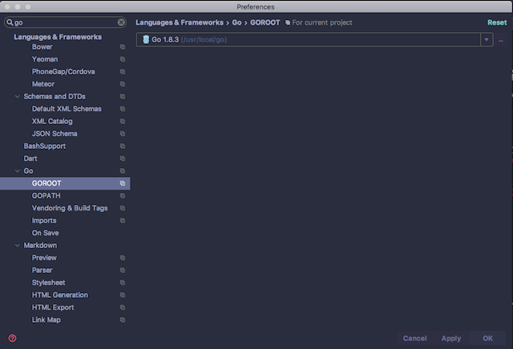
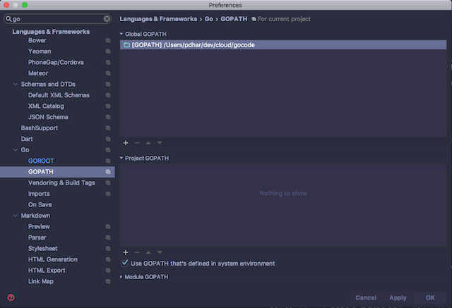

## Table of Contents
1. [Setup](#setup)
1. [Development Tools](#tooling)
1. [Setting up Runtime Development Environment](#runtimedev)
1. [Setup the Environment Variables](#environment)
1. [Folder Structure for Contributions](#source-folder)
1. [Setup Visual Studio Code](#vscode-setup)
1. [Setup Intellij Webstorm](#intellij-setup)
1. [Online Designtime & Runtime SDK API Documentation](#onlinedoc)
1. [Set up Runtime GO libraries](#runtime-go)
1. [Set up Design-time Development Environment](#setup-design-time)
1. [Web Integrator Studio SDK Installation](#sdk-install)
1. [Contribution Dependencies (package.json)](#package-json)
1. [Typescript compiler configuration (tsconfig.json)](#tsconfig-json)
1. [Typescript coding style and standard](#tslint-json)
1. [Typescript Coding Guidelines](#guidelines)
1. [Typescript Build instructions](#build)
1. [Folder Structure for Contributions ZIP](#zip)
1. [Upload and Deploy instructions](#upload)

## Setup<a name="setup"></a>
The Web-Integrator extension is a combination of User Interface code written
using Typescript and Runtime code written using GO language. The project code
is packaged in a zip file with a folder structure for respective code and resources.
The compilation of the project code is done in two phases, one for GO language
and the other for Typescript. After compilation the compiled contents in their
respective folders are zipped up and the extension project is ready for upload to Web-Integrator.

## Development Tools<a name="tooling"></a>
There are many tools and IDE's available that can help a Web Integrator
contribution developer get started. The recommended IDE's enable the
developer to write and debug Runtime code in GO Language and Designtime
code in Typescript. Webstorm IDE has some limitations on the use of
GO Language plugin as it allows code navigation and editing functionalities,
however Webstorm is primarily a NodeJS/Javascript/Typescript IDE hence project
build capabilities are not present , however there is a workaround which allows
the user to use the Terminal from the IDE to run the GO compiler to compile and test
GO code.

  *  [Visual Studio Code](https://code.visualstudio.com)


  *  [IntelliJ WebStorm](https://www.jetbrains.com/webstorm/)


## Setting up Runtime Development Environment<a name="runtimedev"></a>
First download the [GO language SDK](https://golang.org/dl/) and follow the instructions given to complete the installation and setting up the environment variables.

   * [OSX](https://golang.org/doc/install?download=go1.8.3.darwin-amd64.pkg)
   * [Windows](https://storage.googleapis.com/golang/go1.8.3.windows-amd64.msi)
   * [Linux](https://storage.googleapis.com/golang/go1.8.3.linux-amd64.tar.gz)

### Setup the Environment Variables <a name="environment"></a>
   * PATH - Should contain the folder where go lang compiler is installed , usually in Unix bases systems it is the */usr/local/go/bin*
   * GOROOT - This variable is set to point to the folder where GO language SDK is installed , which is same as above in */usr/local/go*
   * GOPATH - This is set to the workspace directory where the GO compiler finds its [projects based on project namespace](https://golang.org/doc/code.html). We will refer this folder as **&lt;workspace-folder&gt;** as it involves hosting typescript files also in addition to GO language files in its subfolders. 

```
    export GOROOT=/usr/local/go
    export PATH=$PATH:$GOROOT/bin
    export GOPATH=$HOME/.../<workspace folder>
```
### Folder Structure <a name="source-folder"></a>
A sample Web-Integrator GO Lang project &lt;workspace-folder&gt; will look like this

```
bin/
    hello                          # command executable
    outyet                         # command executable
pkg/
    linux_amd64/
        github.com/golang/example/
            stringutil.a           # package object
src/
    github.com/
        golang/
            <workspace folder>/               # Your workspace folder
                .git/                         # Git repository metadata
                package.json
                tsconfig.json
                tslint.json
        <extension category name>/            # namespace category stored in github.com
                                              # Visual Studio/WebStorm Project folder
                       
            <activity-name>/               # Extension Activity Named folder
                <activity-name>.go         # Extension Activity source
                <activity-name>_test.go    # Extension Activity Go Test source
                <activity-name>.module.ts  # ExtensionActivity UI module source
                <activity-name>.ts         # Extension Activity UI source.
                activity.json              # Extension Activity Model JSON
                icons/
                    <activity-name>.png       # Activity PNG icon size 16x16 pixels
                    <acitivity-name>.svg      # Activity SVG icon size 16x16 pixels
                    <activity-name>@2x.png    # Activity PNG icon size 32x32 pixels

            <connector-name>/
                connector.json
                <connector-name>.module.ts
                <connector-name>.ts
                <connector-name>*.go
                icons/
                    <connector-name>.png     # Activity PNG icon size 16x16 pixels
                    <connector-name>.svg     # Activity SVG icon size 16x16 pixels
                    <connector-name>@2x.png  # Activity PNG icon size 32x32 pixels

	github.com/TIBCOSoftware/flogo-lib/
	    # Files from the flogo-lib library
	github.com/TIBCOSoftware/flogo-contrib/
	    # Files from the flogo-contrib library

    golang.org/x/image/
        .git/                      # Git repository metadata
	bmp/
	    reader.go              # package source
	    writer.go              # package source
    ... (many more repositories and packages omitted) ...
```

## Setup Visual Studio Code<a name="vscode-setup"></a>

   * Insatll Go Extension - The extension can be installed from the
    **EXTENSIONS** marketplace in visual studio code.

        

   * For more information on the commands and information about IntelliSense visit [Go programming in VS Code](https://code.visualstudio.com/docs/languages/go)

   * Visual Studio Code uses the variables set in the [Envrionment variables](#environment) above

## Online Documentation <a name="onlinedoc"></a>
* The runtime API docs are available at: *https://tibcosoftware.github.io/tci-webintegrator/runtime/wi-runtime/v1.0.0/pkg/github.com/index.html*   
* The designtime API docs are available at: *https://tibcosoftware.github.io/tci-webintegrator/designtime/wi-studio/v1.0.0/index.html*

## Setup Intellij Webstorm <a name="intellij-setup"></a>

   * Install Go Plugin - The plugin can be downloaded from the **Preferences** dialog in Webstorm IDE

        

   * Setup Go Lang Plugin - The plugin can then be configured from the **Preferences** dialog

        
   * Set GOROOT - This should point to the folder set in the [GOROOT envrionment variable](#environment) above and select the GO SDK folder.

        
   * Set GOPATH - This should point to the &lt;workspace-folder&gt; set in the [GOROOT envrionment variable](#environment) above.

        

### Set up Runtime GO libraries<a name="runtime-go"></a>
To get started you'll need to get [flogo-lib](https://github.com/TIBCOSoftware/flogo-lib) and [flogo-contrib](https://github.com/TIBCOSoftware/flogo-contrib) from Project Flogo using the commands below which will add correct version into your GOPATH.

```bash
cd ${GOPATH}
mkdir -p src/github.com/TIBCOSoftware/
```
Download the wi-runtime [**wi-runtime.tar.gz**](https://github.com/TIBCOSoftware/tci-webintegrator/releases/download/1.0.0/wi-runtime.tar.gz) to an temporary folder
*or* Download the [**wi-runtime.tar.gz**](https://github.com/TIBCOSoftware/tci-webintegrator/releases/download/1.0.0/wi-runtime.tar.gz) file using wget command as shown below
```bash
wget --no-check-certificate https://github.com/TIBCOSoftware/tci-webintegrator/releases/download/1.0.0/wi-runtime.tar.gz
```
Unzip the wi-runtime.tar.gz and move all file to ${GOPATH}/src/github.com/TIBCOSoftware/

```bash
tar xzvf wi-runtime.tar.gz
mv flogo-contrib src/github.com/TIBCOSoftware/
mv flogo-lib src/github.com/TIBCOSoftware/
#Get logrus lib
go get github.com/Sirupsen/logrus
```
Now the GOPATH env ready to develop, the Go code can be compiled and tested locally from the command line as follows
```bash
cd $GOPATH/<workspace-folder>/src/<MyExtension folder>
go build ./activity/... ./connector/...
go test ./activity/... ./connector/...
```		

## Set up Design-time Development Environment<a name="setup-design-time"></a>
A Web-Integrator extension project design-time involves writing implementations
of UI interface code with extension metadata provided by the JSON file.
e.g. activity.json or connector.json. The UI development environment depends
on the released version of the Web Integrator Studio SDK and it needs to
be updated from time to time with the releases.

The latest Web Integrator SDK can be found in the `releases` section of
our repository (or with a direct link [here](https://github.com/TIBCOSoftware/tci/releases)).
The WI Studio SDK (**_wi-studio-docs/index.html_**) tells you how to
create and test extensions in a local environment.

###  Web Integrator Studio SDK Installation<a name="sdk-install"></a>
The Web-Integrator Studio API (wi-studio) is a NPM package containing
Typescript & Javascript definitions that allows developers to write
contributions(extensions) for TIBCO Web-Integrator product.

The SDK package comes with its own package.json dependencies
which are installed when wi-studio is installed. The wi-studio
can be downloaded from [Web Integrator GitHub Releases](https://github.com/TIBCOSoftware/tci-webintegrator/releases/latest)
as wi-studio.tar.gz file and installed using npm installer after the
package.json is creates as explained in the [Contribution Dependencies step](#package-json) :-

```
cd <workspace-folder>           # change to your workspace folder
```

[**Download the wi-studio SDK wi-studio.tar.gz from here to your &lt;workspace-folder&gt;**](https://github.com/TIBCOSoftware/tci-webintegrator/releases/download/1.0.0/wi-studio.tar.gz)

**OR**

Download the wi-studio.tar.gz file inside your &lt;workspace-folder&gt; using wget command as shown below

```
wget --no-check-certificate https://github.com/TIBCOSoftware/tci-webintegrator/releases/download/1.0.0/wi-studio.tar.gz
```
Create a temporary folder to unzip the SDK inside it.
```
mkdir wi-studio     # make a temp folder i.e. "wi-studio"
cd wi-studio         # change to temp folder "wi-studio"
```
While inside the temporary folder unzip the downloaded wi-studio.tar.gz from the parent folder

```
tar xzvf ../wi-studio.tar.gz    # This command unzips the contents into current temporary folder
cd ..    # change folder to the parent
```
At this point the wi-studio NPM package can be installed independently from the temporary folder which is a sub folder.
```
npm install file:wi-studio
````
**OR** 
It can be installed as a part of the full contribution package dependency install using package.json shown [below](package-json). The package.json looks at the wi-studio temp folder created above to find wi-studio SDK for installation.

```
npm install 

````

### Contribution Dependencies (package.json)<a name="package-json"></a>
The contribution design time dependencies match the wi-studio web server application dependencies as they need to run and execute in the same environment. 

You can copy the boilerplate package.json contents shown below to your &lt;workspace-folder&gt; to install all the Typescript compile dependencies.

**PLEASE NOTE** that the package *wi-studio*  points to the local sub folder **wi-studio** using the *file:wi-studio* URI path. You may need to adjust this path if you have downloaded and unzipped the wi-studio SDK to another folder.

~~~javascript
{
  "name": "my-contrib",
  "version": "1.0.0",
  "description": "My Web Integrator Contributions",
  "main": "index.js",
  "scripts": {
    "tsc": "tsc",
    "build": "tsc -p ./",
    "build:watch": "tsc -p ./ -w",
    "build:test": "tsc -p src/",
    "build:test:watch": "tsc -p ./ -w",
    "serve": "lite-server -c=bs-config.json",
    "prestart": "npm run build",
    "start": "concurrently \"npm run build:watch\" \"npm run serve\"",
    "protractor": "protractor",
    "webdriver:update": "webdriver-manager update --standalone false --gecko false",
    "pretest": "./test-setup.sh; npm run build:test",
    "test": "karma start karma.conf.js --browsers Chrome_custom",
    "pretest:once": "./test-setup.sh && npm run build:test",
    "test:once": "karma start karma.conf.js --single-run --browsers Chrome",
    "pretest:headless:debug": "./test-setup.sh && npm run build:test",
    "test:headless:debug": "karma start karma.conf.js --single-run --browsers PhantomJS_custom",
    "pretest:headless": "./test-setup.sh && npm run build:test",
    "test:headless": "karma start karma.conf.js --single-run --browsers PhantomJS",
    "posttest:headless": "cat coverage/teamcity.txt; npm run js-zip",
    "zip": "node ./node_modules/.bin/jszip activity/ connector/ -o ../contribution.zip",
    "lint": "tslint ./src/**/*.ts -t verbose"
  },
  "private": true,
  "repository": {
    "type": "git",
    "url": "http://git.tibco.com/git/<my-contrib>.git"
  },
  "author": "John Doe",
  "license": "ISC",
  "dependencies": {
    "@angular/common": "2.4.7",
    "@angular/compiler": "2.4.7",
    "@angular/compiler-cli": "2.4.7",
    "@angular/core": "2.4.7",
    "@angular/forms": "2.4.7",
    "@angular/http": "2.4.7",
    "@angular/platform-browser": "2.4.7",
    "@angular/platform-browser-dynamic": "2.4.7",
    "@angular/platform-server": "2.4.7",
    "@angular/router": "3.4.7",
    "@angular/upgrade": "2.4.7",
    "ag-grid": "8.2.x",
    "ag-grid-angular": "8.2.x",
    "angular-in-memory-web-api": "0.2.4",
    "angular2-notifications": "0.4.53",
    "aws-sdk": "2.7.28",
    "babel-plugin-proxy": "^1.1.0",
    "body-parser": "1.16.0",
    "bootstrap": "3.3.7",
    "brace": "0.10.0",
    "circular-json": "^0.3.1",
    "core-js": "2.4.1",
    "crypto-js": "3.1.9-1",
    "d3": "3.5.17",
    "events": "1.1.1",
    "express": "4.14.0",
    "express-cors": "0.0.3",
    "express-serve-static-core": "0.1.1",
    "generate-schema": "2.3.3",
    "i18n": "*",
    "jquery": "3.1.1",
    "lite-server": "2.2.2",
    "lodash": "4.17.4",
    "minimist": "1.2.0",
    "monaco-editor": "^0.8.3",
    "morgan": "1.7.0",
    "ng2-ace-editor": "0.1.9",
    "ng2-datetime-picker": "0.14.8",
    "ng2-translate": "5.0.0",
    "ngx-perfect-scrollbar": "2.5.2",
    "uuid": "3.1.0",
    "path": "0.12.7",
    "perfect-scrollbar": "0.6.16",
    "plugin-typescript": "7.0.6",
    "primeng": "2.0.6",
    "progress": "2.0.0",
    "reflect-metadata": "0.1.10",
    "request": "2.80.0",
    "rxjs": "5.1.1",
    "sax": "1.2.1",
    "systemjs": "0.20.12",
    "type-of-is": "3.5.1",
    "typescript": "2.2.1",
    "util": "0.10.3",
    "wi-studio": "file:wi-studio",
    "xml2js": "0.4.17",
    "xmlbuilder": "4.2.1",
    "zone.js": "0.7.6"
  },
  "devDependencies": {
    "@types/aws-sdk": "0.0.42",
    "@types/body-parser": "0.0.33",
    "@types/core-js": "0.9.35",
    "@types/crypto-js": "3.1.33",
    "@types/express": "4.0.35",
    "@types/express-serve-static-core": "4.0.40",
    "@types/jasmine": "2.5.47",
    "@types/jquery": "2.0.39",
    "@types/karma": "0.13.33",
    "@types/lodash": "4.14.58",
    "@types/mime": "0.0.29",
    "@types/minimist": "1.2.0",
    "@types/morgan": "1.7.32",
    "@types/node": "7.0.4",
    "@types/node-uuid": "0.0.28",
    "@types/pegjs": "^0.10.0",
    "@types/progress": "2.0.0",
    "@types/reflect-metadata": "0.0.5",
    "@types/request": "0.0.40",
    "@types/sax": "1.0.0",
    "@types/selenium-webdriver": "2.53.39",
    "@types/serve-static": "1.7.31",
    "@types/systemjs": "0.19.33",
    "@types/typescript": "2.0.0",
    "@types/xml2js": "0.4.0",
    "@types/xmlbuilder": "0.0.31",
    "@angular/cli": "1.0.0",
    "@types/angular": "1.6.10",
    "@types/angular-animate": "1.5.6",
    "@types/angular-cookies": "1.4.3",
    "@types/angular-mocks": "1.5.9",
    "@types/angular-resource": "1.5.8",
    "@types/angular-route": "1.3.3",
    "@types/angular-sanitize": "1.3.4",
    "babel-cli": "6.24.0",
    "babel-preset-angular2": "0.0.2",
    "babel-preset-es2015": "6.24.0",
    "canonical-path": "0.0.2",
    "concurrently": "3.4.0",
    "http-server": "0.9.0",
    "jasmine": "2.5.3",
    "jasmine-core": "2.5.2",
    "jszip-cli": "^1.4.24",
    "karma": "1.5.0",
    "karma-chrome-launcher": "2.0.0",
    "karma-cli": "1.0.1",
    "karma-coverage": "^1.1.1",
    "karma-jasmine": "1.1.0",
    "karma-jasmine-html-reporter": "0.2.2",
    "karma-junit-reporter": "^1.2.0",
    "karma-mocha-reporter": "^2.2.3",
    "karma-phantomjs-launcher": "^1.0.4",
    "karma-sourcemap-loader": "0.3.7",
    "karma-super-dots-reporter": "^0.1.0",
    "karma-teamcity-reporter": "^1.0.0",
    "karma-webpack": "2.0.3",
    "lite-server": "2.3.0",
    "pegjs": "^0.10.0",
    "protractor": "5.1.1",
    "raw-loader": "0.5.1",
    "rimraf": "2.6.1",
    "tslint": "4.5.1",
    "typemoq": "^1.4.2",
    "typescript": "^2.2.2"
  }
}
~~~

### Typescript compiler configuration (tsconfig.json)<a name="tsconfig-json"></a>

The typescript compiler (tsc) can take configuration from [command line parameters](https://www.typescriptlang.org/docs/handbook/compiler-options.html) and
from [tsconfig.json file](https://www.typescriptlang.org/docs/handbook/tsconfig-json.html).
The initial tsconfig.json can be created using the tsc command which Initializes a TypeScript project and creates a tsconfig.json file.
```
tsc --init
```
You can use the boilerplate tsconfig.json content shown below to your &lt;workspace-folder&gt;.

~~~javascript
{
    "compilerOptions": {
        "module": "commonjs",
        "target": "es5",
        "moduleResolution": "node",
        "noImplicitAny": false,
        "sourceMap": true,
        "declaration": true,
        "emitDecoratorMetadata": true,
        "experimentalDecorators": true,
        "removeComments": true,
        "noUnusedLocals": false,
        "noUnusedParameters": false,
        "suppressImplicitAnyIndexErrors": true,
        "lib": [
            "es5",
            "dom",
            "es2015",
            "es2016"
        ],
        "types": [
            "wi-studio",
            "node",
            "lodash",
            "rxjs",
            "aws-sdk",
            "crypto-js",
            "sax",
            "xml2js",
            "xmlbuilder"
        ],
        "typeRoots": [
            "node_modules/@types",
            "node_modules"
        ]
    },
    "exclude": [
        "node_modules/**",
        "testing/**",
        "src/**"
    ]
}
~~~

### Typescript coding style and standard<a name="tslint-json"></a>
The coding styles are enforced by the *tslint.json* configuration. You can copy the boilerplate tslint.json contents shown below to your &lt;workspace-folder&gt;.

~~~javascript
{
    "rules": {
        "class-name": true,
        "comment-format": [
            true,
            "check-space"
        ],
        "indent": [
            true,
            "spaces"
        ],
        "no-duplicate-variable": true,
        "no-eval": true,
        "no-internal-module": true,
        "no-trailing-whitespace": true,
        "no-unsafe-finally": true,
        "no-var-keyword": true,
        "one-line": [
            true,
            "check-open-brace",
            "check-whitespace"
        ],
        "quotemark": [
            true,
            "double"
        ],
        "semicolon": [
            true,
            "always"
        ],
        "triple-equals": [
            true,
            "allow-null-check"
        ],
        "typedef-whitespace": [
            true,
            {
                "call-signature": "nospace",
                "index-signature": "nospace",
                "parameter": "nospace",
                "property-declaration": "nospace",
                "variable-declaration": "nospace"
            }
        ],
        "variable-name": [
            true,
            "ban-keywords"
        ],
        "whitespace": [
            true,
            "check-branch",
            "check-decl",
            "check-operator",
            "check-separator",
            "check-type"
        ]
    }
}
~~~

### Typescript Coding Guidelines<a name="guidelines"></a>

The code for the contribution User interface is written in [Typescript language](http://typescriptland.org)
Typescript is the default UI language for Angular 2.x which is the UI framework for Web Integrator.
The contributions are delivered in [Ecmascript - ES5](https://en.wikipedia.org/wiki/ECMAScript) script for browser compatibility
using [commonjs module definition](https://nodejs.org/docs/latest/api/modules.html) format.

The typescript compiler tsc transpiles the typescript code in *.ts files to ES5 and generates the following file
    - *.js - Transpiled Ecmascript/Javascript code.
    - *.js.map - Source code(*.ts) map to transpiled code(*.js)
    - *.d.ts - Typescript Definition files (if using -d option) , similar to C/C++ header files.

Each contribution needs a module file and the contribution service file. The contribution module file
defines a Angular Module [**@NgModule()**](https://angular.io/guide/ngmodule) decorator . The angular module file is where
dependencies on other angular or user code modules are declared using the *import* @NgModule directive
The contribution services are imported into the module file and then exposed using *providers* @NgModule directive.

~~~typescript
import { HttpModule } from "@angular/http";
import { NgModule } from "@angular/core";
import { CommonModule } from "@angular/common";
import { RestContributionHandler } from "./rest-contrib";
import {WiServiceContribution} from "wi-stuio/app/contrib/wi-contrib";
@NgModule({
  imports: [ CommonModule, HttpModule],
  exports: [],
  declarations: [],
  entryComponents: [],
  providers: [
    {
      provide: WiServiceContribution,
      useClass: RestContributionHandler
    }
  ],
  bootstrap: []
})
export class RestContribModule {}
~~~

The contribution service is written as a Angular [**@Injectable()**]([https://angular.io/api/core/Injectable) decorator
so it can loaded by the Angular loading mechanism and exposed as a service. There is one additional decorator
@WiContrib({}) which tells the Web Integrator that the angular service is also a Web Integrator contribution service.

~~~typescript

import {Injectable, Injector} from "@angular/core";
import {Http} from "@angular/http";
import {Observable} from "rxjs/Observable";
import {
    WiContrib,
    WiServiceHandlerContribution,
    IValidationResult,
    ValidationResult,
    IActivityContribution,
    ActionResult,
    IActionResult
} from "wi-studio/app/contrib/wi-contrib";

@WiContrib({})
@Injectable()
export class RestContributionHandler extends WiServiceHandlerContribution {
    constructor(injector: Injector, http: Http) {
        super(injector, http);
    }

    value = (fieldName: string, context: IActivityContribution): Observable<any> | any => {
        return Observable.create(observer => {
            observer.next("");
        });
    }

    validate = (fieldName: string, context: IActivityContribution): Observable<IValidationResult> | IValidationResult => {
        return Observable.create(observer => {
            let vresult: IValidationResult = ValidationResult.newValidationResult();
            observer.next(vresult);
        });
    }

    action = (actionId: string, context: IActivityContribution): Observable<IActionResult> | IActionResult => {
        return Observable.create(observer => {
            let aresult: IActionResult = ActionResult.newActionResult();
            observer.next(aresult);
        });
    }
}
~~~

### Typescript Build instructions<a name="build"></a>
The build can be run after installing all the package dependencies from
package.json.

    npm install
    npm run build
    npm run zip

### Folder Structure inside Contributions Category ZIP<a name="zip"></a>
Since the user will zip the <extension category name> folder the content inside the zip will look as below.
```
        <activity>/
            <contrib-name>/
                icons/
                    <activity-name>.png
                    <acitivity-name>.svg
                    <activity-name>@2x.png
                activity.json
                <activity-name>.module.ts
                <activity-name>.module.js
                <activity-name>.module.js.map
                <activity-name>.ts
                <activity-name>.js
                <activity-name>.js.map
                <activity-name>*.go
        <connector>/
            <contrib-name>/
                icons/
                    <connector-name>.png
                    <connector-name>.svg
                    <connector-name>@2x.png
                connector.json
                <connector-name>.module.ts
                <connector-name>.module.js
                <connector-name>.module.js.map
                <connector-name>.ts
                <connector-name>*.go
                <connector-name>.js
                <connector-name>.js.map
```

### Upload and Deploy instructions<a name="upload"></a>
After Typescript build the contribution folder is packaged into a zip file containing
the source and the transpiled output files in the same folder structure. The zip file is
then uploaded using the Web-Integrator Contributions UI.

To upload a compiled contribution login to https://cloud.tibco.com

