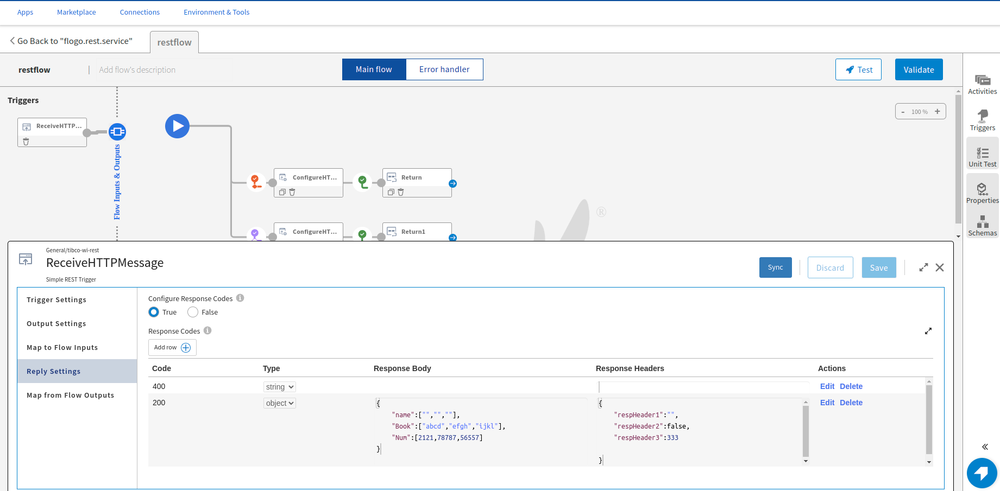
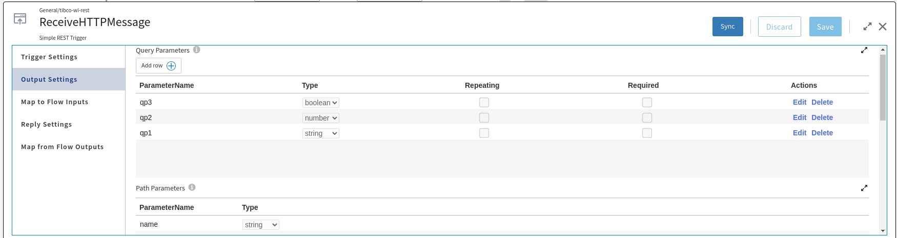
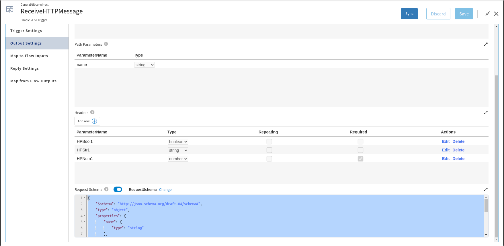
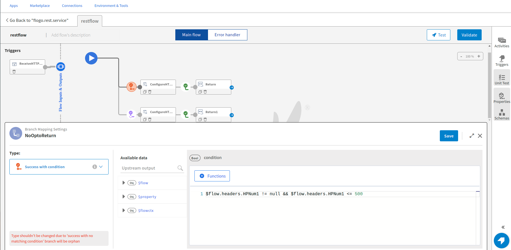
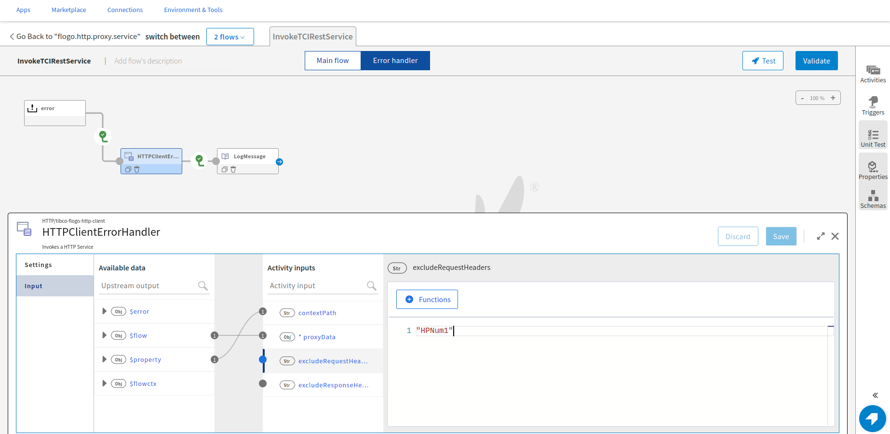
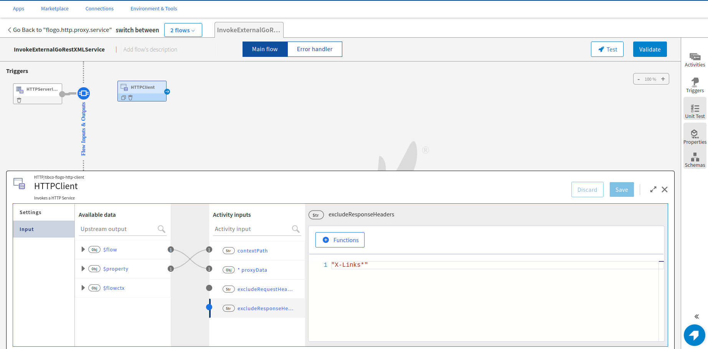

# HTTP Proxy Service Sample

This sample demonstrates how to use HTTP Server trigger and HTTP Client activity to create a service as a proxy to another service. In this sample there are three flogo apps. One is a Rest service with the name 'flogo.rest.service' which will be used as a producer Rest service. Second app 'flogo.http.proxy.service' is the app which will act as a proxy to the flogo Rest service. Third app is the 'flogo.invoke.http.proxy.service' app which will call the proxy service and invoke the flogo rest service via the http proxy service.

Features which are covered in these sample apps are:
## HTTP Server trigger
1. Context Path, Processing Mode, Proxy data.
2. Branching in the flow.
3. ReceiveHTTPMessage trigger with multiple response codes.

## HTTP Client activity
1. Service Endpoint and proxy processing mode.
2. Context path, excludeRequestHeaders and excludeResponseHeaders.
3. HTTP Client activity in the branch and error handler flow. 

## Import the sample apps
 
1. Download the sample's .json files 'flogo.rest.service.json', 'flogo.http.proxy.service' and 'flogo.invoke.http.proxy.service', apps for producer, proxy and consumer services respectively.

2. On 'What do you want to build?' dialog, select 'Import a Flogo app' and browse the app json for flogo rest service app and click on 'Import Flogo app' button.

3. Similarly, import the 'flogo.proxy.service' applications. 

4. After importing the 'flogo.proxy.service' app, repeat the above steps to import the flogo.invoke.http.proxy.service app(consumer service).

## Understanding the configuration
flogo.rest.service application

After importing the 'flogo.rest.service', we can see that the app has multiple response codes have been configured in the Rest trigger. Few Response codes have Response headers as well. While adding schema in Response header and Response body we need to make sure that both are in JSON data or JSON Schema format. This Rest service app has multiple query and header parameters as well.

This Rest service app has multiple query and header parameters as well.

For each response code we are returning a different response for that we're using branching and conditions have been put, when these conditions are satisfied that particular branch gets executed and that response is returned. Like here for 200 Success response the condition is that the 'HPNum1' header should not be null and less than or equal to 500.

If the condition is not satisfied then the 'Success with no matching condition' will be executed.

flogo.http.proxy.service application
This app has 2 flows, 'InvokeTCIRestService' flow is calling the above 'flogo.rest.service' service, the other flow 'InvokeExternalGoRestXMLService' is calling an external service which returns a XML 
response.

InvokeTCIRestService flow
This flow has 2 branches and one error handler flow. 

The condition is based on the output of the 'Increment Counter Activity', when counter response is an odd number then success 200 response will be executed, for any other response like even number response it will execute the 'Throw Error' activity flow which will trigger the Error Handler flow.

HTTP Client activity in the success condition branch has 'Service Endpoint' mapped to an URL defined as an app property. The 'Processing Mode' is set as 'Proxy'. In the Input, 'proxyData' is a mandatory field and must be mapped with the flow input as it is received from the HTTP Server trigger. The data received from the HTTP Server trigger is passed opaquely to the HTTP Client activity without any data conversion. We can pass the contextPath of the service as string or map it with an app property.

HTTP Client in Error Handler flow is demonstrating how we can use 'excludeRequestHeaders', we can pass the exact request header or as a regular expression to remove the request header while making the request. Here, we're excluding a mandatory request header, thus getting an error response from the service. 

Similarly, in the 'InvokeExternalGoRestXMLService' flow, we are invoking an external service, it's configuration is similar to the above HTTP Client activity, here we are not excluding any Request Header but excluding all the Response Headers starting with 'X-Links'.

flogo.invoke.http.proxy.service application
This application is also a Rest application having two flows each having InvokeRestService activity, one flow is invoking the above proxy service which is calling the flogo rest service and another flow is invoking the other proxy service which is calling the external XML response service. The ednpoints of the flogo.http.proxy.serice is being passed to these InvokeRestService activites URL as app properties, after importing them in an environment we can copy the endpoints of the flogo.http.proxy.service app and override them in the flogo.invoke.http.proxy.service app. We need to take care that the endpoint is appended byt the context path of the HTTP Server triggers and the path parameter of the flogo.rest.service app.

In the 'flogo.Invoke.http.proxy.service' we have similar branching like the service app, but here the condition is based on the response code received when the service is invoked, like for 200 response the success branch will be executed and corresponding response will be returned.

## Run the application

Once you have imported both the apps, push the 'flogo.rest.service' app first and scale the app to 1. Now we need to get the endpoint of the producer service, go to the 'Endpoints' tab of the app and click on 'Copy URL' to get the endpoint URL.

Now push the 'flogo.http.proxy.service' app and scale the app to 1. Go to 'Environment Controls' tab -> 'Application Variables' and edit the default value of the 'TCIServiceEndpoint' application property to point to the endpoint URL of the producer Rest service app.

FlogoRestServiceEnpointURL_AppProp

Now push the 'Invoke.flogo.rest.service' app and scale the app to 1. Go to 'Environment Controls' tab -> 'Application Variables' and edit the default value of the 'ExternalServiceProxyEndpoint' and 'TCIServiceEndpoint' application properties to point to the endpoint URL of the proxy flogo service app.

App properties value:
TCIServiceEndpoint: <proxy service TCI endpoint>/cont3xtpath/flogo
ExternalServiceProxyEndpoint: <proxy service External endpoint>/users.xml	

## Output

1. Sample response for 200 Success for invoking the external XML service via the proxy service. We can pass the query param name as 'kumar' or 'singh'.
Method: Get
Path: /invokegorest
name: kumar

Success Response if the name is found in the records.

2. Sample response for invokng the flogo.rest.service via the flogo.proxy.service. We need to pass value of each query, path and header parameters. For success response the value of the 'HPNum1' header param should not be null or more than 500 and success response will come for odd number of endpoint invoking like 1,3,5 and so on.

Success Response for the odd number of endpoint execution and HPNum1 <= 500.

Error response when endpoint is executed even number of times, execution goes into the Error Handler flow where we have excluded the required request header in the HTTP Client activity.

## Troubleshooting

1. If you do not see the Endpoint enabled, make sure your app is in Running status.
2. The responses are received upon meeting a particular condition, please check the branch conditions.
3. If the  'flogo.invoke.http.proxy.service' app is not returning the expected response, please check if the application property is pointing to the correct endpoint URL.

## Contributing

If you want to build your own activities for Flogo please read the docs here.

If you want to showcase your project, check out [tci-awesome](https://github.com/TIBCOSoftware/tci-awesome)

You can also send an email to `tci@tibco.com`

## Feedback
If you have feedback, don't hesitate to talk to us!

* Submit feature requests on our [TCI Ideas](https://ideas.tibco.com/?project=TCI) or [FE Ideas](https://ideas.tibco.com/?project=FE) portal
* Ask questions on the [TIBCO Community](https://community.tibco.com/answers/product/344006)
* Send us a note at `tci@tibco.com`

## Help

Please visit our [TIBCO Cloud&trade; Integration documentation](https://integration.cloud.tibco.com/docs/) and TIBCO Flogo® Enterprise documentation on [docs.tibco.com](https://docs.tibco.com/) for additional information.

## License
This TCI Flogo SDK and Samples project is licensed under a BSD-type license. See [license.txt](license.txt).

