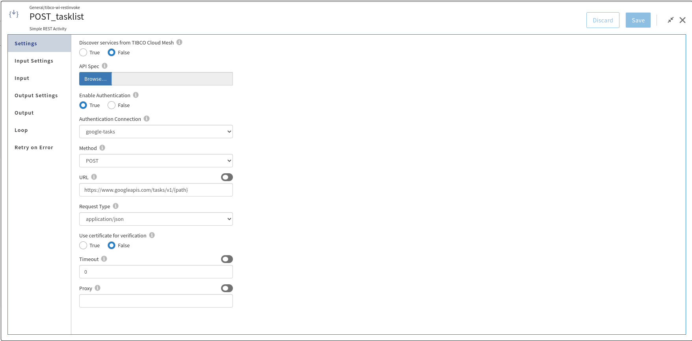

# HTTP Client Authorization Connection Example

## Description

This example demonstrate how we can create and use HTTP Client Authorization connection in flogo apps to enable authorization and authentication for the Google Tasks API using Auth type OAuth 2.0.

The app basically creates new google task list and inserts a task into it. Then it updates the status of the task. Finally deletes the task list. All these operation will be done using restInvokeService activities which are configured using a HTTP Client Authorization connection named 'google-tasks'.

## Prerequisites

* You must ensure that Google Task API is enabled in your google account.
* You will need a connected web app in your google account under Credentials page from which you can get the Client Id and Client Secret. For more info, you can refer to google OAuth 2.0 usage documentation- https://developers.google.com/identity/protocols/oauth2/web-server
* You also need to make sure that your connected web application has Tibco Cloud Integration redirect URL added and in case for Flogo Enterprise, it should have localhost redirect URL. The URL can be obtained from the flogo HTTP client authorization connection itself.

## Import the sample

1. Download the sample's .json file 'OAuth2_GoogleTask_Sample.json'

2. Create a new empty app.

3. On the app details page, select Import app.

4. Browse on your machine or drag and drop the .json file for the app that you want to import.

5. Click Upload. The Import app dialog displays some generic errors and warnings as well as any specific errors or warnings pertaining to the app you are importing. It validates whether all the activities and triggers used in the app are available in the Extensions tab.

6. You have the option to import all flows from the source app or selectively import flows.

7. If you choose selective import, select the trigger, flow and connection. Click Next.

8. Make sure you re-configure the connection as mentioned in 'Understanding the configuration' section

## Understanding the configuration

### The Connection
When you import this app, you need to configure the 'google-tasks' connection in Connections page. It has pre-filled values except Client Secret. You also need to change Client Id with yours.

In the connection, note that,
* Authorization type is set to 'OAuth2'
* Grant type is set to 'Authorization Code' as supported by Google APIs.
* There are additional Auth URL query parameters for google service as below
'access_type=offline&prompt=consent'
This is used to refresh your access token and to prompt user content screen.
* There is a scope added to Create, edit, organize, and delete all your tasks which is 'https://www.googleapis.com/auth/tasks' for Google Tasks API.
* Client Authentication as 'Body' (Client id and secret will be sent in POST body request as supported by Google)

Once you login and allow access in user consent screen, a Base64 encoded access token string will get populated in Token field. This is the access token which will be send as Authorization Header while invoking the API to get the access to the API.

### The Flow and InvokeRestService activity
If you open the app, you will see there are InvokeRestService activities which are authentication enabled and using the 'google-tasks' connection.

You can enable/disable the Authentication by setting 'Enable Authentication' to 'True' or 'False'. For this sample, we need it to be 'True'.
If you enable the authentication, you will have to select one of the existing HTTP Client Authorization connections from the drop-down. In this sample, its 'google-tasks'.
You can explore all activities in the flow. They are designed in a way to create task list, insert a task in the task list, update the title of this task using PATCH method and finally delete the task list. 

### Run the application
Once you are ready to run the application, you can use Push option and later run this app.
Once it reaches to Running state, go to Endpoints and for GET/tasks, select 'Try it out'
You will have to pass the query parameter 'tasklist_path'. The value is 'users/@me/lists'
Now click Execute button.

If you want to test the sample in the Flow tester, either you can create a new launch configuration and give the above value for query parameter 'tasklist_path' in inputs or import the attached 'google_tasks_Launch_Configuration.json' with this sample and start testing.

### Note about Refresh Token
Based on the service you use, you need to look for the parameters to refresh the access token if you want to run your apps for longer duration. In this example access_type=offline is used in additional query parameters for this purpose. For other service like Salesforce, you may want to specify 'refresh_token' in the scope field.
We recommend you to create connections which are capable to refresh the access token.

## Outputs

1. Sample Response

2. Sample Logs

## Troubleshooting

* If you do not see the Endpoint enabled, make sure your apps is in Running status.
* If you do not see user consent screen while creating connection, check if your browser is blocking pop-ups.
* if you see 401 Unauthorized error or token refresh error, re-configure the connection.

## Contributing
If you want to build your own activities for Flogo please read the docs here.

If you want to showcase your project, check out [tci-awesome](https://github.com/TIBCOSoftware/tci-awesome)

You can also send an email to `tci@tibco.com`

## Feedback
If you have feedback, don't hesitate to talk to us!

* Submit feature requests on our [TCI Ideas](https://ideas.tibco.com/?project=TCI) or [FE Ideas](https://ideas.tibco.com/?project=FE) portal
* Ask questions on the [TIBCO Community](https://community.tibco.com/answers/product/344006)
* Send us a note at `tci@tibco.com`

## Help
Please visit our [TIBCO Cloud&trade; Integration documentation](https://integration.cloud.tibco.com/docs/) and TIBCO Flogo® Enterprise documentation on [docs.tibco.com](https://docs.tibco.com/) for additional information.

## License
This TCI Flogo SDK and Samples project is licensed under a BSD-type license. See [license.txt](license.txt).
