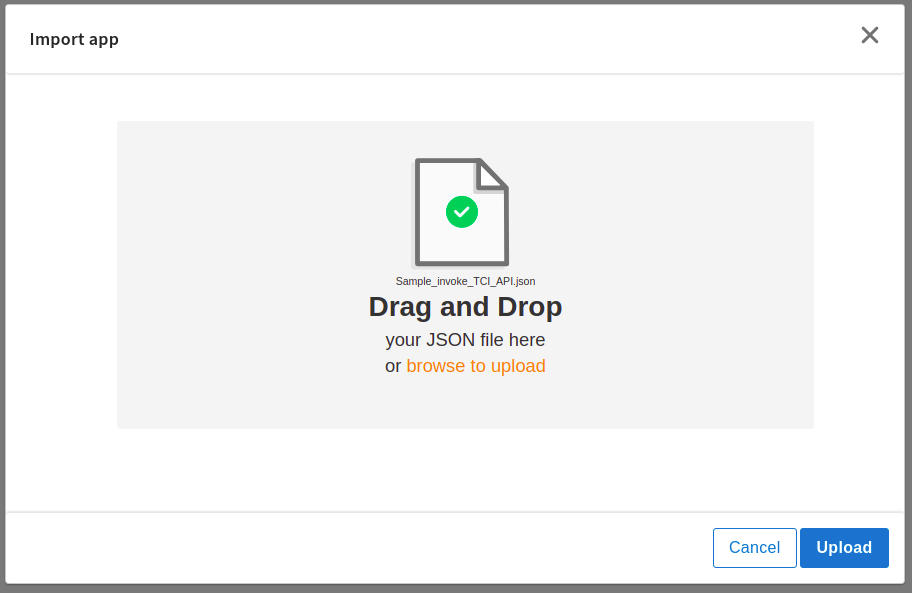
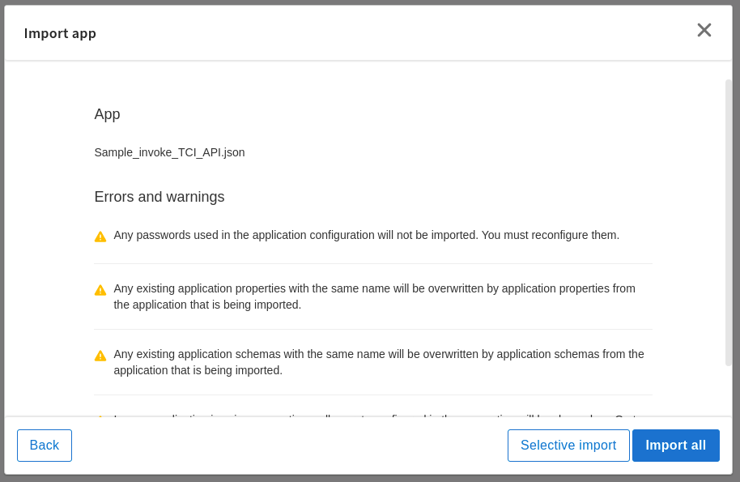
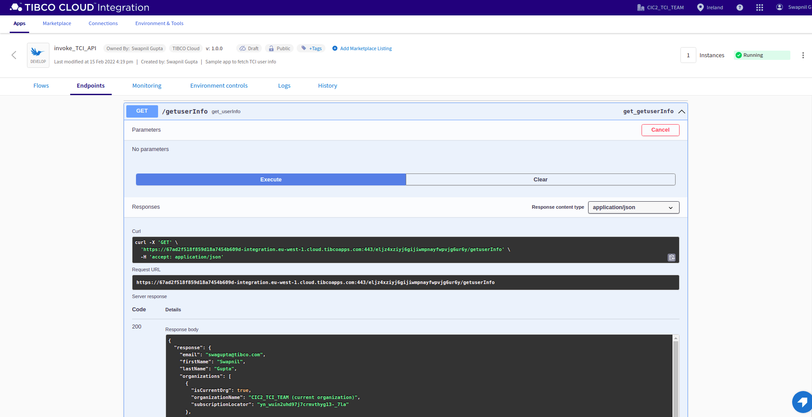
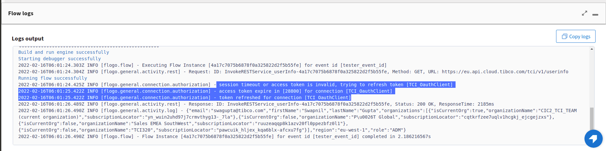

# HTTP Client Authorization Connection Example
## Client Credentials Flow to Access Tibco Cloud Integration Platform APIs

## Description

This example demonstrates how to create and use HTTP Client Authorization connection in flogo apps to enable authorization for TCI platform APIs using Auth type OAuth 2.0 and grant type Client Credentials.

The app is desined to access TCI's userinfo API using InvokeRestService activity which is configured with a HTTP Client Authorization connection named 'TCI_OauthClient'.

## Prerequisites

* Tibco Cloud Integration Service Account (to know about service accounts, please refer to https://eu.account.cloud.tibco.com/cloud/docs/accounts/account-info/service_accounts.html)
* Register OAuth Client using Service Account user (to know more about OAuth Client, please refer to https://eu.account.cloud.tibco.com/cloud/docs/oauth-access/oauth_clients.html)

## Import the sample

1. Download the sample's .json file 'Sample_invoke_TCI_API.json'

2. Create a new empty app.

3. On the app details page, select Import app.

4. Browse on your machine or drag and drop the .json file for the app that you want to import.

5. Click Upload. The Import app dialog displays some generic errors and warnings as well as any specific errors or warnings pertaining to the app you are importing. It validates whether all the activities and triggers used in the app are available in the Extensions tab.

6. You have the option to import all flows from the source app or selectively import flows.

7. If you choose selective import, select the trigger, flow and connection. Click Next.

8. Make sure you re-configure the connection as mentioned in 'Understanding the configuration' section

## Understanding the configuration

### The Connection
When you import this app, you need to configure the 'TCI_OauthClient' connection in Connections page. It has pre-filled values except Client Secret. You also need to change Client Id with yours.

In the connection, note that,
* Authorization type is set to 'OAuth2'
* Grant type is set to 'Client Credentials' which is the only way to get access using Tibco OAuth Client that you've registered.
* Scope 'TCI' is mandatory.
* Client Authentication as 'Header' (if you register the oAuth Client with 'Body' then please select 'Body')

Once you login, a Base64 encoded access token string will get populated in Token field.

### The Flow and InvokeRestService activity
When you open the app, you will see there is InvokeRestService activity which is authentication enabled and configured with the 'TCI_OauthClient' connection.

You can enable/disable the Authentication by setting 'Enable Authentication' to 'True' or 'False'. For this sample, we need it to be 'True'.
If you enable the authentication, you will have to select one of the existing HTTP Client Authorization connections from the drop-down.
The method selected is GET and the URL is configured with 'https://eu.api.cloud.tibco.com/tci/v1/userinfo' which is userinfo API.

### Run the application
Once you are ready to run the application, you can use Push option and later run this app.
Once it reaches to Running state, go to Endpoints and for GET/getuserInfo, select 'Try it out'
Now click Execute button.

If you want to test the sample in the Flow tester, just open the flow and hit Test button. It will show the response in log message.

### Note about Refresh Token
You don't need to be worry about the access token refresh flow. If you have a long running app for Tibco OAuth Client, after the expiry of the active access token it will be auto refreshed.

## Troubleshooting

* If you do not see the Endpoint enabled, make sure your apps is in Running status.
* if you see 401 Unauthorized error or token refresh error, re-configure the connection.

## Contributing
If you want to build your own activities for Flogo please read the docs here.

If you want to showcase your project, check out [tci-awesome](https://github.com/TIBCOSoftware/tci-awesome)

You can also send an email to `tci@tibco.com`

## Feedback
If you have feedback, don't hesitate to talk to us!

* Submit feature requests on our [TCI Ideas](https://ideas.tibco.com/?project=TCI) or [FE Ideas](https://ideas.tibco.com/?project=FE) portal
* Ask questions on the [TIBCO Community](https://community.tibco.com/answers/product/344006)
* Send us a note at `tci@tibco.com`

## Help
Please visit our [TIBCO Cloud&trade; Integration documentation](https://integration.cloud.tibco.com/docs/) and TIBCO Flogo® Enterprise documentation on [docs.tibco.com](https://docs.tibco.com/) for additional information.

## License
This TCI Flogo SDK and Samples project is licensed under a BSD-type license. See [license.txt](license.txt).
