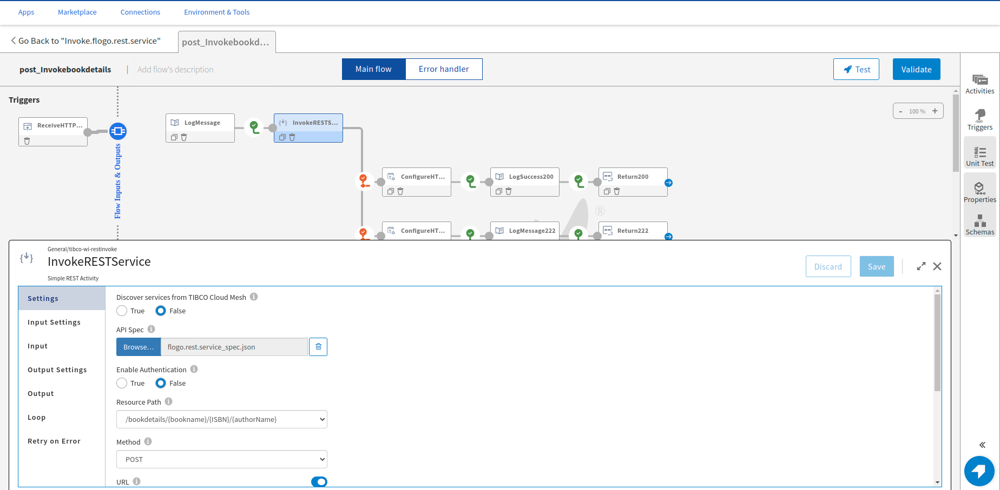

# REST Features Sample

This sample demonstrates some of the REST features present in the FLOGO ReceiveHTTPMessage trigger and InvokeRestService activity. Features which are covered in these sample apps are:
## ReceiveHTTPMessage trigger
1. Path, query and header parameters in the REST trigger.
2. Configure multiple response code in REST trigger.
3. Response Headers in REST trigger.
4. App level schema in Request Schema and mapper activities.
5. Multiple branching for each Response code.
6. ConfigureHTTPResponse activity to map corresponding response schema and header with Return activity.

## InvokeRestService activity
1. Configuring InvokeRest activity with the API Spec of the producer REST service.
2. Path, query, header parameters and Request and Response schema will be auto-populated.
3. Branching with condition on the Response code received from the invoked service.
4. App property for the URL field which can be overridden at runtime as per the request URL. 

## Import the sample apps
 
1. Download the sample's .json files 'flogo.rest.service.json' and 'Invoke.flogo.rest.service.json', apps for producer and consumer services respectively.

2. Create a new empty app.

3. On the app details page, select Import app.

4. Browse on your machine or drag and drop the .json files for the app that you want to import.

5. Click Upload. The Import app dialog displays some generic errors and warnings as well as any specific errors or warnings pertaining to the app you are importing. It validates whether all the activities and triggers used in the app are available in the Extensions tab.

6. You have the option to import all flows from the source app or selectively import flows.

7. If you choose selective import, select the trigger, flow and connection. Click Next.

8. After importing the 'flogo.rest.service' app(producer service), repeat the above steps to import the Invoke.flogo.rest.service app(consumer service).

## Understanding the configuration
After importing the 'flogo.rest.service', we can see that multiple response codes have been configured in the Rest trigger. Few Response codes have Response headers as well. While adding schema in Response header and Response body we need to make sure that both are in JSON data or JSON Schema format.

For each response code we are returning a different response for that we're using branching and conditions have been put, when these conditions are satisfied that particular branch gets executed and that response is returned. Like here for 200 Success response the condition is that the book array should contain more than 2 objects but less than or equal to 10 objects, the count of the array object is taken from the payload passed in the input.

Similarly, for Error 400 response we have a condition that query parameter 'id' should not be between 0 to 10. If 'id' is negative or greater than 10 integer value then 400 error will be returned.

App level schema is used here in the app in the mapper activity and Request schema of the Rest trigger. We can have a common schema declared in the 'Schema' section and use it throughout the app wherever it is supported. The advantage of App level schema is that editing the app level schema will modify the schema wherever it is used, also we do not need to enter the same schema everywhere.

ConfigureHTTPResponse activity should be used when we have configured multiple response codes in the Rest trigger. This activity is useful in mapping Response body and Response headers of a particular Response code in getting input from other activities and output to 'Return' activity.

For the 'Invoke.flogo.rest.service' app, we have configured the activity with the API Spec of the 'flogo.rest.service'. We can upload swagger 2.0 or Open API spec 3.0 in the InvokeRestService activity to configure it. Request parameters, Request schema, Response schema and header would be auto-populated when a valid API spec file is uploaded. After uploading the spec we just need to map the input.
App property is attached with the Invoke Rest activity URL field which can be overridden at runtime as per the URL of the service to be invoked without changing the app.

In the 'Invoke.flogo.rest.service' we have similar branching like the service app, but here the condition is based on the response code received when the service is invoked, like for 200 response the success branch will be executed and corresponding response will be returned.
As the consumer app is also a multiple response code service ConfigureHTTPResponse activity is used for mapping input and output.

## Run the application

Once you have imported both the apps, push the 'flogo.rest.service' app first and scale the app to 1. Now we need to get the endpoint of the producer service, go to the 'Endpoint' tab of the app and click on 'Copy URL' to get the endpoint URL.

Now push the 'Invoke.flogo.rest.service' app and scale the app to 1. Go to 'Environment Controls' tab -> 'Application Variables' and edit the default value of the 'InvokeRestURL' application property to point to the endpoint URL of the producer Rest service app.

To run the app in Flogo Enterprise, create appropriate binaries for both the apps and run the 'flogo.rest.service'. Export the URL of the Service app in the 'Invoke.flogo.rest.service' app before running the invoking app like this:

 $ export InvokeRestURL="http://localhost:9998"

 $ FLOGO_APP_PROPS_ENV=auto ./Invoke.flogo.rest.service-linux_amd64 

And then hit the endpoint of the 'Invoke.flogo.rest.service' app.

## Output

1. Sample response for 200 Success 

2. Sample response for 222 custom code 

3. Sample response for 400 error

4. Sample response for 500 error

## Troubleshooting

1. If you do not see the Endpoint enabled, make sure your app is in Running status.
2. The responses are received upon meeting a particular condition, please check the branch conditions.
3. If the  'Invoke.flogo.rest.service' app is not returning the expected response, please check if the 'InvokeRestURL' application property is pointing to the right endpoint URL.
4. For expected payload and parameters, please refer to the Resources folder.

## Contributing

If you want to build your own activities for Flogo please read the docs here.

If you want to showcase your project, check out [tci-awesome](https://github.com/TIBCOSoftware/tci-awesome)

You can also send an email to `tci@tibco.com`

## Feedback
If you have feedback, don't hesitate to talk to us!

* Submit feature requests on our [TCI Ideas](https://ideas.tibco.com/?project=TCI) or [FE Ideas](https://ideas.tibco.com/?project=FE) portal
* Ask questions on the [TIBCO Community](https://community.tibco.com/answers/product/344006)
* Send us a note at `tci@tibco.com`

## Help

Please visit our [TIBCO Cloud&trade; Integration documentation](https://integration.cloud.tibco.com/docs/) and TIBCO Flogo® Enterprise documentation on [docs.tibco.com](https://docs.tibco.com/) for additional information.

## License
This TCI Flogo SDK and Samples project is licensed under a BSD-type license. See [license.txt](license.txt).

