# REST service with request types as multipart/form-data and x-www-form-urlencoded Sample

## Description
This sample demonstrates the support of the multipart/form-data and x-www-form-urlencoded request type in the FLOGO ReceiveHTTPMessage trigger and InvokeRestService activity. Features which are covered in these sample apps are:
## ReceiveHTTPMessage trigger
1. A Request type drop-down to select application/json, multipart/form-data and x-www-form-urlencoded for Post and Put methods. 
2. Multipart/form-data having String, Object and Filecontent type of parameters. 
3. Upload the file received in the request payload to Amazon S3 bucket with AmazonS3 Put activity.
4. Return the upload file success message along with the string and object parameters received in the request.
5. Another flow having request type as x-www-form-urlencoded with Put method.
6. Request Schema having JSON data in Key:Value pair.
7. Mulitple response codes with response body and custom response headers.
8. Branching in the flow for each type of response code.

## InvokeRestService activity
1. Configuring InvokeRest activity with the API Spec of the producer REST service having multipart/form-data request type.
2. Path, query, header parameters and multipart data table are auto-populated.
3. AmazonS3 Get activity to fetch the file uploaded to S3 bucket.
4. InvokeRest activity configured manually to invoke the x-www-form-urlencoded service.
5. Branching from the InvokeRest activity based on the response code received from the service.
4. App property for the URL field which can be overridden at runtime as per the request URL. 

## Prerequisites

* These apps use AmazonS3 activities and AWS connection for uploading files to S3 Bucket and getting the file content. Please make sure you have a valid AWS Access ID and Access Keys. 
* You need to have access to Amazon S3 services and created a bucket where a file can be uploaded.

## Import the sample apps
 
1. Download the sample's .json files 'MultipartUrlEncodedService.json' and 'InvokeMultipartUrlEncodedService.json', apps for producer and consumer services respectively.

2. Create a new empty app.

3. On the app details page, select Import app.

4. Browse on your machine or drag and drop the .json files for the app that you want to import.
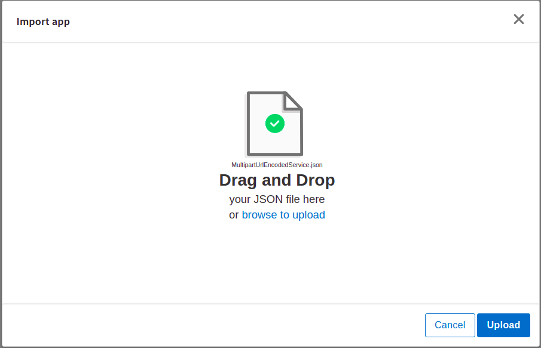

5. Click Upload. The Import app dialog displays some generic errors and warnings as well as any specific errors or warnings pertaining to the app you are importing. It validates whether all the activities and triggers used in the app are available in the Extensions tab.

6. You have the option to import all flows from the source app or selectively import flows.

7. If you choose selective import, select the trigger, flow and connection. Click Next.

8. After importing the 'MultipartUrlEncodedService' app(producer service), repeat the above steps to import the InvokeMultipartUrlEncodedService app(consumer service).

## Understanding the configuration
### Rest Service
In the 'MultipartUrlEncodedService', when the method is Post or Put we can see a 'Request Type' drop-down in the ReceiveHTTPMesaage trigger, here we have selected 'multipart/form-data'.
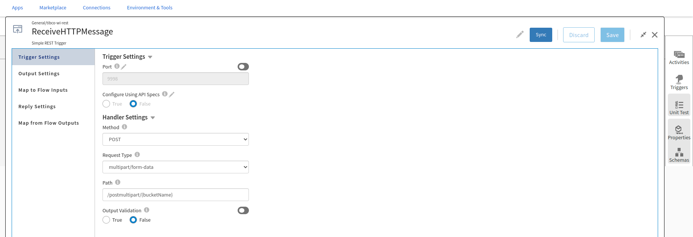

In the Output Settings we can see that a 'Multipart Data' table has been added, here we have support for String, Object and FileContent types of data. When Object type is selected we need to 
pass the schema as JSON schema not JSON data.  
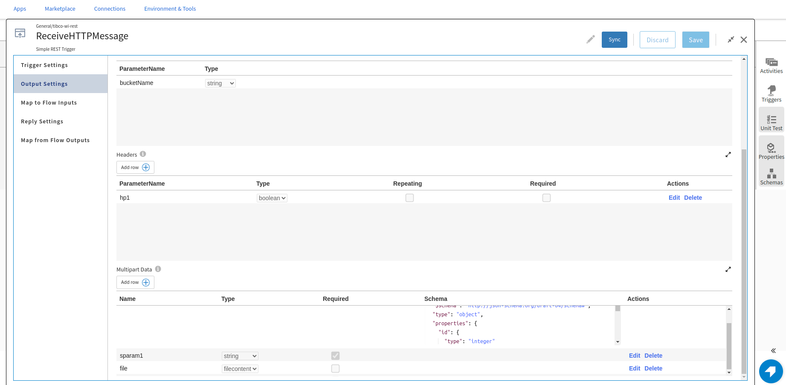

The mappings from trigger to flow input is like this.
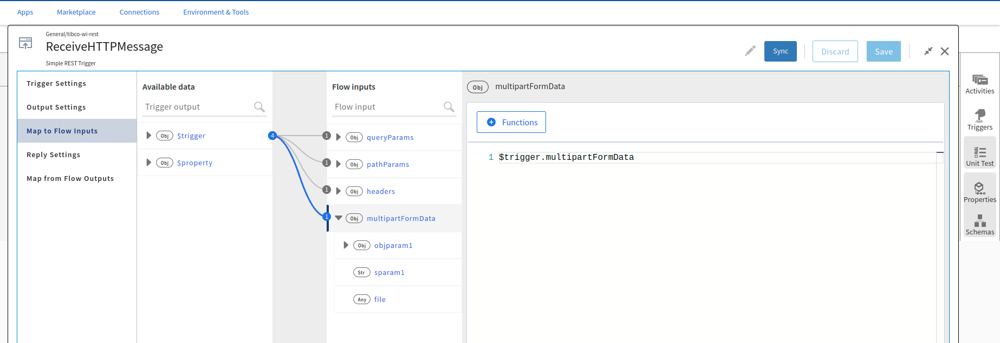

Coming to the flow, AmazonS3 Put activity has been used to upload the file received from the Rest trigger. Text is the supported Input type in this activity so we need to convert the file content to 
string format.
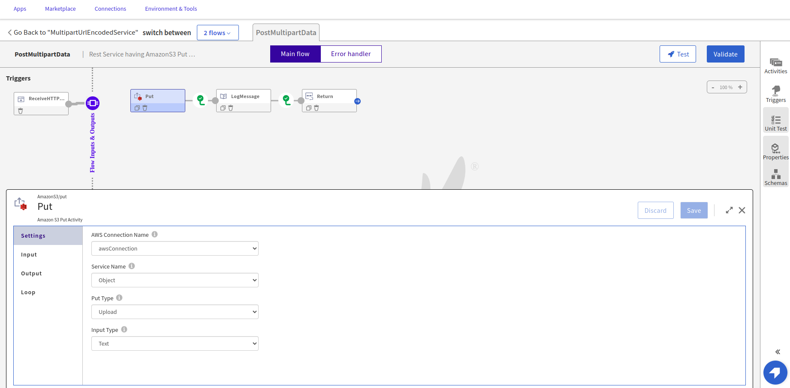

The S3 Bucket name and the file/key name of the file is coming from the path and query parameters from the Rest trigger.
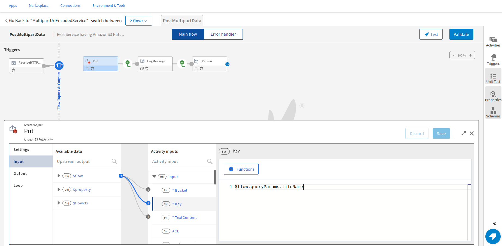

In the Return activity we are returning the status of the file uploaded and the string and object parameters received from the trigger.

In the Second flow, method Put is used with Request Type as x-www-form-urlencoded and it's Request Schema has JSON with "key:value" pair, we can use App Schema here as well.
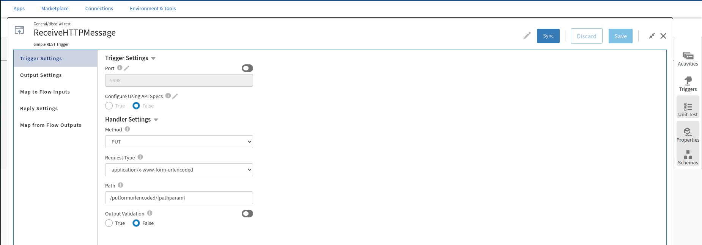
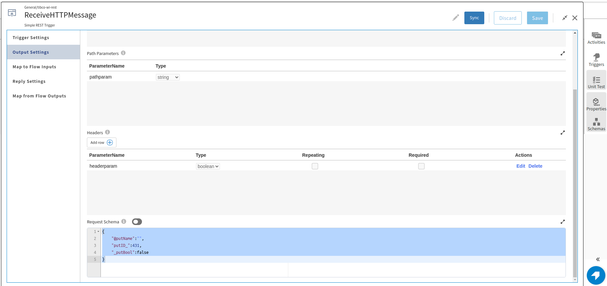

Configure Response Codes has been enabled, service will respond in 200 Success or 400 error response based on the condition and accordingly response schema and response header will change.
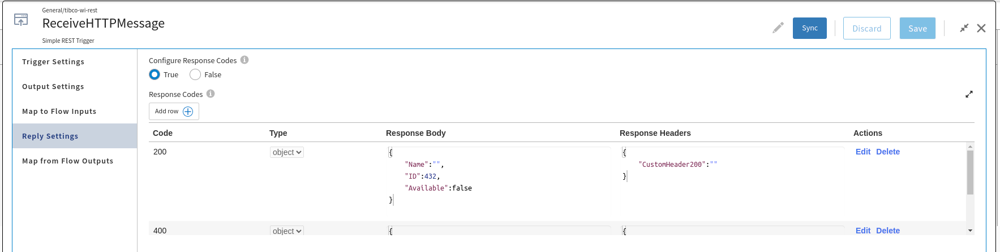

ConfigureHTTPResponse activity should be used when we have configured multiple response codes in the Rest trigger. This activity is useful in mapping Response body and Response headers of a particular Response code in getting input from other activities and output to 'Return' activity.
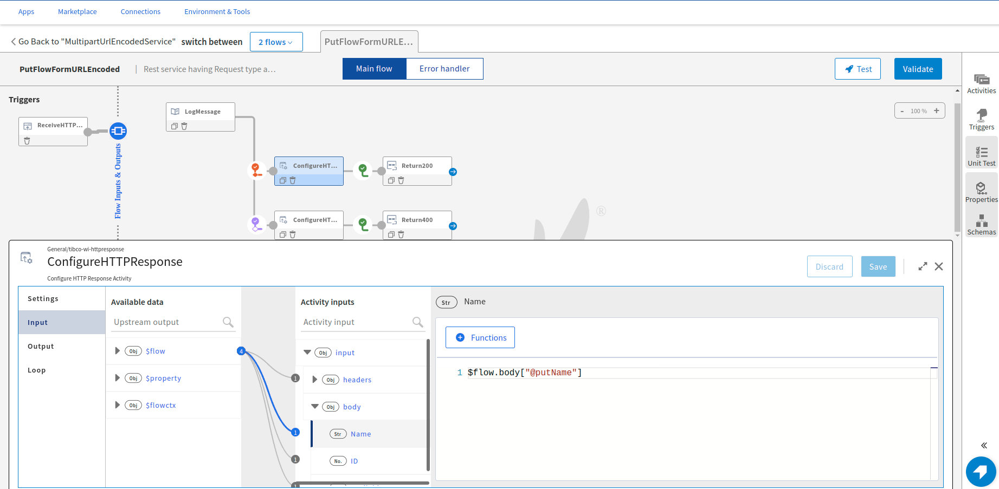

### Rest Invoke
For the 'InvokeMultipartUrlEncodedService' app, there are two flows, each one having InvokeRestService activity calling the two services created above, one having request type as multipart/form-data and other one having  x-www-form-urlencoded.
The InvokeRest activity in the 'InvokePostmultipartDataFlow' flow is configured with the API Spec of the 'MultipartUrlEncodedService' service. This will call the multipart/form-data request type service. The input params to the service is provided by the Rest trigger of this flow which is also has multipart/form-data request type. Inputs are directly mapped with the flow inputs. When invoked successfully, this will call the Rest service 'MultipartUrlEncodedService' which will upload the file sent from this flow.
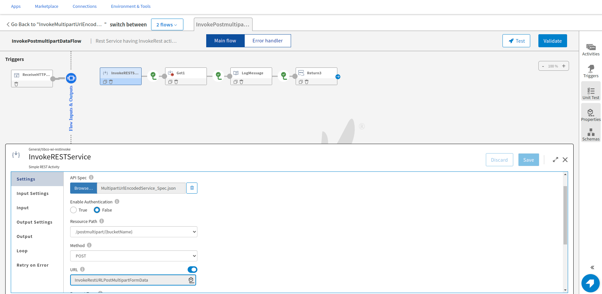

Since, API Spec is used in the activity configuration, multipart/form-data will be auto-selected and multipart data table will also get populated.
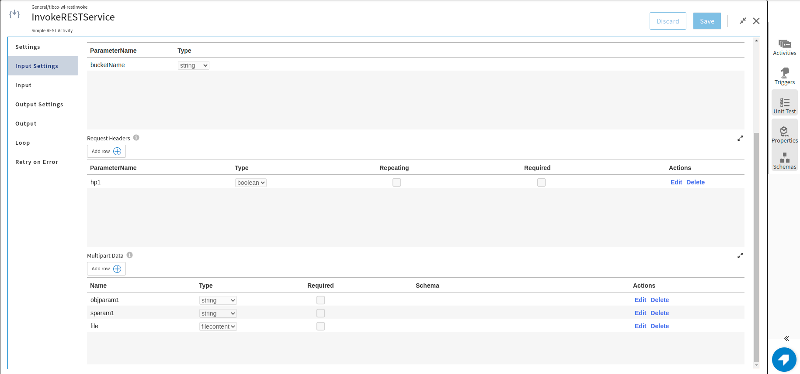

AmazonS3 Get activity has been used to fetch the text content of the file uploaded on the S3 bucket. The input params like bucket name and key name are coming from the Rest trigger path and query parameters.
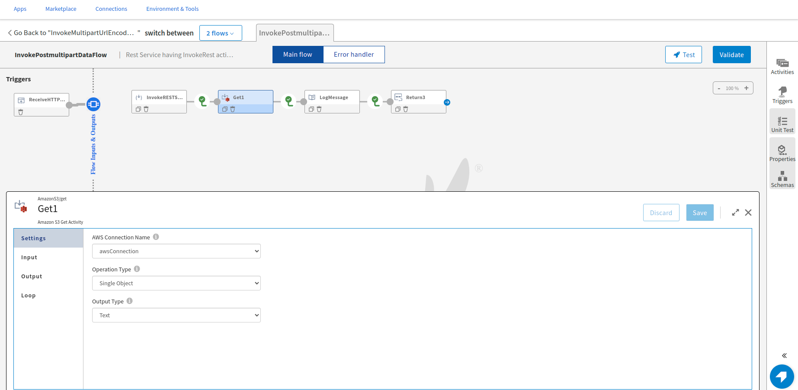

When the file content is fetched successfully we are returning the content as the output. Since the data is stored on the S3 bucket is an array with file content as base64 encoded format we need to decode the value to make it readable.  
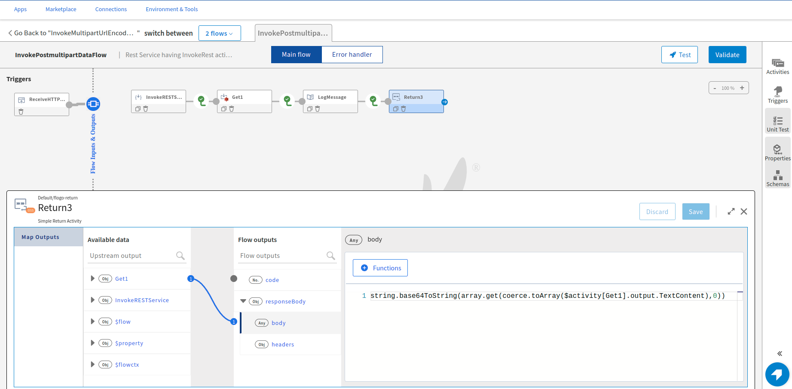

In the 'InvokePutFormURLEncoded' flow, we are calling the x-www-form-urlencoded service, here the configuration is done manually with the Invoke Rest URL as an app property. We can override this URL as per requirement.
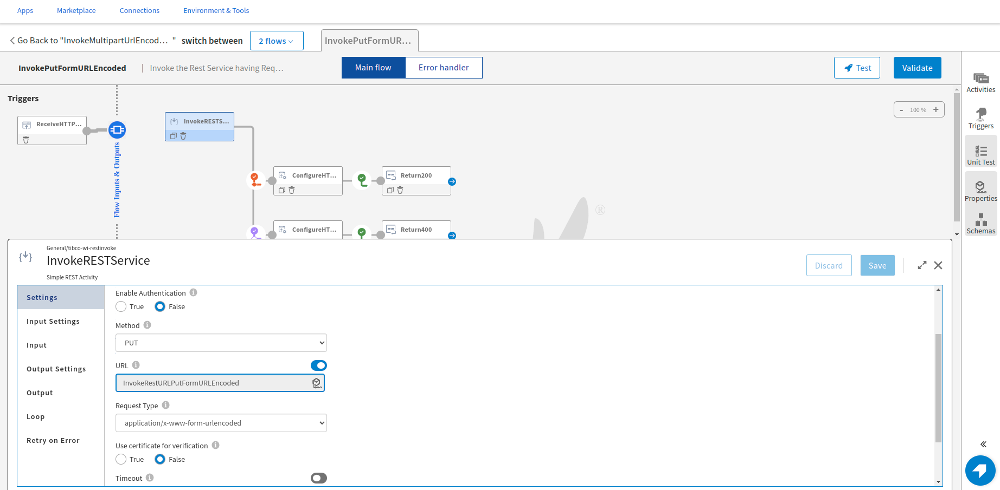

In the Input Settings, app schema is used for the x-www-form-urlencoded service request schema.
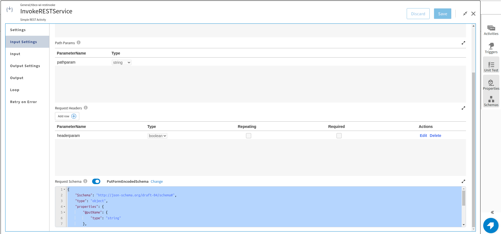

In the 'InvokeMultipartUrlEncodedService' we have similar branching like the service app, but here the condition is based on the response code received when the service is invoked, like for 200 response the success branch will be executed and corresponding response will be returned.
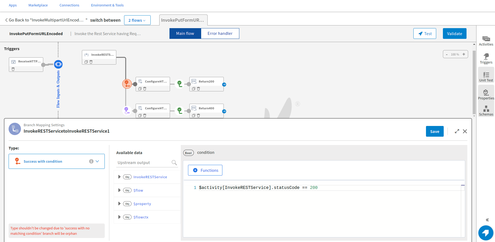

As the consumer app is also a multiple response code service ConfigureHTTPResponse activity is used for mapping input and output.
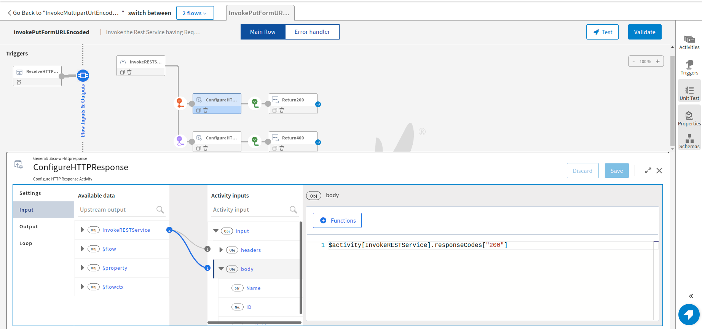

## Run the application

Once you have imported both the apps, push the 'MultipartUrlEncodedService' app first and scale the app to 1. Now we need to get the endpoint of the producer service, go to the 'Endpoint' tab of the app and click on 'Copy URL' to get the endpoint URL.
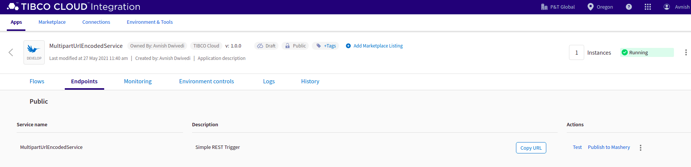

Now push the 'InvokeMultipartUrlEncodedService' app and scale the app to 1. Go to 'Environment Controls' tab -> 'Application Variables' and edit the default value of the 'InvokeRestURLPostMultipartFormData' and 'InvokeRestURLPutFormEncoded' application properties to point to the endpoint URL of the producer Rest service app.
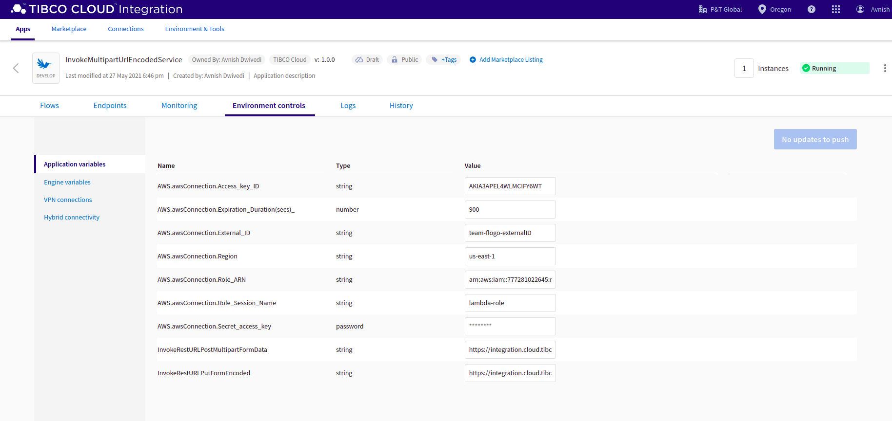

Since we are using AmazonS3 activities it needs AWS connection to connect to the AWS S3 services, when app is imported please make sure to update the AWS credentials in the AWS Connection which got imported with both the apps and save the connection. 
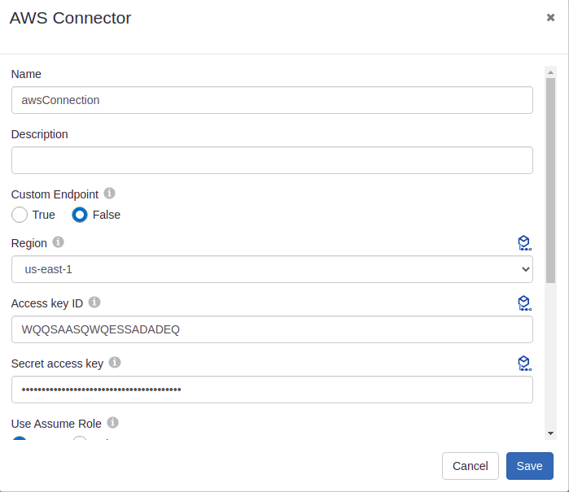

To run the app in Flogo Enterprise, create appropriate binaries for both the apps and run both the binaries. Export the URL of the Service app in the 'InvokeMultipartUrlEncodedService' app before running the invoking app like this:
 $ ./MultipartUrlEncodedService-linux_amd64 

 $ export InvokeRestURLPostMultipartFormData="http://localhost:9998"
 
 $ export InvokeRestURLPutFormEncoded="http://localhost:9998/putformurlencoded"

 $ FLOGO_APP_PROPS_ENV=auto ./InvokeMultipartUrlEncodedService-linux_amd64 

And then hit the endpoint of the 'InvokeMultipartUrlEncodedService' app.

## Output

1. Input for the 'InvokePostmultipartDataFlow' flow in the InvokeMultipartUrlEncodedService app
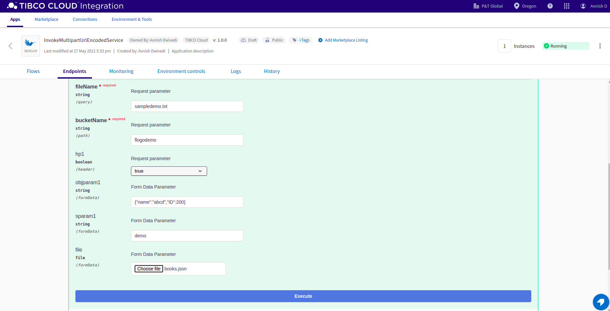

2. Sample response for 200 Success for the 'InvokePostmultipartDataFlow' flow in the InvokeMultipartUrlEncodedService app
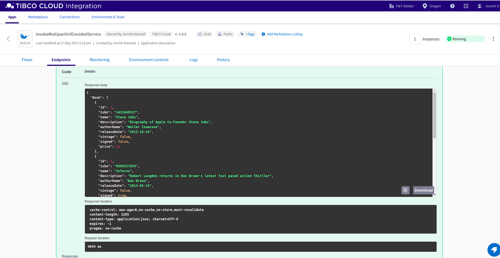

3. Input for the 'InvokePutFormURLEncoded' flow in the InvokeMultipartUrlEncodedService app for 200 Success response qp1 should be less than or equal to 200.
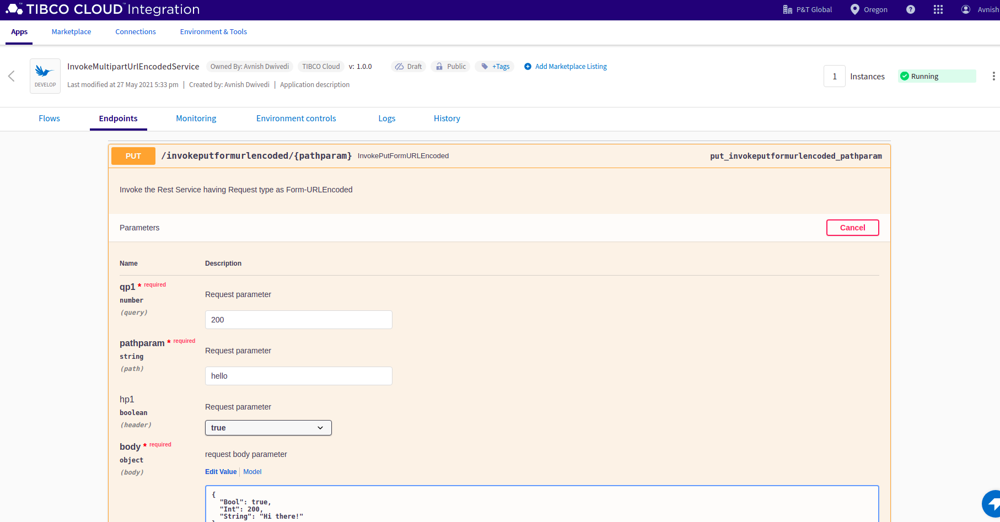

4. Sample response for 200 success for the 'InvokePutFormURLEncoded' flow
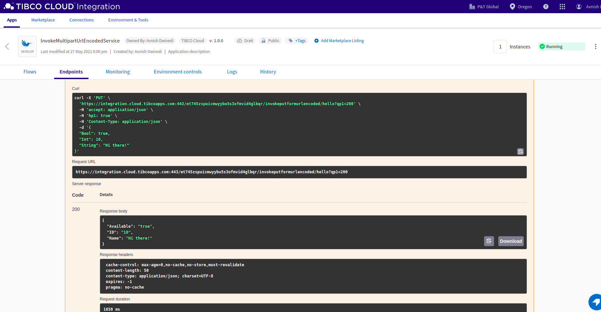

5. Input for the 'InvokePutFormURLEncoded' flow in the InvokeMultipartUrlEncodedService app for 400 Error response qp1 should be more than 200.
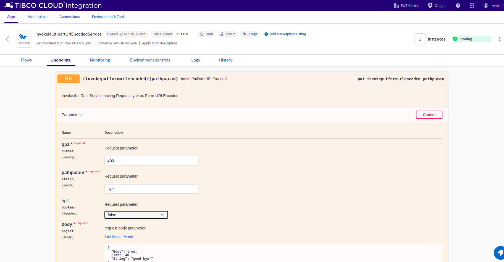

6. Sample response for 400 error for the 'InvokePutFormURLEncoded' flow
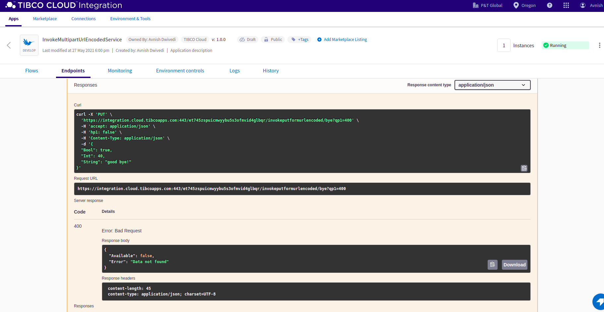

## Troubleshooting

1. If you do not see the Endpoint enabled, make sure your app is in Running status.
2. The responses are received upon meeting a particular condition, please check the branch conditions.
3. If the  'InvokePostmultipartDataFlow' app is not returning the expected response, please check if the 'InvokeRestURL' application property is pointing to the right endpoint URL.
4. Please update the AWS Connector with your AWS Access ID and Secret Access key and region. 
5. Check if your S3 Bucket is accessible or your role has permission to upload files on to the S3 bucket. 

## Contributing

If you want to build your own activities for Flogo please read the docs here.

If you want to showcase your project, check out [tci-awesome](https://github.com/TIBCOSoftware/tci-awesome)

You can also send an email to `tci@tibco.com`

## Feedback
If you have feedback, don't hesitate to talk to us!

* Submit feature requests on our [TCI Ideas](https://ideas.tibco.com/?project=TCI) or [FE Ideas](https://ideas.tibco.com/?project=FE) portal
* Ask questions on the [TIBCO Community](https://community.tibco.com/answers/product/344006)
* Send us a note at `tci@tibco.com`

## Help

Please visit our [TIBCO Cloud&trade; Integration documentation](https://integration.cloud.tibco.com/docs/) and TIBCO Flogo® Enterprise documentation on [docs.tibco.com](https://docs.tibco.com/) for additional information.

## License
This TCI Flogo SDK and Samples project is licensed under a BSD-type license. See [license.txt](license.txt).

