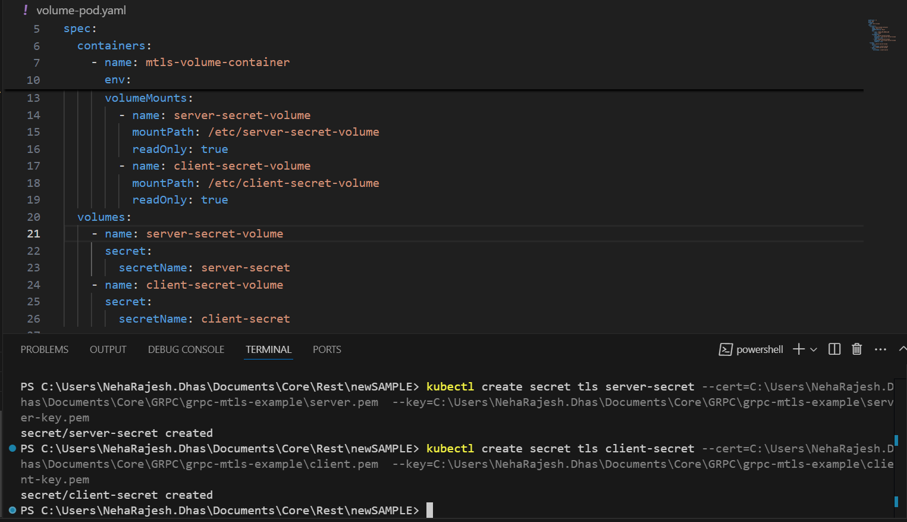
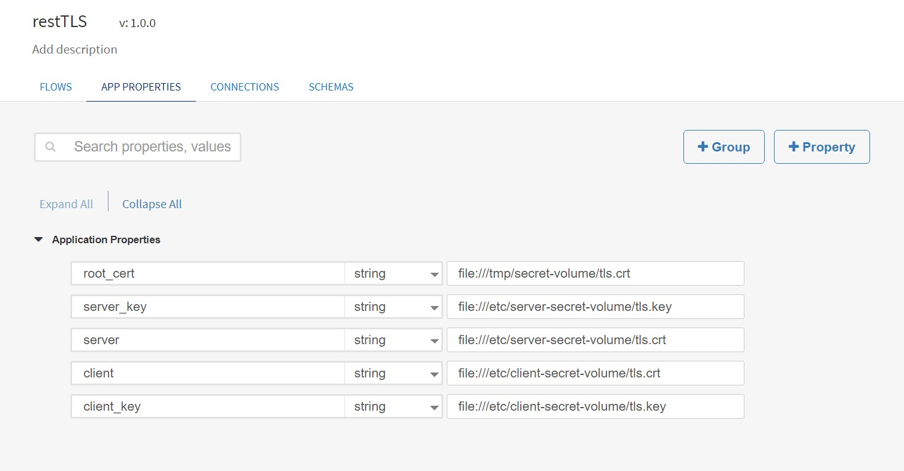
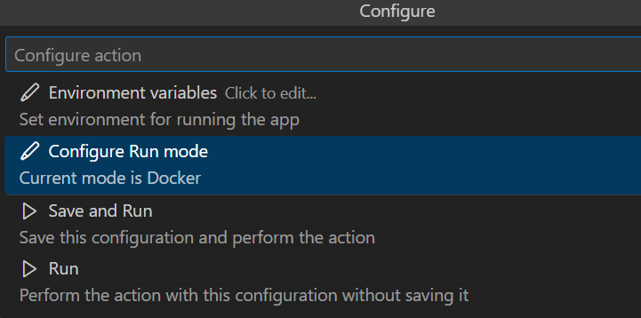
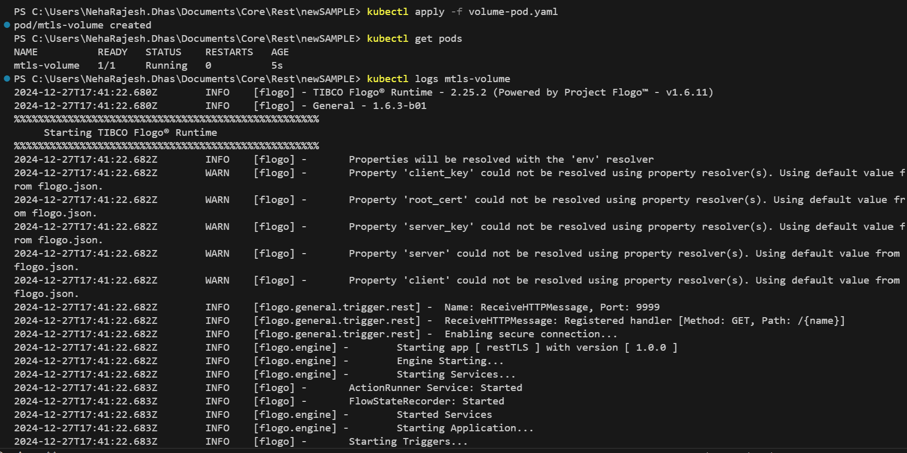

# REST Sample: Supporting SSL Certificates from K8s Secret for REST Service and Client

The app must be designed with Flogo Extension for VS Code v1.1.1 and above.

This sample demonstrates how to support SSL certificates for a REST service and client using Kubernetes secrets.
Two approaches are provided: 
1. Using environment variables.
2. Using volume mounts. 

Screenshots and YAML configuration files for both approaches are included.

## Steps to Implement

1. Create Kubernetes Secret

Generate your SSL certificates and create the Kubernetes secret:
Following commands can be used to create the server secret and client secret.

	```bash
	kubectl create secret tls server-secret \
	  --cert=<path-to-server-certificate> \
	  --key=<path-to-server-private-key>

	kubectl create secret tls client-secret \
	  --cert=<path-to-client-certificate> \
	  --key=<path-to-client-private-key>
	  ```

This will create two secrets named server-secret and client-secret containing your respective certificates and private keys.



2. Prepare the Flogo App

Ensure your Flogo app is configured to use SSL and is configured with the app properties for the SSL certificates and keys. The app should be built and ready to deploy as a Docker image.



3. Build and Tag the Docker Image

Run the following command to tag your Docker image:

	`docker tag <source-image>:<source-tag> <target-image>:<target-tag>`
		


4. Load the Image to Minikube

Load the Docker image into Minikube:
	
	`minikube image load <image-name>:<image-tag>`

5. Use the Attached Configuration Files(Sample YAML Files can also be found in the Rersources folder)

a. Deployment Configuration File (Environment Variable Approach)

The deployment-env.yaml file demonstrates how to use environment variables to access the secrets.

### Environment Variables in Deployment YAML

Below is a generic YAML configuration for deploying an application with SSL certificates stored in secret and secret used as environment variables.

	```yaml

	apiVersion: apps/v1
	kind: Deployment
	metadata:
	  name: mtls-env-deployment
	spec:
	  selector:
		matchLabels:
		  app: mtls-env-deployment
	  template:
		metadata:
		  labels:
			app: mtls-env-deployment
		spec:
		  containers:
			- name: mtls-enn-container
			  image: restserviceclientapp:1.1.2
			  imagePullPolicy: Never
			  env:
				# Root certificate environment variable
				- name: root_cert
				  valueFrom:
					secretKeyRef:
					  name: server-secret  # Assuming root_cert is part of server-secret
					  key: tls.crt
				# Server certificate and key environment variables
				- name: server
				  valueFrom:
					secretKeyRef:
					  name: server-secret
					  key: tls.crt
				- name: server_key
				  valueFrom:
					secretKeyRef:
					  name: server-secret
					  key: tls.key
				# Client certificate and key environment variables
				- name: client
				  valueFrom:
					secretKeyRef:
					  name: client-secret
					  key: tls.crt
				- name: client_key
				  valueFrom:
					secretKeyRef:
					  name: client-secret
					  key: tls.key
				- name: FLOGO_APP_PROPS_ENV
				  value: auto
			  ports:
				- containerPort: 9999
			  volumeMounts:
				- name: tls-persistent-storage
				  mountPath: /var/lib/misc
		  volumes:
			- name: tls-persistent-storage
			  emptyDir: {}

	```

Apply this file using the following command;
	`kubectl apply -f deployment-env.yaml`

b. Pod Configuration File (Volume Mount Approach)

The volume-pod.yaml file demonstrates how to use volume mounts to access the secrets. 

###Volume Mounts Configuration for YAML

Below is a generic YAML configuration for deploying an application with SSL certificate stored in secret and secret used as volume mount.

	```yaml

	apiVersion: v1
	kind: Pod
	metadata:
	  name: mtls-volume
	spec:
	  containers:
		- name: mtls-volume-container
		  image: restserviceclientapp:1.1.2
		  imagePullPolicy: Never
		  env:
			- name: FLOGO_APP_PROPS_ENV
			  value: auto
		  volumeMounts:
			- name: server-secret-volume
			  mountPath: /etc/server-secret-volume
			  readOnly: true
			- name: client-secret-volume
			  mountPath: /etc/client-secret-volume
			  readOnly: true
	  volumes:
		- name: server-secret-volume
		  secret:
			secretName: server-secret
		- name: client-secret-volume
		  secret:
			secretName: client-secret
	```		
				
Apply this file using the following command;
	`kubectl apply -f volume-pod.yaml`	


6. Run the App

Deploy the app using the specified configuration files. The Docker image will be automatically used in the pods. Verify the deployment by checking the logs and endpoints.

Example Commands for Debugging

Check pod status:
	`kubectl get pods`

View logs:
	`kubectl logs <pod-name> -c <container-name>`

Execute commands inside the pod:
	`kubectl exec -it <pod-name> -- /bin/sh`



##Notes

Ensure your Kubernetes cluster has sufficient resources for deployment.

Update certificate paths and secret names in the configuration files as required.

By following these steps, you can successfully configure and deploy a REST service and client with SSL certificate support in Kubernetes.

