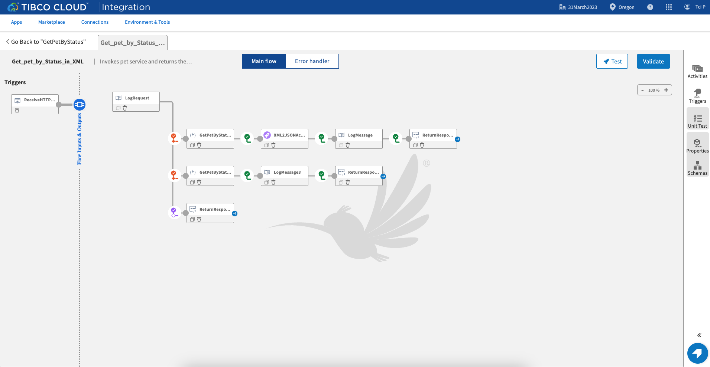
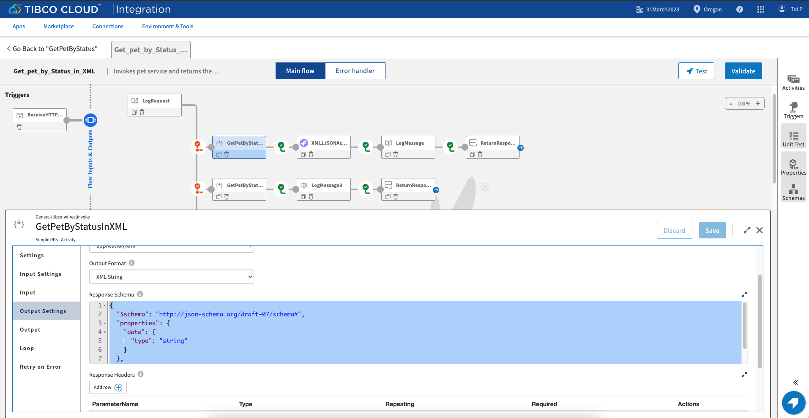
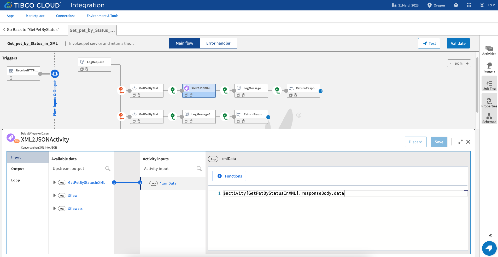
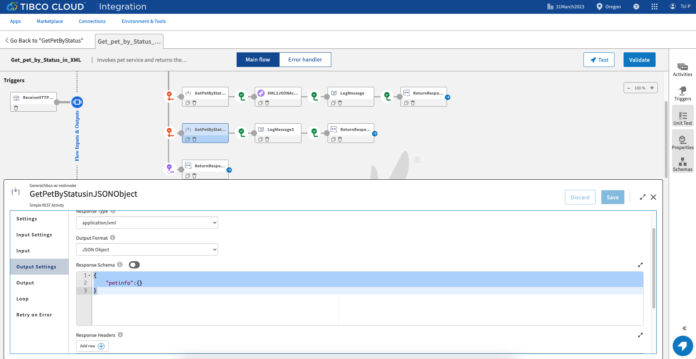
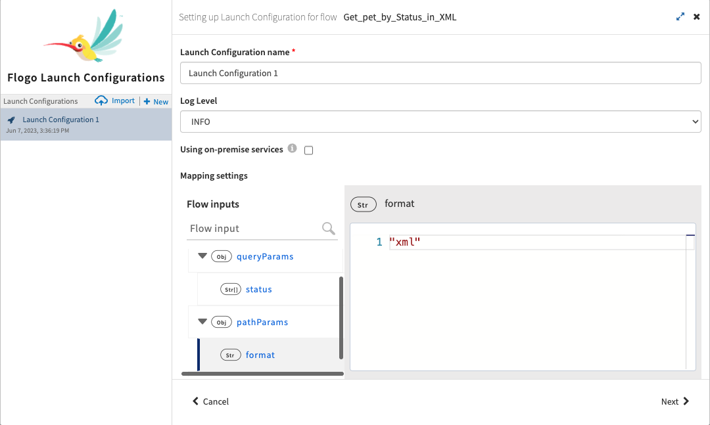
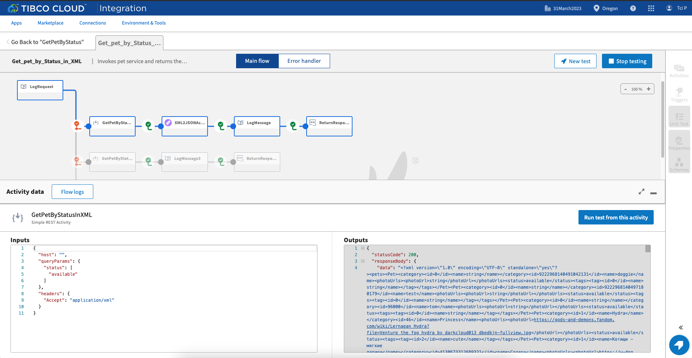

# Support of application/xml as Response Type for InvokeRESTService Activity Sample

# Description

This is rest xml support sample.The invokeRest activity supports invoking services which are returning response in the XML format. The users can select XML string to get the output in an XML string or they can chose to convert the XML response in the JSON object by selecting the JSON Object as Output format in Output settings of the activity.

## Import the sample
1. Download the sample json file i.e., *GetPetByStatus.json*.

2. Create a new empty app

3. On the app details page, select import app option.

4. Now click on ‘browse to upload’ button and select the app.json from your machine that you want to import.

5. Click on Upload Button. The Import app dialog displays some generic errors and warnings as well as any specific errors or warnings pertaining to the app you are importing.

6. You have the option to import all flows from the source app or selectively import flows.

7.  Click Next. If you had not selected a trigger in the previous dialog, the flows associated with that trigger are displayed. You have the option to select one or more of these flows such that the flows get imported as blank flows that are not attached to any trigger. By default, all flows are selected. Clear the check box for the flows that you do not want to import. If your flow(s) have subflows, and you select only the main flow but do not select the subflow, the main flow gets imported without the subflow. Click Next.

## Understanding the configuration

In the attached sample *GetPetByStatus.json*, there is 1 flow *Get_pet_by_Status_in_XML*. The flow contains invokeRest activity which is invoking the petstore service. The service returns the pet information by status.

In the first branch,The invokeRest activity is expecting the response in XML string. There is XML2JSON activity used in the 1st branch which will convert the XML response into  JSON object.

In the second branch, The invokeRest activity is expecting the response in JSON Object. The invokeRest activity will convert the XML response into JSON object. The branches will be executed based upon the *format* path paramter. For example, if value of *format* path parameter is "xml", branch with xml string will be executed. 

### Run the application

To run the application, push the app to TIBCO Cloud and then scale up to 1 instance. Once your app is scaled, you can see your app in running status.

Once your app reaches to Running state, go to Endpoints and for GET/pet/{format} option, select 'Try it Out’ option and then give "xml" as value in format path parameter and "available" as value in status query parameter. Then click on execute.

Another option, If you want to test the sample in the Flow tester then follow below instructions:
 
in flow, click on Test Button -> create Launch configuration -> provide values in path params and query params -> click Next button -> click on Run

## Outputs

1. Flow Tester 	

2. When hit endpoints

## Troubleshooting

* If you do not see the Endpoint enabled, make sure your apps is in Running status.
* If you see test connection failed in connection tab, then check your public ip if it is whitelisted or not.

## Contributing
If you want to build your own activities for Flogo please read the docs here.

If you want to showcase your project, check out [tci-awesome](https://github.com/TIBCOSoftware/tci-awesome)

You can also send an email to `tci@tibco.com`

## Feedback
If you have feedback, don't hesitate to talk to us!

* Submit feature requests on our [TCI Ideas](https://ideas.tibco.com/?project=TCI) or [FE Ideas](https://ideas.tibco.com/?project=FE) portal
* Ask questions on the [TIBCO Community](https://community.tibco.com/answers/product/344006)
* Send us a note at `tci@tibco.com`

## Help
Please visit our [TIBCO Cloud&trade; Integration documentation](https://integration.cloud.tibco.com/docs/) and TIBCO Flogo® Enterprise documentation on [docs.tibco.com](https://docs.tibco.com/) for additional information.

## License
This TCI Flogo SDK and Samples project is licensed under a BSD-type license. See [license.txt](license.txt).

