# gRPC Client Server Sample - Enable creating a gRPC server(trigger) and client(activity)

# Description

This is gRPC client and server sample. gRPC enables procedure calls to request a service from a remote server via protobuffers.Flogo Enterprise enables to create the gRPC client server with the help of proto files. gRPC trigger in Flogo acts as gRPC server and gRPC activity acts as a gRPC client. 

Note- Flogo Enterpise supports both gRPC trigger and activity while Flogo on TCI supports only gRPC activity.

If you want to read more about gRPC, please refer [here](https://grpc.io/docs/what-is-grpc/introduction/)

## Import the sample
1. Download the sample json file i.e., *grpcPetStoreClientServer*.

2. Create a new empty app

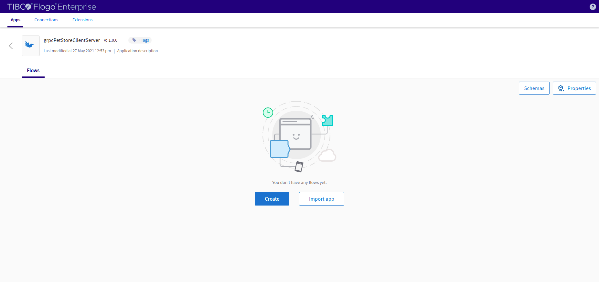

3. On the app details page, select import app option.

4. Now click on ‘browse to upload’ button and select the app.json from your machine that you want to import.

5. Click on Upload Button. The Import app dialog displays some generic errors and warnings as well as any specific errors or warnings pertaining to the app you are importing.

6. You have the option to import all flows from the source app or selectively import flows.

7.  Click Next. If you had not selected a trigger in the previous dialog, the flows associated with that trigger are displayed. You have the option to select one or more of these flows such that the flows get imported as blank flows that are not attached to any trigger. By default, all flows are selected. Clear the check box for the flows that you do not want to import. If your flow(s) have subflows, and you select only the main flow but do not select the subflow, the main flow gets imported without the subflow. Click Next.

## Understanding the configuration

In the attached sample *grpcPetStoreClientServer.json*, The server and client are created with petstore.proto file attached with the sample. there are 8 flows, The first 4 flows are attached to gRPC trigger which acts as the gRPC Server. The next 4 flows are attached to the rest trigger and includes the gRPC activity which acts as the gRPC client. 

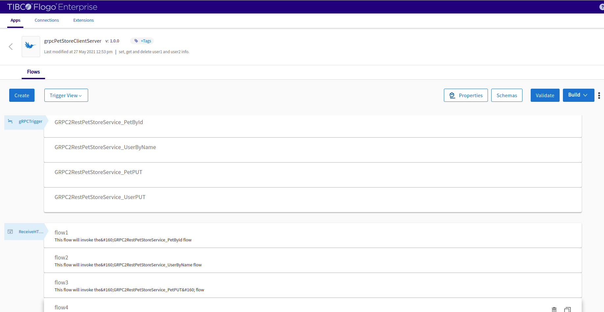

First 4 flows which are attached to the gRPC trigger are the server flows and have been created with the option *gRPC Protobuff* on Create new app screen as shown below. 

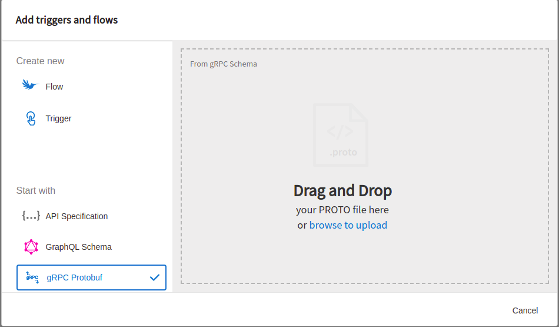

The flows are generated upon successful upload of the .proto file based upon the no. of service and rpc request in the .proto file. Since, in the given *petstore.proto* file, there were one service and four rpc requests, so 1 flow for each rpc request has been generated.

The 1st gRPC Server flow name is *GRPC2RestPetStoreService_PetById*. It is returning the pet name upon providing the id from the flow parameter.

The 2nd gRPC Sever flow name is *GRPC2RestPetStoreService_UserByName*. It is returning the user id, email and phone no. upon providing the username from the flow parameter.

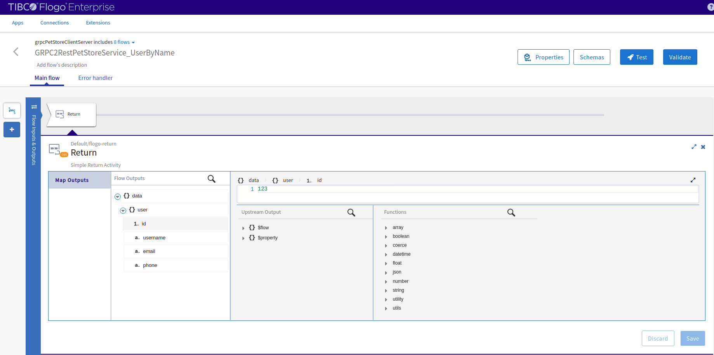

The 3rd gRPC server flow name is *GRPC2RestPetStoreService_PetPUT*. it is updating the pet name with a specific id with the values provided from the flow parameter.

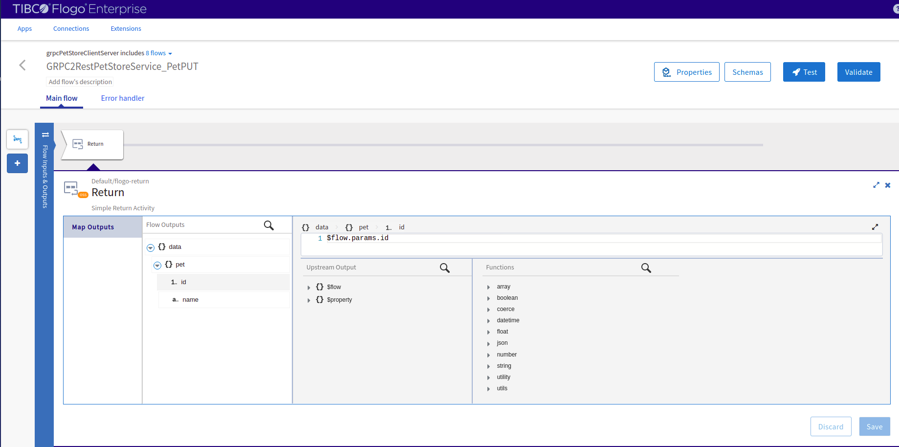

The 4th gRPC server flow name is *GRPC2RestPetStoreService_UserPUT*. it is updating the user's details with the values provided from the flow paramter.

The next four flows which are attached with the Rest trigger are the gRPC client flows, the client flows contain the gRPC invoke activity which acts as the client for a gRPC service. each flow is client of their respective gRPC trigger flow. Let us see the configuration of each flow.

The 1st gRPC client flow is *flow1*. it is invoking the gRPC server flow *GRPC2RestPetStoreService_PetById*. The *id* is provided and the server flow returns the *id* as well as the *name* of the pet.

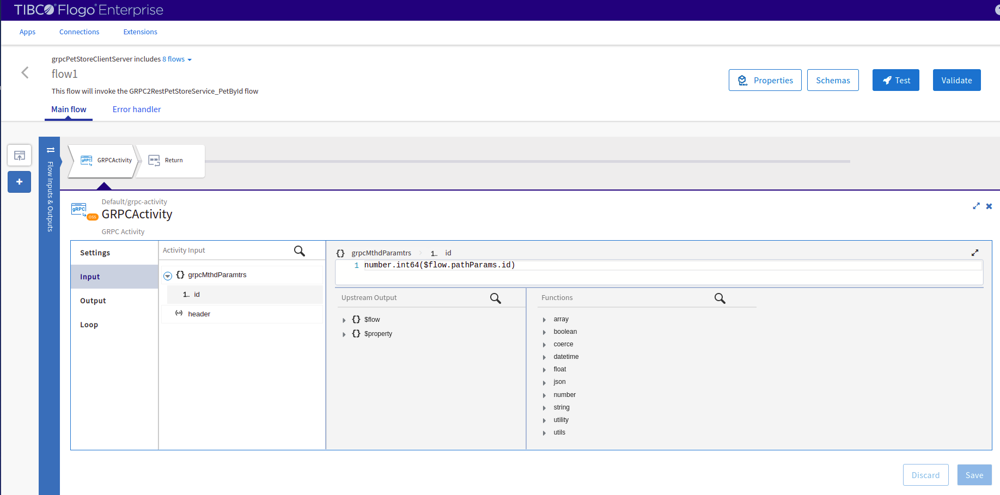

The 2nd gRPC client flow is *flow2*. it is invoking the gRPC server flow *GRPC2RestPetStoreService_UserByName*. The *username* is provided and the server flow returns the *id*,*username*,*email* as well as the *phone* of the user.

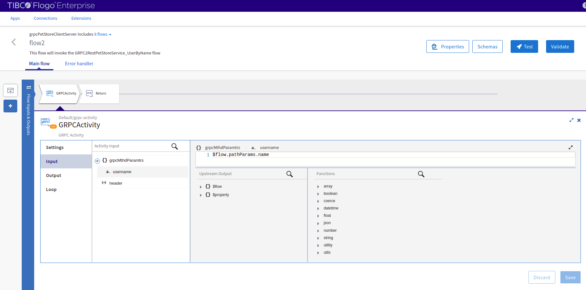

The 3rd gRPC client flow is *flow3*. it is invoking the gRPC server flow *GRPC2RestPetStoreService_PetPUT*. The *id* and *name* are provided and the server flow returns the updated *id* and *name* of the pet.

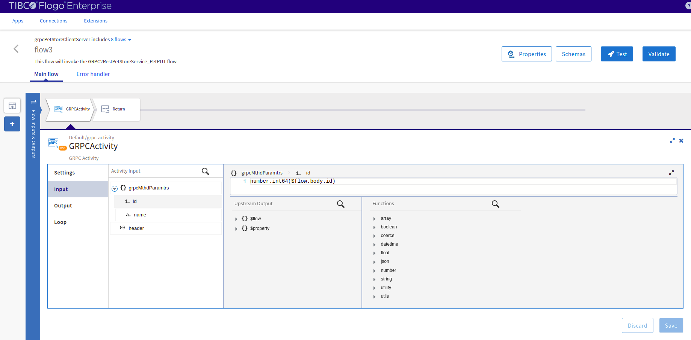

The 4th gRPC client flow is *flow4*. it is invoking the gRPC server flow *GRPC2RestPetStoreService_UserPUT*. The *id*,*username*,*email* and *phone* are provided and the server flow returns the updated values of the user.

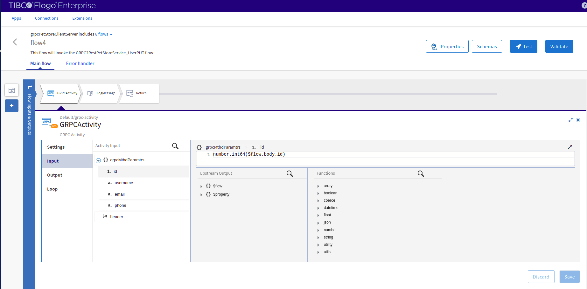

### Run the application

To run the application, generate the app binary according to the platform you are going to run. 

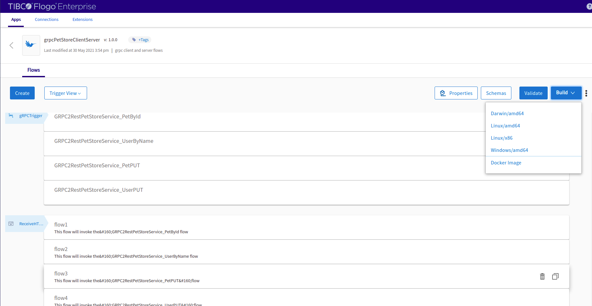

Once your app is running, use a rest client to invoke the rest endpoints which are further invoking the gRPC client activities.

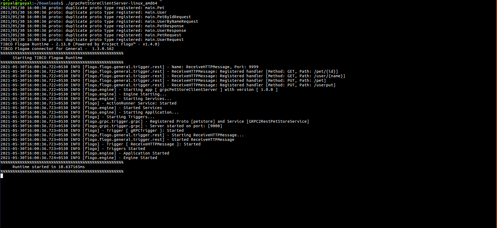

Another option, Once your gRPC service is running, you can also test the sample in the Flow tester then follow below instructions:
 
In the flow, click on Test Button -> create Launch configuration -> provide values in path params and query params -> click Next button -> click on Run

*Note:-In Host URL of gRPC invoke activity, give IP of the machine where gRPC service is running while using the flow tester.*

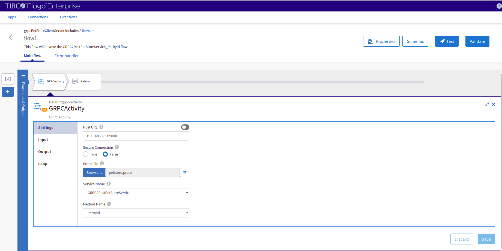

## Outputs

1. Flow Tester

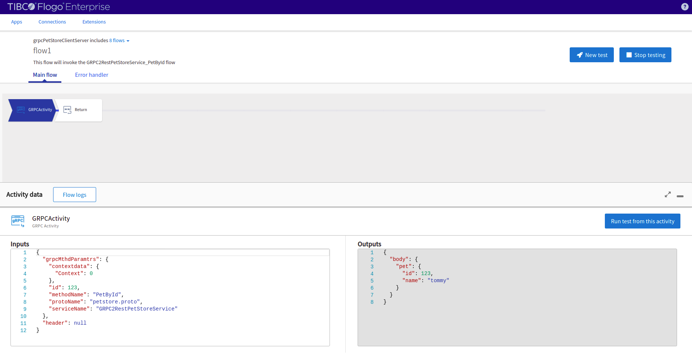
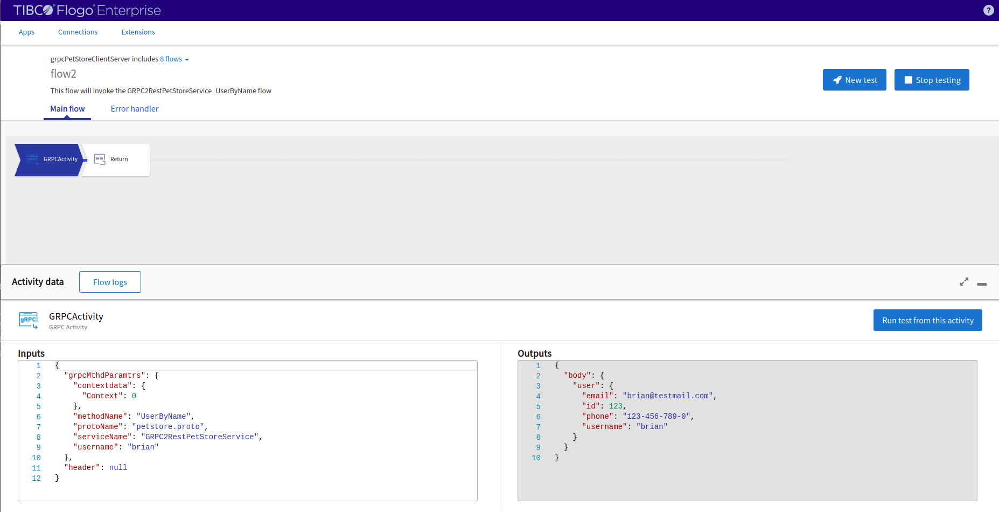
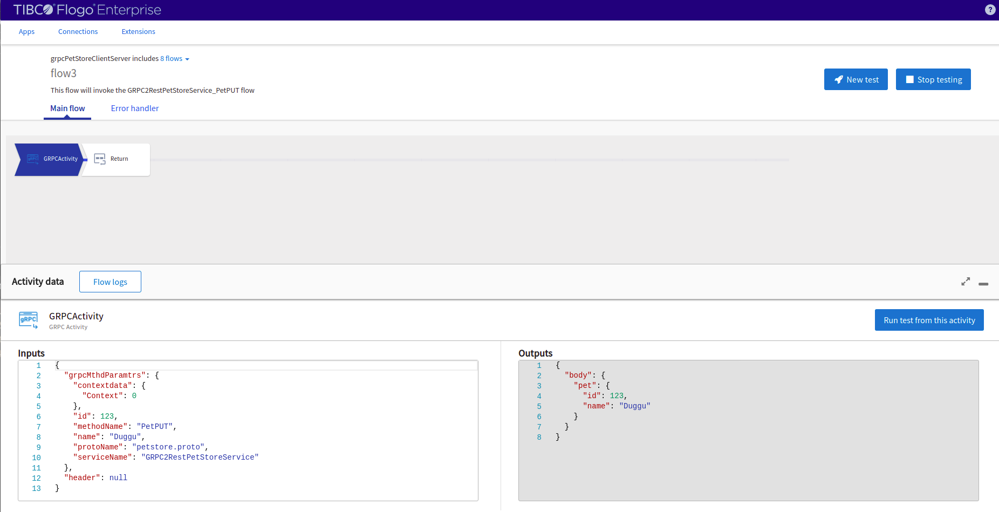
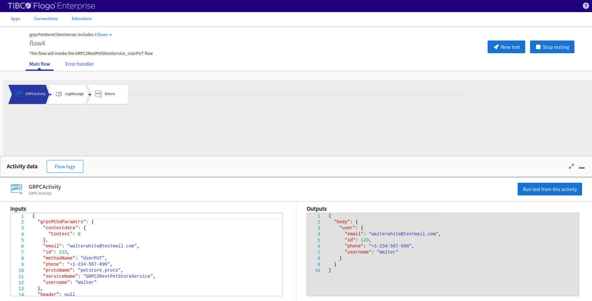

2. When hit endpoints

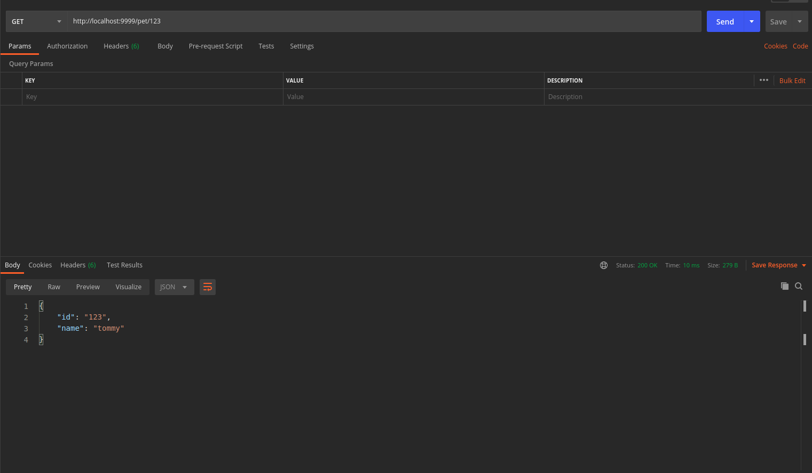
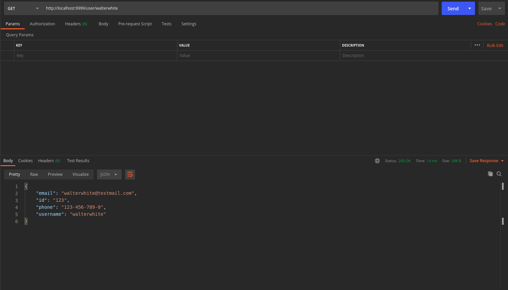
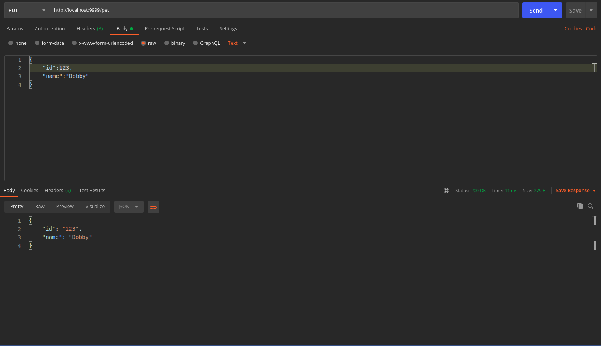
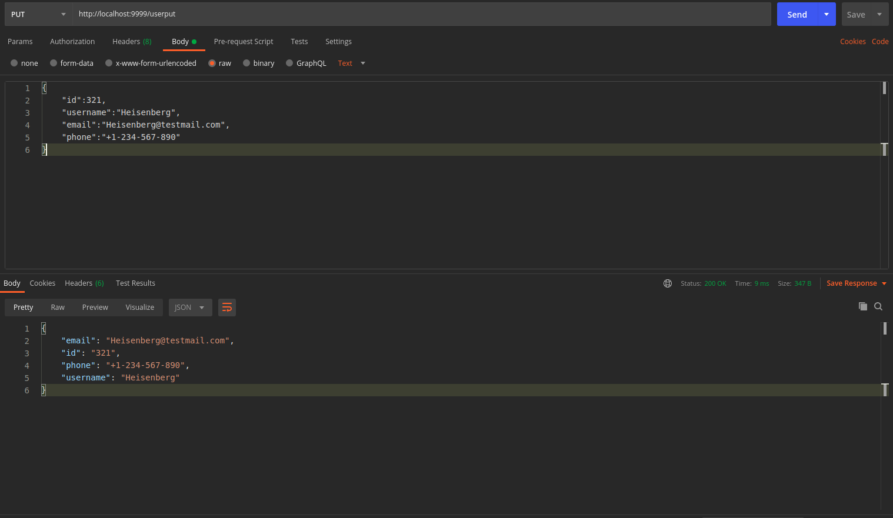

## Troubleshooting

* If you do not see the Endpoint enabled, make sure your apps is in Running status.
* If you see test connection failed in connection tab, then check your public ip if it is whitelisted or not.

## Contributing
If you want to build your own activities for Flogo please read the docs here.

If you want to showcase your project, check out [tci-awesome](https://github.com/TIBCOSoftware/tci-awesome)

You can also send an email to `tci@tibco.com`

## Feedback
If you have feedback, don't hesitate to talk to us!

* Submit feature requests on our [TCI Ideas](https://ideas.tibco.com/?project=TCI) or [FE Ideas](https://ideas.tibco.com/?project=FE) portal
* Ask questions on the [TIBCO Community](https://community.tibco.com/answers/product/344006)
* Send us a note at `tci@tibco.com`

## Help
Please visit our [TIBCO Cloud&trade; Integration documentation](https://integration.cloud.tibco.com/docs/) and TIBCO Flogo® Enterprise documentation on [docs.tibco.com](https://docs.tibco.com/) for additional information.

## License
This TCI Flogo SDK and Samples project is licensed under a BSD-type license. See [license.txt](license.txt).

