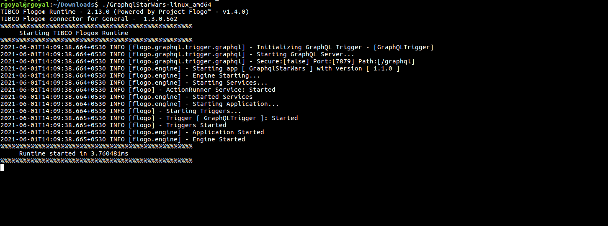
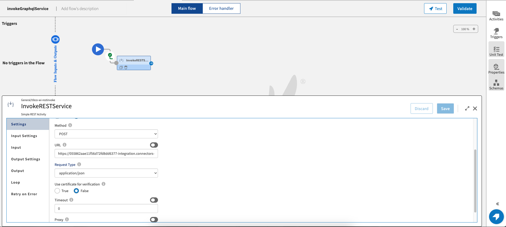

# Graphql Server Sample - Enable creating a Graphql service in Flogo.

# Description

This is Graphql service sample. GraphQL provides a complete and understandable description of the data in your API, gives clients the power to ask for exactly what they need and nothing more. Flogo makes it even easier to create Graphql services. 

To know more about Graphql, please refer [here](https://graphql.org/)

*Note:- As of now, Flogo supports only Query and Mutation type in Graphql. Currently, Subscription type is not supported.*

## Import the sample
1. Download the sample json file i.e., *GraphqlStarWars*.

2. Create a new empty app

3. On the app details page, select import app option.

4. Now click on ‘browse to upload’ button and select the app.json from your machine that you want to import.

5. Click on Upload Button. The Import app dialog displays some generic errors and warnings as well as any specific errors or warnings pertaining to the app you are importing.

6. You have the option to import all flows from the source app or selectively import flows.

7.  Click Next. If you had not selected a trigger in the previous dialog, the flows associated with that trigger are displayed. You have the option to select one or more of these flows such that the flows get imported as blank flows that are not attached to any trigger. By default, all flows are selected. Clear the check box for the flows that you do not want to import. If your flow(s) have subflows, and you select only the main flow but do not select the subflow, the main flow gets imported without the subflow. Click Next.

## Understanding the configuration

In the attached sample *GraphqlStarWars.json*, The flows are created with *StarWarsSchema.gql* file attached with the sample. there are 4 flows which are attached to Graphql trigger which acts as the Graphql Server.

The flows are  created with the option *GraphQL Schema* on Create new app screen as shown below. 

The flows are generated upon successful upload of the .gql file based upon the no. of *queries* and *mutation* in the .gql file. Each flow acts as a resolver function. Since, in the given *StarWarsSchema.gql* file, there were three *queries* and one *mutation*, so 1 flow for each *query* and *mutation* has been generated.

The 1st flow name is *Query_hero*. It is returning the hero details upon providing the arguments from the trigger via flow parameter.

The 2nd flow name is *Query_human*. It is returning the human details upon providing the id  from the trigger via flow parameter.

The 3rd flow name is *Query_droid*. it is returning the droid details with specific id provided from the trigger via flow parameter.

The 4th flow name is *Mutation_createReview*. it is updating the user's review based upon the details with the values *id*,*rating* and *comment* provided from the trigger via flow parameter.

### Run the application

To run the application, generate the app binary according to the platform you are going to run. If you are using Tibco Cloud Integration, push the app to TIBCO Cloud and then scale up to 1 instance. Once your app is scaled, you can see your app in running status.

Once your app reaches to Running state, use a rest client to hit the endpoints.  

Another option, If you want to test the sample in the Flow tester then follow below instructions:
 
In the flow, click on Test Button -> create Launch configuration -> provide values in path params and query params -> click Next button -> click on Run

*Note:- The graphql queries are not supported in the flow tester since the trigger acts as the graphql server and the trigger is excluded in the flow tester.In the flow tester you can test the values you are returning to the trigger from Return activity*

### Graphql services can also be invoked from the *invokeRESTService* activity.

1. Provide the URL where the graphql service is running. The graphql parameter is mandatory to be added.

2. Provide the query as a string or use the function *string.concat()* to concat multiple queries in the *queryParams*

3. Provide the Content header as *application/graphql*

4. Run the flow tester for *invokeRESTService* activity and the response will look like this:-

## Outputs

1. Flow Tester

2. When hit endpoints

## Troubleshooting

* If you do not see the Endpoint enabled, make sure your apps is in Running status.
* If you see test connection failed in connection tab, then check your public ip if it is whitelisted or not.

## Contributing
If you want to build your own activities for Flogo please read the docs here.

If you want to showcase your project, check out [tci-awesome](https://github.com/TIBCOSoftware/tci-awesome)

You can also send an email to `tci@tibco.com`

## Feedback
If you have feedback, don't hesitate to talk to us!

* Submit feature requests on our [TCI Ideas](https://ideas.tibco.com/?project=TCI) or [FE Ideas](https://ideas.tibco.com/?project=FE) portal
* Ask questions on the [TIBCO Community](https://community.tibco.com/answers/product/344006)
* Send us a note at `tci@tibco.com`

## Help
Please visit our [TIBCO Cloud&trade; Integration documentation](https://integration.cloud.tibco.com/docs/) and TIBCO Flogo® Enterprise documentation on [docs.tibco.com](https://docs.tibco.com/) for additional information.

## License
This TCI Flogo SDK and Samples project is licensed under a BSD-type license. See [license.txt](license.txt).

