# Graphql Server Sample - Enable creating a Graphql service in Flogo vscode extension using the app level specs.

## Description

This example demonstrates how to build a GraphQL server in Flogo using the GraphQL Trigger, with the schema defined via App-Level Spec support. It enables handling GraphQL queries effortlessly through a REST-like endpoint.

For more information on Graphql, please refer [here](https://graphql.org/)

*Note:- As of now, Flogo supports only Query and Mutation type in Graphql. Currently, Subscription type is not supported.*

## Steps to Implement

### Create the GraphQL Application

1. Create the new flogo application in VScode studio using the Flogo vscode extension.

2. Navigate to the Specs Tab in your Flogo application.

3. Click on the Import Specs button and select GraphQL as the spec type.

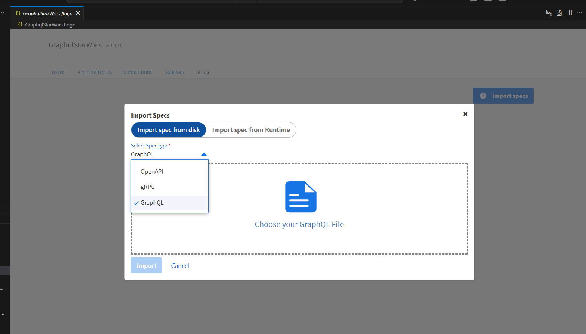

4. Browse to the location of your GraphQL schema file (e.g., StarWarsSchema.graphql) and import it into your application.

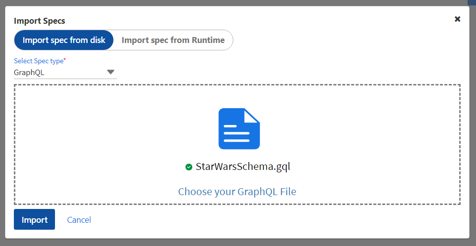

5. Navigate to the Flows Tab in your Flogo application.

6. Add the GraphQL Trigger activity to the flow.

7. Configure the GraphQL Trigger with the following settings:

	* Port: Set the port number where the GraphQL server will listen (e.g., 7879).
	* Path: Set the GraphQL path (e.g., /graphql).
	* GraphQL Schema File: Click on the toggle button to Use App Level Spec. This will enable the selection of the imported spec file.
	
	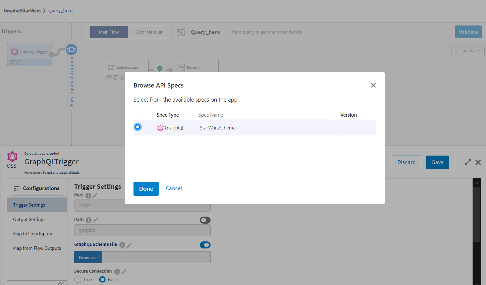
	
	* GraphQL Operation: Select the operation type (e.g., Query or Mutation).
	* Resolver For: Set the resolver (e.g., hero) to resolve GraphQL queries.
	* Secure Connection: We can set to false if not using secure communication.
	* Schema Introspection: Enable if required for introspection.
	
8. Add a Return Activity to the flow to send the response back to the client after processing the GraphQL request.

### Understanding the configuration

1. In the attached sample *GraphqlStarWars.json*, The flows are created with *StarWarsSchema.gql* file attached with the sample. 

2. There are 4 flows which are attached to Graphql trigger which acts as the Graphql Server.

	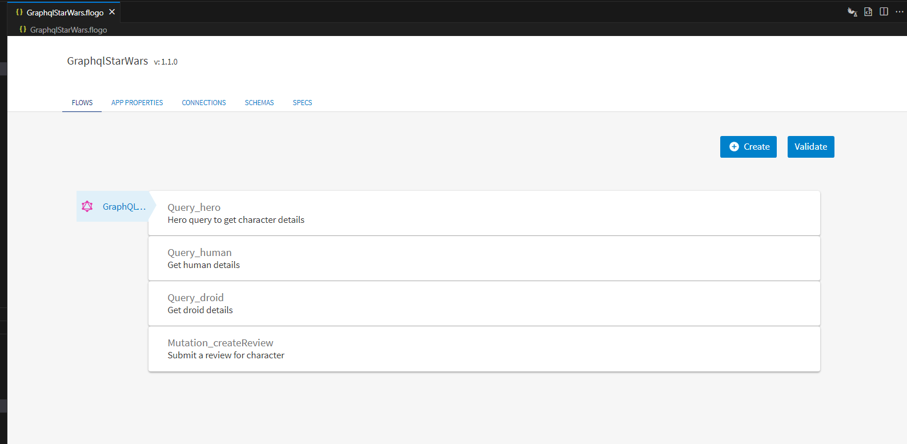

3. The flows are generated upon successful upload of the spec file .gql file based upon the no. of *queries* and *mutation* in the .gql file. Each flow acts as a resolver function. Since, in the given *StarWarsSchema.gql* file, there were three *queries* and one *mutation*, so 1 flow for each *query* and *mutation* has been generated.

	* The 1st flow name is *Query_hero*. It is returning the hero details upon providing the arguments from the trigger via flow parameter.

	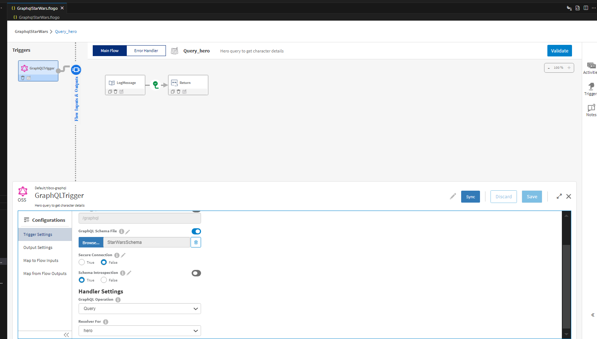

	* The 2nd flow name is *Query_human*. It is returning the human details upon providing the id  from the trigger via flow parameter.

	

	* The 3rd flow name is *Query_droid*. it is returning the droid details with specific id provided from the trigger via flow parameter.

	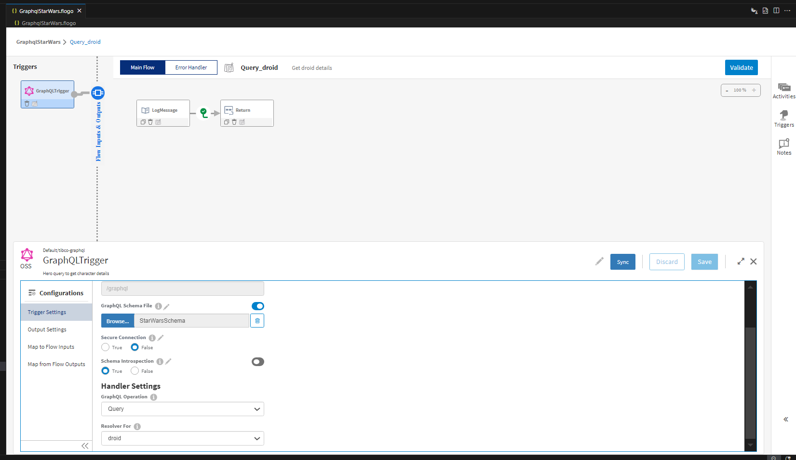

	* The 4th flow name is *Mutation_createReview*. it is updating the user's review based upon the details with the values *id*,*rating* and *comment* provided from the trigger via flow parameter.

	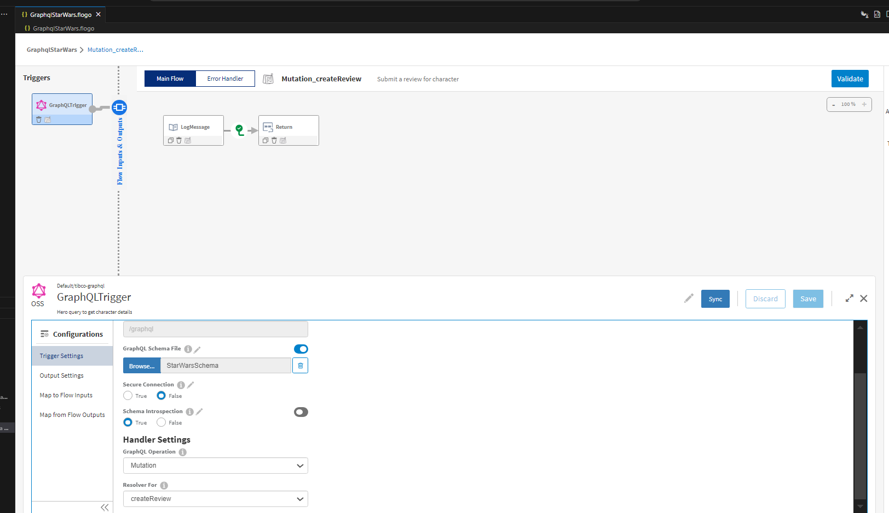

### Run the application

1. Run your application in VS Code. The GraphQL server will start automatically since it includes the GraphQL Trigger.

2. Open Postman (or any GraphQL client). Use the localhost URL, appending /graphql to the end of it (e.g., http://localhost:7879/graphql). 

3. Add your GraphQL query in the request body or parameters.

4. Send the request and view the response containing the data from your GraphQL server.

### Outputs

1. When we hit the endpoints;

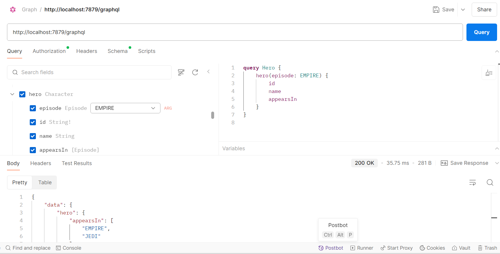

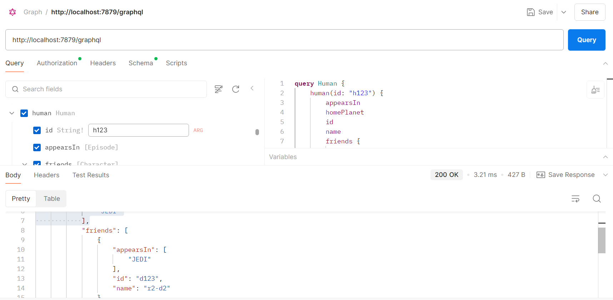

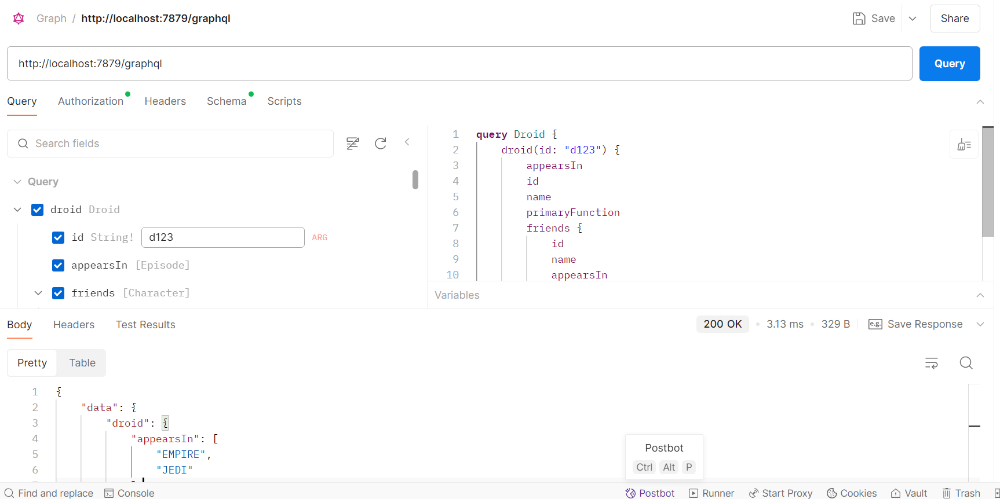

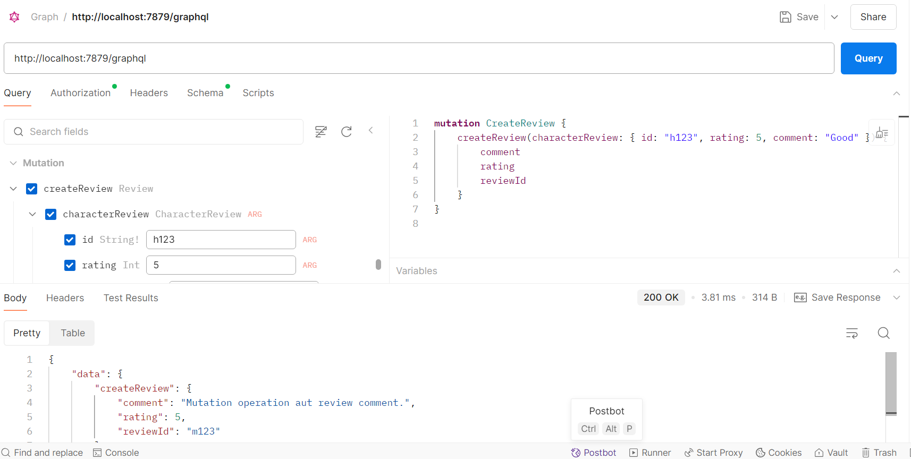

2. Verify the logs in the integrated terminal;

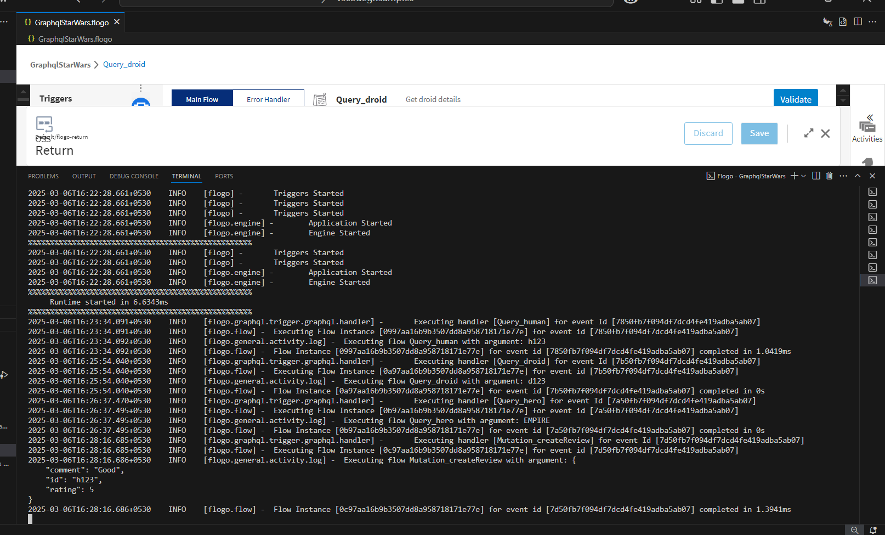

## Notes & Conclusion

* GraphQL Trigger: The GraphQL Trigger in Flogo makes it easy to expose a GraphQL endpoint and handle GraphQL queries without requiring complex configurations. Once you configure the trigger and set up the schema, your GraphQL server is ready to handle requests automatically.

* Testing: You can use tools like Postman or any other GraphQL client to interact with the server. Ensure the request includes the necessary query parameters and is sent to the correct endpoint (e.g., http://localhost:7879/graphql).

* App-Level Spec: Using the App-Level Spec feature simplifies schema management by linking the trigger to the schema directly from the imported spec, which improves maintainability and scalability.

