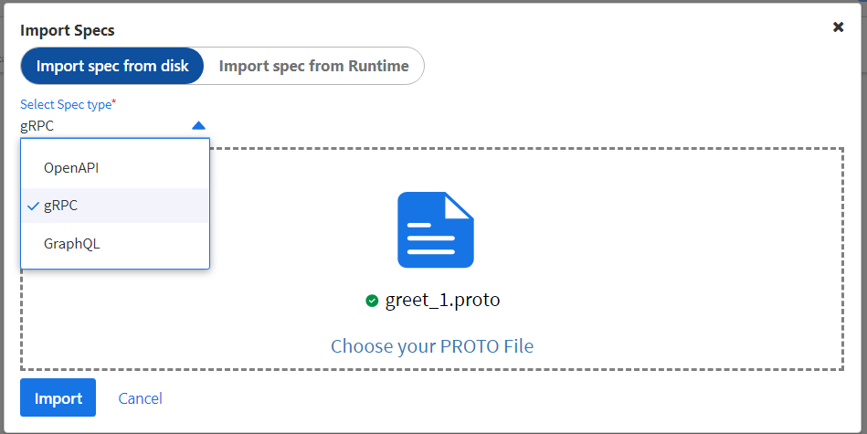
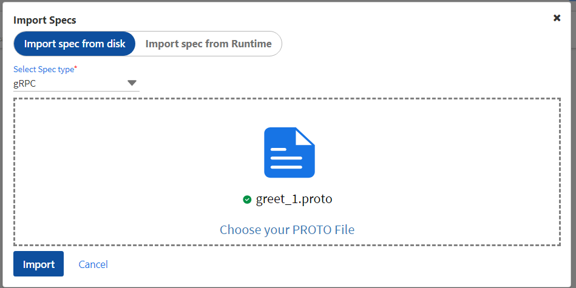
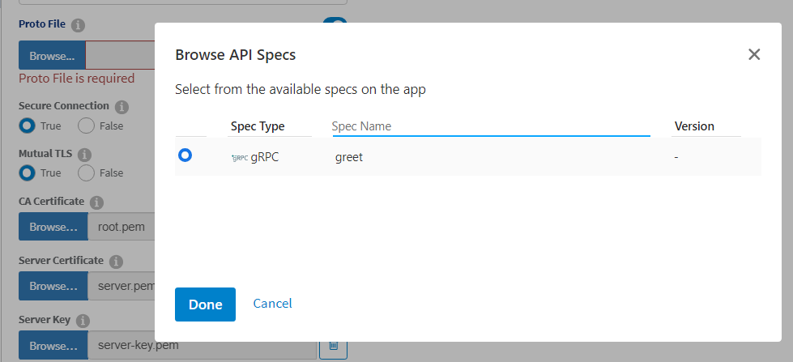
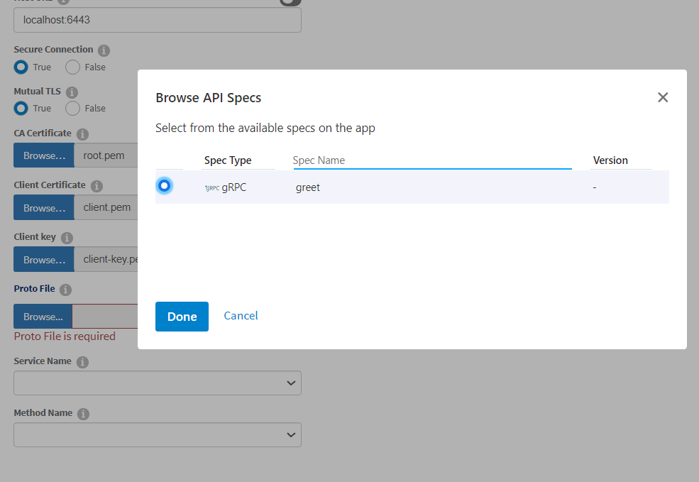
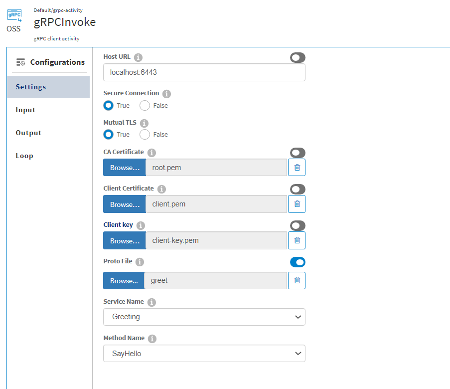
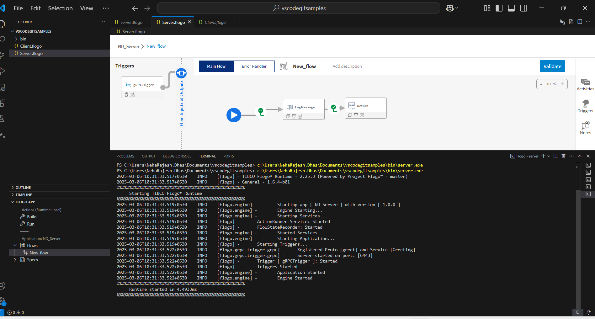
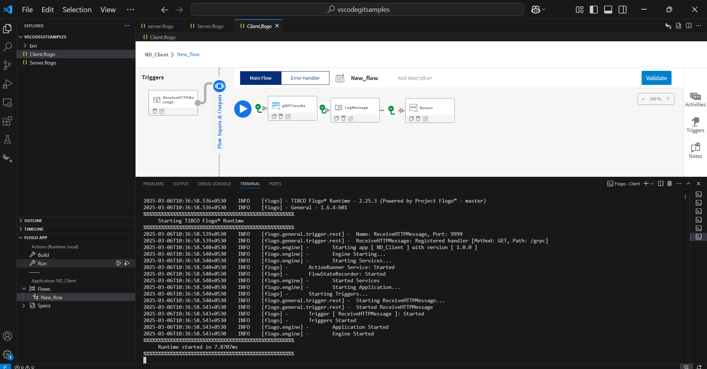
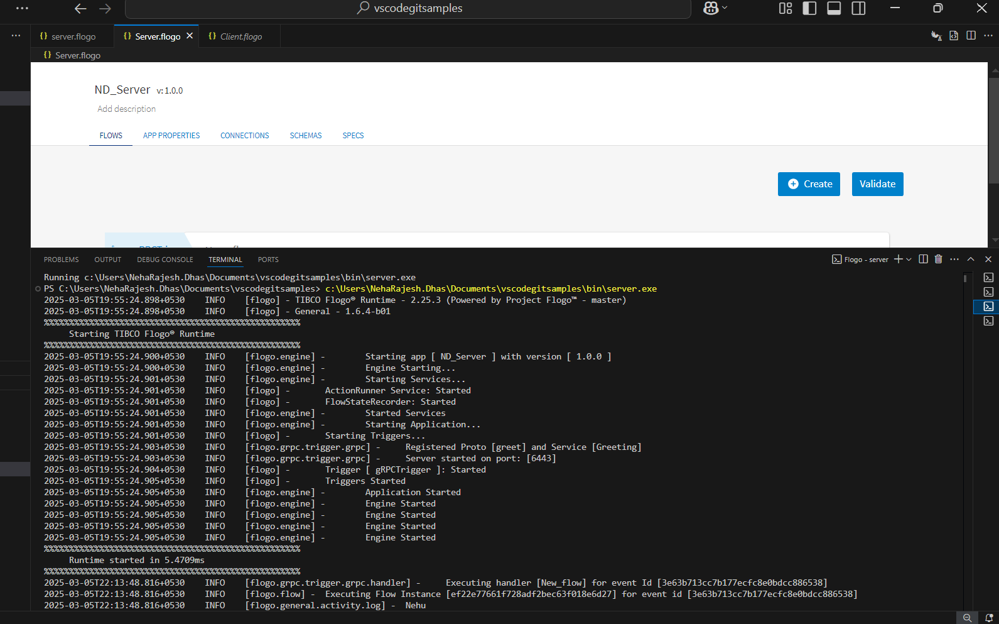
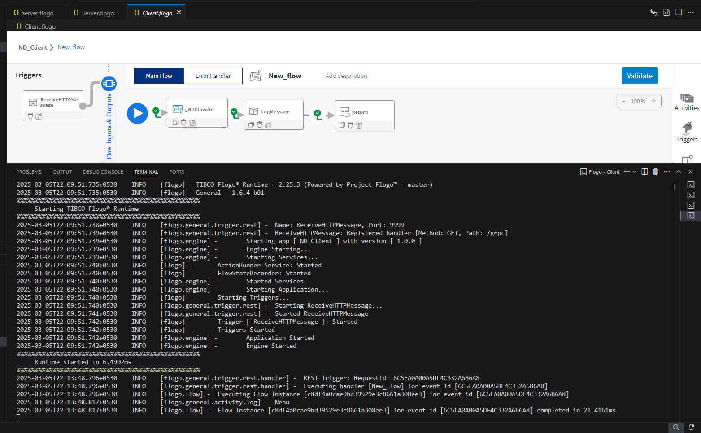

# GRPC Sample: gRPC Server and Client with Mutual TLS Authentication and App-Level Spec support in Flogo

## This Sample Demonstrates
1. How to configure a gRPC server with mutual TLS authentication in Flogo.
2. How to use the app-level spec to load the proto file for defining the gRPC service methods.

## Prerequisites:

1. Flogo VS Code extension installed
2. Go runtime configured in your Flogo project
3. gRPC service defined in a .proto file (e.g., greet.proto)
4. TLS certificates for mutual authentication (CA certificate, server certificate, and server key for the server; CA certificate, client certificate, and client key for the client)

## Steps to Implement

### Create the gRPC Server Application

#### To create the gRPC server:
 
1. Create a new Flogo application and use the gRPC Trigger activity.
  
2. Configure the gRPC Trigger with a secure port (e.g., 6443), where the server will listen for incoming requests.

3. Navigate to the Specs tab and click on the Import Specs button.

4. Select the gRPC option and browse the .proto file (e.g., greet.proto) from your local disk.

5. Click Import and navigate to the Flows tab.

6. Add a gRPC Trigger activity and toggle the option to Use App Level Spec for the proto file.

7. Set the Secure Connection and Mutual TLS options to true.

8. Provide the appropriate CA certificate, server certificate, and server key for mutual authentication.

### Create the gRPC Client Application

#### To create the gRPC client:

1. Create a new Flogo application and use the REST Trigger to handle incoming HTTP requests. Configure the REST Trigger with an endpoint (e.g., localhost:8080), where the client will listen for incoming REST requests.

2. Navigate to the Specs Tab and import the proto file (e.g., greet.proto) to define the gRPC service and methods.

3. Navigate to the Flows Tab and add the gRPC Invoke activity to the flow. 

4. Toggle the option Use App Level Spec to link it with the imported proto file.

5. Configure the gRPC Invoke activity to point to the server's endpoint (e.g., localhost:6443). 

6. Ensure the client is configured to load the CA certificate, client certificate, and client key for mutual authentication. 

7. The client should verify the server’s certificate using the CA certificate and present its own certificate to authenticate itself.

8. After the gRPC Invoke activity, add a Return Activity to send the response from the gRPC service back to the REST requestor.

### Run the Server and Client in Flogo

#### Once both the server and client applications are set up, you can run them locally using the Flogo VS Code Extension.
  
1. Ensure that the Flogo Go runtime is configured for your project.

2. Click the Run button in VS Code for the server application first to start the gRPC server.

3. Once the server is running, click Run again for the client application to start the client.

4. The client will use the REST trigger to call the gRPC service on the server, and the communication will be secured using mutual TLS authentication.

5. Logs for both the server and client will appear directly in the integrated terminal in VS Code.

### Notes
-Make sure the correct certificates are configured for both the client and server to ensure mutual authentication.
-This example assumes you are familiar with using Flogo for creating and running applications.
-You can modify the greet.proto file as needed with the inline editor to match your actual service definition.

By following these steps, you can successfully create and run a secure gRPC server and client using mutual authentication in Flogo, with the client interacting with the server via REST.

