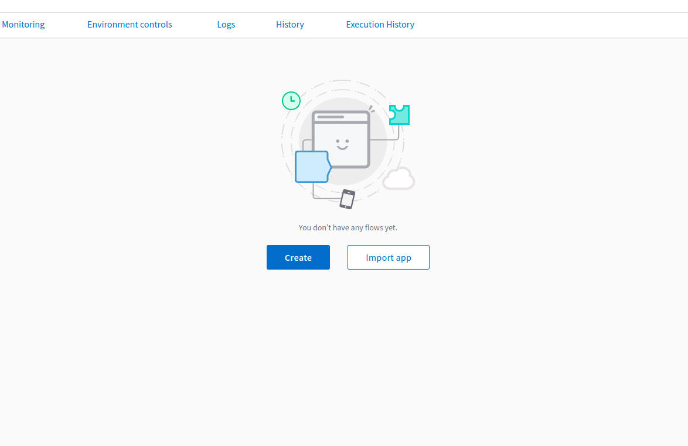
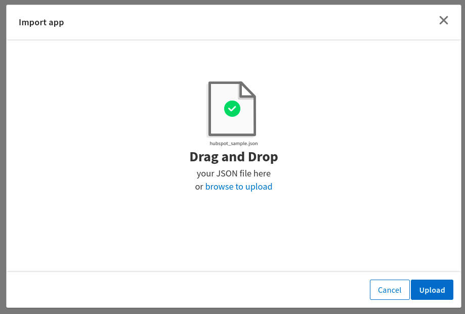
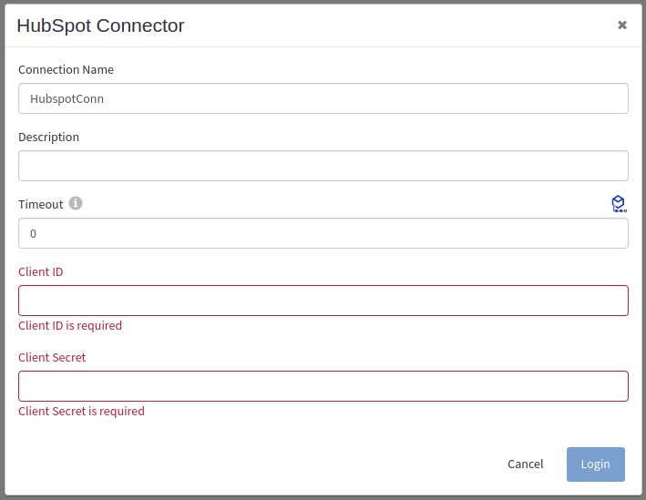
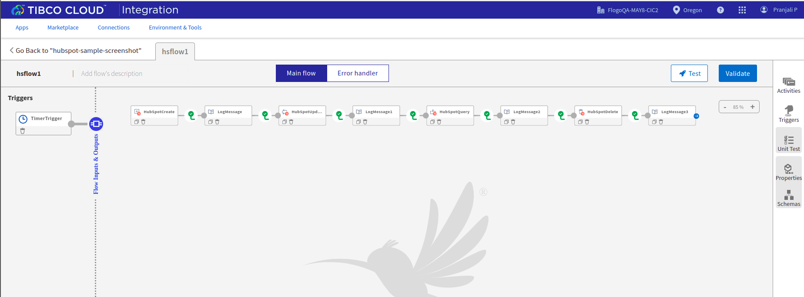
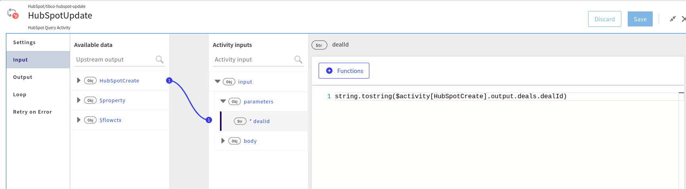
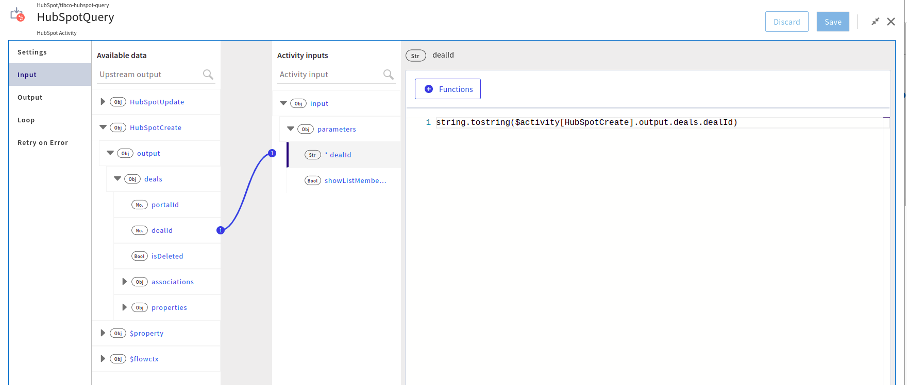
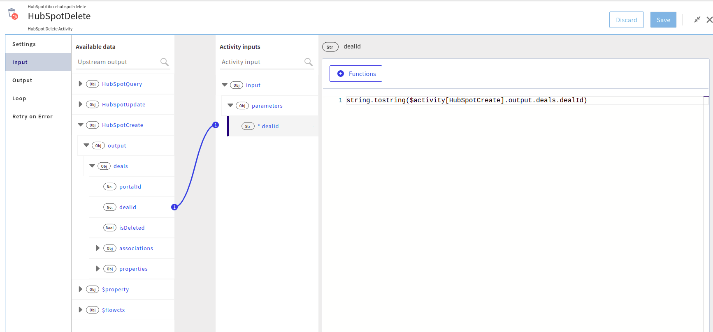
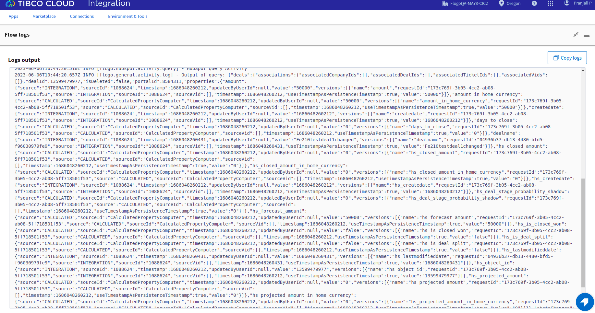

# HubSpot Sample demonstrating how to implement the CRUD activities on HubSpot Deals object.

## Description

This sample demonstrate how we can create and use HubSpot CRUD activities on Deals object such as Create, Update, Query and Delete.
HubSpot app bascially contains 4 activities. The main purpose of these activitie are to  perform CRUD activities on various HubSpot objects like Deals, companies, contacts etc.

## Prerequisites

1. You need to make sure that you have a active HubSpot account and basic understanding of HubSpot features and activities.
2. To perform actions using your HubSpot account you need to have HubSpot connection details such as Client ID and Client Secret.
3. You can find Client ID and Client secret from your HubSpot account, for more details on how to create Connection and other HubSpot features, please refer this TCI documentation.

## Import the sample

1. Download the sample json file i.e., hubspot_sample.json.

2. Create a new empty app

3. On the app details page, select import app option.

4. Now click on ‘browse to upload’ button and select the app.json from your machine that you want to import.

5. Click on Upload Button. The Import app dialog displays some generic errors and warnings as well as any specific errors or warnings pertaining to the app you are importing.

6. In Import App dialog, there are 2 options to import:

* Selective Import – If you are choosing this option then select trigger, flow and connection and click Next.

* Import all – If you are choosing this option then it will import all flows from the source app.

7. After importing app is done, in connection tab make sure to re-enter the client id and client secret and click on Save Connection button to establish the connection.

## Understanding the configuration

### The Connection

When you import the app you need to re-enter the client id and client secret and establish the connection.

In the connection, note that,
1. Name - 	Enter a name for this HubSpot connection
2. Description(Optional) - Enter a short description for the connection
3. Client ID -	The client ID used to connect to HubSpot REST API, will be available in your HubSpot account.
4. Client Secret -	The client secret used to generate an access token, will be available in your HubSpot account.

### The Flow

If you go inside the app, you can see in flow we have 4 activities (Create, Update, Query and Delete)  that perform some operations on various HubSpot objects like Deals, Companies and Contacts.
In this sample we are using Deals object to perform CRUD operation.

### HubSpot Create

HubSpot Create activity adds an object to the database of your organization.
You can use this activity to create Deals, Contacts and companies objects.

On the Settings tab, you can define the HubSpot connection and the type of object to be created.(For example: using Deals object in this sample)

In input tab, provide the details like dealname, Deal amount etc.

### HubSpot Update

HubSpot Update activity updates an existing record of the specified object.

On the Settings tab, you can define the HubSpot connection and the type of object to be updated.

In Input tab, provide the id of the Deal to update data, you can also use the previous activity output to provide the object ID.

In Input tab, provide data to be updated in body section.

### HubSpot Query

HubSpot Query activity runs the query for the specified object and returns the data that matches the criteria in the query.

On the Settings tab, you can define the HubSpot connection and the type of object to query.

In input tab, provide the Deal id to be retrieved, you can also use the previous activity output to provide the Deal ID.

### HubSpot Delete

HubSpot Delete activity is used to delete a record in the HubSpot database. It deletes a record of the specified object from the database of your organization

On the Settings tab, you can define the HubSpot connection and the type of object to be deleted.

In input tab, provide the Deal id to be deleted, you can also use the previous activity output to provide the Deal ID.

### Run the application
For running the application, first you have to push the app and then scale up the app.
Then after sometime you can see your app in running status.

Another option, If you want to test the sample in the Flow tester then follow below instructions:
 
in flow, click on Test Button -> create Launch configuration -> click Next button -> click on Run

## Outputs

1. Flow Tester

2. When hit endpoints

## Troubleshooting

* If you do not see the Endpoint enabled, make sure your apps is in Running status.
* If you see test connection failed in connection setup, then check REST endpoint and Identity URL.
* If you see invalid credentials, then check client ID and client secret.

## Contributing
If you want to build your own activities for Flogo please read the docs here.

If you want to showcase your project, check out [tci-awesome](https://github.com/TIBCOSoftware/tci-awesome)

You can also send an email to `tci@tibco.com`

## Feedback
If you have feedback, don't hesitate to talk to us!

* Submit feature requests on our [TCI Ideas](https://ideas.tibco.com/?project=TCI) or [FE Ideas](https://ideas.tibco.com/?project=FE) portal
* Ask questions on the [TIBCO Community](https://community.tibco.com/answers/product/344006)
* Send us a note at `tci@tibco.com`

## Help
Please visit our [TIBCO Cloud&trade; Integration documentation](https://integration.cloud.tibco.com/docs/) and TIBCO Flogo® Enterprise documentation on [docs.tibco.com](https://docs.tibco.com/) for additional information.

## License
This TCI Flogo SDK and Samples project is licensed under a BSD-type license. See [license.txt](license.txt).

