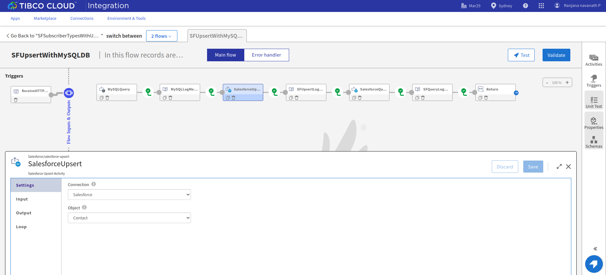
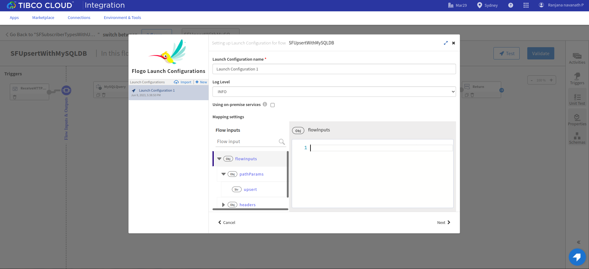

# Salesforce Upsert on Bulk records and Salesforce Trigger With Change Data Capture Example

## Description

This example demonstrate how we can do the Upsert on multiple records in Salesforce using Salesforce Upsert activity in flogo. If the records in the collection have valid External Id Field Name values, the corresponding records in the database will be updated with the flow’s collection. If not, new records will be created and saved. In this example, records are fetched using query in MySQL database and those records are mapped to the Salesforce Upsert activity input and then those incoming records are either created or updated according to custom field called an external ID to determine whether to create a new record or update an existing record.

Then in the other flow, Salesforce trigger with the Subscriber type as Change data capture is getting executed once Upserted records in the Salesforce. Change Data Capture publishes change events in the flogo runtime logs, which represent changes to Salesforce records. In this example changes include creation of a new record and/or updates to an existing records. So in this case when SFUpsertWithMySQLDB flow executes, the salesforce trigger will start and provide respective output in the logs.

## Prerequisites

* Ensure that MySQL database must be install either on local computer or on AWS EC2 instance. 
* You need to make sure that your public ip is whitelisted (If you are using database hosted on AWS EC2 instance).
* In order to use on-prem database server in TCI, you will have to attach Access Key to use Hybrid Connectivity. For more details on how to use Hybrid Connectivity/tibtunnel/Proxy Agent, please  refer this TCI documentation - [Link](https://integration.cloud.tibco.com/docs/#tci/using/hybrid-agent/installing-configuring-running-agent.html%3FTocPath%3DUsing%2520TIBCO%2520Cloud%25E2%2584%25A2%2520Integration%7CUsing%2520the%2520TIBCO%2520Cloud%25E2%2584%25A2%2520Integration%2520-%2520Hybrid%2520Agent%7C_____4)
* Ensure that Flogo Connector for Salesforce.com must be install.
* Ensure that you have an active Salesforce.com account.
* Ensure that you have set up the OAuth permissions in Salesforce.com before installing the connector which will be used in the Salesforce connection for Client ID and Client Secret parameters. To set up OAuth permissions, follow the steps mentioned in 'Creating a Salesforce.com Connection' topic in the TIBCO Cloud Integration documentation.
* Ensure that you have to add Change Data capture in Salesforce.com. To add Change Data capture in Salesforce.com, you can refer the Salesforce.com product documentation.

## Import the sample

1. Download the sample's .json file 'SFSubscriberTypesWithUpsertActivity.json'

2. Create a new empty app.

3. On the app details page, select Import app.

4. Browse on your machine or drag and drop the .json file for the app that you want to import.

5. Click Upload. The Import app dialog displays some generic errors and warnings as well as any specific errors or warnings pertaining to the app you are importing. It validates whether all the activities and triggers used in the app are available in the Extensions tab.

6. You have the option to import all flows from the source app or selectively import flows.

7. If you choose selective import, select the trigger, flow and connection. Click Next.

8. Make sure you re-configure the connection as mentioned in 'Understanding the configuration' section

## Understanding the configuration

### The Connection
When you import this app, you need to configure the 'Salesforce' connection in Connections page. It has pre-filled values except Client Secret. You also need to change Client Id with yours.

Note: After imported an app, in the imported connection under Connection tab,
* Client ID has prefilled value which is the Consumer Key in the Salesforce Account (get it from the Connected Apps section in Salesforce Account).
* Client secret is blank and you have to provide the Consumer Secret in the Salesforce Account (get it from the Connected Apps section in Salesforce Account).
* For both Client ID and Client Secret values ensure that you have set up the OAuth permissions in Salesforce.com. 

Once you provide both the values then login to your salesforce account and allow access in user consent screen, a Base64 encoded access token string will get populated in OAuth2 Token field. This is the access token which will be send as Authorization Header while invoking the API to get the access to the API.

### The Flow and InvokeRestService activity
If you open the app, you will see there are two flows in the SFSubscriberTypesWithUpsertActivity app. The flow 'SFUpsertWithMySQLDB' and second flow 'SFChangeDataCapture'.

The 'SFUpsertWithMySQLDB' flow in the SFSubscriberTypesWithUpsertActivity app, records are getting fetched from mysql database using query and then those records are mapped as an input to Salesforce Upsert activity. In the Salesforce Upsert activity those incoming records are either created or updated into the Contact object according to values mapped to the custom field called an external ID "ContactID__c". You can see those Upserted records from the SalesforceQuery activity's output after executing the flow. All these operation will be done when execute the REST trigger with Get method and path parameter used in ReceiveHTTPMessage trigger.

The 'SFChangeDataCapture' flow in the SFSubscriberTypesWithUpsertActivity app have ReceiveSalesforceMessage trigger which starts whenever a changes occurs on records in the Contact object in Salesforce.com and activates the flow. So in this case when SFUpsertWithMySQLDB flow executes, the salesforce trigger will start and provide respective output in the logs.

### Run the application
For running the application, first you have to push the app and then scale up the app. Then after sometime you can see your app in running status.

Once it reaches to Running state, go to Endpoints, click on Test under Actions and for GET/sfupsert/{upsert}, select 'Try it out'
You will have to pass value for the path parameter 'upsert'. You can provide any string type value for 'upsert' parameter.
Now click Execute button.

If you want to test the sample in the Flow tester then follow below instructions:
Click on the SFUpsertWithMySQLDB flow, click on Test Button -> create Launch configuration -> click Next button -> click on Run

## Outputs

1. Sample Response when hit the endpoints, first is the output when record is created and second is when record updated. 

2. Sample Logs

3. Flow Tester Logs

## Troubleshooting

* If you do not see the Endpoint enabled, make sure your apps is in Running status.
* If you do not see user content screen, check if your browser is blocking pop-ups.
* if you see 401 Unauthorized error or token refresh error, re-configure the connection.

## Contributing
If you want to build your own activities for Flogo please read the docs here, [Flogo-docs](https://tibcosoftware.github.io/flogo/)

If you want to showcase your project, check out [tci-awesome](https://github.com/TIBCOSoftware/tci-awesome)

You can also send an email to `tci@tibco.com`

## Feedback
If you have feedback, don't hesitate to talk to us!

* Submit feature requests on our [TCI Ideas](https://ideas.tibco.com/?project=TCI) or [FE Ideas](https://ideas.tibco.com/?project=FE) portal
* Ask questions on the [TIBCO Community](https://community.tibco.com/answers/product/344006)
* Send us a note at `tci@tibco.com`

## Help
Please visit our [TIBCO Cloud&trade; Integration documentation](https://integration.cloud.tibco.com/docs/) and TIBCO Flogo® Enterprise documentation on [docs.tibco.com](https://docs.tibco.com/) for additional information.

## License
This TCI Flogo SDK and Samples project is licensed under a BSD-type license. See [license.txt](license.txt).
