# Salesforce activities for bulk operations Example

## Description

This example demonstrate how we can create job for bulk query operation, checks the status of the Job ID preceding it in a flow. Also gets the result of a bulk query job with a specific number of result sets and maximum number of records to be fetched per result set using loop applies to sub flow.
The example of the Salesforce_BulkAPISample app includes bulk job activities in the Salesforce.com category and Salesforce.com connection.

## Prerequisites

* Ensure that Flogo Connector for Salesforce.com must be install.
* Ensure that you have an active Salesforce.com account.
* Ensure that you have set up the OAuth permissions in Salesforce.com before installing the connector which will be used in the Salesforce connection for Client ID and Client Secret parameters. To set up OAuth permissions, follow the steps mentioned in 'Creating a Salesforce.com Connection' topic in the TIBCO Cloud Integration documentation.

## Import the sample

1. Download the sample's .json file 'Salesforce_BulkAPISample.json'

2. Create a new empty app.

3. On the app details page, select Import app.

4. Browse on your machine or drag and drop the .json file for the app that you want to import.
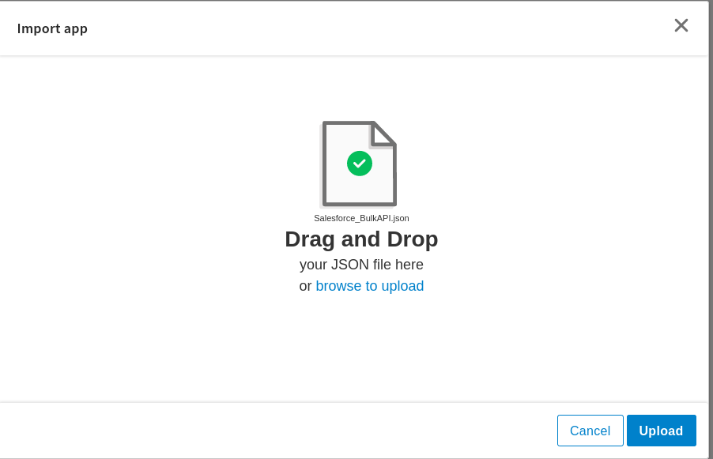

5. Click Upload. The Import app dialog displays some generic errors and warnings as well as any specific errors or warnings pertaining to the app you are importing. It validates whether all the activities and triggers used in the app are available in the Extensions tab.
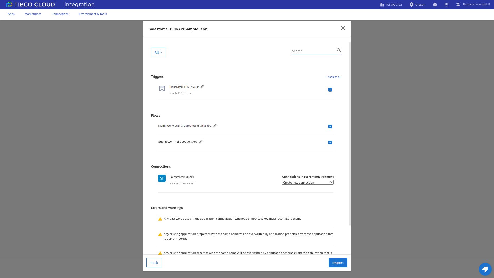

6. You have the option to import all flows from the source app or selectively import flows.

7. If you choose selective import, select the trigger, flow and connection. Click Next.

8. Make sure you re-configure the connection as mentioned in 'Understanding the configuration' section

## Understanding the configuration

### The Connection
When you import this app, you need to configure the 'SalesforceBulkAPI' connection in Connections page. It has pre-filled values except Client Secret. You also need to change Client Id with yours.

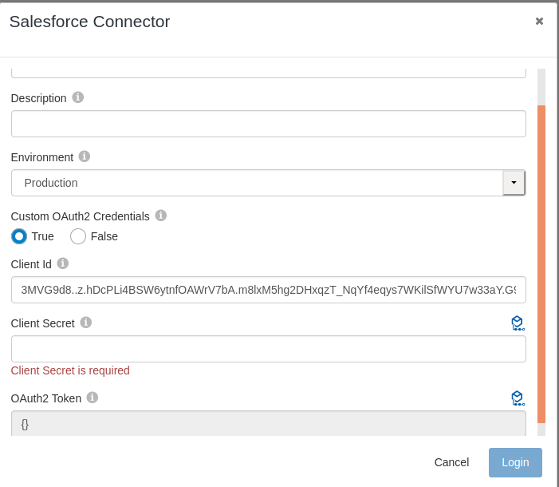

Note: After imported an app, in the imported connection under Connection tab,
* Client ID has prefilled value which is the Consumer Key in the Salesforce Account (get it from the Connected Apps section in Salesforce Account).
* Client secret is blank and you have to provide the Consumer Secret in the Salesforce Account (get it from the Connected Apps section in Salesforce Account).
* For both Client ID and Client Secret values ensure that you have set up the OAuth permissions in Salesforce.com. 

Once you provide both the values then login to your salesforce account and allow access in user consent screen, a Base64 encoded access token string will get populated in OAuth2 Token field. This is the access token which will be send as Authorization Header while invoking the API to get the access to the API.

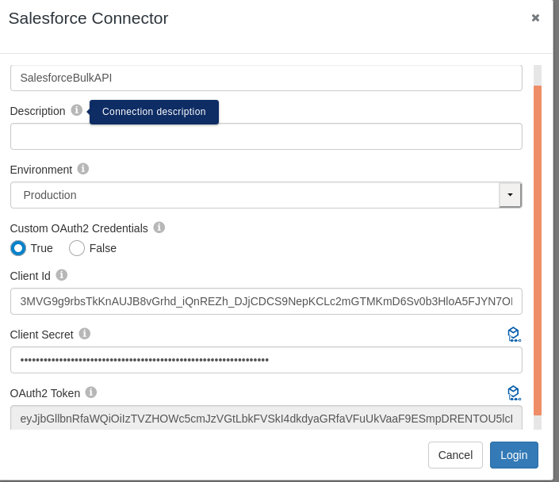

### The Flow and Salesforce activities
If you open the app, you will see there are two flows in the Salesforce_BulkAPISample app. Main flow 'MainFlowWithSFCreateCheckStatusJob' and sub flow 'SubFlowWithSFGetQueryJob'.
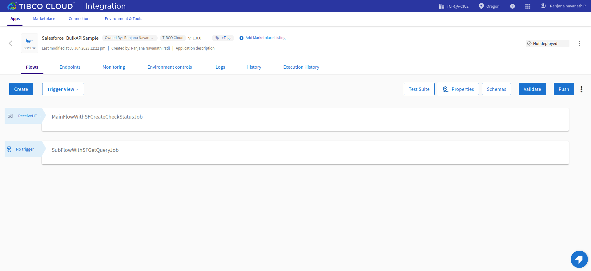

The flow 'MainFlowWithSFCreateCheckStatusJob' basically creates new job for bulk query using SalesforceCreateJob activity to efficiently query large data sets for Account object in Salesforce. Then we can checks the status of the Job ID created in preceding SalesforceCreateJob for bulk query using SalesforceCheckJobStatus activity. Then to get the result of the bulk query job we have to use SalesforceGetQueryJobResult activity inside a subflow and the subflow must be placed inside a loop. To start this flow, use REST trigger with GET method and path parameter 'bulk' in which you can pass any string type value.
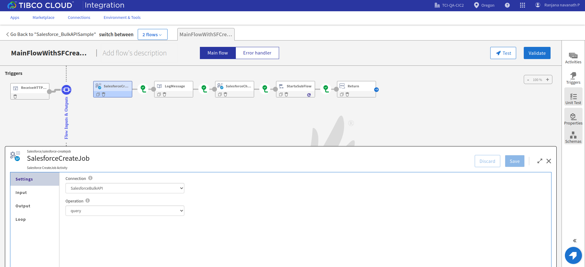

The flow 'SubFlowWithSFGetQueryJob' have SalesforceGetQueryJobResult activity which will show the records from query job with a specific number of result sets that is set in locator. So you will get all the records fetched from query provided in SalesforceCreateJob activity in main flow in the form of pagination.
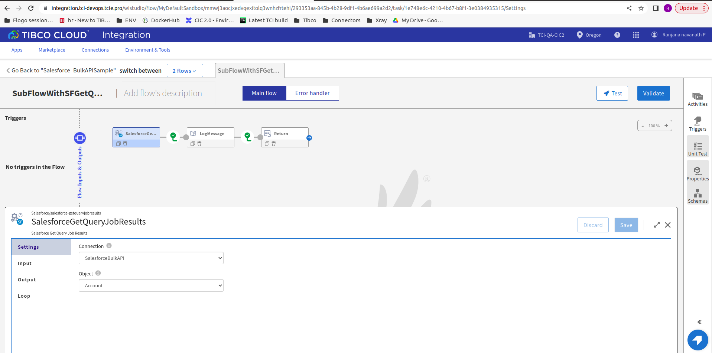

### Run the application
For running the application, first you have to push the app and then scale up the app. Then after sometime you can see your app in running status.
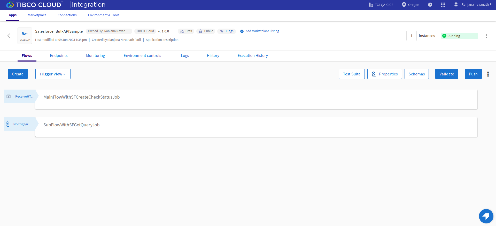

Once it reaches to Running state, go to Endpoints, click on Test under Actions and for GET/salesforce/{bulk}, select 'Try it out'
You will have to pass value for the path parameter 'bulk'. You can provide any string type value for 'bulk' parameter.
Now click Execute button.
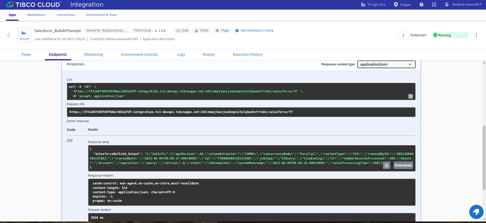

If you want to test the sample in the Flow tester then follow below instructions:
Click on the MainFlowWithSFCreateCheckStatusJob flow, click on Test Button -> create Launch configuration -> click Next button -> click on Run
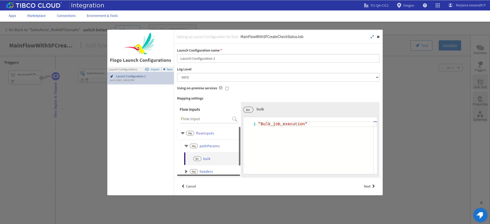

## Outputs

1. Sample Response when hit the endpoints

2. Sample Logs
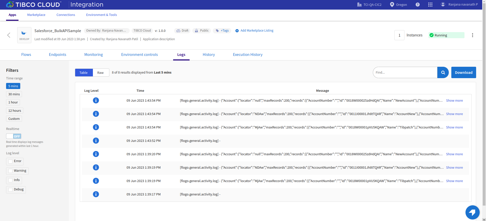

3. Flow Tester Logs
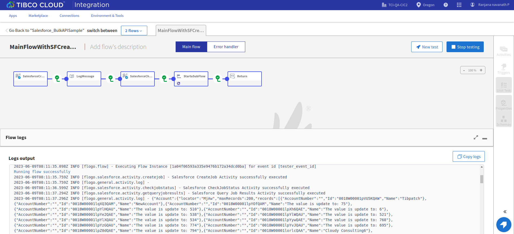

## Troubleshooting

* If you do not see the Endpoint enabled, make sure your apps is in Running status.
* If you do not see user content screen, check if your browser is blocking pop-ups.
* if you see 401 Unauthorized error or token refresh error, re-configure the connection.

## Contributing
If you want to build your own activities for Flogo please read the docs here, [Flogo-docs](https://tibcosoftware.github.io/flogo/)

If you want to showcase your project, check out [tci-awesome](https://github.com/TIBCOSoftware/tci-awesome)

You can also send an email to `tci@tibco.com`

## Feedback
If you have feedback, don't hesitate to talk to us!

* Submit feature requests on our [TCI Ideas](https://ideas.tibco.com/?project=TCI) or [FE Ideas](https://ideas.tibco.com/?project=FE) portal
* Ask questions on the [TIBCO Community](https://community.tibco.com/answers/product/344006)
* Send us a note at `tci@tibco.com`

## Help
Please visit our [TIBCO Cloud&trade; Integration documentation](https://integration.cloud.tibco.com/docs/) and TIBCO Flogo® Enterprise documentation on [docs.tibco.com](https://docs.tibco.com/) for additional information.

## License
This TCI Flogo SDK and Samples project is licensed under a BSD-type license. See [license.txt](license.txt).
