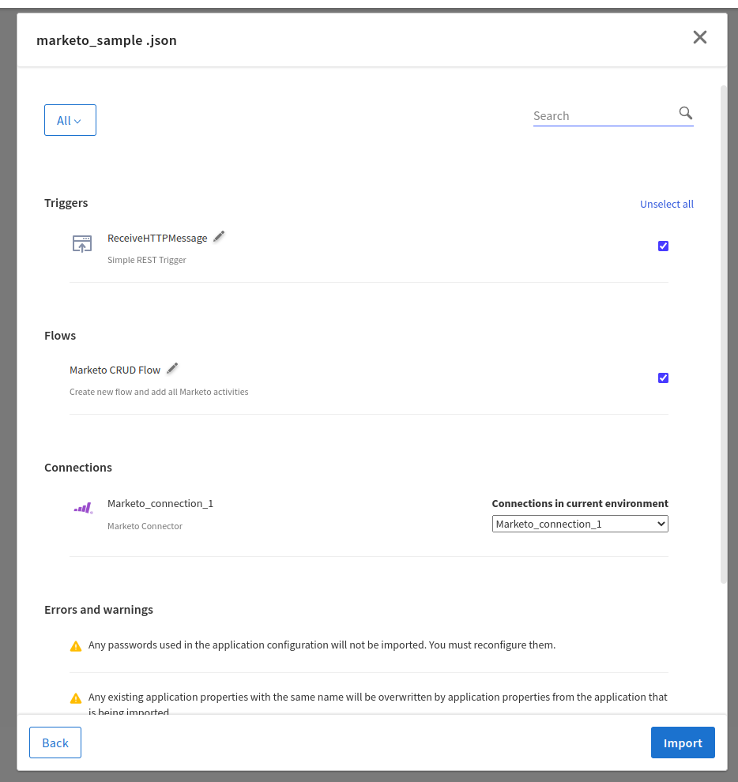

# Salesforce CRUD on single record Example

## Description

This example demonstrate how we can create single record, fetch it using query, update and delete that record in Salesforce using Salesforce activities and connection in flogo.
The main purpose of Salesforce activities used in the Salesforce_GeneralSample app are to insert new account, fetch the details of the created account, update the data for that account and then delete accountfrom Salesforce. Also receives messages whenever a change occurs in Salesforce.com and activates the flow using Salesforce trigger.

The CRUD flow in the Salesforce_GeneralSample app basically creates new record for Account object in Salesforce and then fetch that record details using query. Then it updates the name of the newly created account. Finally deletes that account. All these operation will be done when execute the REST trigger with valid input schema provided in ReceiveHTTPMessage trigger.
The SalesforceTrigger flow in the Salesforce_GeneralSample app have ReceiveSalesforceMessage trigger which starts when new record is created in the salesforce. So in this case when CRUD flow executes, the salesforce trigger will start and provide respective output in the logs.

## Prerequisites

* Ensure that Flogo Connector for Salesforce.com must be install.
* Ensure that you have an active Salesforce.com account.
* Ensure that you have set up the OAuth permissions in Salesforce.com before installing the connector which will be used in the Salesforce connection for Client ID and Client Secret parameters. To set up OAuth permissions, follow the steps mentioned in 'Creating a Salesforce.com Connection' topic in the TIBCO Cloud Integration documentation.

## Import the sample

1. Download the sample's .json file 'Salesforce_GeneralSample.json'

2. Create a new empty app.

3. On the app details page, select Import app.

4. Browse on your machine or drag and drop the .json file for the app that you want to import.

5. Click Upload. The Import app dialog displays some generic errors and warnings as well as any specific errors or warnings pertaining to the app you are importing. It validates whether all the activities and triggers used in the app are available in the Extensions tab.

6. You have the option to import all flows from the source app or selectively import flows.

7. If you choose selective import, select the trigger, flow and connection. Click Next.

8. Make sure you re-configure the connection as mentioned in 'Understanding the configuration' section

## Understanding the configuration

### The Connection
When you import this app, you need to configure the 'Salesforce' connection in Connections page. It has pre-filled values except Client Secret. You also need to change Client Id with yours.

Note: After imported an app, in the imported connection under Connection tab,
* Client ID has prefilled value which is the Consumer Key in the Salesforce Account (get it from the Connected Apps section in Salesforce Account).
* Client secret is blank and you have to provide the Consumer Secret in the Salesforce Account (get it from the Connected Apps section in Salesforce Account).
* For both Client ID and Client Secret values ensure that you have set up the OAuth permissions in Salesforce.com. 

Once you provide both the values then login to your salesforce account and allow access in user consent screen, a Base64 encoded access token string will get populated in OAuth2 Token field. This is the access token which will be send as Authorization Header while invoking the API to get the access to the API.

### The Flow and InvokeRestService activity
If you open the app, you will see there are two flows in the Salesforce_GeneralSample app. The flow 'CRUD' and second flow 'SalesforceTrigger'.

The CRUD flow in the Salesforce_GeneralSample app basically creates new record for Account object in Salesforce using SalesforceCreate activity and then fetch that record details using SalesforceQuery activity. Then it updates the name of the newly created account using SalesforceUpdate activity. Finally deletes that account using SalesforceDelete activity. All these operation will be done when execute the REST trigger with valid input schema provided in ReceiveHTTPMessage trigger. REST trigger have method POST with path parameter 'account'.

The SalesforceTrigger flow in the Salesforce_GeneralSample app have ReceiveSalesforceMessage trigger which starts whenever a change occurs in Salesforce.com and activates the flow. So in this case when CRUD flow executes, the salesforce trigger will start and provide respective output in the logs.

### Run the application
For running the application, first you have to push the app and then scale up the app. Then after sometime you can see your app in running status.

Once it reaches to Running state, go to Endpoints, click on Test under Actions and for POST//Salesforce/{account}, select 'Try it out'
You will have to pass value for the path parameter 'account'. You can provide any string type value for 'account' parameter.
You will have to pass the values for the request body parameter.
Now click Execute button.

If you want to test the sample in the Flow tester then follow below instructions:
Click on the MainFlowWithSFCreateCheckStatusJob flow, click on Test Button -> create Launch configuration -> provide request schema in body parameter -> click Next button -> click on Run

## Outputs

1. Sample Response when hit the endpoints

2. Sample Logs

3. Flow Tester Logs

## Troubleshooting

* If you do not see the Endpoint enabled, make sure your apps is in Running status.
* If you do not see user content screen, check if your browser is blocking pop-ups.
* if you see 401 Unauthorized error or token refresh error, re-configure the connection.

## Contributing
If you want to build your own activities for Flogo please read the docs here, [Flogo-docs](https://tibcosoftware.github.io/flogo/)

If you want to showcase your project, check out [tci-awesome](https://github.com/TIBCOSoftware/tci-awesome)

You can also send an email to `tci@tibco.com`

## Feedback
If you have feedback, don't hesitate to talk to us!

* Submit feature requests on our [TCI Ideas](https://ideas.tibco.com/?project=TCI) or [FE Ideas](https://ideas.tibco.com/?project=FE) portal
* Ask questions on the [TIBCO Community](https://community.tibco.com/answers/product/344006)
* Send us a note at `tci@tibco.com`

## Help
Please visit our [TIBCO Cloud&trade; Integration documentation](https://integration.cloud.tibco.com/docs/) and TIBCO Flogo® Enterprise documentation on [docs.tibco.com](https://docs.tibco.com/) for additional information.

## License
This TCI Flogo SDK and Samples project is licensed under a BSD-type license. See [license.txt](license.txt).
