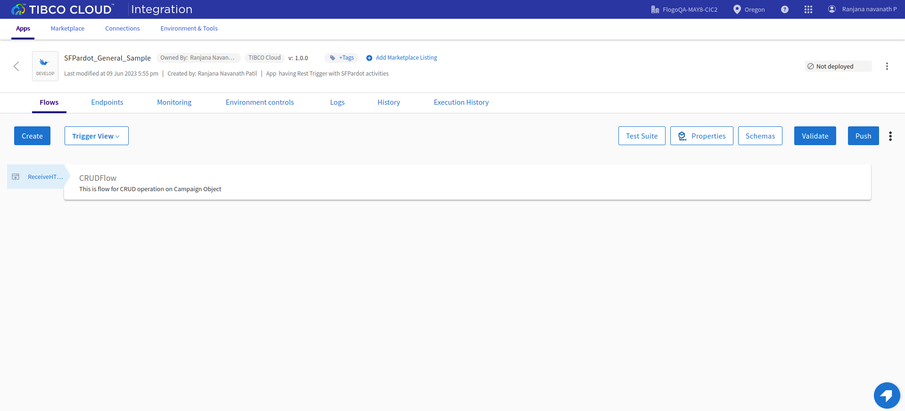

# SFPardot CRUD on single record Example

## Description

This example demonstrate how we can create single record, fetch it using query, update that record in SFPardot using SFPardot activities and connection in flogo.
The main purpose of SFPardot activities used in the SFPardot_General_Sample app are to insert new Campaign, fetch the details of the created Campaign, update the data for that Campaign and then return the updated output. Also activates the flow using REST trigger.

The CRUD flow in the SFPardot_General_Sample app basically creates new record for Campaign object in SFPardot and then fetch that record details using query. Then it updates the name of the newly created campaign. All these operation will be done when execute the REST trigger.

## Prerequisites

* Ensure that Flogo Connector for SFPardot connector must be install.
* Ensure that you have an active SFPardot.com account.
* Ensure that you have set up the OAuth permissions in SFPardot.com before installing the connector which will be used in the SFPardot connection for Client ID,Client Secret and Business Unit Id parameters. To set up SFPardot connection, follow the steps mentioned in 'Creating a SFPardot.com Connection' topic in the TIBCO Cloud Integration documentation.

## Import the sample

1. Download the sample's .json file 'SFPardot_General_Sample.json'

2. Create a new empty app.

3. On the app details page, select Import app.

4. Browse on your machine or drag and drop the .json file for the app that you want to import.

5. Click Upload. The Import app dialog displays some generic errors and warnings as well as any specific errors or warnings pertaining to the app you are importing. It validates whether all the activities and triggers used in the app are available in the Extensions tab.

6. You have the option to import all flows from the source app or selectively import flows.

7. If you choose selective import, select the trigger, flow and connection. Click Next.

8. Make sure you re-configure the connection as mentioned in 'Understanding the configuration' section

## Understanding the configuration

### The Connection
When you import this app, you need to configure the 'SFPardot' connection in Connections page. It has pre-filled values except Client Secret. You also need to change Client Id with yours and also Business Unit Id.

Note: After imported an app, in the imported connection under Connection tab,
* Client ID has prefilled value which is the Consumer Key in the SFPardot Account (get it from the Connected Apps section in SFPardot Account).
* Client secret is blank and you have to provide the Consumer Secret in the SFPardot Account (get it from the Connected Apps section in SFPardot Account).
* For Business Unit Id, you have to take it from SFPardot Account under Pardot account setup.

Once you provide the values then login to your SFPardot account and it will redirect to Salesforce login page. you have to login with valid salesforce credentils. And then allows it,so your SFPardot connection will be established.

### The Flow and InvokeRestService activity
If you open the app, you will see there is one flows in the SFPardot_General_Sample app. The flow 'CRUD' on Campaign object.

The CRUD flow in the SFPardot_General_Sample app basically creates new record for Campaign object in SFPardot using SFPardotCreate activity and then fetch that record details using SFPardotQuery activity. Then it updates the name of the newly created Campaign using SFPardotUpdate activity. Finally returns that updated campaign using return activity. All these operation will be done when execute the REST trigger which have GET method.

### Run the application
For running the application, first you have to push the app and then scale up the app. Then after sometime you can see your app in running status.

Once it reaches to Running state, go to Endpoints, click on Test under Actions and for GET /get, select 'Try it out'

Now click Execute button.

If you want to test the sample in the Flow tester then follow below instructions:
Click on the MainFlow, click on Test Button -> create Launch configuration -> provide request schema in body parameter(if any) -> click Next button -> click on Run

## Outputs

1. Sample Response when hit the endpoints

2. Sample Logs

3. Flow Tester Logs

## Troubleshooting

* If you do not see the Endpoint enabled, make sure your apps is in Running status.
* If you do not see user content screen, check if your browser is blocking pop-ups.
* if you see 401 Unauthorized error or token refresh error, re-configure the connection.

## Contributing
If you want to build your own activities for Flogo please read the docs here, [Flogo-docs](https://tibcosoftware.github.io/flogo/)

If you want to showcase your project, check out [tci-awesome](https://github.com/TIBCOSoftware/tci-awesome)

You can also send an email to `tci@tibco.com`

## Feedback
If you have feedback, don't hesitate to talk to us!

* Submit feature requests on our [TCI Ideas](https://ideas.tibco.com/?project=TCI) or [FE Ideas](https://ideas.tibco.com/?project=FE) portal
* Ask questions on the [TIBCO Community](https://community.tibco.com/answers/product/344006)
* Send us a note at `tci@tibco.com`

## Help
Please visit our [TIBCO Cloud&trade; Integration documentation](https://integration.cloud.tibco.com/docs/) and TIBCO Flogo® Enterprise documentation on [docs.tibco.com](https://docs.tibco.com/) for additional information.

## License
This TCI Flogo SDK and Samples project is licensed under a BSD-type license. See [license.txt](license.txt).
