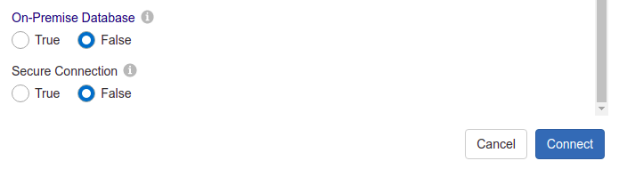
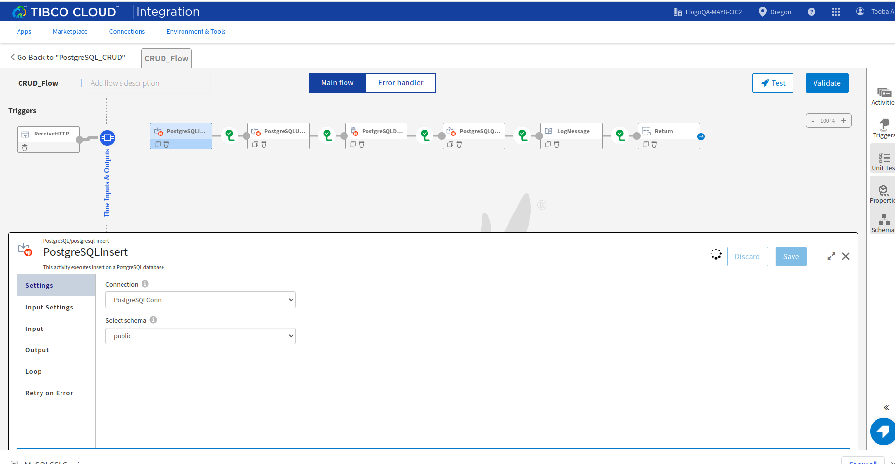

# PostgreSQL CRUD Example

## Description

This example demonstrate how we can create and use PostgreSQL CRUD activities.
PostgreSQL CRUD app bascially contains 4 activities. The main purpose of these activities are to insert data, update the data, delete the data and then finally perform query to fetch data from postgresql database.

## Prerequisites

1. You need to make sure that your public ip is whitelisted (If you are using database hosted on AWS EC2 instance).
2. In order to use on-prem database server in TCI, you will either have to attach VPN Connection to your app or attach Access Key to use Hybrid Connectivity.
   For more details on how to use Hybrid Connectivity/tibtunnel/Proxy Agent, please refer this TCI documentation - [Link](https://integration.cloud.tibco.com/docs/#tci/using/hybrid-agent/installing-configuring-running-agent.html%3FTocPath%3DUsing%2520TIBCO%2520Cloud%25E2%2584%25A2%2520Integration%7CUsing%2520the%2520TIBCO%2520Cloud%25E2%2584%25A2%2520Integration%2520-%2520Hybrid%2520Agent%7C_____4)

## Import the sample

1. Download the sample json file i.e., PostgreSQL_CRUD.json.

2. Create a new empty app

3. On the app details page, select import app option.

4. Now click on ‘browse to upload’ button and select the app.json from your machine that you want to import.

5. Click on Upload Button. The Import app dialog displays some generic errors and warnings as well as any specific errors or warnings pertaining to the app you are importing.

6. In Import App dialog, there are 2 options to import:

* Selective Import – If you are choosing this option then select trigger, flow and connection and click Next.

* Import all – If you are choosing this option then it will import all flows from the source app.

7. After importing app is done, in connection tab make sure to re-enter the password and click on connect button to establish the connection.

## Understanding the configuration

### The Connection

When you import the app you need to re-enter the password and establish the connection.

In the connection, note that,
1. Host - In this field we give public ip/public DNS of EC2 instance on which database is hosted.
2. Maximum Connection Retry Attempts - maximum number of attempts to reconnect with a database server in case connection failure. Default value is 3
3. Connection Retry Delay - number of seconds to wait between connection retry attempts. Default value is 5 sec.

### The Flow

If you go inside the app, you can see in flow we have 4 activities (Insert, Update, Delete and Query)  that perform some operations.
Also in flow we have Log Message and Return Activity for getting the output.

### Run the application
For running the application, first you have to push the app and then scale up the app.
Then after sometime you can see your app in running status.

Once your app reaches to Running state, go to Endpoints and for GET/tasks, select 'Try it Out’ option and then click on execute.

Another option, If you want to test the sample in the Flow tester then follow below instructions:
 
in flow, click on Test Button -> create Launch configuration -> click Next button -> click on Run

## Outputs

1. Flow Tester

2. When hit endpoints

## Troubleshooting

* If you do not see the Endpoint enabled, make sure your apps is in Running status.
* If you see test connection failed in connection tab, then check your public ip if it is whitelisted or not.

## Contributing
If you want to build your own activities for Flogo please read the docs here.

If you want to showcase your project, check out [tci-awesome](https://github.com/TIBCOSoftware/tci-awesome)

You can also send an email to `tci@tibco.com`

## Feedback
If you have feedback, don't hesitate to talk to us!

* Submit feature requests on our [TCI Ideas](https://ideas.tibco.com/?project=TCI) or [FE Ideas](https://ideas.tibco.com/?project=FE) portal
* Ask questions on the [TIBCO Community](https://community.tibco.com/answers/product/344006)
* Send us a note at `tci@tibco.com`

## Help
Please visit our [TIBCO Cloud&trade; Integration documentation](https://integration.cloud.tibco.com/docs/) and TIBCO Flogo® Enterprise documentation on [docs.tibco.com](https://docs.tibco.com/) for additional information.

## License
This TCI Flogo SDK and Samples project is licensed under a BSD-type license. See [license.txt](license.txt).

