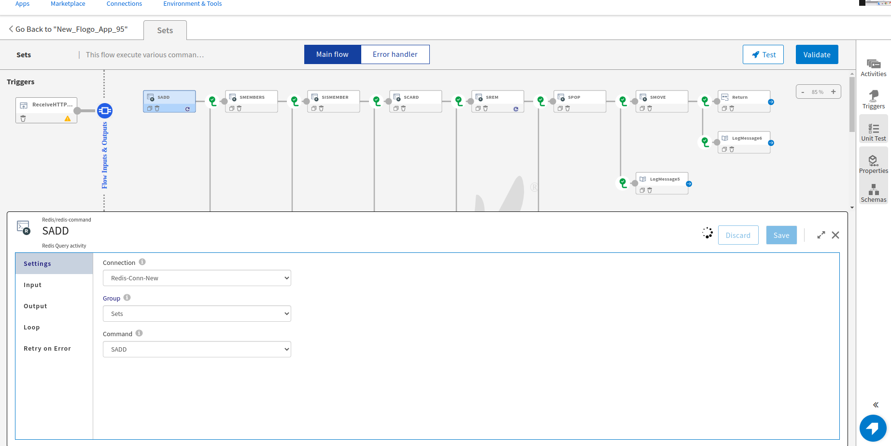
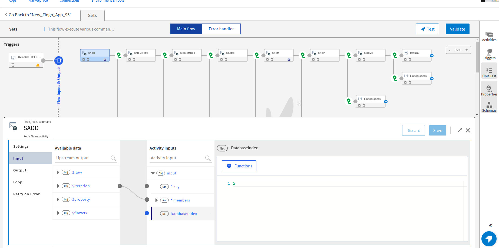

# Redis Sample on creating SSL connection and performing various commands of Group SETS

## Description

This example demonstrate how we can create Redis SSL Connection and perform various commands of Redis Group Sets.
Flogo Redis app contain single activity i.e. Redis Command. In this activity we have 5 groups (Hashes, Lists, Sets, SortedSets and Strings) and their respective commands which perform some operations on redis database. 

## Prerequisites

1. TIBCO Flogo Connector for Redis must be installed.
2. Make sure Redis database is up and running on AWS EC2 isntance/ local machine.
3. You need to make sure that your public ip is whitelisted (If you are using database hosted on AWS EC2 instance).

## Import the sample

1. Download the sample json file i.e., Redis-Sets-App.json.

2. Create a new empty app

3. On the app details page, select import app option.

4. Now click on ‘browse to upload’ button and select the app.json from your machine that you want to import.

5. Click on Upload Button. The Import app dialog displays some generic errors and warnings as well as any specific errors or warnings pertaining to the app you are importing.

6. In Import App dialog, there are 2 options to import:

* Selective Import – If you are choosing this option then select trigger, flow and connection and click Next.

* Import all – If you are choosing this option then it will import all flows from the source app.

7. After importing app is done, in connection tab make sure to re-enter the password and click on Save button to establish the connection.

## Understanding the configuration

### The Connection

When you import the app you need to re-enter the password and establish the connection.

In the connection, note that,
1. Host - In this field we give public DNS of EC2 instance on which database is hosted.
2. Port - Port number on which redis server is running.
3. Default Database Index - It is the default index at which database is stored.
4. Secure Connection - When set to True it establish a secure connection. 
Also it is mandatory to pass PEM encoded file of Client Certificate, Client Key for Client authentication and PEM encoded file of CA or Server Certifcate for server authentication.

### The Flow

If you go inside the app, you can see in flow we have created multiple activities which indicate different commands of Redis Group Sets that perform some operations.Below is the description of each activity having different commands:

1. Activity having Command "SADD" - This is used to add single/multiple members to set stored at key.

2. Activity having command "SMEMBERS" - Returns all the members of the set stored at key.

3. Activity having command "SISMEMBER" - Check whether element is member of the set or not.

4. Activity having command "SCARD" - Returns the set cardinality (number of elements) of the set stored at key.

5. Activity having command "SREM" - Remove the specified member(s) from the set stored at key.

6. Activity having command "SPOP" - Removes and returns one or more random members from the set  store at key.

7. Activity having command "SMOVE" - Move member from the set at source to the set at destination.

Redis Command Activity has different tabs below are the description:

Settings tab - In this we need to select connection name, Group and respective command.

Input tab - Input tab fields change according to Group and command selection. Generally in this tab we pass Key name and its value (Value can be array or string).
If we pass DatabaseIndex value in activity then it means that this Redis Database partition select during run-time (DatabaseIndex value is optional here).

Also in flow we have Log Message and Return Activity for getting the output.

### Run the application

For running the application, first you have to push the app and then scale up the app.
Then after sometime you can see your app in running status.

Once your app reaches to Running state, go to Endpoints and for GET/tasks, select 'Try it Out’ option and then click on execute.

Another option, If you want to test the sample in the Flow tester then follow below instructions:
 
in flow, click on Test Button -> create Launch configuration -> click Next button -> click on Run

## Outputs

1. Flow Tester

2. When hit endpoints

## Troubleshooting

* If you do not see the Endpoint enabled, make sure your apps is in Running status.
* If you see i/o timeout at runtime, then check your public ip if it is whitelisted or not.

## Contributing

If you want to build your own activities for Flogo please read the docs here. [Flogo-docs](https://tibcosoftware.github.io/flogo/)

If you want to showcase your project, check out [tci-awesome](https://github.com/TIBCOSoftware/tci-awesome)

You can also send an email to `tci@tibco.com`

## Feedback

If you have feedback, don't hesitate to talk to us!

* Submit feature requests on our [TCI Ideas](https://ideas.tibco.com/?project=TCI) or [FE Ideas](https://ideas.tibco.com/?project=FE) portal
* Ask questions on the [TIBCO Community](https://community.tibco.com/answers/product/344006)
* Send us a note at `tci@tibco.com`

## Help

Please visit our [TIBCO Cloud&trade; Integration documentation](https://integration.cloud.tibco.com/docs/) and TIBCO Flogo® Enterprise documentation on [docs.tibco.com](https://docs.tibco.com/) for additional information.

## License

This TCI Flogo SDK and Samples project is licensed under a BSD-type license. See [license.txt](license.txt).

