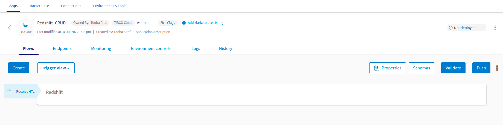
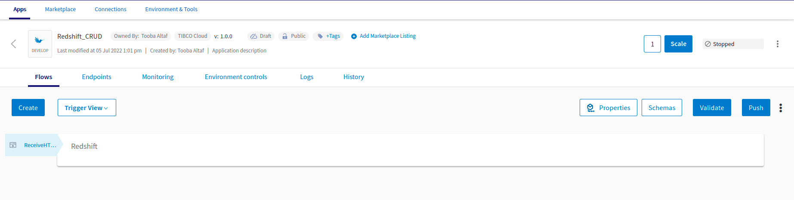
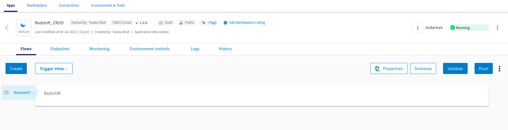
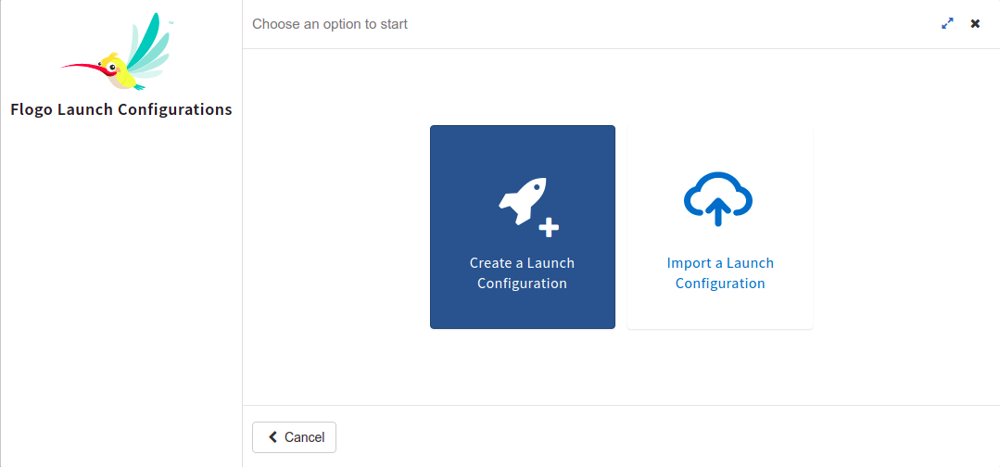
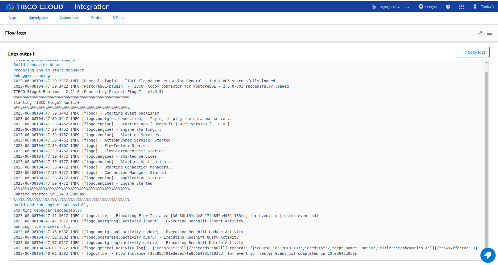
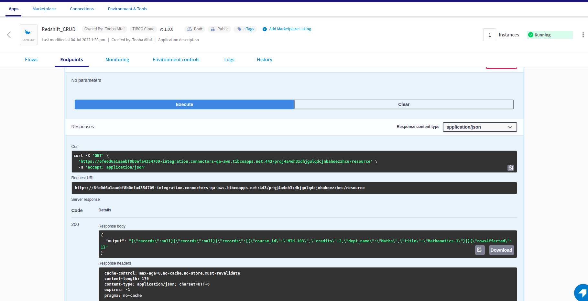

# Redshift CRUD Example

## Description

This example demonstrate how we can create a Redshift connection using integrated PostgreSQL connector and use CRUD activities.The PostgreSQL connector provides the connection for Redshift.
With TIBCO Flogo® Connector for PostgreSQL, you can run SQL queries on a PostgreSQL, Redshift, or Greenplum database by using the PostgreSQL activities.
Redshift CRUD app using integrated PostgreSQL Connector bascially contains 4 activities. 
The main purpose of these activities are: 
a) To insert data using Insert activity.
b) Update the data using Update activity.
c) Delete the data using Delete activity.
d) To fetch data using Query activity from PostgreSQL database.

## Prerequisites

1. You need to make sure that your public ip is whitelisted (If you are using database hosted on AWS EC2 instance).

## Import the sample

1. Download the sample json file i.e., Redshift_CRUD.json.

2. Click on Create/Import from the UI.

3. From the same page, select import a Flogo app option.

4. Now click on ‘browse to upload’ button and select the app.json from your machine that you want to import.

5. After importing app is done, in connection tab make sure to re-enter the password and click on connect button to establish the connection.

## Understanding the configuration

### The Connection

When you import the app you need to re-enter the password and establish the connection.

In the connection, note that,
1. Host - In this field we give public ip/public DNS of EC2 instance on which database is hosted.
2. Maximum Connection Retry Attempts - maximum number of attempts to reconnect with a database server in case connection failure. Default value is 3
3. Connection Retry Delay - number of seconds to wait between connection retry attempts. Default value is 5 sec.

### The Flow

If you go inside the app, you can see in flow we have 4 activities (Insert, Update, Delete and Query)  that perform some operations.
Also in flow we have Log Message and Return Activity for getting the output.

### Run the application
For running the application, first you have to push the app and then scale up the app.
Then after sometime you can see your app in running status.

Once your app reaches to Running state, go to Endpoints and for GET/tasks, select 'Try it Out’ option and then click on execute.

Another option, If you want to test the sample in the Flow tester then follow below instructions:
 
In flow, click on Test Button -> create Launch configuration -> click Next button -> click on Run

## Outputs

1. Flow Tester

2. When hit endpoints

## Troubleshooting

* If you do not see the Endpoint enabled, make sure your apps is in Running status.
* If you see test connection failed in connection tab, then check your public ip if it is whitelisted or not.

## Contributing
If you want to build your own activities for Flogo please read the docs here.

If you want to showcase your project, check out [tci-awesome](https://github.com/TIBCOSoftware/tci-awesome)

You can also send an email to `tci@tibco.com`

## Feedback
If you have feedback, don't hesitate to talk to us!

* Submit feature requests on our [TCI Ideas](https://ideas.tibco.com/?project=TCI) or [FE Ideas](https://ideas.tibco.com/?project=FE) portal
* Ask questions on the [TIBCO Community](https://community.tibco.com/answers/product/344006)
* Send us a note at `tci@tibco.com`

## Help
Please visit our [TIBCO Cloud&trade; Integration documentation](https://integration.cloud.tibco.com/docs/) and TIBCO Flogo® Enterprise documentation on [docs.tibco.com](https://docs.tibco.com/) for additional information.

## License
This TCI Flogo SDK and Samples project is licensed under a BSD-type license. See [license.txt](license.txt).

