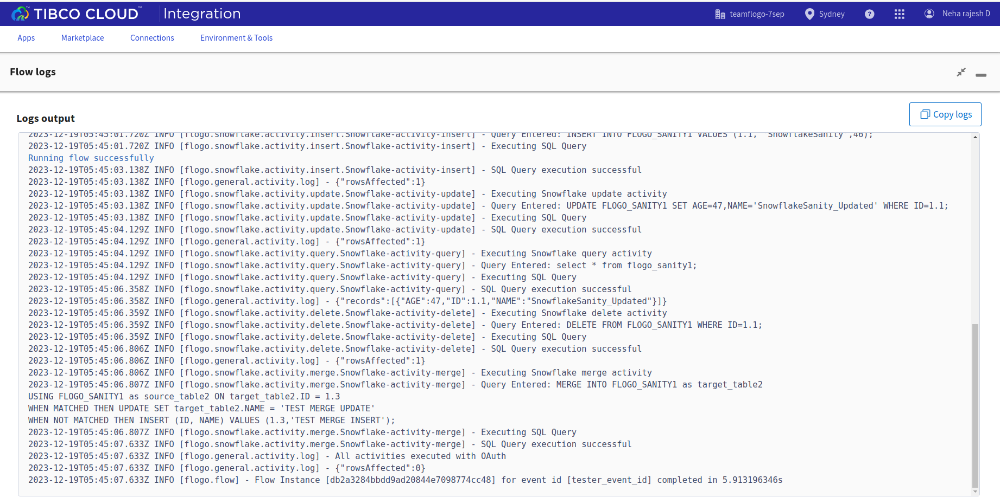

# Snowflake Example

## Description

This example demonstrates how we can create a Snowflake connection using Snowflake connector and use CRUD activities.The Snowflake connector provides the connection for Snowflake. With TIBCO Flogo® Connector for Snowflake, you can run SQL queries on a Snowflake database by using the Snowflake activities. Snowflake app bascially contains 5 activities.

The main purpose of these activities are:

a) To insert data using Insert activity.

b) Update data using Update activity.

c) Delete data using Delete activity.

d) To fetch data using Query activity from Snowflake database.

e) To execute SQL Merge statement.

## Prerequisites

1. Ensure that you are subscribed to a working Snowflake account

## Import the sample

1. Download the sample json file i.e., Snowflake_Demo.json.

2. Click on Create/Import from the UI.

3. From the same page, select import a Flogo app option.

4. Now click on ‘browse to upload’ button and select the app.json from your machine that you want to import.

5. After importing app is done, in connection tab make sure to enter the client secret and authorization code and click on generate access token button to establish the connection.

## Understanding the configuration

### The Connection

When you import the app you need to enter the client secret and the authorization code and click on generate access token button to establish the connection.

In the connection, note that: 
1. Name: Unique name for the Snowflake connector.
2. Description: Brief description of the Snowflake connection.
3. Account Name: Account name for your Snowflake domain.
4. Warehouse: Warehouse for your Snowflake domain.
5. Database: Database for your Snowflake warehouse.
6. Schema: Schema for your Snowflake database.
7. Authentication Type: Authentication type that is used to connect to the Snowflake domain.
8. Provider: The OAuth authentication type that is used to connect to the Snowflake domain. 
9. Client ID: Client ID of the integration object. 
10. Client Secret: Client secret of the integration object. This field is visible when the authentication type is OAuth and the Provider is Snowflake.
11. Authorization Code: Authorization code to authorize the generation of access token and refresh token. 
12. Redirect URI: Redirect URI of the integration object. This field is visible when the authentication type is Oauth.
13. Login Timeout: Time out value to connect to your Snowflake domain.

### The Flow

If you go inside the app, you can see in flow we have 5 activities (Insert, Update, Query, Delete and Merge) that perform some operations. Also in flow we have Log Message after each activity to print the logs.

### Run the application
For running the application, first you have to push the app and then scale up the app.
Then after sometime you can see your app in running status.

Another option, If you want to test the sample in the Flow tester then follow below instructions:
 
In flow, click on Test Button -> create Launch configuration -> click Next button -> click on Run

## Outputs

1. Flow Tester

2. Runtime Deployment logs

## Troubleshooting

* If you see test connection failed in connection tab, then check if your authorization code is recently generated.

## Contributing
If you want to build your own activities for Flogo please read the docs here.

If you want to showcase your project, check out [tci-awesome](https://github.com/TIBCOSoftware/tci-awesome)

You can also send an email to `tci@tibco.com`

## Feedback
If you have feedback, don't hesitate to talk to us!

* Submit feature requests on our [TCI Ideas](https://ideas.tibco.com/?project=TCI) or [FE Ideas](https://ideas.tibco.com/?project=FE) portal
* Ask questions on the [TIBCO Community](https://community.tibco.com/answers/product/344006)
* Send us a note at `tci@tibco.com`

## Help
Please visit our [TIBCO Cloud&trade; Integration documentation](https://integration.cloud.tibco.com/docs/) and TIBCO Flogo® Enterprise documentation on [docs.tibco.com](https://docs.tibco.com/) for additional information.

## License
This TCI Flogo SDK and Samples project is licensed under a BSD-type license. See [license.txt](license.txt).

