# Sample demonstrating different File operations along with File Compression(GZIP and GUNZIP) and XML To JSON, JSON To XML conversion 

## Description

This sample demonstrate how we can perform different operations on Directories and File along with File compression and XML To JSON, JSON To XML conversion.
In File category, we have File Poller trigger to poll directories and files for events like Create, Write, Rename, Remove, Move and have different file activities which allows you to perform create, read, write, copy, remove, rename, and list files operation. It also provides activities to archive and unarchive files.

## Prerequisites

1. Make sure that users have necessary permissions to read and write to the file system/app pod.

## Import the sample

1. Download the sample json file i.e., Files-App

2. Create a new empty app

3. On the app details page, select import app option.

4. Now click on ‘browse to upload’ button and select the app.json from your machine that you want to import.

5. Click on Upload Button.The Import app dialog displays some generic errors and warnings as well as any specific errors or warnings pertaining to the app you are importing.

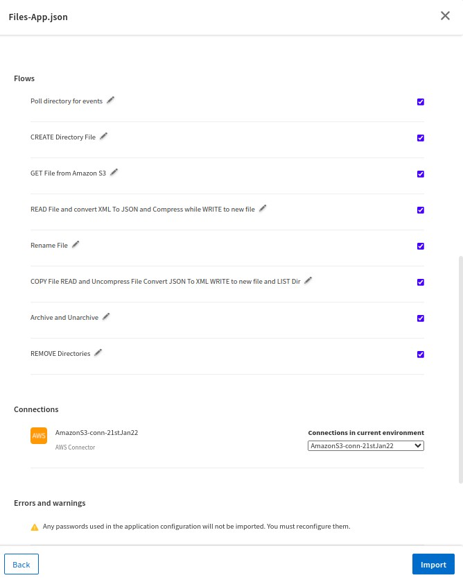

6. After importing app is done, in connection tab make sure to re-enter the Secret access key in AWS Connector as we are using Amazon S3 to Get file from S3 Bucket.

## Understanding the configuration

### The Flow

If you go inside the app, you can see multiple flows having different File activities. Below is the description of each flow:

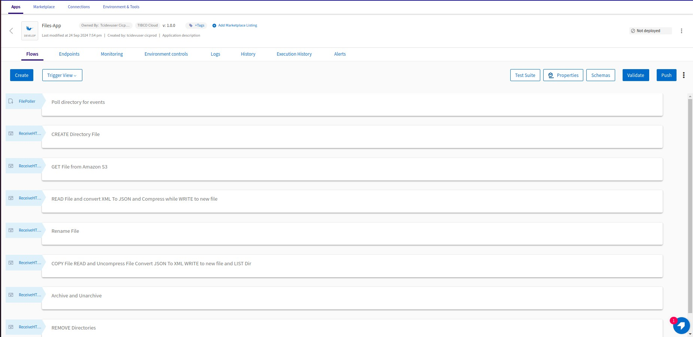

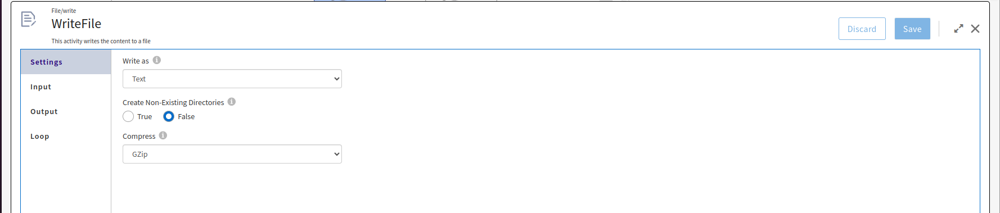

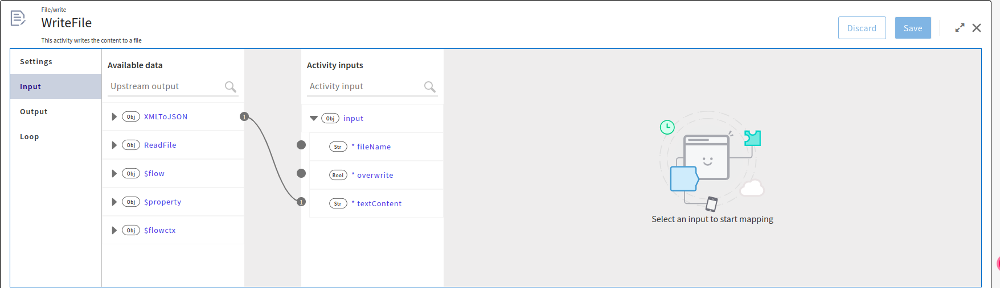

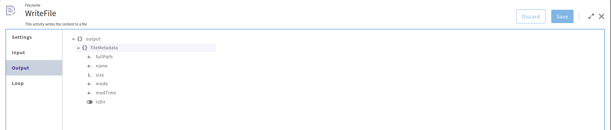

Flow 1 (Poll directory for events) : This flow has File Poller trigger to poll directories and files for events like Create, Write, Rename, Remove, Move.

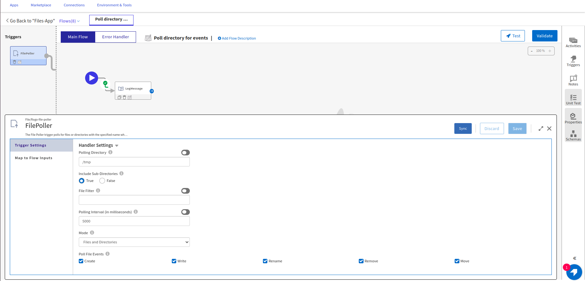

Flow 2 (CREATE Directory File) : In this flow we are creating blank directory and file using Create File activity.

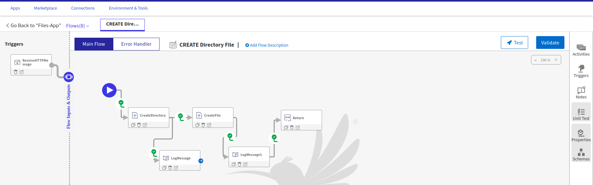

Flow 3 (GET File from Amazon S3) : In this flow we are using GET Activity from Amazon S3 to fetch the XML file from S3 bucket and put it in application pod/local file.

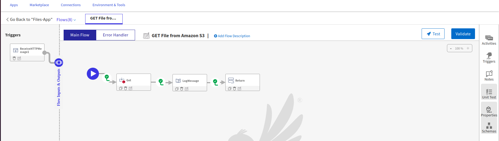

Flow 4 (READ File and convert XML To JSON and Compress while WRITE to new file) : In this flow we are reading content of XML file that we fetched from S3 bucket, convert XML data to JSON Object using XMLToJSON Activity and then using Write File activity write the JSON Object content to a new file in GZIP compressed format.

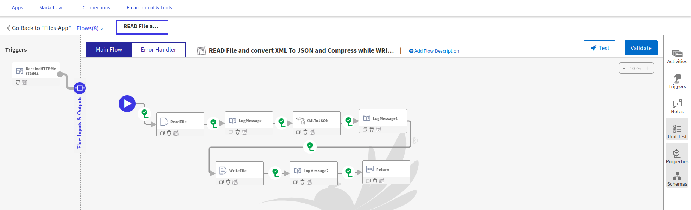

Flow 5 (Rename File) : In this flow we are renaming file created in previous flow.

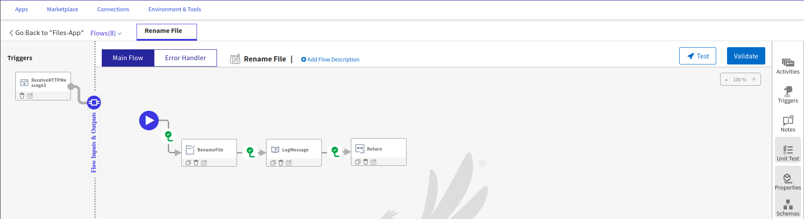

Flow 6 (COPY File, READ and Uncompress File, Convert JSON To XML, WRITE to new file and LIST Dir) : In this flow we are copying file from one directory to another directory, uncompressing file using GUNZIP format that we compressed in Flow 4 and Read the content of it, convert stringified JSON to XML string using JSONToXML activity and then again using Write File activity write the XML data to a new file and List all directories and Files present at /tmp location using List File activity .

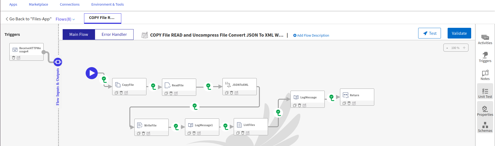

Flow 7 (Archive and Unarchive) : In this flow we are archiving directory in ZIP Format using Archive Files activity and then unarchive it at different directory using Unarchive Files activity.

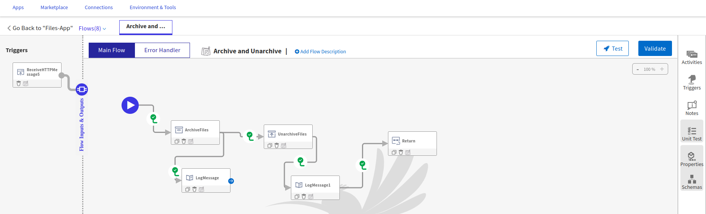

Flow 8 (Remove Directories) : In this flow we are removing all directories created in above flows.

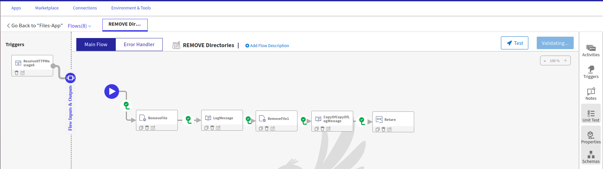

In all flows we have used Log Message and Return Activity for getting the output.

### Run the application

For running the application, first you have to push the app and then scale up the app. Then after sometime you can see your app in running status.

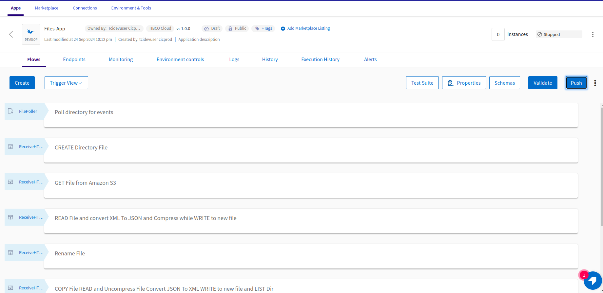

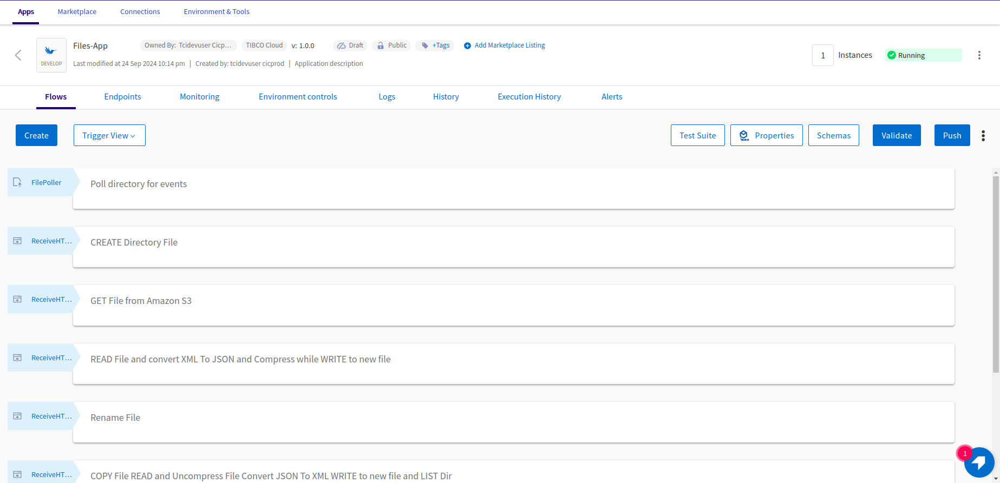

Once your app reaches to Running state, go to Endpoints and for GET/tasks, select 'Try it Out’ option and then click on execute.

Another option, If you want to test the sample in the Flow tester then follow below instructions:
 
in flow, click on Test Button -> create Launch configuration -> click Next button -> click on Run

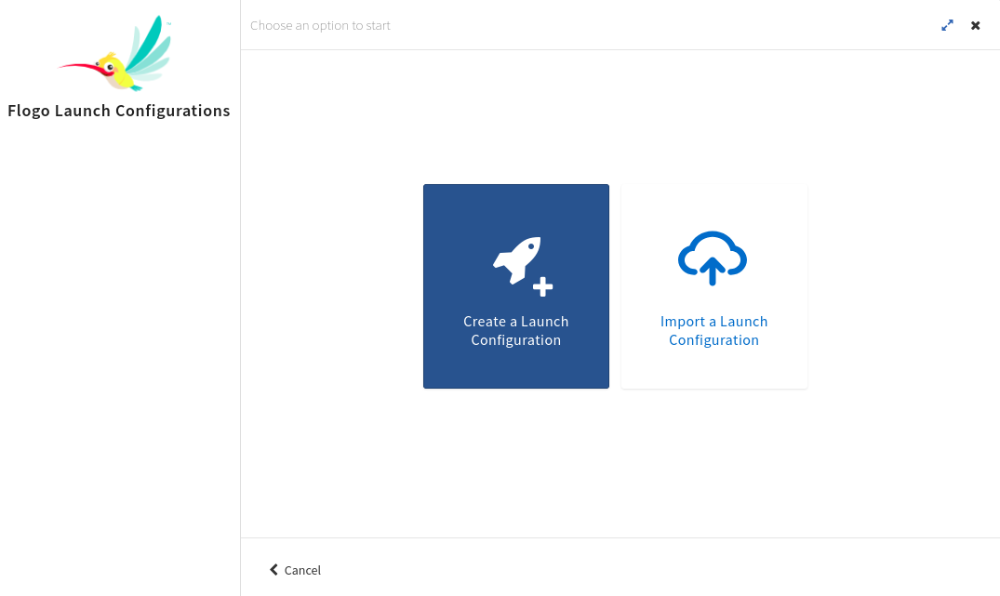

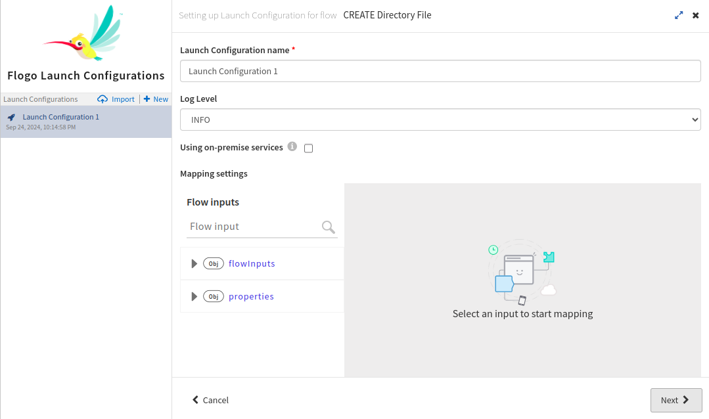

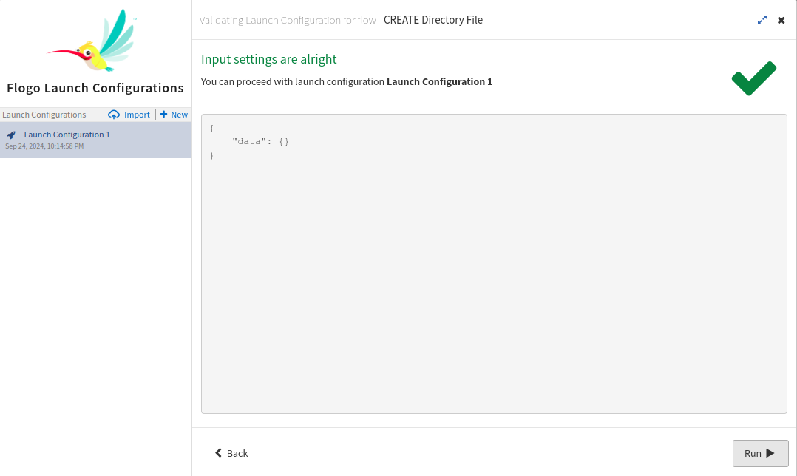

## Outputs

1. Flow Tester

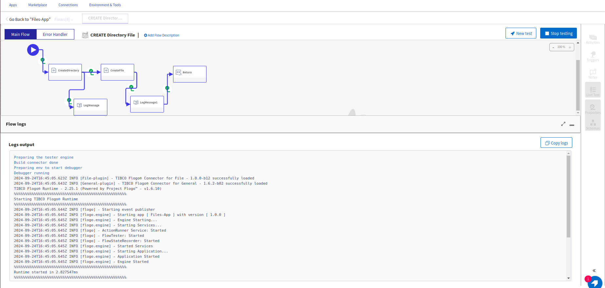

2. When hit endpoints

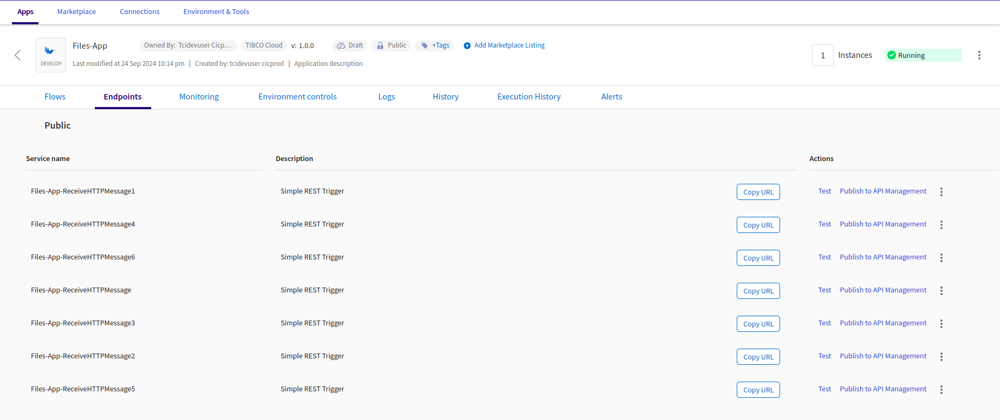

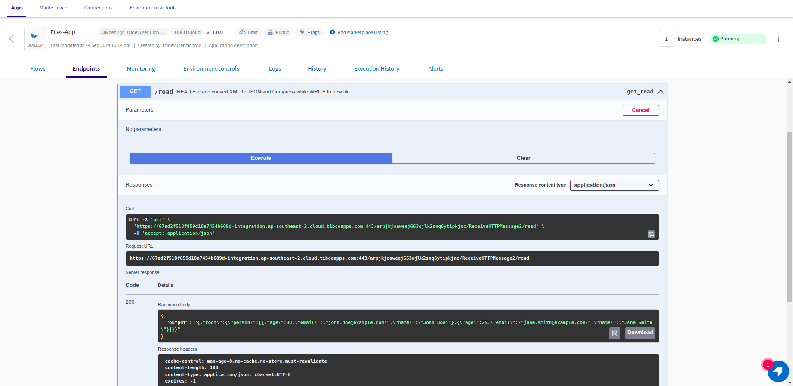

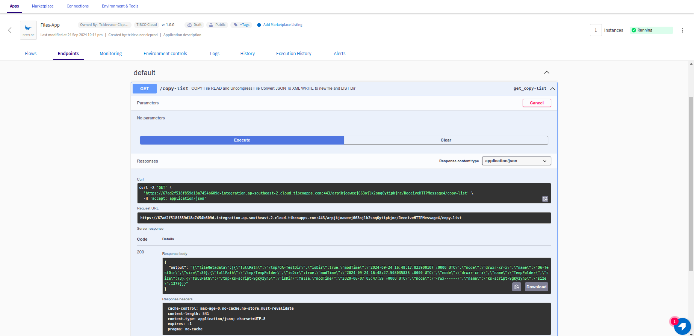

## Troubleshooting

* If you do not see the Endpoint enabled, make sure your apps is in Running status.

## Contributing

If you want to build your own activities for Flogo please read the docs here [Flogo-docs](https://tibcosoftware.github.io/flogo/)

If you want to showcase your project, check out [tci-awesome](https://github.com/TIBCOSoftware/tci-awesome)

You can also send an email to `tci@tibco.com`

## Feedback

If you have feedback, don't hesitate to talk to us!

* Submit feature requests on our [TCI Ideas](https://ideas.tibco.com/?project=TCI) or [FE Ideas](https://ideas.tibco.com/?project=FE) portal
* Ask questions on the [TIBCO Community](https://community.tibco.com/answers/product/344006)
* Send us a note at `tci@tibco.com`

## Help

Please visit our [TIBCO Cloud&trade; Integration documentation](https://integration.cloud.tibco.com/docs/) and TIBCO Flogo® Enterprise documentation on [docs.tibco.com](https://docs.tibco.com/) for additional information.

## License

This TCI Flogo SDK and Samples project is licensed under a BSD-type license. See [license.txt](license.txt).

