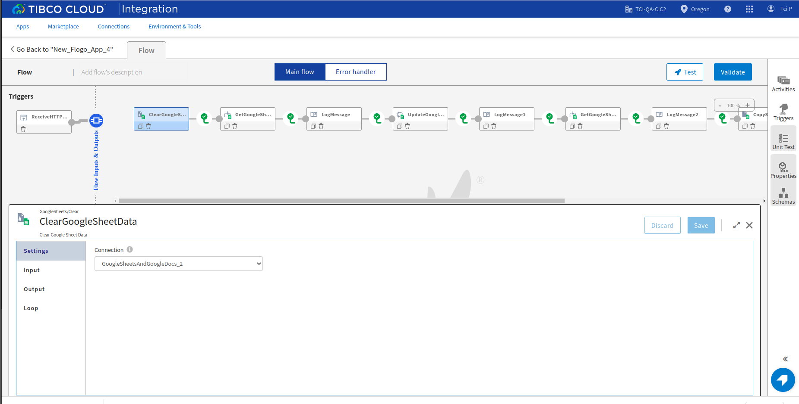
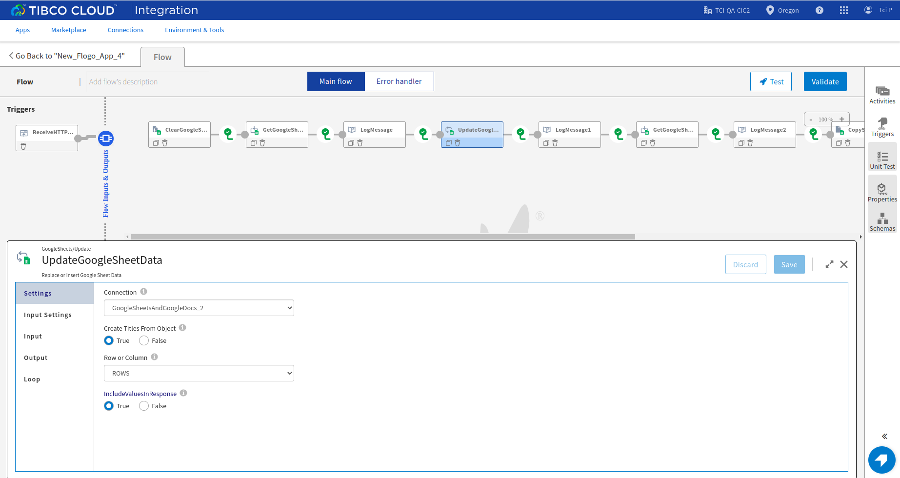
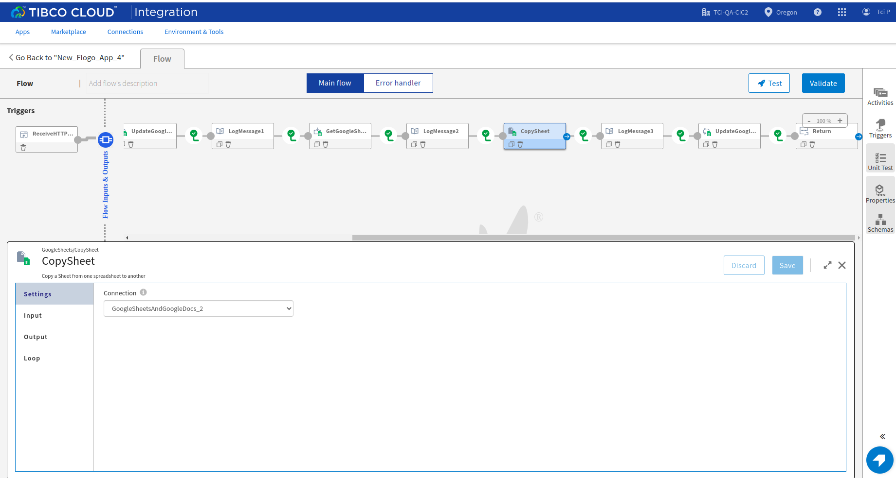
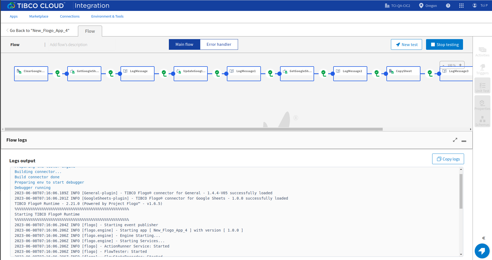

# Google Sheets Example

## Description

This example demonstrate how we can create and use Google Sheets activities.
Google Sheets bascially contains 4 activities. The main purpose of these activities are:

a) Clear Google Sheet Data : It is going to clear contents of the excel sheet.

b) Get Google Sheet Data : Get the data and make it available in the output(You can get data from a particular group or coloumn)

c) Update Google Sheet Data : To update the data in the excel sheet.

d) Copy Sheet: To copy the content of one sheet to the other.

In this sample we will first clear contents of the excel sheet, get the data, update the data , get the updated data, copy the content of one sheet to the other, update the coloumn without defining a schema.

## Prerequisites

1. TIBCO Cloud™ Integration 
2. If you run any of these samples locally using TIBCO Flogo® Enterprise -Ensure that connector is installed.

## Import the sample

1. Download the sample json file i.e., Google_sheets.json.

2. Create a new empty app

3. On the app details page, select import app option.

4. Now click on ‘browse to upload’ button and select the app.json from your machine that you want to import.

5. Click on Upload Button. The Import app dialog displays some generic errors and warnings as well as any specific errors or warnings pertaining to the app you are importing.

6. In Import App dialog, there are 2 options to import:

* Selective Import – If you are choosing this option then select trigger, flow and connection and click Next.

* Import all – If you are choosing this option then it will import all flows from the source app.

7. After importing app is done, in connection tab make sure to provide the Service Account Key and click on save button to establish the connection.

## Understanding the configuration

### The Connection

When you import the app you need to provide the Service Account Key and click on save button to establish the connection.

### The Flow

If you go inside the app, you can see in flow we have 5 activities (Copy,Create,Get,Delete and Update) that perform some operations.
Also in flow we have Log Message and Return Activity for getting the output.

### Run the application
For running the application, first you have to push the app and then scale up the app.
Then after sometime you can see your app in running status.

Once your app reaches to Running state, go to Endpoints and for GET/tasks, select 'Try it Out’ option and then click on execute.

Another option, If you want to test the sample in the Flow tester then follow below instructions:
 
in flow, click on Test Button -> create Launch configuration -> click Next button -> click on Run

## Outputs

1. Flow Tester

2. When hit endpoints

## Troubleshooting

* If you do not see the Endpoint enabled, make sure your apps is in Running status.

## Contributing
If you want to build your own activities for Flogo please read the docs here.

If you want to showcase your project, check out [tci-awesome](https://github.com/TIBCOSoftware/tci-awesome)

You can also send an email to `tci@tibco.com`

## Feedback
If you have feedback, don't hesitate to talk to us!

* Submit feature requests on our [TCI Ideas](https://ideas.tibco.com/?project=TCI) or [FE Ideas](https://ideas.tibco.com/?project=FE) portal
* Ask questions on the [TIBCO Community](https://community.tibco.com/answers/product/344006)
* Send us a note at `tci@tibco.com`

## Help
Please visit our [TIBCO Cloud&trade; Integration documentation](https://integration.cloud.tibco.com/docs/) and TIBCO Flogo® Enterprise documentation on [docs.tibco.com](https://docs.tibco.com/) for additional information.

## License
This TCI Flogo SDK and Samples project is licensed under a BSD-type license. See [license.txt](license.txt).

