# AmazonSNS publish messages(plain text and Custom type) on topic Example

## Description

This example demonstrate how we can publish plain text messages as well as custom or platform specific messages to a Amazon SNS topic with message attributes. You can send an email or SMS to a mobile phone with type custom message like JSON format set in GCM in this example.

To receive messages published to a topic, you must subscribe an endpoint to the topic. When you subscribe an endpoint to a topic, the endpoint begins to receive messages published to the associated topic. 
You can only subscribe an endpoint to SNS topic from Amazon Web Service account. For details about how to subscribe an endpoint to a topic, see Amazon SNS documentation.

## Prerequisites

* Ensure that Flogo Connector for Amazon SNS must be install.
* Before you create a connection with AWS connector, you must have an active Amazon Web Service account with permission to access Amazon SNS. For details about how to use the product, see Amazon SNS documentation.

## Import the sample

1. Download the sample's .json file 'AmazonSNS_Sample.json'

2. Create a new empty app.

3. On the app details page, select Import app.

4. Browse on your machine or drag and drop the .json file for the app that you want to import.
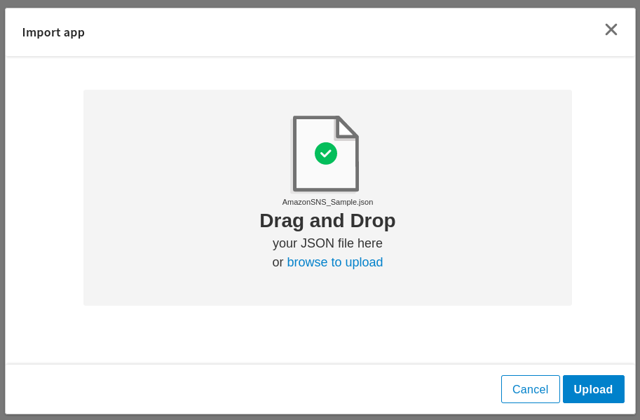

5. Click Upload. The Import app dialog displays some generic errors and warnings as well as any specific errors or warnings pertaining to the app you are importing. It validates whether all the activities and triggers used in the app are available in the Extensions tab.
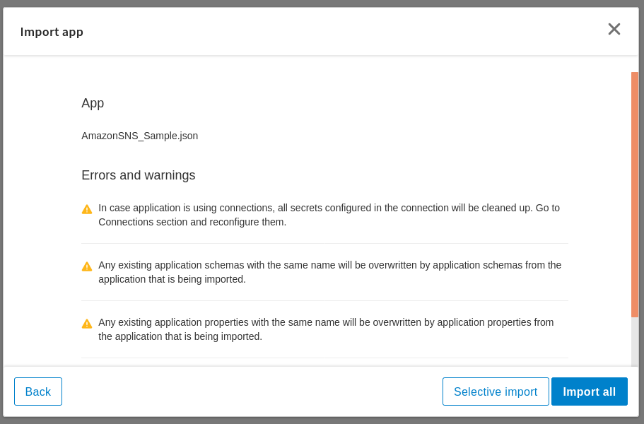

6. You have the option to import all flows from the source app or selectively import flows.

7. If you choose selective import, select the trigger, flow and connection. Click Next.

8. Make sure you re-configure the connection as mentioned in 'Understanding the configuration' section

## Understanding the configuration

### The Connection
When you import this app, you need to configure the 'AmazonSNS' connection in Connections page. It has pre-filled values except Secret access key. You also need to change other fields with yours.

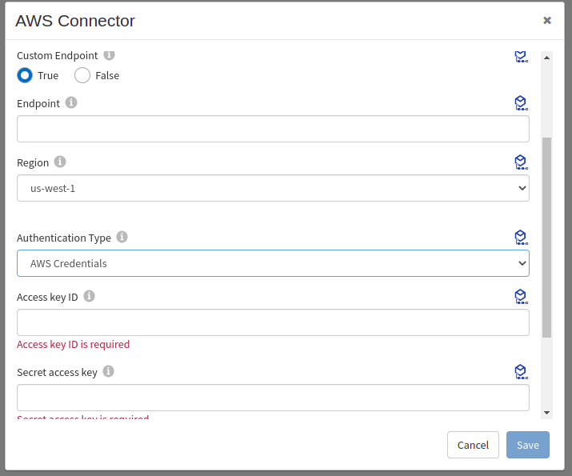

Note: After imported an app, in the imported connection under Connection tab,
* Access key ID has prefilled value which will be getting from the Security Credentials field of IAM Management Console in AWS. For details, see the AWS documentation.
* Secret access key is blank and you have to provide access key ID that is associated with your AWS account. For details, see the AWS documentation.
* For this sample connection used Assume Role True and provided related fields which will be varies according to User's AWS account.
  This enables you to assume a role from another AWS account. By default, it is set to False (indicating that you cannot assume a role from another AWS account).
  When set to True, provide the following information:
  Role ARN - Amazon Resource Name of the role to be assumed
  Role Session Name - Any string used to identify the assumed role session
  External ID - A unique identifier that might be required when you assume a role in another account
  Expiration Duration - The duration in seconds of the role session. The value can range from 900 seconds (15 minutes) to the maximum session duration setting that you specify for the role.
  For details, see the AWS documentation

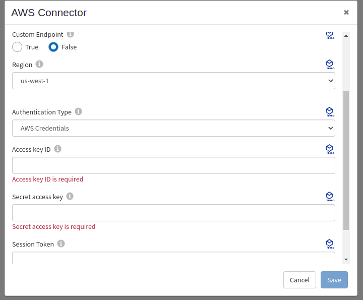

### The Flow and InvokeRestService activity
If you open the app, you will see there is 'AmazonSNSPublishMessage' flow in the AmazonSNSSample app with REST trigger.
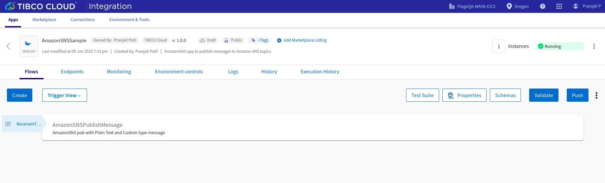

The AmazonSNSPublishMessage flow in the AmazonSNS_Sample app basically publish messages to Amazon SNS topic along with message attributes using SNS Publish activity posted using REST trigger. There are two SNS Publish activities used in flow. In the first SNS Publish activity, plain text message is sent to the topic along with message attributes and topic ARN with message you can provide in the input tab of activity. In the second activity, custom message is sent to topic along with message attributes and json message you can see for GCM to which devices and mobile apps may register. 
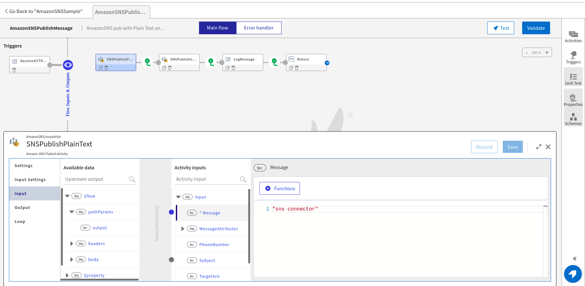
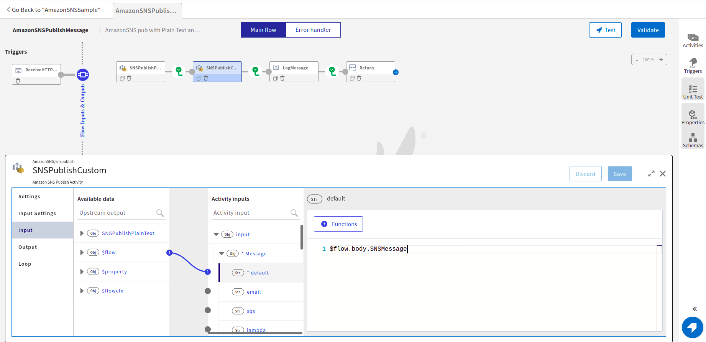

### Run the application
For running the application, first you have to push the app and then scale up the app. Then after sometime you can see your app in running status.
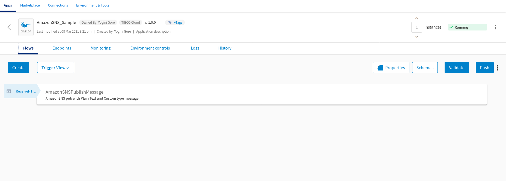

Once it reaches to Running state, go to Endpoints, click on Test under Actions and for POST//snspub/{output}, select 'Try it out'
You will have to pass value for the path parameter 'output'. You can provide any string type value for 'output' parameter.
You will have to pass the values for the request body parameter.
Now click Execute button.
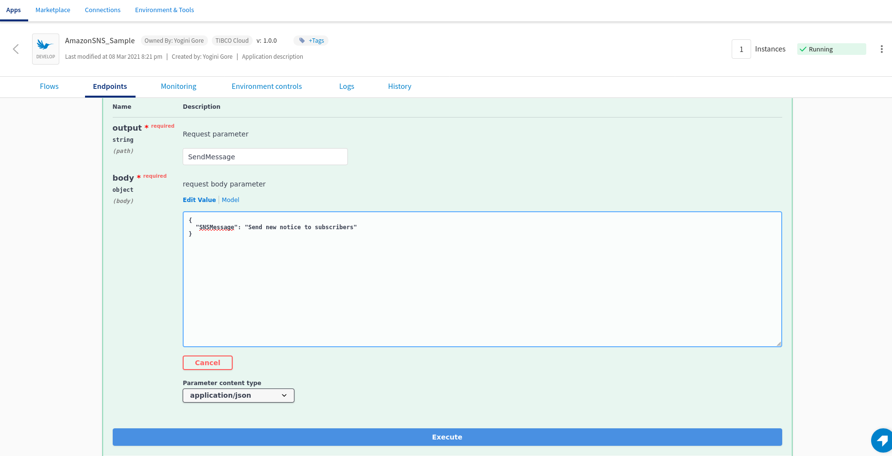

If you want to test the sample in the Flow tester then follow below instructions:
Click on the 'AmazonSNSPublishMessage' flow, click on Test Button -> create Launch configuration -> provide request schema in body parameter -> click Next button -> click on Run
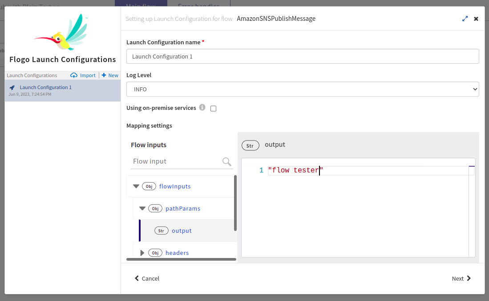

## Outputs

1. Sample Response when hit the endpoints
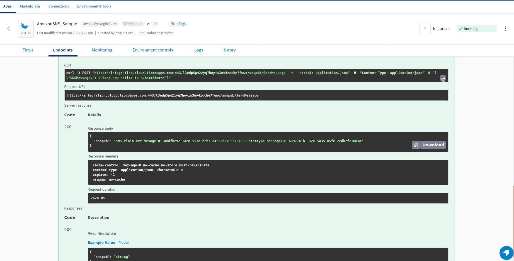

2. Sample Logs
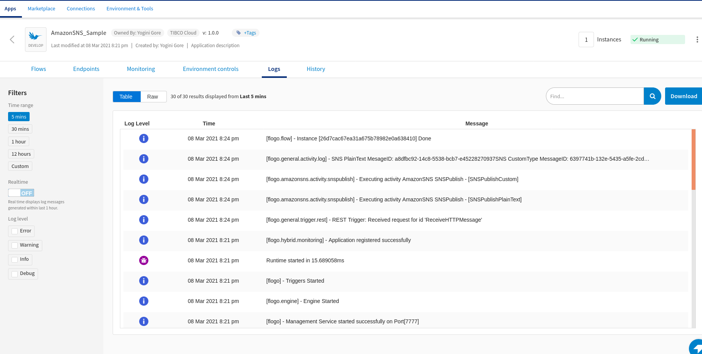

3. Flow Tester Logs
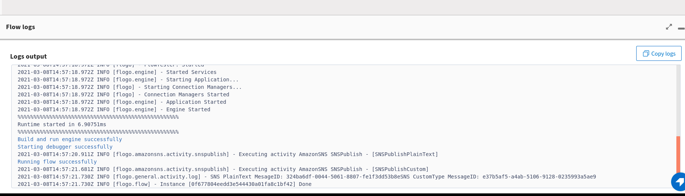

## Troubleshooting

* If you do not see the Endpoint enabled, make sure your apps is in Running status.
* If you do not see user content screen, check if your browser is blocking pop-ups.
* if you see 401 Unauthorized error or token refresh error, re-configure the connection.

## Contributing
If you want to build your own activities for Flogo please read the docs here, [Flogo-docs](https://tibcosoftware.github.io/flogo/)

If you want to showcase your project, check out [tci-awesome](https://github.com/TIBCOSoftware/tci-awesome)

You can also send an email to `tci@tibco.com`

## Feedback
If you have feedback, don't hesitate to talk to us!

* Submit feature requests on our [TCI Ideas](https://ideas.tibco.com/?project=TCI) or [FE Ideas](https://ideas.tibco.com/?project=FE) portal
* Ask questions on the [TIBCO Community](https://community.tibco.com/answers/product/344006)
* Send us a note at `tci@tibco.com`

## Help
Please visit our [TIBCO Cloud&trade; Integration documentation](https://integration.cloud.tibco.com/docs/) and TIBCO Flogo® Enterprise documentation on [docs.tibco.com](https://docs.tibco.com/) for additional information.

## License
This TCI Flogo SDK and Samples project is licensed under a BSD-type license. See [license.txt](license.txt).
