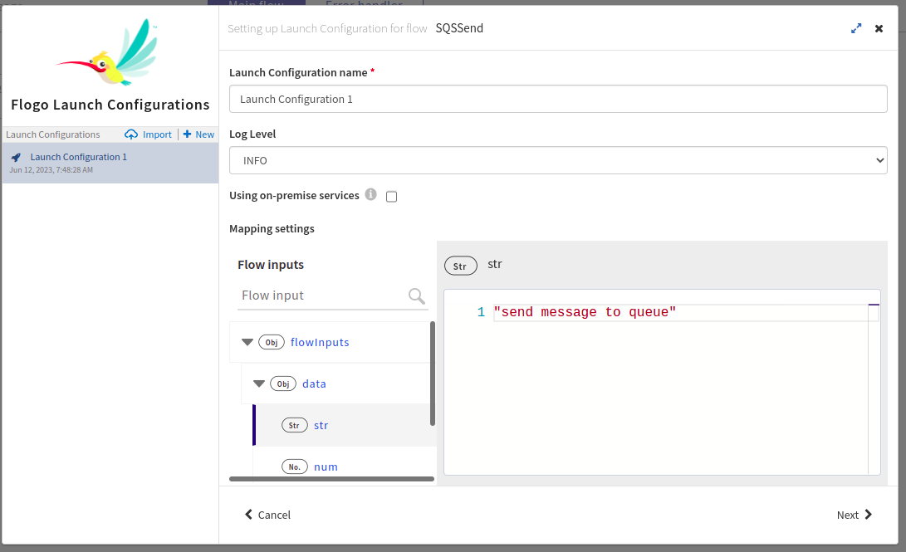

# AmazonSQS Send and Recieve messages on FIFO and Standard queue type Example

## Description

This example demonstrate how we can send the multiple messages to Standard and FIFO queues with a structured metadata, with messages by using message attributes.

The flows in the AmazonSQSSample app basically sends multiple messages using Iterate loop to FIFO queue and single message to Standard queue. The ReceiveSQSMessage trigger is used to receive the messages sent on respective queues. 

## Prerequisites

* Ensure that Flogo Connector for Amazon SQS must be install.
* Before you create a connection with AWS connector, you must have an active Amazon Web Service account with permission to access Amazon SQS. For details about how to use the product, see Amazon SQS documentation.

## Import the sample

1. Download the sample's .json file 'AmazonSQSSample.json'

2. Create a new empty app.

3. On the app details page, select Import app.

4. Browse on your machine or drag and drop the .json file for the app that you want to import.

5. Click Upload. The Import app dialog displays some generic errors and warnings as well as any specific errors or warnings pertaining to the app you are importing. It validates whether all the activities and triggers used in the app are available in the Extensions tab.

6. You have the option to import all flows from the source app or selectively import flows.

7. If you choose selective import, select the trigger, flow and connection. Click Next.

8. Make sure you re-configure the connection as mentioned in 'Understanding the configuration' section

## Understanding the configuration

### The Connection
When you import this app, you need to configure the 'AmazonSQS' connection in Connections page. It has pre-filled values except Secret access key. You also need to change other fields with yours.

Note: After imported an app, in the imported connection under Connection tab,
* Access key ID has prefilled value which will be getting from the Security Credentials field of IAM Management Console in AWS. For details, see the AWS documentation.
* Secret access key is blank and you have to provide access key ID that is associated with your AWS account. For details, see the AWS documentation.
* For this sample connection used Assume Role True and provided related fields which will be varies according to User's AWS account.
  This enables you to assume a role from another AWS account. By default, it is set to False (indicating that you cannot assume a role from another AWS account).
  When set to True, provide the following information:
  Role ARN - Amazon Resource Name of the role to be assumed
  Role Session Name - Any string used to identify the assumed role session
  External ID - A unique identifier that might be required when you assume a role in another account
  Expiration Duration - The duration in seconds of the role session. The value can range from 900 seconds (15 minutes) to the maximum session duration setting that you specify for the role.
  For details, see the AWS documentation

### The Flow and InvokeRestService activity
If you open the app, you will see there are three flows in the AmazonSQSSample app. The flow 'SQSSend', second flow 'SQSReceiveFiFO' and thrid flow 'SQSReceiveSTD'.

The SQSSend flow in the AmazonSQSSample app basically sends multiple messages to FIFO queue along with message attributes using Send SQS Message activity and using Iterate loop. MesageDeduplicationId and MessageGroupId also attached to the messages that are sent to FIFO queue which is set in Input tab of Send SQS Message activity. Then using same activity, single message sent to Standard queue without any message attributes and as queue type selected is standard there is no field for MesageDeduplicationId and MessageGroupId. To start this flow used REST trigger activity where user can POST the request schema and executre the flow. 

The SQSReceiveFiFO trigger flow in the AmazonSQSSample app receieves the messages sent to FIFO type queue. At a time maximum 5 messages to be received. And once messages are received it will delete atomatically. This flow starts when FIFO type queue have the new messages in the queue. Visibility timeout and WaitTime set 0 that is messages are not hidden from the queue to receive and returns output without waiting for the messages to arrive in the queue. 

The SQSReceiveSTD trigger flow in the AmazonSQSSample app receieves the messages sent to Standard type queue. At a time maximum 1 message to be received. And once messages are received it will delete atomatically. This flow starts when Standard type queue have the new messages in the queue. Visibility timeout is 0 that is messages are not hidden from the queue to receive and WaitTime set 20 that is the call waits 20 seconds for a message to arrive in the queue before returning. If a message is available, the call returns sooner than WaitTimeSeconds.

### Run the application
For running the application, first you have to push the app and then scale up the app. Then after sometime you can see your app in running status.

Once it reaches to Running state, go to Endpoints, click on Test under Actions and for POST//sqssend/output, select 'Try it out'
You will have to pass the values for the request body parameter.
Now click Execute button.

If you want to test the sample in the Flow tester then follow below instructions:
Click on the SQSSend flow, click on Test Button -> create Launch configuration -> provide request schema in body parameter -> click Next button -> click on Run

## Outputs

1. Sample Response when hit the endpoints

2. Sample Logs

3. Flow Tester Logs

## Troubleshooting

* If you do not see the Endpoint enabled, make sure your apps is in Running status.
* If you do not see user content screen, check if your browser is blocking pop-ups.
* if you see 401 Unauthorized error or token refresh error, re-configure the connection.

## Contributing
If you want to build your own activities for Flogo please read the docs here, [Flogo-docs](https://tibcosoftware.github.io/flogo/)

If you want to showcase your project, check out [tci-awesome](https://github.com/TIBCOSoftware/tci-awesome)

You can also send an email to `tci@tibco.com`

## Feedback
If you have feedback, don't hesitate to talk to us!

* Submit feature requests on our [TCI Ideas](https://ideas.tibco.com/?project=TCI) or [FE Ideas](https://ideas.tibco.com/?project=FE) portal
* Ask questions on the [TIBCO Community](https://community.tibco.com/answers/product/344006)
* Send us a note at `tci@tibco.com`

## Help
Please visit our [TIBCO Cloud&trade; Integration documentation](https://integration.cloud.tibco.com/docs/) and TIBCO Flogo® Enterprise documentation on [docs.tibco.com](https://docs.tibco.com/) for additional information.

## License
This TCI Flogo SDK and Samples project is licensed under a BSD-type license. See [license.txt](license.txt).
