# AzureServiceBus managed enterprise message broker with message queues and publish-subscribe topics  Example

## Description

This example demonstrate how we can publish the different type of messages to a topic and subscribes to a topic and log the messages received as output.

The flow in the AzureServiceBusPUBSUBSample app basically publish different types of messages over a queue and topic entities.The AzureServiceBus Queues are sent to and received messages from queues. The AzueServiceBus Topic subscribers will be used in publish-subscriber scenario. The example having multiple trigger handlers using AzureServcieBus trigger(Queue Receiver and Topic Subscriber) .

## Prerequisites

* Ensure that TIBCO Flogo Connector for AzureServiceBus must be install.
* Before you create a connection, familiarize yourself with AzureServiceBus.you must have an active Microsoft Azure Portal Account with permission to access Azure Service Bus. For details about how to use the product, see AzureServiceBus documentation. 

## Import the sample

1. Download the sample's .json file 'AzureServiceBusPUBSUBSample.json'

2. Create a new empty app.

3. On the app details page, select Import app.

4. Browse on your machine or drag and drop the .json file for the app that you want to import.
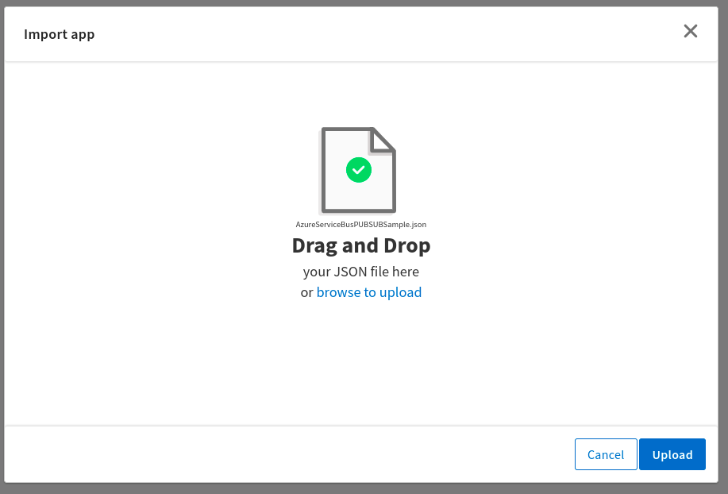

5. Click Upload. The Import app dialog displays some generic errors and warnings as well as any specific errors or warnings pertaining to the app you are importing. It validates whether all the activities and triggers used in the app are available in the Extensions tab.
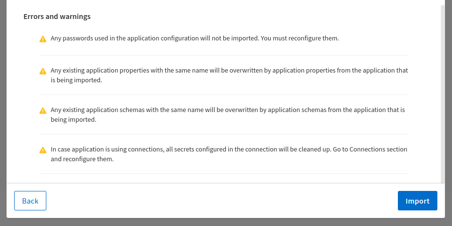

6. You have the option to import all flows from the source app or selectively import flows.

7. If you choose selective import, select the trigger, flow and connection. Click Next.

8. Make sure you re-configure the connection as mentioned in 'Understanding the configuration' section

## Understanding the configuration

### The Connection
When you import this app, you need to configure the 'AzureServiceBus' connection in the Connections page. It has pre-filled values for all paramaters. But if you have an app with AzureServiceBus connection having Namespace, AuthorizationRule and SharedAccessKey required to authenticate the broker then after import such apps, SharedAccessKey field will be empty as shown in below screenshot.

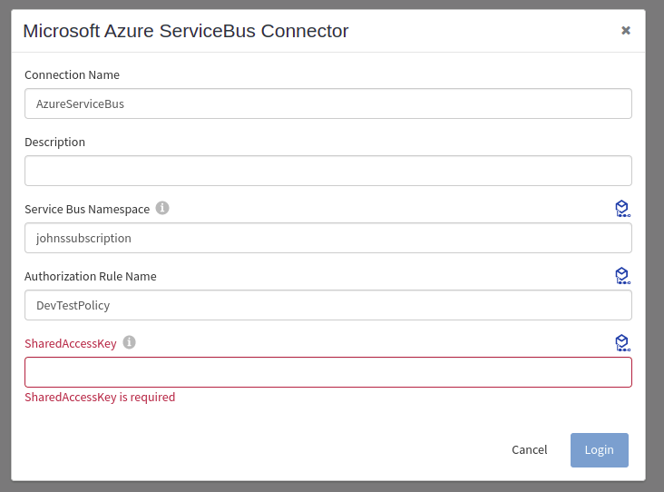

Note: After imported an app, in the imported connection under Connection tab,
* Namespace has prefilled value which is the Name of Azure Service Bus Namespace (get it from Azure Portal ).
* Authorization Rule has prefiled value which is policy (get it from the Azure Portal under Shared Access Policies).
* Shared Access Key has blank value which is Primary or Secondary key under respective policy(get it from Azure Portal under policy which you have selected). 

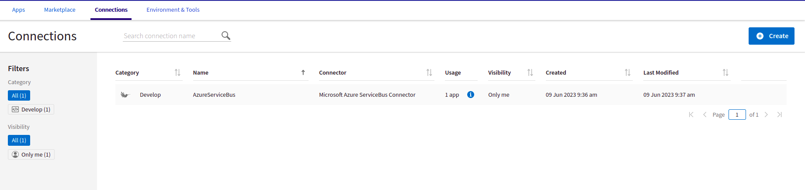

### The Flow and InvokeRestService activity
If you open the app, you will see there are three flows, one is Publisher for Queues and Topics and other two is like consumer i.e QueueReceiver and TopicSubscriber
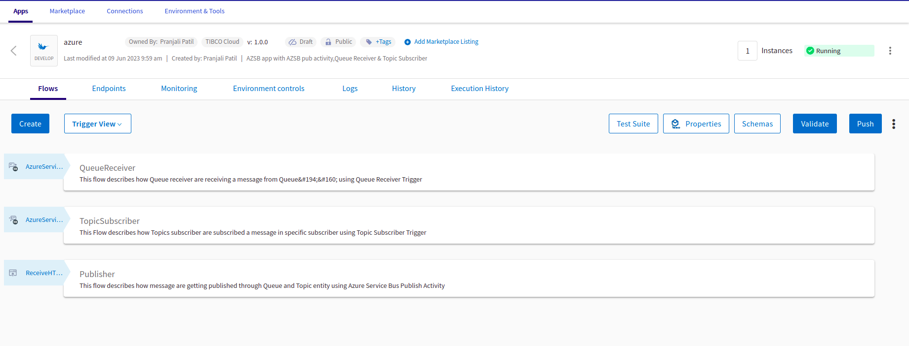

The 'Publisher' flow in the AzureServiceBusPUBSUBSample app basically sends a messages over Queues and Topics. It has two publish activites for Queue and Topic respetively.All these operation will be done when execute the REST trigger with valid input schema provided in ReceiveHTTPMessage trigger. REST trigger have method POST.
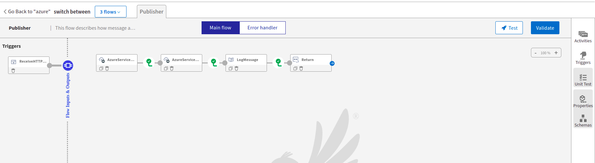

When 'Publisher' flow sends a message through a Queue, then the Queue Receiver trigger receives the message from the respective queue. To see how Will Queue Receivers work, see Azure Service Bus documentation.
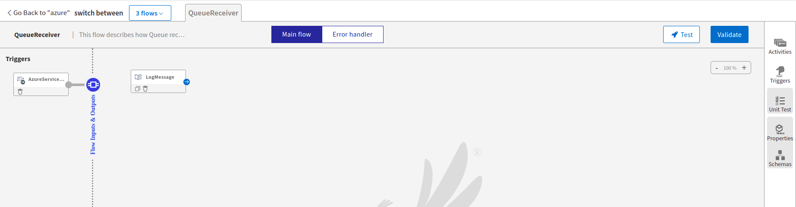

When 'Publisher' flow sends a message through a Topic, then the Topic Subscriber trigger receives the message from the topic of the respective subscriber. To see how Will Queue Receiver works, see Azure Service Bus documentation.
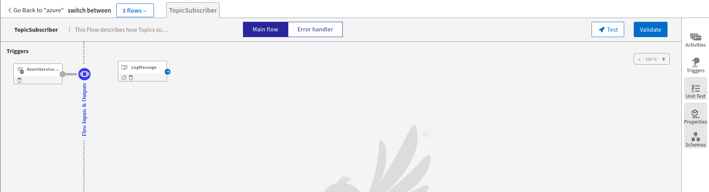

### Run the application
For running the application, first you have to push the app and then scale up the app. Then after sometime you can see your app in running status.
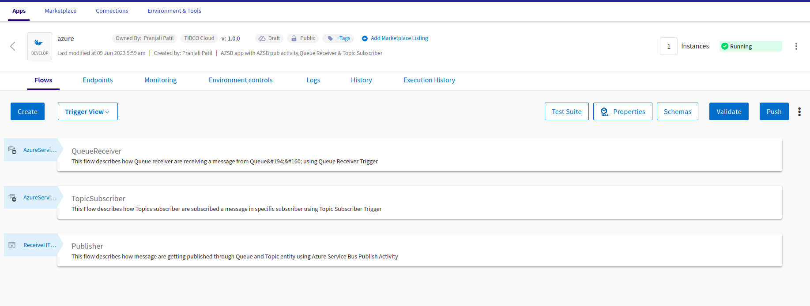

Once it reaches to Running state, go to Endpoints, click on Test under Actions and for POST/publisher, select 'Try it out'
You will have to pass value in a request schema QueueMessage and TopicMessage.
Now click Execute button.
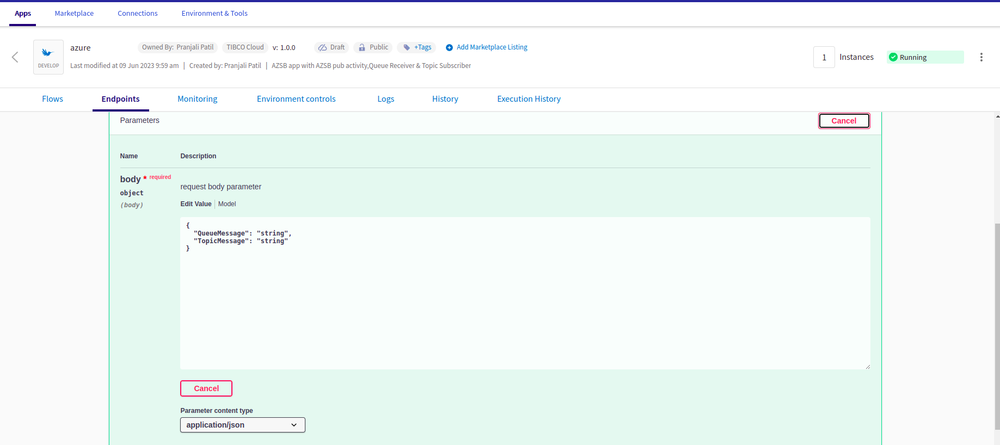

If you want to test the sample in the Flow tester then follow below instructions:
Click on the Publisher flow, click on Test Button -> create Launch configuration -> provide request schema in body parameter -> click Next button -> click on Run
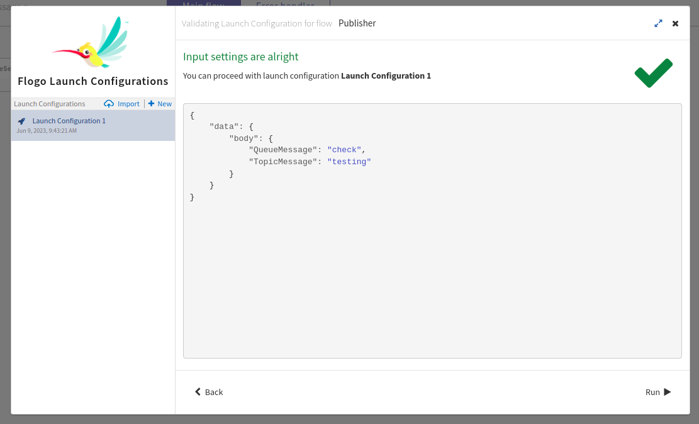

## Outputs

1. Sample Response when hit the endpoints
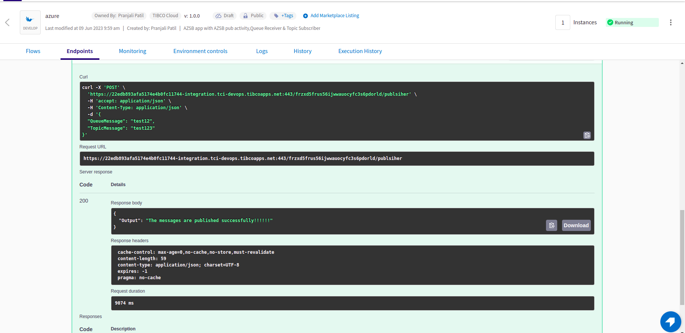

2. Sample Logs
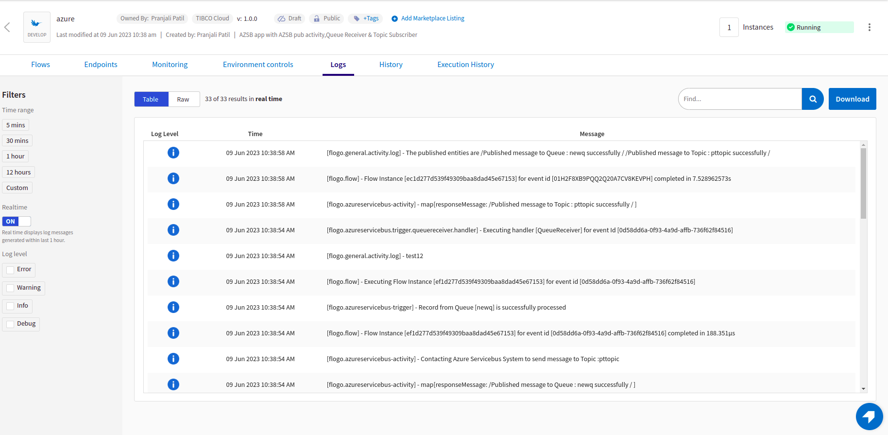

3. Flow Tester Logs
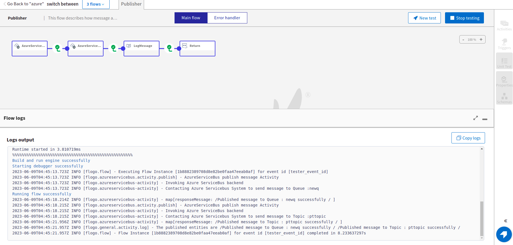

## Troubleshooting

* If you do not see the Endpoint enabled, make sure your apps is in Running status.
* If you do not see user content screen, check if your browser is blocking pop-ups.
* if you see 401 Unauthorized error or token refresh error, re-configure the connection.

## Contributing
If you want to build your own activities for Flogo please read the docs here, [Flogo-docs](https://tibcosoftware.github.io/flogo/)

If you want to showcase your project, check out [tci-awesome](https://github.com/TIBCOSoftware/tci-awesome)

You can also send an email to `tci@tibco.com`

## Feedback
If you have feedback, don't hesitate to talk to us!

* Submit feature requests on our [TCI Ideas](https://ideas.tibco.com/?project=TCI) or [FE Ideas](https://ideas.tibco.com/?project=FE) portal
* Ask questions on the [TIBCO Community](https://community.tibco.com/answers/product/344006)
* Send us a note at `tci@tibco.com`

## Help
Please visit our [TIBCO Cloud&trade; Integration documentation](https://integration.cloud.tibco.com/docs/) and TIBCO Flogo® Enterprise documentation on [docs.tibco.com](https://docs.tibco.com/) for additional information.

## License
This TCI Flogo SDK and Samples project is licensed under a BSD-type license. See [license.txt](license.txt).
