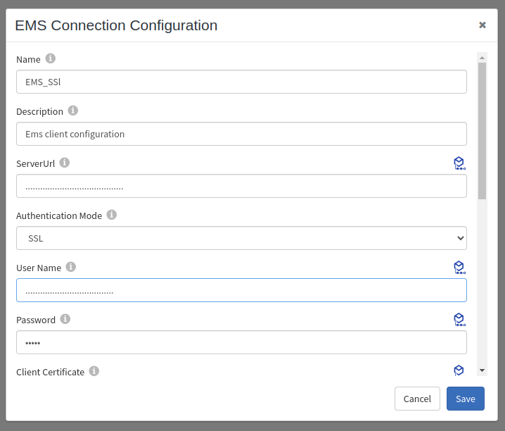
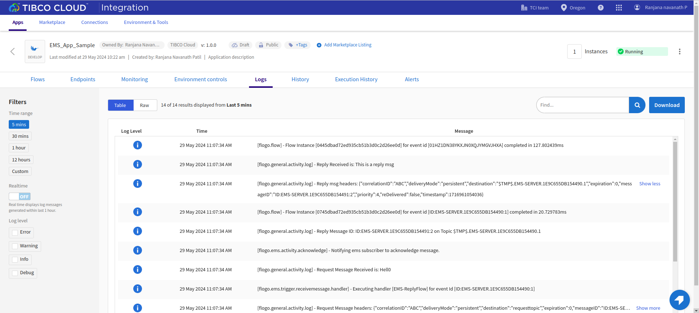

# Flogo Application sample for TIBCO Enterprise Message Service™ (EMS)

## Description

This sample demonstrate a simple worflow about how EMS provides activities and triggers to send and receive messages. You can connect to your EMS broker by using transport layer security (TLS).

Configure triggers that subscribe to messages published to a queue and topic.

EMS Send Message is a synchronous activity that sends a message to the specified EMS destination. 
The EMS Receive Message trigger receives a message from a topic or queue. Each message triggers a new flow. The message gets acknowledged as soon as the 'EMS Acknowledge' activity is encountered in the flow.
The EMS Request Reply is an asynchronous activity that is used to send a request to an EMS destination and wait for a response from the EMS client.

## Prerequisites

* A EMS broker running in any mode -None,SSL
* Depending on the mode and where your broker is running, you will have to configure the EMS connection

## Import the sample

1. Download the sample's .json file 'EMS_App_Sample.json'

2. Create a new empty app.

3. On the app details page, select Import app.

4. Browse on your machine or drag and drop the .json file for the app that you want to import.

5. Click Upload. The Import app dialog displays some general warnings and specific error in you app if any.

6. You have the option to import all flows from the source app or selectively import flows.

7. If you choose selective import, select the trigger, flow and connection. Click Next.

8. Make sure you re-configure the connection as mentioned in 'Understanding the configuration' section

## Understanding the configuration

### The Connection
When you import this app, you need to re-configure the 'EMS_SSl' connection in Connections page. 

Note: If you want to use the TIBCO Cloud Messaging - EMS instance hosted on TCI, you can refer to the following doc for configuring the connection.

[Configuring the Connection.](https://integration.cloud.tibco.com/docs/index.html#Subsystems/flogo-ems/users-guide/ems-creating-an-ems-connection.html?TocPath=TIBCO%2520Flogo%25C2%25AE%2520Connector%2520for%2520TIBCO%2520Enterprise%2520Message%2520Service%25E2%2584%25A2%257CCreating%2520an%2520EMS%2520Connection%257C_____0)

### The Request and Receiver Flows
The application contains two flows; a EMS-RequestFlow and a EMS-ReplyFlow

EMS-RequestFlow that is used to send a request to an EMS destination, and wait for a response from the EMS client. whenever the rest enpoint is triggered. REST trigger has method POST with path parameter 'request'.  

EMS-ReplyFlow has the Receiver trigger which is listening to the mentioned destination and recieves the message whenever it is sent. Further, the EMSAcknowledge activity acknowledges the EMS message received by the EMS trigger. EMS Send Message activity is used to send the reply back to the Request flow.

### Run the application
Once you are ready to run the application, you can use the Push option and later run this app.
Once it reaches to Running state, go to Endpoints, click on Test under Actions and select 'Try it out' for POST/request
Now enter values for request parameter in the post body.
Now click Execute button.

## Outputs

1. Response when hit the endpoints

2. Receieve Message Logs

## Troubleshooting

* If you do not see the Endpoint enabled, make sure your apps is in Running status.
* If your app is going into Failure state, make sure your pulsar broker is reachable to your client machine.

## Contributing
If you want to build your own activities for Flogo please read the docs here, [Flogo-docs](https://tibcosoftware.github.io/flogo/)

If you want to showcase your project, check out [tci-awesome](https://github.com/TIBCOSoftware/tci-awesome)

You can also send an email to `tci@tibco.com`

## Feedback
If you have feedback, don't hesitate to talk to us!

* Submit feature requests on our [TCI Ideas](https://ideas.tibco.com/?project=TCI) or [FE Ideas](https://ideas.tibco.com/?project=FE) portal
* Ask questions on the [TIBCO Community](https://community.tibco.com/answers/product/344006)
* Send us a note at `tci@tibco.com`

## Help
Please visit our [TIBCO Cloud&trade; Integration documentation](https://integration.cloud.tibco.com/docs/) and TIBCO Flogo® Enterprise documentation on [docs.tibco.com](https://docs.tibco.com/) for additional information.

## License
This TCI Flogo SDK and Samples project is licensed under a BSD-type license. See [license.txt](license.txt).
