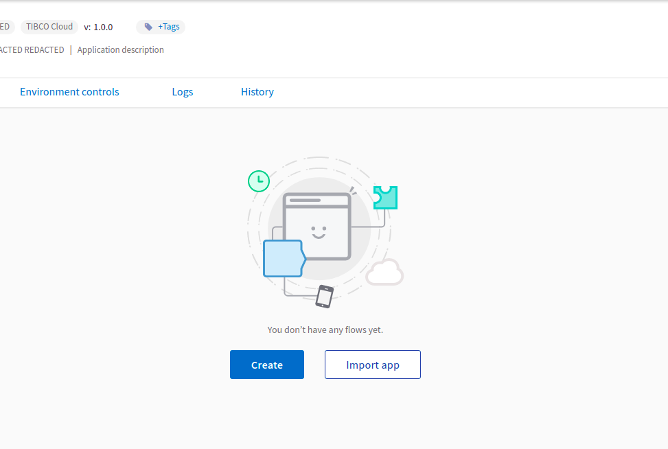

# Google Cloud Pub/Sub Sample on how to Publish and Subscribe message 

## Description

This sample demonstrate on how to publish message to a topic and subscribe mesage from a topic through flogo application.
There are two flows in this sample application - Publisher (creates messages and publishes them to the messaging service on a specified topic and returns the message id of the published message) and Subscriber (receives messages on a specified topic using Subscription Id).	

## Prerequisites

1. TIBCO Flogo Connector for Google Cloud Pub/Sub must be installed.
2. Topic Id and Subscription Id must be preconfigured in the Google Cloud Pub/Sub service.
3. Access to Google Cloud Platform (GCP) account.
4. Understanding of Google Cloud Pub/Sub service concepts. For details about how to use Google Cloud Pub/Sub, see the Google Cloud Pub/Sub documentation.

## Import the sample

1. Download the sample json file i.e., Google-PubSub-App.json.

2. Create a new empty app

3. On the app details page, select import app option.

4. Now click on ‘browse to upload’ button and select the app.json from your machine that you want to import.

5. Click on Upload Button. The Import app dialog displays some generic errors and warnings as well as any specific errors or warnings pertaining to the app you are importing.

6. In Import App dialog, there are 2 options to import:

* Selective Import – If you are choosing this option then select trigger, flow and connection and click Next.

* Import all – If you are choosing this option then it will import all flows from the source app.

7. After importing app is done, in connection tab make sure to click on Save button to establish the connection.

## Understanding the configuration

### The Connection

After importing the app you can see pre-filled values for all fields. So all you need to do is to simply click on Save button to establish the connection.

In connection tab, below are the mandatory fields: 
1. Connection Name - provide name of the connection.
2. Project ID - Project ID of the subscription or the topic.
3. Service Account Key - Purpose of this field is to access the Google Cloud Pub/Sub service. Service Account Key should be in the JSON format.

### The Flow

If you go inside the app, you can see 2 flows - Publisher and Subscriber

1. Publisher - In this flow we use Message Publisher Activity to publish the message to a specified topic. Message Publisher Activity has different tabs below are the description:

Settings tab - in this we need to select connection name, pass the topic Id to publish the message, enable the message ordering field so that subscriber can receive message in the order in which publisher sent the message (Message Ordering field is optional) and then Select the Message data format, it can be JSON or String.

Input Settings tab - If we select Message Data Format as JSON in settings tab then we need to give JSON schema for the message data and also we can add message attribute along with the JSON Schema.

Input tab - in this the first field is topicId so if we want to override topicID during runtime we can pass the value here and it will override the topic id that we pass in settings tab, in next field we can pass the message that need to be sent and also value for the message attributes. If we enable Message ordering in settings tab then we can see messageOrderingKey field in this tab and we can pass any string value to this field.

Output tab - Message Publisher Activity returns messageId of the published message as output.

Loop tab - with this loop feature we can send 'n' no. of messages and each message has different messageId. 

Also in Publisher flow we have Log Message and Return Activity for getting the output.

2. Subscriber - In this flow we use PubSub Message Subscriber Trigger to receive the message from Google Pub/Sub Service on a speciifed topic when subscribes to preconfigured subscriptions.
PubSub Message Subscriber Trigger has following tabs below are the description:
Trigger Settings - in this we need to select connection name, pass the Subscription Id to receive the message, pass value to Max outstanding message field (default value is 1000) , flow control is is set to default value i.e., false which means trigger continuously receives messages from the service and processes them concurrently, Select the Message data format it can be JSON or String and then add message attribute field.

Output Setting - in this if we select Message Data Format as JSON and add message attribute in Trigger settings then JSON Schema and message attribute is automatically populated here.

Map to Flow Inputs - flow inputs (message and metadata) are auto mapped.

Also in Subscriber flow we have Log Messages for getting message and metadata as output.

### Run the application

For running the application, first you have to push the app and then scale up the app.
Then after sometime you can see your app in running status.
Once your app reaches to Running state, go to Endpoints and for GET/tasks, select 'Try it Out’ option and then click on execute.

## Outputs

1. When hit endpoints

2. Publish message logs

3. Receive message logs

## Troubleshooting

* If you do not see the Endpoint enabled, make sure your apps is in Running status.
* If your app is going into Failure state, make sure your Topic ID and Subscription ID are correct and preconfigured in the Google Cloud Pub/Sub service.
* If your app is going into Failure state, make sure publish and subscriber permission is configured to IAM role.

## Contributing

If you want to build your own activities for Flogo please read the docs here. [Flogo-docs](https://tibcosoftware.github.io/flogo/)

If you want to showcase your project, check out [tci-awesome](https://github.com/TIBCOSoftware/tci-awesome)

You can also send an email to `tci@tibco.com`

## Feedback

If you have feedback, don't hesitate to talk to us!

* Submit feature requests on our [TCI Ideas](https://ideas.tibco.com/?project=TCI) or [FE Ideas](https://ideas.tibco.com/?project=FE) portal
* Ask questions on the [TIBCO Community](https://community.tibco.com/answers/product/344006)
* Send us a note at `tci@tibco.com`

## Help

Please visit our [TIBCO Cloud&trade; Integration documentation](https://integration.cloud.tibco.com/docs/) and TIBCO Flogo® Enterprise documentation on [docs.tibco.com](https://docs.tibco.com/) for additional information.

## License

This TCI Flogo SDK and Samples project is licensed under a BSD-type license. See [license.txt](license.txt).

