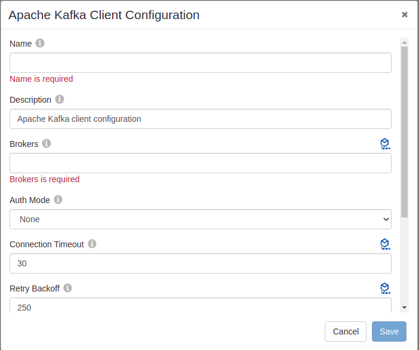
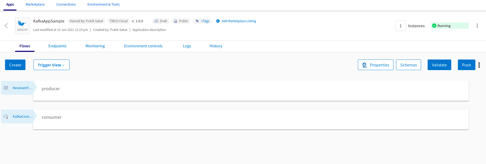
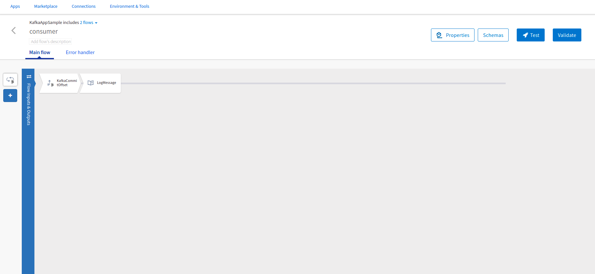
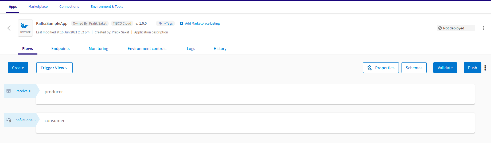

# Producing and Consuming message using Kafka connector.

## Description

This example demonstrate how we can send message using the Kafka producer activity and recieve the same message using Kafka consumer trigger.

The Producer flow produces a message on the mentioned topic, whenever the rest enpoint is triggered.
The Consumer flow has the consumer trigger which is listening to the mentioned topic and recieves the message whenever it is sent. Further, the 'commit offset' activity notifies the consumer to commit the offset and lastly the 'Log' activity is printing the recieved message. 

## Prerequisites

* Ensure that Apache Kafka Connector is already installed being an OOTB connector.
* Ensure that you have an active Kafka broker.

## Import the sample

1. Download the sample's .json file 'KafkaAppSample.json'

2. Create a new empty app.

3. On the app details page, select Import app.

4. Browse on your machine or drag and drop the .json file for the app that you want to import.

5. Click Upload. The Import app dialog displays some generic errors and warnings as well as any specific errors or warnings pertaining to the app you are importing. It validates whether all the activities and triggers used in the app are available in the Extensions tab.

6. You have the option to import all flows from the source app or selectively import flows.

7. If you choose selective import, select the trigger, flow and connection. Click Next.

8. Make sure you re-configure the connection as mentioned in 'Understanding the configuration' section

## Understanding the configuration

### The Connection
When you import this app, you need to configure the 'Kafkasample' connection in Connections page. It has pre-filled values. You need to change 'Brokers' url with yours.

Note: If you want to use the TIBCO Cloud Messaging - Kafka instance hosted on TCI, you can refer to the following doc for configuring the connection.

[Configuring the Connection.](https://integration.cloud.tibco.com/docs/#Subsystems/flogo-kafka/connector-users-guide/kafka-Connecting-to-TIBCO-Cloud-Messaging.html?TocPath=TIBCO%2520Flogo%25C2%25AE%2520Connectors%257CTIBCO%2520Flogo%25C2%25AE%2520Connector%2520for%2520Apache%2520Kafka%257CConfiguring%2520a%2520Kafka%2520Client%2520Connection%257C_____2)

### The Flows and Commit offset activity
If you open the app, you will see there are two flows in the KafkaAppSample app. The flow 'producer' and second flow 'consumer'.

The Producer flow produces a message on the mentioned topic, whenever the rest enpoint is triggered. REST trigger has method GET with path parameter 'pub'.

The Consumer flow has the consumer trigger which is listening to the mentioned topic and recieves the message whenever it is sent. Further, the 'commit offset' activity notifies the consumer to commit the offset and lastly the 'Log' activity is printing the recieved message.
Note: If 'commit offset' activity is not used the consumer commits the offset at the end of the flow.

### Run the application
For running the application, first you have to push the app and then scale up the app. Then after sometime you can see your app in running status.

Once it reaches to Running state, go to Endpoints, click on Test under Actions and for GET//pub, select 'Try it out'
YNow click Execute button.

If you want to test the sample in the Flow tester then follow below instructions:
Click on the MainFlowWithSFCreateCheckStatusJob flow, click on Test Button -> create Launch configuration -> click Next button -> click on Run

## Outputs

1. Sample Response when hit the endpoints

2. Sample Logs

3. Flow Tester Logs

## Troubleshooting

* If you do not see the Endpoint enabled, make sure your apps is in Running status.
* If you do not see user content screen, check if your browser is blocking pop-ups.
* if you see 401 Unauthorized error or token refresh error, re-configure the connection.

## Contributing
If you want to build your own activities for Flogo please read the docs here, [Flogo-docs](https://tibcosoftware.github.io/flogo/)

If you want to showcase your project, check out [tci-awesome](https://github.com/TIBCOSoftware/tci-awesome)

You can also send an email to `tci@tibco.com`

## Feedback
If you have feedback, don't hesitate to talk to us!

* Submit feature requests on our [TCI Ideas](https://ideas.tibco.com/?project=TCI) or [FE Ideas](https://ideas.tibco.com/?project=FE) portal
* Ask questions on the [TIBCO Community](https://community.tibco.com/answers/product/344006)
* Send us a note at `tci@tibco.com`

## Help
Please visit our [TIBCO Cloud&trade; Integration documentation](https://integration.cloud.tibco.com/docs/) and TIBCO Flogo® Enterprise documentation on [docs.tibco.com](https://docs.tibco.com/) for additional information.

## License
This TCI Flogo SDK and Samples project is licensed under a BSD-type license. See [license.txt](license.txt).
