# MQTT Send and Recieve messages over MQTT server Example

## Description

This example demonstrate how we can send the different type of messages to a topic and subscribes to a topic and log the messages received as output.

The flow in the MQTTPUBSUBSample app basically sends different types of messages like string, base64 and JSON to a different topics. The MQTT Subscriber Trigger subscribes to a different topics and presents the messages received as output. When the messages arrive, a new flow is triggered. The example having multiple trigger handlers using MQTT Subscriber.

## Prerequisites

* Ensure that TIBCO Flogo Connector for MQTT must be install.
* Before you create a connection, familiarize yourself with MQTT. You can establish the MQTT server and Client and generate the certificate authority file and client-server certificate to use two way authentication i,e encryption mode TLS-ClientAuth. For details about how to use the product, see MQTT documentation. 

## Import the sample

1. Download the sample's .json file 'MQTTPUBSUBSample.json'

2. Create a new empty app.

3. On the app details page, select Import app.

4. Browse on your machine or drag and drop the .json file for the app that you want to import.
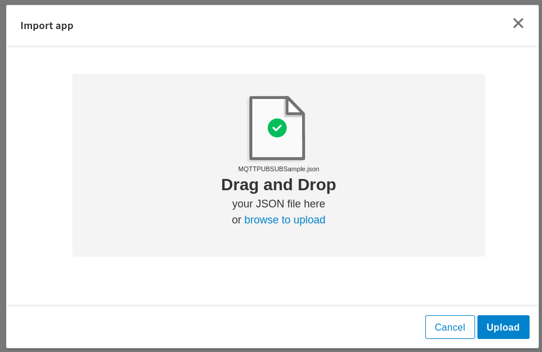

5. Click Upload. The Import app dialog displays some generic errors and warnings as well as any specific errors or warnings pertaining to the app you are importing. It validates whether all the activities and triggers used in the app are available in the Extensions tab.
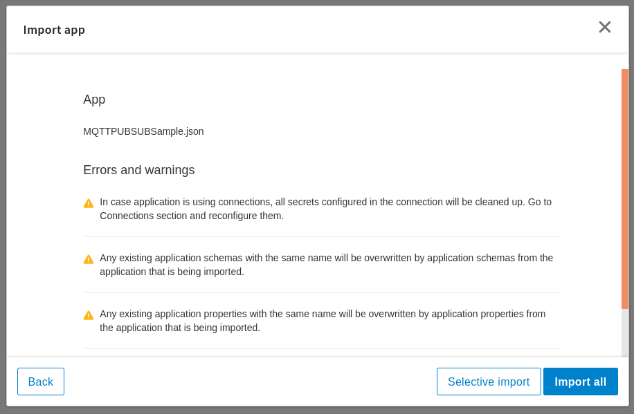

6. You have the option to import all flows from the source app or selectively import flows.

7. If you choose selective import, select the trigger, flow and connection. Click Next.

8. Make sure you re-configure the connection as mentioned in 'Understanding the configuration' section

## Understanding the configuration

### The Connection
When you import this app, you need to configure the 'MQTT' connection in Connections page. It has pre-filled values for all paramaters. But if you have an app with MQTT connection having username password required to authenticate the broker then after import such apps, password field will be empty as shown in below screenshot.

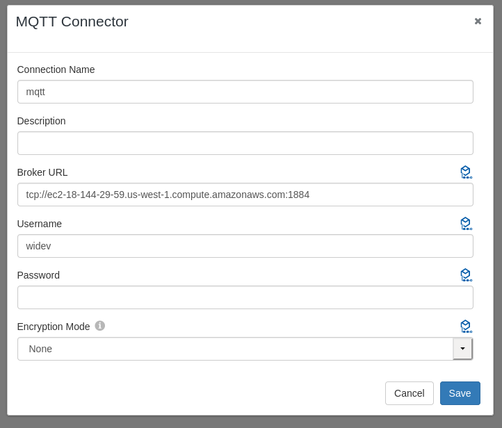

Note: After imported an app, in the imported connection under Connection tab,
* If in the MQTT connection username, password provided then after import such apps, password field is blank and user have to provide password field after import connection. 
* For the encryption mode TLS-ClientAuth, user have to provide CA certificate, Client certificate and Client key. In this example used TLS-Cert mode so just passed CA certificate.  
* For this sample, connection used with encryption mode TLS-Cert as the MQTT broker is ssl configured.

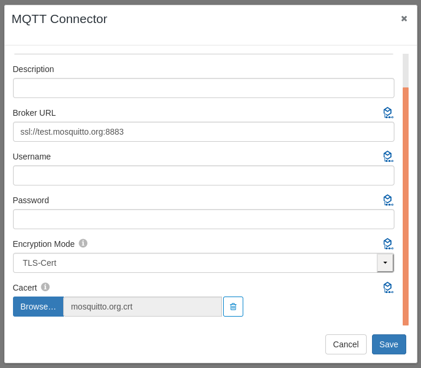

### The Flow and InvokeRestService activity
If you open the app, you will see there is one flow 'MQTTPUBSUB' in the MQTTPUBSUBSample app with four multiple triggers in it. 

The 'MQTTPUBSUB' flow in the MQTTPUBSUBSample app basically sends  different types of messages like string, base64 and JSON to a different topics using MQTT Pub activity. In the first MQTT pub activity for Base64 message Retain set as True to cause the server to retain this message for newly arriving subscribers. In the input tab, added stringValue in base64 format as we set Value Deserializer is Base64 in Setting tab. The same configuration we followed for other two MQTT Pub activities having Value Deserializer String and JSON.
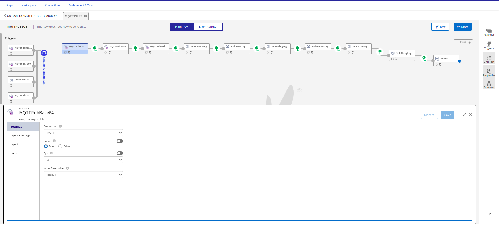

The MQTTSubBase64 trigger in the MQTTPUBSUB flow subscribes to a topic to which message published from 'MQTTPubBase64' activity and presents the messages received as output. Here Value Deserializer should be same as the value set while Publishing the message through MQTT Pub activity. For this trigger, Will fields are enable using Show Will Fields button and provided the values for each field like WillMessage, WillTopic, WillQOS, WillRetain. To see how Will fields work, see MQTT documentation. 
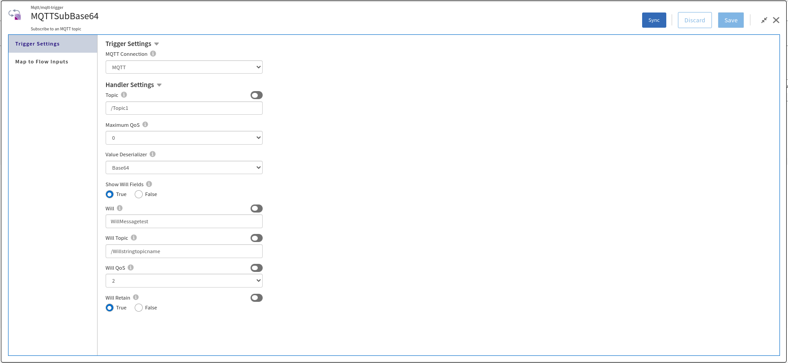

For the other MQTT Subscriber triggers MQTTSubJSON and MQTTSubString, configuration set according to respective MQTT Pub activities in the flow.

### Run the application
For running the application, first you have to push the app and then scale up the app. Then after sometime you can see your app in running status.
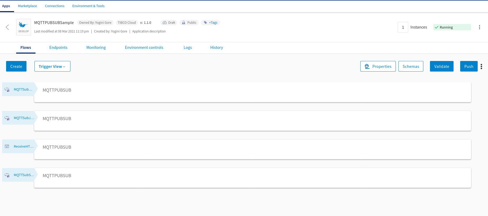

Once it reaches to Running state, go to Endpoints, click on Test under Actions and for GET//MQTTPub/output, select 'Try it out'
You will have to pass value for the path parameter 'output'. You can provide any string type value for 'output' parameter.
Now click Execute button.
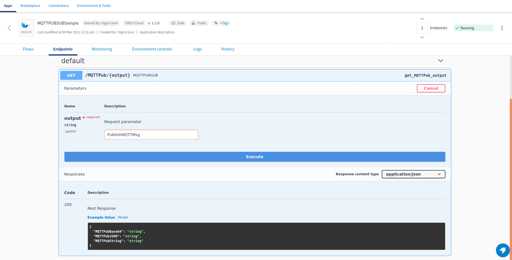

If you want to test the sample in the Flow tester then follow below instructions:
Click on the MQTTPUBSUB flow, click on Test Button -> create Launch configuration -> provide request schema in body parameter -> click Next button -> click on Run

## Outputs

1. Sample Response when hit the endpoints
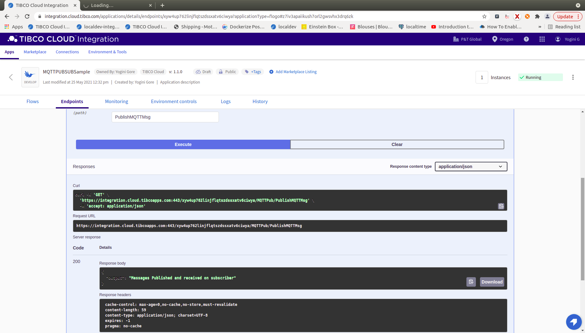

2. Sample Logs
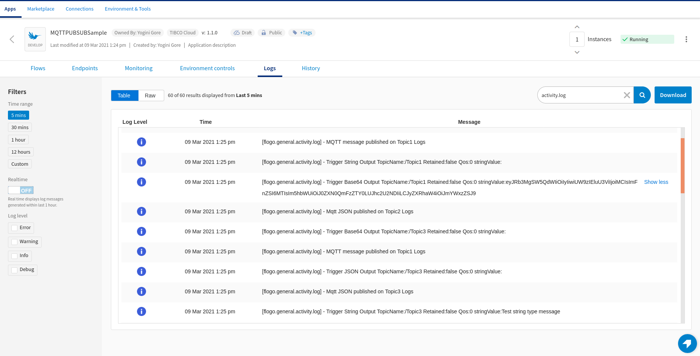

3. Flow Tester Logs
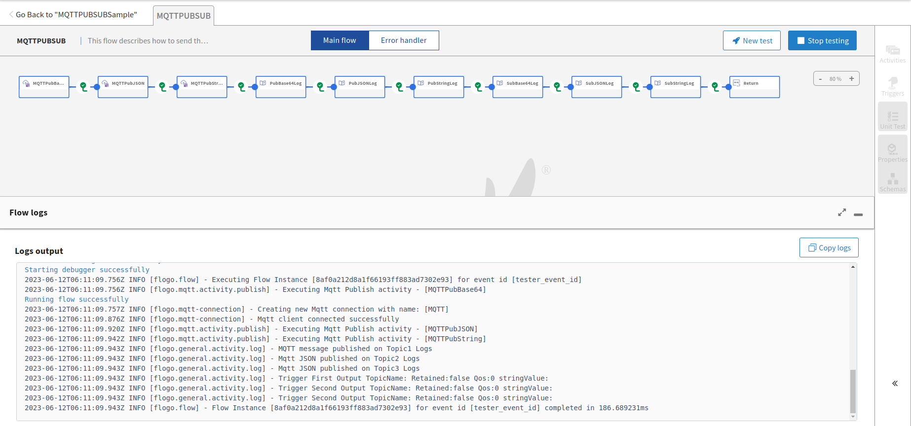

## Troubleshooting

* If you do not see the Endpoint enabled, make sure your apps is in Running status.
* If you do not see user content screen, check if your browser is blocking pop-ups.
* if you see 401 Unauthorized error or token refresh error, re-configure the connection.

## Contributing
If you want to build your own activities for Flogo please read the docs here, [Flogo-docs](https://tibcosoftware.github.io/flogo/)

If you want to showcase your project, check out [tci-awesome](https://github.com/TIBCOSoftware/tci-awesome)

You can also send an email to `tci@tibco.com`

## Feedback
If you have feedback, don't hesitate to talk to us!

* Submit feature requests on our [TCI Ideas](https://ideas.tibco.com/?project=TCI) or [FE Ideas](https://ideas.tibco.com/?project=FE) portal
* Ask questions on the [TIBCO Community](https://community.tibco.com/answers/product/344006)
* Send us a note at `tci@tibco.com`

## Help
Please visit our [TIBCO Cloud&trade; Integration documentation](https://integration.cloud.tibco.com/docs/) and TIBCO Flogo® Enterprise documentation on [docs.tibco.com](https://docs.tibco.com/) for additional information.

## License
This TCI Flogo SDK and Samples project is licensed under a BSD-type license. See [license.txt](license.txt).
