# Sample about Batching and Chunking feature in Apache Pulsar Connector.

## Description

This samples demonstrate a simple worflow about how pulsar publisher and consumer work through a flogo application using the Chunking and batching feature.

In Apache Pulsar, chunking refers to the process of breaking up large messages into smaller, more manageable pieces or "chunks." This can be particularly useful for handling large payloads that might exceed size limits.The consumer can reassemble these chunks back into the original message.
Batching in Apache Pulsar is a feature that allows messages to be sent and processed in groups, and on the consumer side, the consumer consumes it as an individual message.

For more details please visit:https://integration.cloud.tibco.com/docs/#Subsystems/flogo-pulsar/connector-users-guide/pulsar-overview.html?TocPath=TIBCO%2520Flogo%25C2%25AE%2520Connectors%257CTIBCO%2520Flogo%25C2%25AE%2520Connector%2520for%2520Apache%2520Pulsar%257C_____0 

## Prerequisites

* A pulsar broker running in any mode - TLS,OAUTH,JWT or plain.
* Depending on the mode and where your broker is running, you will have to configure the pulsar connection

## Import the sample

1. Download the sample's .json file 'PulsarChunkingApp.json','PulsarBatchingProducer.json' and 'PulsarBatchingConsumer.json'

2. Create a new empty app.

3. On the app details page, select Import app.

4. Browse on your machine or drag and drop the .json file for the app that you want to import.

5. Click Upload. The Import app dialog displays some general warnings and specific error in you app if any.

6. Make sure you re-configure the connection as mentioned in 'Understanding the configuration' section

## Understanding the configuration

### The Connection
When you import this app, you need to re-configure the 'pulsarConnection' connection in Connections page. 

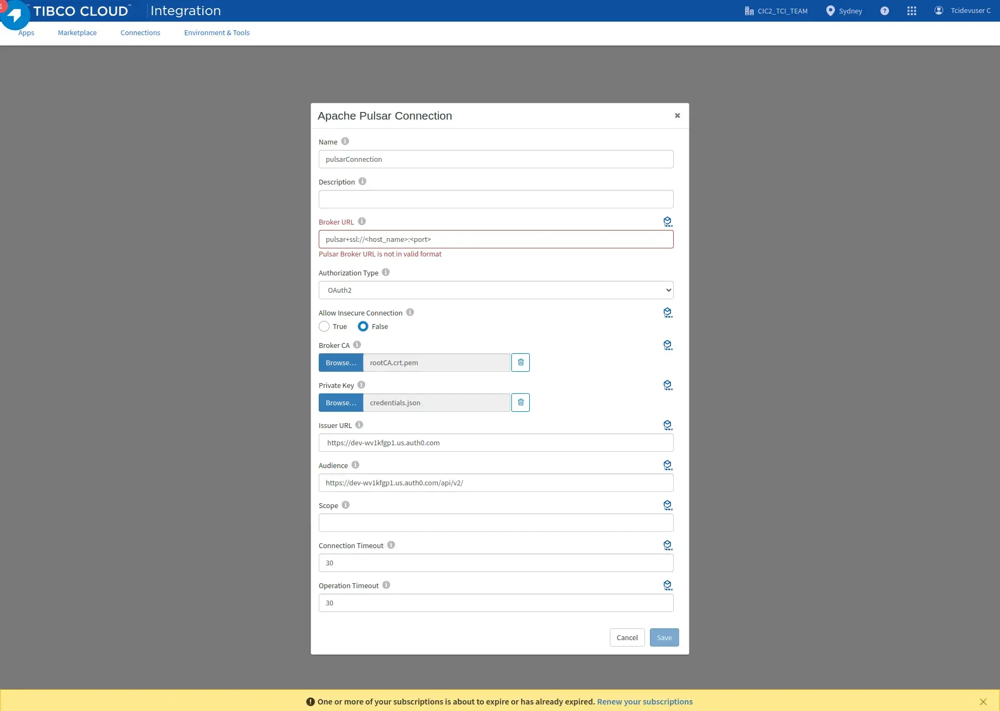

In the sample connection,
* It uses a pulsar broker running OAUTH mode. You can set the authorization type according to your broker flavour. If its running in plain mode, simply choose 'None' in 'auth type' dropdown.
* In TLS,OAUTH or JWT auth types, broker URL requires 'pulsar+ssl' in the beginning of the URL. In plain mode, only 'pulsar' is required.
* Update the Broker URL and certificates in the connection if using TLS,OAUTH mode. Refer to Pulsar Security documentation to get the idea about auth types and creating certificates- https://pulsar.apache.org/docs/en/security-overview  
For more information on connection fields, please refer to https://integration.cloud.tibco.com/docs/index.html#Subsystems/flogo-pulsar/connector-users-guide/pulsar-connection-details.html
* Connecting to Pulsar hosted on Tibco Cloud Messaging - You can also connect to the pulsar TCM instance by configuring Pulsar Connection using tcm-config.yaml. In this case you need to use Autorization type as JWT and use the tcm_authentication_key as the JWT token. You can get the broker url and namespace from the same tcm-config.yaml.
Please refer to - https://messaging.cloud.tibco.com/docs/getstarted/quickstart-pulsar/index.html

### The Producer and Consumer Flows

In the samples, we have 3 applications: 1.PulsarChunkingApp. 2.PulsarBatchingProducer.json, and  3.PulsarBatchingConsumer.json

PulsarChunkingApp: This sample has two flows. The first is 'Pulsar-producer', which publishes messages to a persistent Pulsar topic using the chunking feature and returns the payload of published messages, and the other flow has a Pulsar consumer trigger, which listens to the same topic using a Pulsar subscription and aggregates all the chunks and receives the original message.

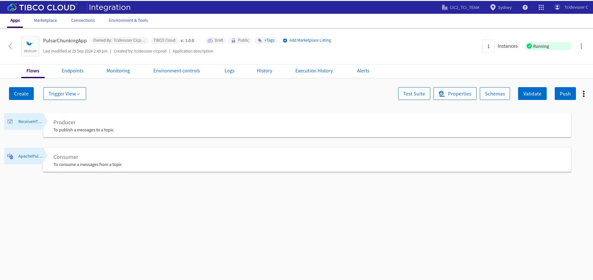
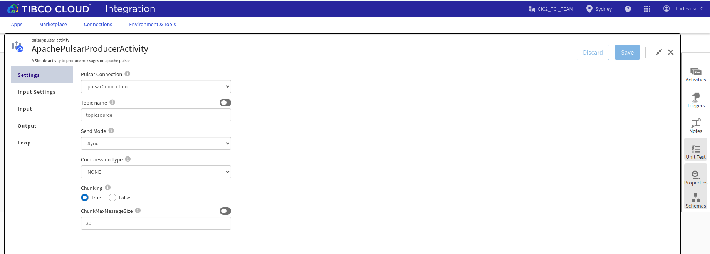

PulsarBatchingProducer:The producer flow produces a message on the mentioned topic, whenever the rest enpoint is triggered. REST trigger has method GET.In this sample for batching Pulsar-producer', which publishes messages in batches to a persistent Pulsar topic and returns the payload of published messages.

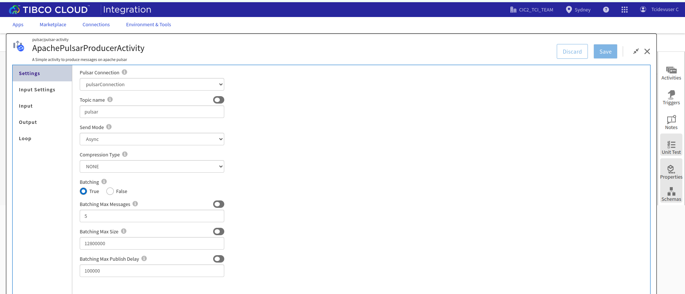

PulsarBatchingConsumer:The Consumer flow has the consumer trigger which is listening to the mentioned topic and recieves the message whenever it is sent. In this consumer application has a Pulsar consumer trigger, which listens to the same topic using a Pulsar subscription and receives the batch of messages together.
the consumer consumes it as an individual message.

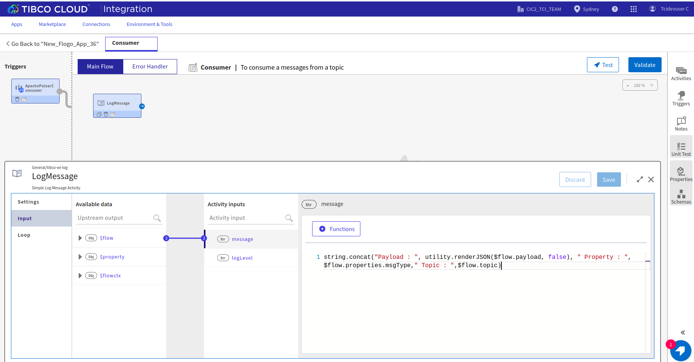
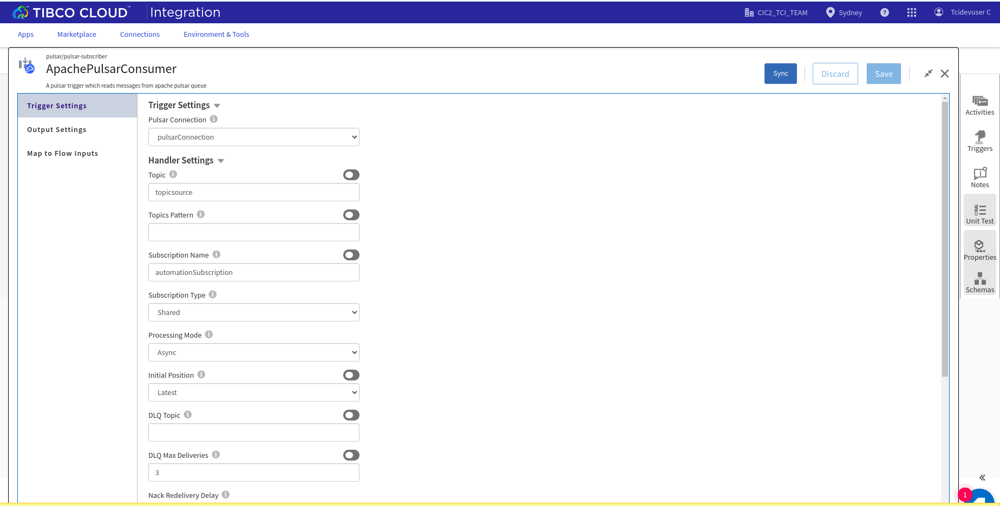

To publish messages to a topic, it accepts the messages that you want to send from the HTTP trigger along with your message. Then the PulsarPublisher activity sends a given message to a topic defined in its 'Settings'.

The Settings tab has the specified connection and the topic name with an optional compression type and also send mode. And also, you can see the chunking option is there.When you select send mode as an 'async', then you can see the batching option is there.
  
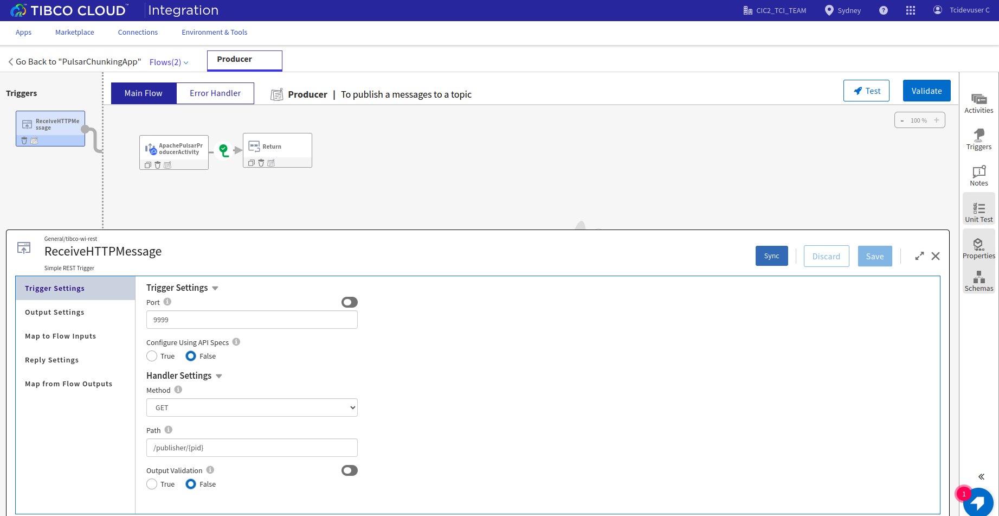
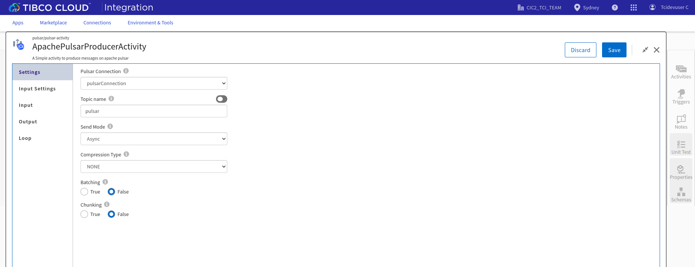

Here we are sending the messages in JSON format which is set in the Input Settings along with a message property 'message_type'
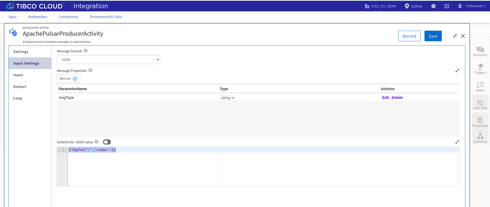

You can map the actual message and the message properties in the Input tab. It retruns the number of messages published with message payload.

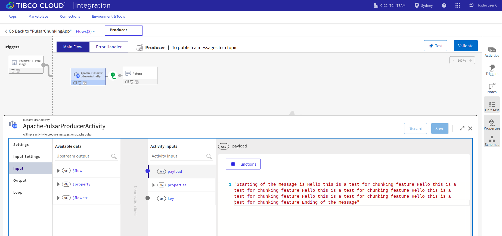

Also you can override the client cert and client key using app property support.

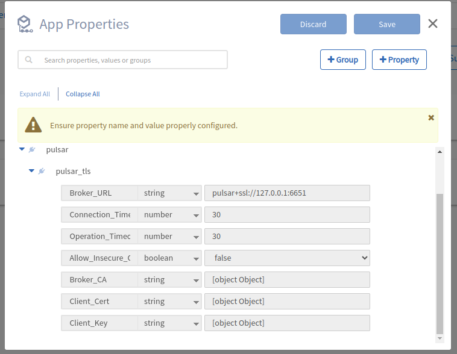
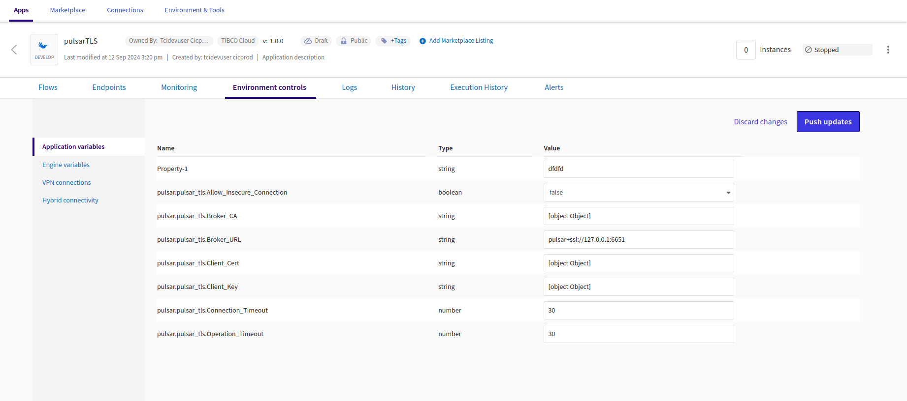

To receive the message using the chunking and batching feature, it has a consumer trigger flow that subscribes to the same topic using a subscription name to process the incoming messages. You can set the subscription type and processing mode according to your choice in the trigger setting.  
For information on trigger settings please refer to https://integration.cloud.tibco.com/docs/index.html#Subsystems/flogo-pulsar/connector-users-guide/pulsar-consumer-trigger.html

When there is a new message, the consumer triggers get extecuted and it prints the message payload, properties, topic name and the message id of received message using a log activity.

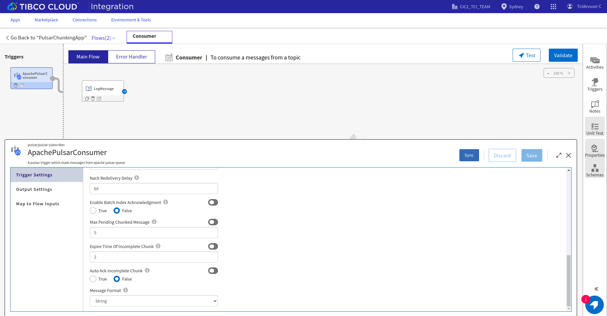

### Run the application

Once you are ready to run the application, you can use the Push option and later run this app.
Once it reaches to Running state, go to Endpoints, click on Test under Actions and select 'Try it out' for /publisher/{pid}
Now enter the number of messages you want to send.

Now click Execute button.
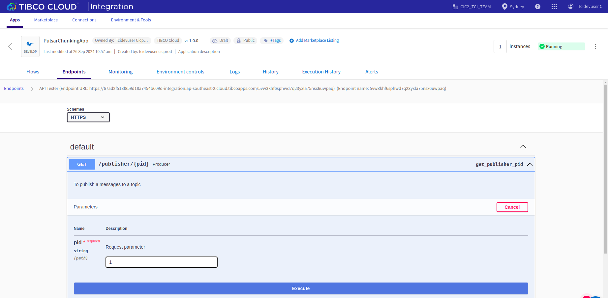

You can hit the endponit using jmeter also.
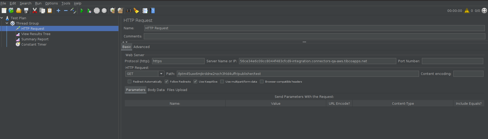

## Outputs

1. Response when hit the endpoints
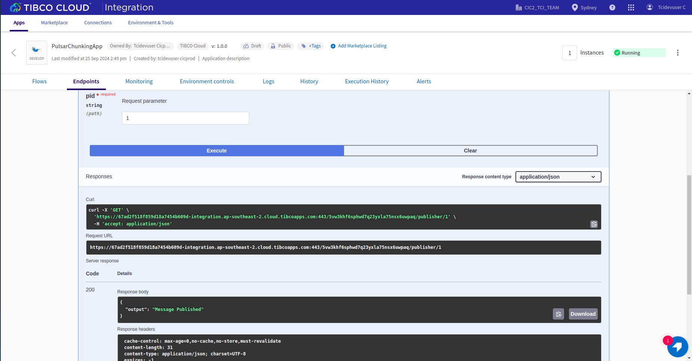

2. Receieve Message Logs for Chunking.
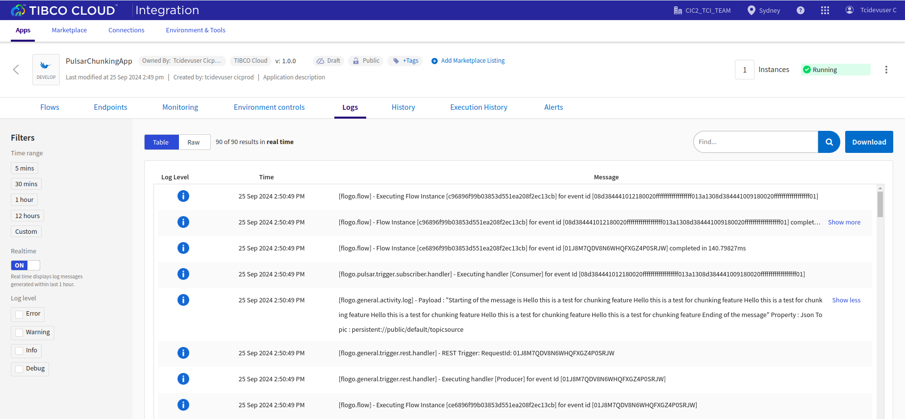

3. In the DEBUG logs you can see the entry id for each and every chunks.
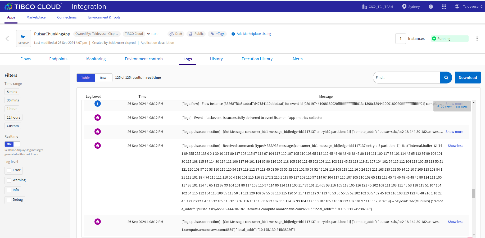
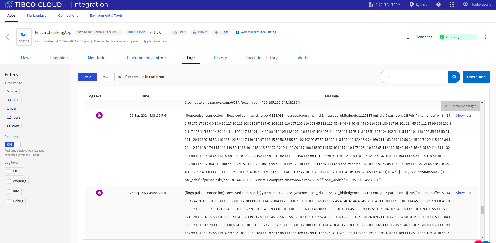

4. Receieve Message Logs for Batching
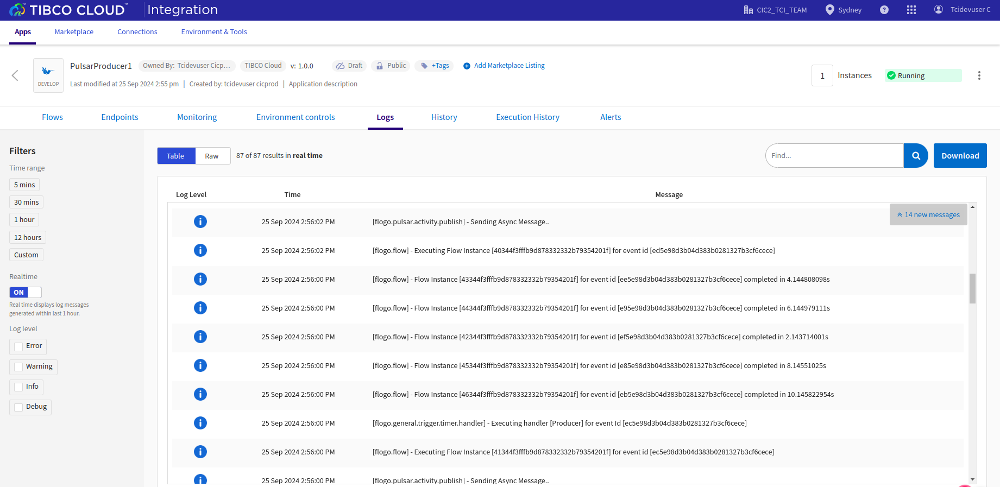
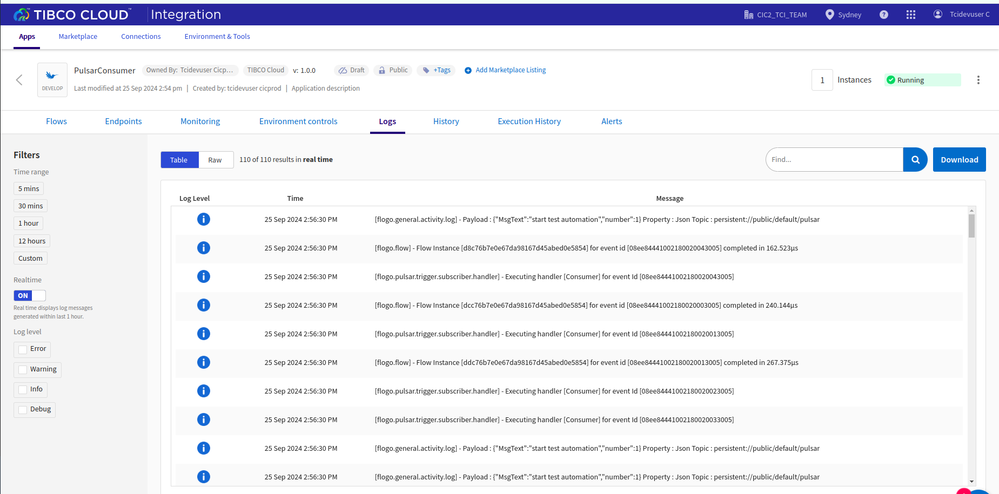

## Troubleshooting

* If you do not see the Endpoint enabled, make sure your apps is in Running status.
* If your app is going into Failure state, make sure your pulsar broker is reachable to your client machine.

## Contributing
If you want to build your own activities for Flogo please read the docs here, [Flogo-docs](https://tibcosoftware.github.io/flogo/)

If you want to showcase your project, check out [tci-awesome](https://github.com/TIBCOSoftware/tci-awesome)

You can also send an email to `tci@tibco.com`

## Feedback
If you have feedback, don't hesitate to talk to us!

* Submit feature requests on our [TCI Ideas](https://ideas.tibco.com/?project=TCI) or [FE Ideas](https://ideas.tibco.com/?project=FE) portal
* Ask questions on the [TIBCO Community](https://community.tibco.com/answers/product/344006)
* Send us a note at `tci@tibco.com`

## Help
Please visit our https://integration.cloud.tibco.com/docs/ and TIBCO Flogo® Enterprise documentation on https://docs.tibco.com/ for additional information.

## License
This TCI Flogo SDK and Samples project is licensed under a BSD-type license. See [license.txt](license.txt).
