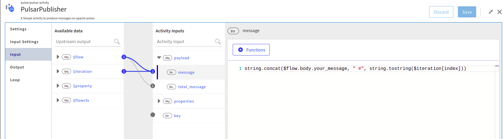
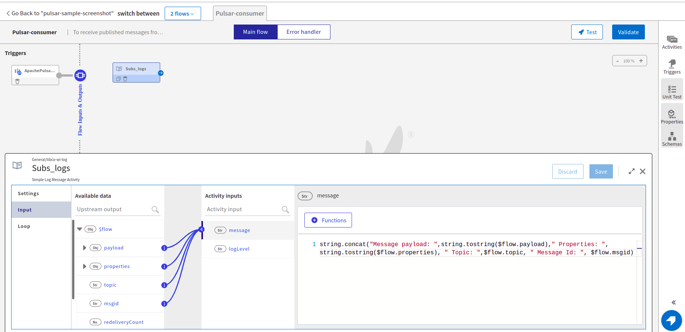
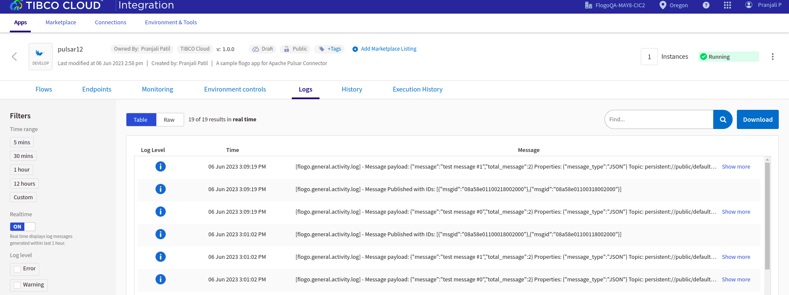

# Flogo Application sample for Apache Pulsar Connector

## Description

This sample demonstrate a simple worflow about how pulsar publisher and consumer work through a flogo application.

The sample application has two flows - first is 'Pulsar-producer' which publishes some messages to a persitent pulsar topic and returns the ids of published messages and the other flow has pulsar consumer trigger which listens to the same topic using a pulsar subscription and processes the incoming message.

## Prerequisites

* A pulsar broker running in any mode - TLS, JWT or plain.
* Depending on the mode and where your broker is running, you will have to configure the pulsar connection

## Import the sample

1. Download the sample's .json file 'Flogo_pulsar_sample.json'

2. Create a new empty app.

3. On the app details page, select Import app.

4. Browse on your machine or drag and drop the .json file for the app that you want to import.

5. Click Upload. The Import app dialog displays some general warnings and specific error in you app if any.

6. You have the option to import all flows from the source app or selectively import flows.

7. If you choose selective import, select the trigger, flow and connection. Click Next.

8. Make sure you re-configure the connection as mentioned in 'Understanding the configuration' section

## Understanding the configuration

### The Connection
When you import this app, you need to re-configure the 'flogo_pulsar_TLS' connection in Connections page. 

In the sample connection,
* It uses a pulsar broker running TLS mode. You can set the authorization type according to your broker flavour. If its running in plain mode, simply choose 'None' in 'auth type' dropdown.
* In TLS or JWT auth types, broker URL requires 'pulsar+ssl' in the beginning of the URL. In plain mode, only 'pulsar' is required.
* Update the Broker URL and certificates in the connection if using TLS mode. Refer to Pulsar Security documentation to get the idea about auth types and creating certificates- https://pulsar.apache.org/docs/en/security-overview  
For more information on connection fields, please refer to https://integration.cloud.tibco.com/docs/index.html#Subsystems/flogo-pulsar/connector-users-guide/pulsar-connection-details.html
* Connecting to Pulsar hosted on Tibco Cloud Messaging - You can also connect to the pulsar TCM instance by configuring Pulsar Connection using tcm-config.yaml. In this case you need to use Autorization type as JWT and use the tcm_authentication_key as the JWT token. You can get the broker url and namespace from the same tcm-config.yaml.
Please refer to - https://messaging.cloud.tibco.com/docs/getstarted/quickstart-pulsar/index.html

### The Producer and Consumer Flows
The application contains two flows; a Pulsar-producer and a Pulsar-consumer flow

To publish the mesages to a topic, it accepts the number of messages that you want to send from the HTTP trigger along with your message. Then PulsarPublisher activity iterate using the Loop settings and sends given number of messages to a topic defined in its 'Settings'.
Settings tab has the specified connection and the topic name with optional compression type.  

Here we are seinding the messages in JSON format which is set in the Input Settings along with a message property 'message_type'

You can map the actual message and the message properties in the Input tab. It retruns the number of messages published with message ids.

To receive the messages, it has a consumer trigger flow which subscribes to the same topic using a subscription name to process the incoming messages. You can set the subscription type and processing mode according to your choice in the trigger setting.  
For information on trigger settings please refer to https://integration.cloud.tibco.com/docs/index.html#Subsystems/flogo-pulsar/connector-users-guide/pulsar-consumer-trigger.html
When there is a new message, the consumer triggers get extecuted and it prints the Message payload, properties and the topic name using a log activity.

### Run the application
Once you are ready to run the application, you can use the Push option and later run this app.
Once it reaches to Running state, go to Endpoints, click on Test under Actions and select 'Try it out' for POST/publish
Now enter the number of messages you want to send and a value of 'you_message' in the post body.
Now click Execute button.

## Outputs

1. Response when hit the endpoints

2. Receieve Message Logs

## Troubleshooting

* If you do not see the Endpoint enabled, make sure your apps is in Running status.
* If your app is going into Failure state, make sure your pulsar broker is reachable to your client machine.

## Contributing
If you want to build your own activities for Flogo please read the docs here, [Flogo-docs](https://tibcosoftware.github.io/flogo/)

If you want to showcase your project, check out [tci-awesome](https://github.com/TIBCOSoftware/tci-awesome)

You can also send an email to `tci@tibco.com`

## Feedback
If you have feedback, don't hesitate to talk to us!

* Submit feature requests on our [TCI Ideas](https://ideas.tibco.com/?project=TCI) or [FE Ideas](https://ideas.tibco.com/?project=FE) portal
* Ask questions on the [TIBCO Community](https://community.tibco.com/answers/product/344006)
* Send us a note at `tci@tibco.com`

## Help
Please visit our [TIBCO Cloud&trade; Integration documentation](https://integration.cloud.tibco.com/docs/) and TIBCO Flogo® Enterprise documentation on [docs.tibco.com](https://docs.tibco.com/) for additional information.

## License
This TCI Flogo SDK and Samples project is licensed under a BSD-type license. See [license.txt](license.txt).
