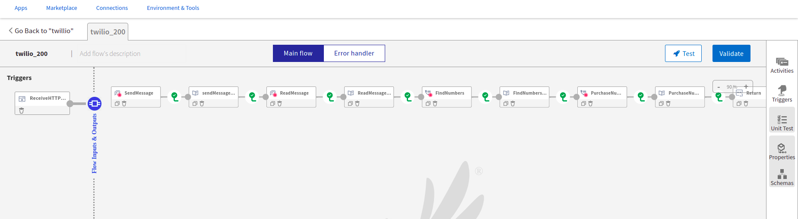
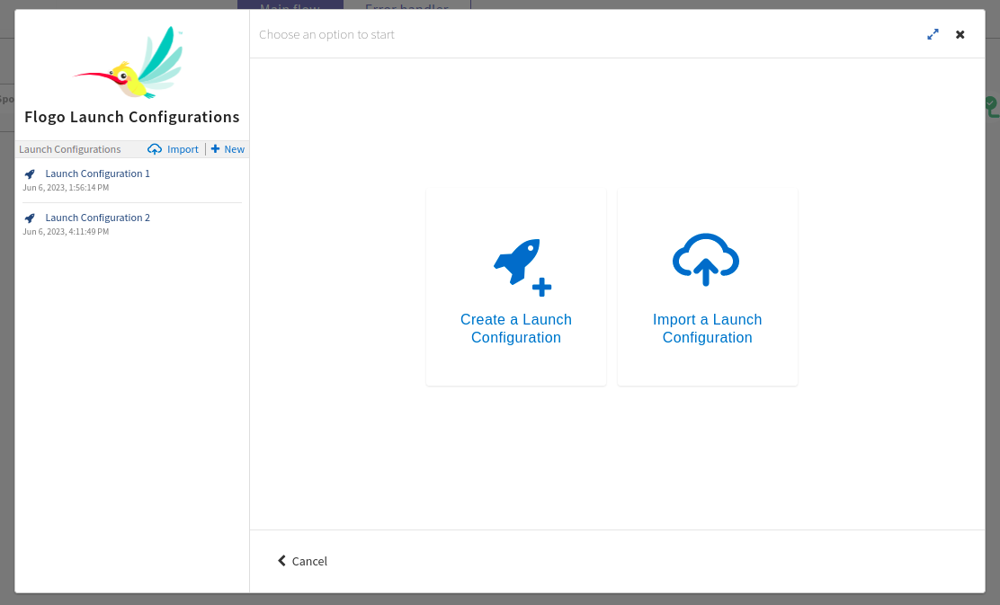
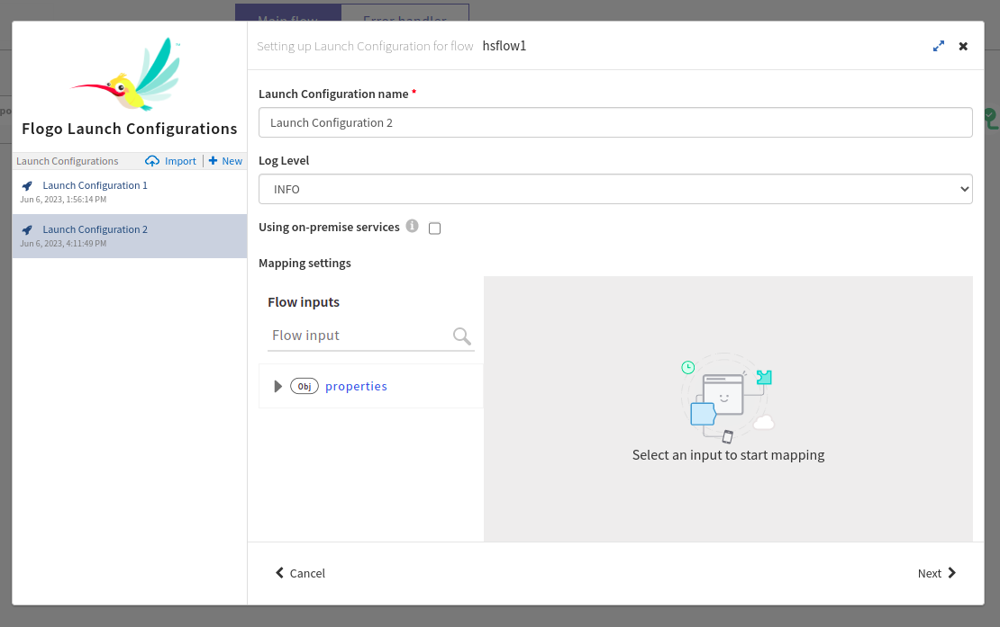
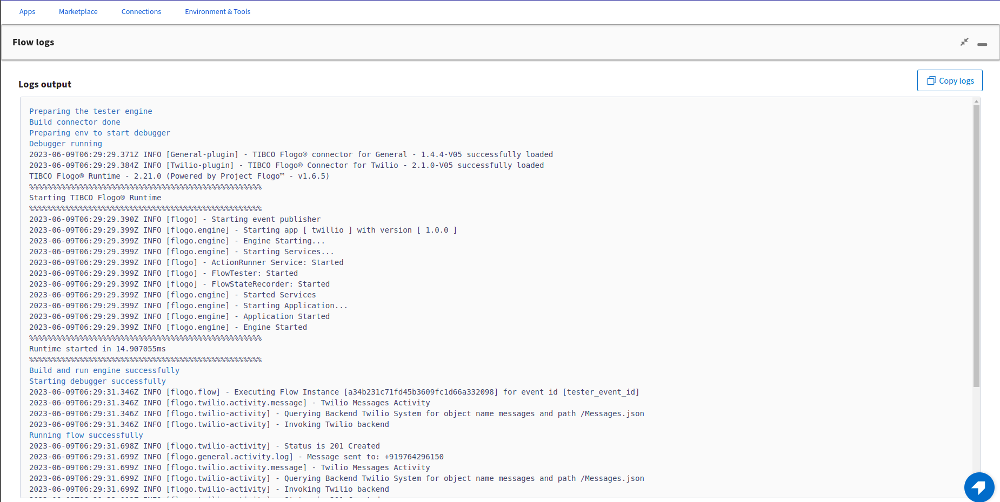

# Twilio Sample for creating and using Message and Numbers activity

## Description

This example demonstrate how we can create and use Twilio Message and Twilio Number activities.
Twilio app bascially contains 2 activities. The main purpose of these activities are to send and read messages using Twilio Message Activity and to find available numbers and purchase number using Twilio Number activity.

NOTE:- There are two kind of credentials LIVE & TEST credential for twilio account. You can use TEST credentials on test environment for 'Send Message' and 'Purchase Number' activity.

## Prerequisites

1. You need to make sure that you have a active twilio account and a valid twilio number using which you will be performing send and read message actions.
2. To perform actions using your twilio number you need to have LIVE account credentials as well as TEST account credentials(Account SID & Auth token), which you can find in your twilio account details.
3. Before configuring connection user should have knowledge on Twilio features, Please refer this TCI documentation - [Link](https://integration.connectors-qa-aws.tcie.pro/docs/#tci/flogo-connectors/Twilio/index.html?TocPath=TIBCO%2520Flogo%25C2%25AE%2520Connectors%257C_____62)

## Import the sample

1. Download the sample json file i.e., twilio_sample.json.

2. Create a new empty app

3. On the app details page, select import app option.

4. Now click on ‘browse to upload’ button and select the app.json from your machine that you want to import.

5. Click on Upload Button. The Import app dialog displays some generic errors and warnings as well as any specific errors or warnings pertaining to the app you are importing.

6. In Import App dialog, there are 2 options to import:

* Selective Import – If you are choosing this option then select trigger, flow and connection and click Next.

* Import all – If you are choosing this option then it will import all flows from the source app.

7. After importing app is done, in connection tab make sure to re-enter the Auth token and click on connect button to establish the connection.

## Understanding the configuration

### The Connection

When you import the app you need to re-enter the Auth token and establish the connection.

When configuring Twilio TEST connection you need to set Test Credential boolean value to TRUE and provide TEST connection Account SID and Auth Token.

When configuring Twilio LIVE connection you need to set Test Credential boolean value to False and provide LIVE connection Account SID and Auth Token.

In the connection, note that,
1. Account SID - In this field we provide the Account SID that is available in Twilio account details for TEST and LIVE accounts.
2. Auth Token - This is also available within the twilio account and this value will be encrypted on the UI.
3. Connection Timeout - This is the duration for which the server will wait to setup the connection, if it does not respond within provided time then the connection setup is failed.

### The Flow

If you go inside the app, you can see in flow we have 4 activities to perform Send/Recieve Messages and Find/Purchase available numbers.
Also in flow we have Log Message and Return Activity for getting the output.

### TEST CONNECTION
TEST CONNECTION can perform only send message and purchase number actions.

In Send Message activity, select the twilio connection(using TEST connection in this sample) and the action is selected by default as Send Message for TEST connection.   

In input tab, provide your twilio number and the reciever's number along with the message body to be sent.

In Purchase number activity, select the twilio connection(using TEST connection in this sample) and the action is selected by default as Purchase Number for TEST connection.  

In input tab, provide the number to be purchased.

### LIVE CONNECTION
LIVE CONNECTION can perform all the action performed by TEST connection and some additional functions like Read Mesaage and Find Available Numbers.

In READ MESSAGE select the LIVE connection and select the action as Read Message.

Provide value to one of the below criteria to retrieve the message.

In FIND AVAILABLE NUMBERS activity select the LIVE connection as above and select Find available numbers action from the action dropdown. 
In Input tab, provide values as asked to get the number.
ISOCountryCode : Provide the contry code (For example: 'US' for USA)
ISOType : Local or ISD
Contains : If you wish some digits to be of your choice you can provide it here.

### Run the application
For running the application, first you have to push the app and then scale up the app.
Then after sometime you can see your app in running status.

Once your app reaches to Running state, go to Endpoints and for GET/tasks, select 'Try it Out’ option and then click on execute.

Another option, If you want to test the sample in the Flow tester then follow below instructions:
 
in flow, click on Test Button -> create Launch configuration -> click Next button -> click on Run

## Outputs

1. Flow Tester

2. When hit endpoints

## Troubleshooting

* If you do not see the Endpoint enabled, make sure your apps is in Running status.
* If you see Invalid Credentials check if Test Connection boolean value is set as expected for LIVE and TEST connection. 

## Contributing
If you want to build your own activities for Flogo please read the docs here.

If you want to showcase your project, check out [tci-awesome](https://github.com/TIBCOSoftware/tci-awesome)

You can also send an email to `tci@tibco.com`

## Feedback
If you have feedback, don't hesitate to talk to us!

* Submit feature requests on our [TCI Ideas](https://ideas.tibco.com/?project=TCI) or [FE Ideas](https://ideas.tibco.com/?project=FE) portal
* Ask questions on the [TIBCO Community](https://community.tibco.com/answers/product/344006)
* Send us a note at `tci@tibco.com`

## Help
Please visit our [TIBCO Cloud&trade; Integration documentation](https://integration.cloud.tibco.com/docs/) and TIBCO Flogo® Enterprise documentation on [docs.tibco.com](https://docs.tibco.com/) for additional information.

## License
This TCI Flogo SDK and Samples project is licensed under a BSD-type license. See [license.txt](license.txt).

