# Example of Websocket activities to send and receive messages over a Websocket connection using different modes

## Description

This example demonstrate how we can send the JSON message to Websocket Server using Websocket Client activity. In this case Websocket Server is configured with Data mode to read data on the Websocket connection and receives the messages sent by Websocket Client.

Also this example explains how to receive the message sent by Websocket Server to Websocket Subscriber trigger which acts as a Websocket Client. In this case Websocket Server is configured with Connection mode to provide the trigger output as the Websocket connection and that already created connection by the Websocket Server trigger used as an input in the following Websocket Write Data activity to write data on an already created Websocket connection. Websocket Subscriber trigger subscribes to Websocket server to read message sent by Websocket Server using Write Data activity.

## Prerequisites

* Before you proceed with this connector, familiarize yourself with Websocket. For details about how to use the product, see TIBCO Flogo® Connector for Websocket documentation. 

## Import the sample

1. Download the sample's .json files 'WebsocketClients.json' and 'WebsocketServer.json'

2. Create a new empty app.

3. On the app details page, select Import app.

4. Browse on your machine or drag and drop the .json files for the app that you want to import.
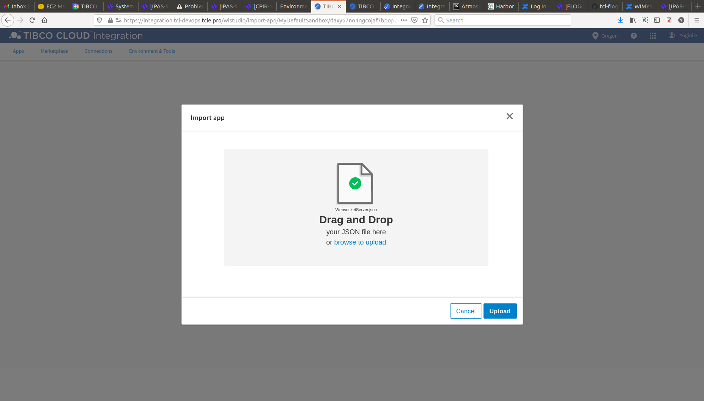
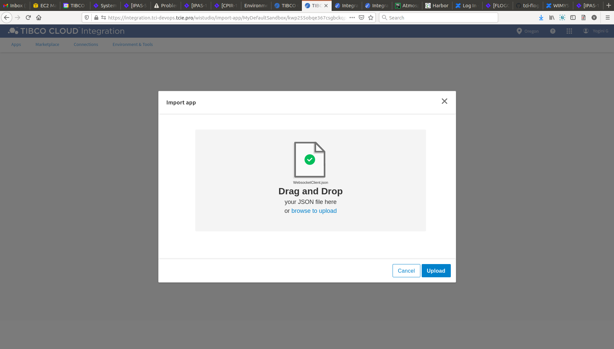

5. Click Upload. The Import app dialog displays some generic errors and warnings as well as any specific errors or warnings pertaining to the app you are importing. It validates whether all the activities and triggers used in the app are available in the Extensions tab.
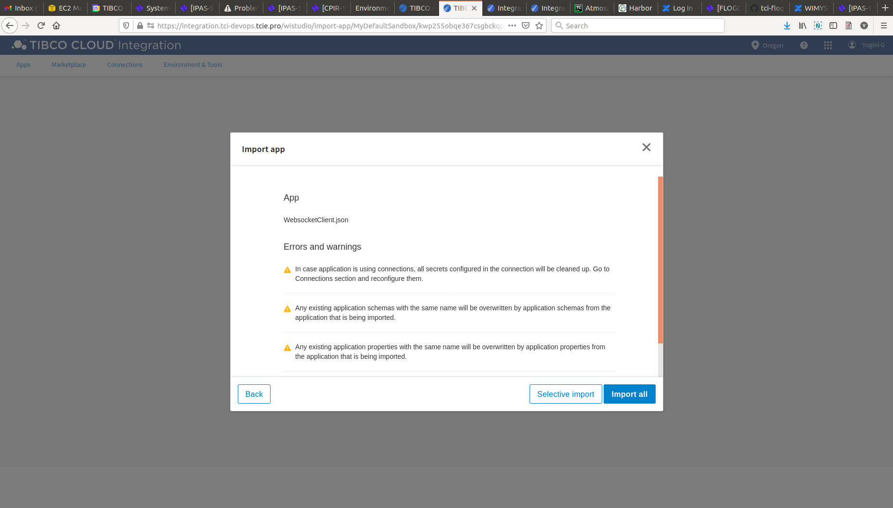

6. You have the option to import all flows from the source app or selectively import flows.

7. If you choose selective import, select the trigger, flow and connection. Click Next.

8. Make sure you re-configure the connection as mentioned in 'Understanding the configuration' section

## Understanding the configuration

### The Flows and REST Trigger
If you open the 'WebsocketServer' app, you will see there are two flows 'WSServerDataMode' and 'WSServerConnectionMode'. 
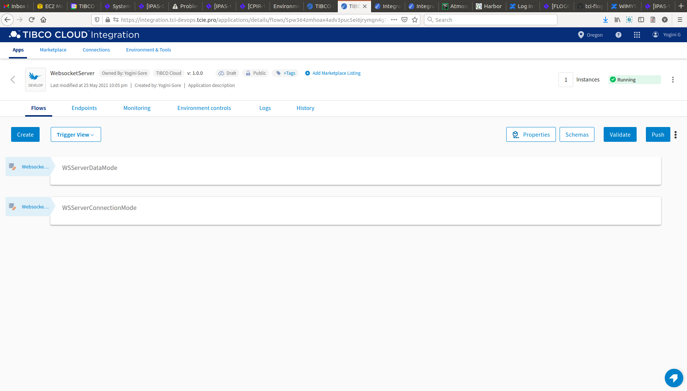

The 'WSServerDataMode' flow in the 'WebsocketServer' app have Websocket Server trigger configured with default port, URI Path and Mode is Data with message format JSON. Here used Data mode to read data on the Websocket connection sent by Websocket Client activity added in other app 'WebsocketClients'. Message format is JSON in Server trigger so it will only accept JSON format message from Websocket Client. The server trigger in this flow also configured with Required Query parameters and Headers of type String in Output Settings tab. Headers set as Repeating to accept the array values from Websocket Client activity. The following activity used is Log message to print the message sent by Websocket Client in server logs.
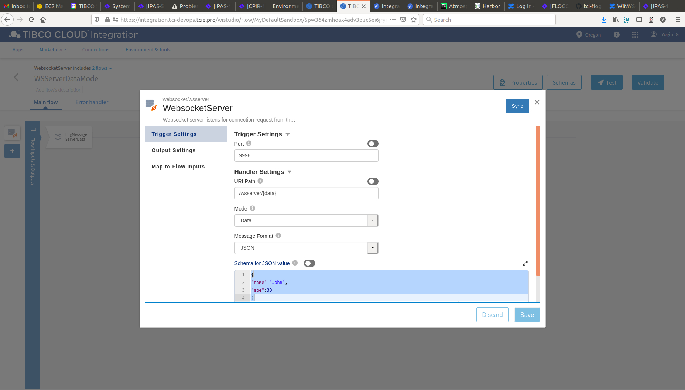

The 'WSServerConnectionMode' flow in the 'WebsocketServer' app have Websocket Server trigger configured with different port and URI Path than used in 'WSServerDataMode' flow. Here used Connection mode to provide the trigger output Websocket connection as the input to the Write Data activity. The server trigger in this flow also configured with Required Query parameters of type number and Headers of type boolean in Output Settings tab. Query parameters set as Repeating to accept the array values from Websocket Subscriber activity. 
Following is the Write Data activity to write String type of message on an already created Websocket connection. You can send string message to Websocket Subscriber which is Websocket Client only and map the already created connection by the Websocket Server trigger as an input in Input tab of the activity.
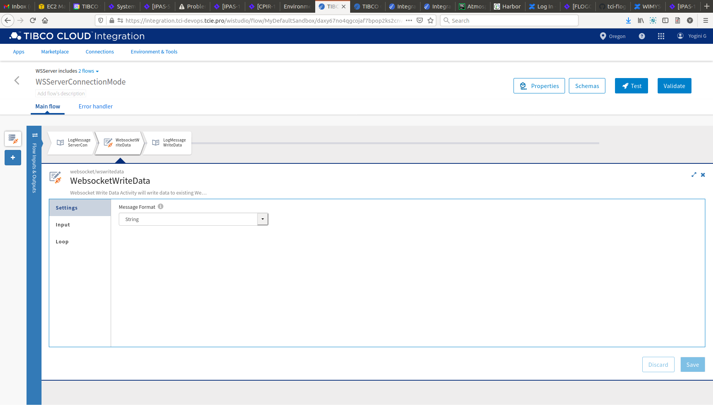

Once 'WebsocketServer' app is ready, push this app. You will see two different Service names are listed for each Websocket Server trigger i,e 'WebsocketServer' and 'WebsocketServer1'. These endpoints are used to configure URI field in Websocket Client and Subscriber as described below in the second 'WebsocketClients' app.

Now when you import  other 'WebsocketClients' app, you will see there are two flows 'WSClient' and 'WSSubscriber'. 
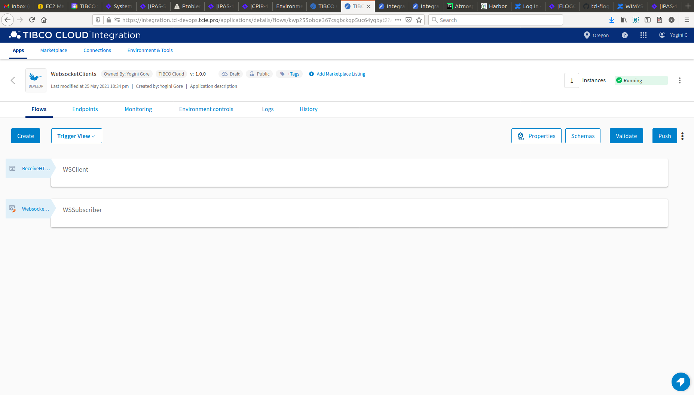

The 'WSClient' flow in the 'WebsocketClients' app have REST trigger with POST and Websocket Client activity configured to send message in the form of JSON because the server that we have configured in 'WSServerDataMode' flow in the 'WebsocketServer' app accept JSON message only. Then in URI field provide the endpoint URI of 'WebsocketServer' copied from Endpoints tab of 'WebsocketServer' app along with path parameter mentioned in 'WSServerDataMode' flow in the 'WebsocketServer'app. As query parameters and headers are set as Required in 'WSServerDataMode' flow, add same query params and headers in Websocket Client activity in Input Settings tab and provide respective values in Input tab. We have to map message field in Input tab of Client activity with REST output that needs to be sent to server. Following is the Log message activity to print some message for logging purpose. 

The 'WSSubscriber' flow in the 'WebsocketClients' app have Websocket Subscriber trigger configured to receive the message sent from Websocket Server trigger configured in 'WSServerConnectionMode' flow in the 'WebsocketServer' app . Then in URI field provide the endpoint URI of 'WebsocketServer1' copied from Endpoints tab of 'WebsocketServer' app along with path parameter mentioned in 'WSServerConnectionMode' flow in the 'WebsocketServer' app. As query parameters and headers are set as Required in 'WSServerConnectionMode' flow, add same query params and headers in Websocket Subscriber trigger in Trigger Settings tab and provide multiple values for Repeating query parameters separated by a comma without space. You have to map the trigger output to flow input. The following activity used is Log message to print the message sent by Websocket Server in subscriber logs.
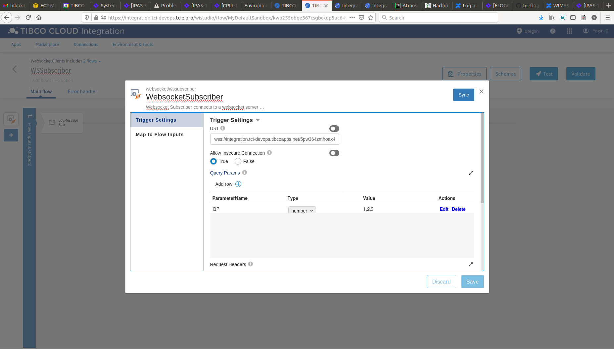

### Run the application
For running both the application, first you have to push 'WebsocketServer' app and then scale up the app. Then after sometime you can see your app in running status. 
Once it reaches to Running state, go to Endpoints, you will see two different Service names are listed for each Websocket Server trigger used in the 'WebsocketServer'app i,e 'WebsocketServer' and 'WebsocketServer1'. These endpoints are used to configure URI field in Websocket Client and Subscriber as described in the second 'WebsocketClients' app under Flows and REST Trigger section. 
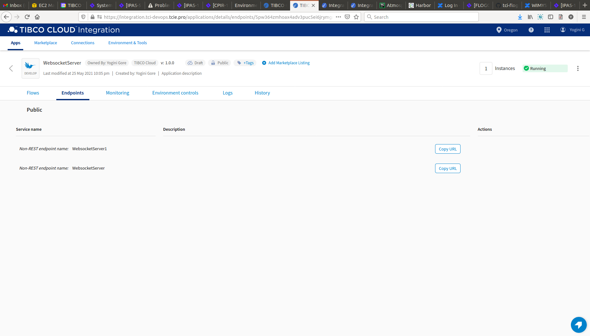

Now after 'WebsocketServer' app is running, you have to push 'WebsocketClients' app and then scale up the app.Then after sometime you can see your app in running status. Once app goes into running state you can see message sent by Websocket Server is received to Subscriber and printed in logs of 'WebsocketClients' app. 
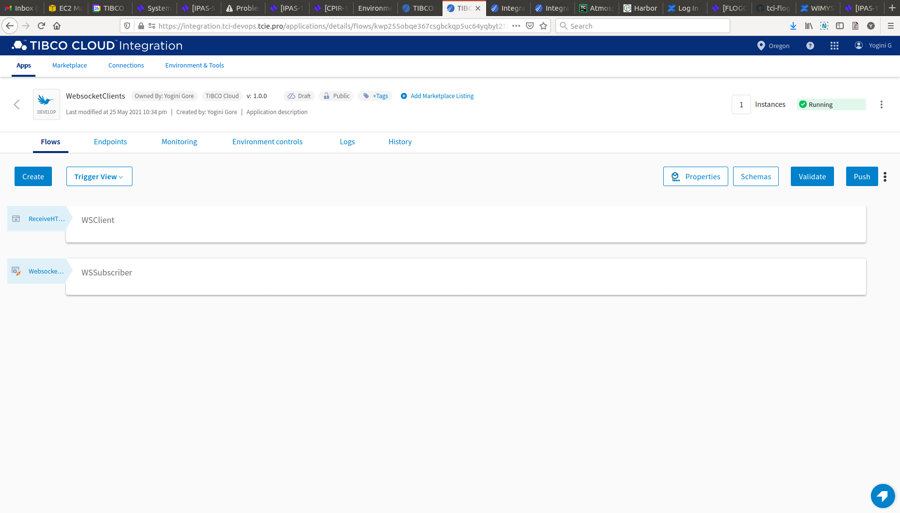

Once it reaches to Running state, go to Endpoints, click on Test under Actions and for POST​/message, select 'Try it out'.
You will have to pass value for the request body parameter 'Message' in JSON format. 
Now click Execute button. Once this flow executed you can see message sent by Websocket client received to Server and printed in logs of 'WebsocketServer' app.
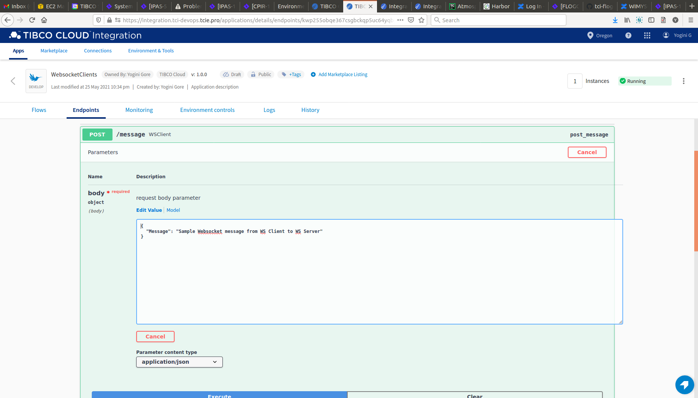

If you want to test the sample in the Flow tester then follow below instructions:
Click on the 'WSClient' flow, click on Test Button -> create Launch configuration -> provide request schema in body parameter -> click Next button -> click on Run
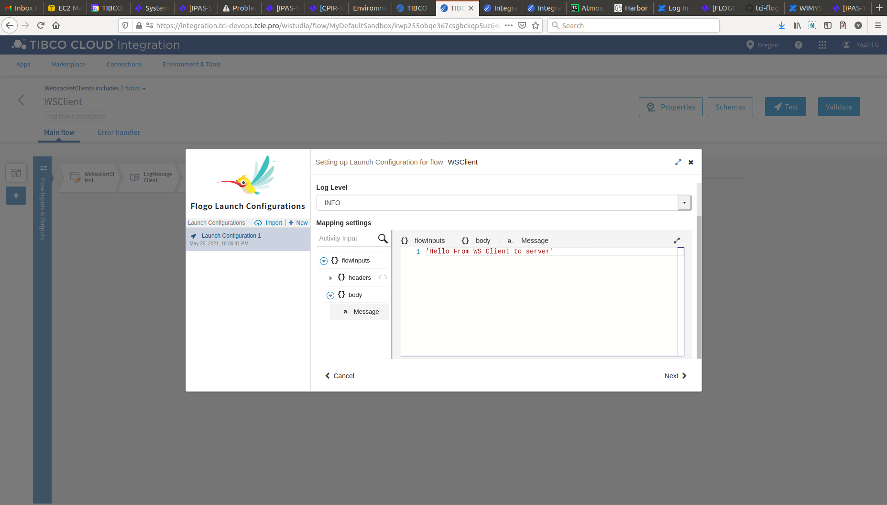

## Outputs

1. Sample Response when hit the endpoints
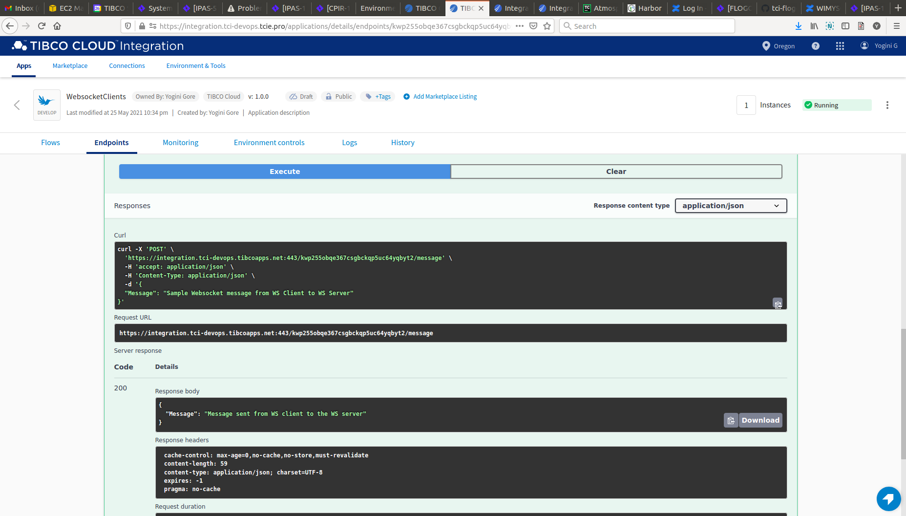

2. Sample Logs
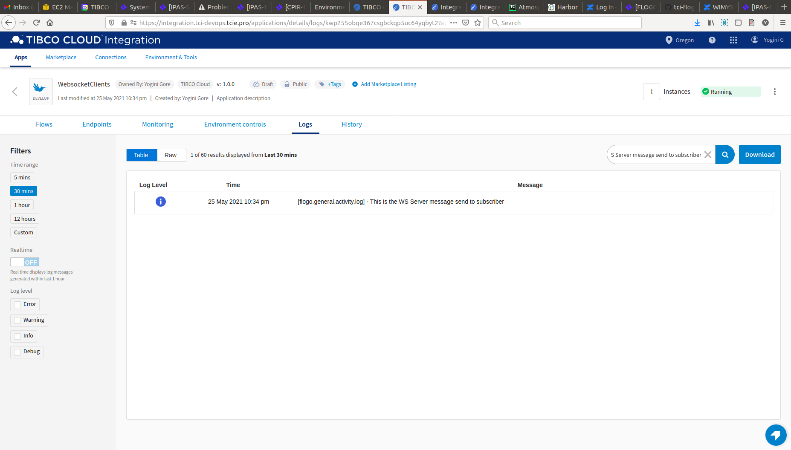
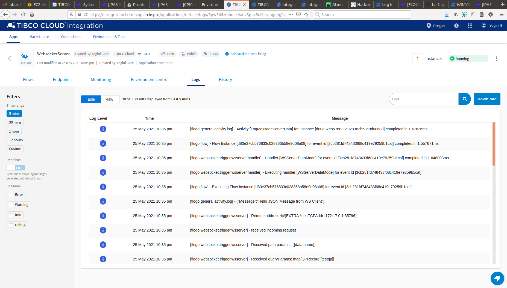

3. Flow Tester Logs
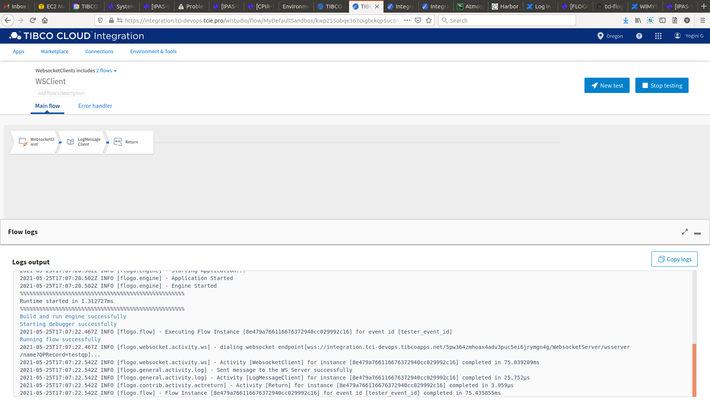

## Troubleshooting

* If you do not see the Endpoint enabled, make sure your apps is in Running status.
* If you do not see user content screen, check if your browser is blocking pop-ups.
* if you see 401 Unauthorized error or token refresh error, re-configure the connection.

## Contributing
If you want to build your own activities for Flogo please read the docs here, [Flogo-docs](https://tibcosoftware.github.io/flogo/)

If you want to showcase your project, check out [tci-awesome](https://github.com/TIBCOSoftware/tci-awesome)

You can also send an email to `tci@tibco.com`

## Feedback
If you have feedback, don't hesitate to talk to us!

* Submit feature requests on our [TCI Ideas](https://ideas.tibco.com/?project=TCI) or [FE Ideas](https://ideas.tibco.com/?project=FE) portal
* Ask questions on the [TIBCO Community](https://community.tibco.com/answers/product/344006)
* Send us a note at `tci@tibco.com`

## Help
Please visit our [TIBCO Cloud&trade; Integration documentation](https://integration.cloud.tibco.com/docs/) and TIBCO Flogo® Enterprise documentation on [docs.tibco.com](https://docs.tibco.com/) for additional information.

## License
This TCI Flogo SDK and Samples project is licensed under a BSD-type license. See [license.txt](license.txt).
