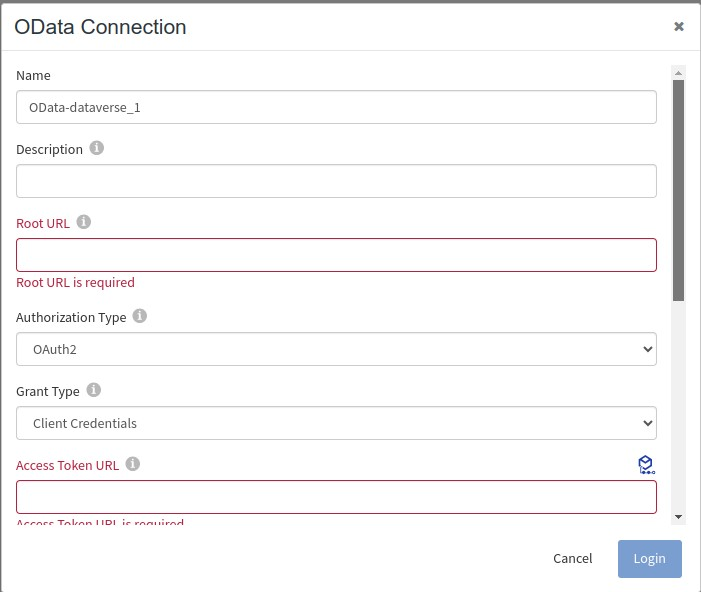

# Sample demonstrating on how to connect to Dataverse service using OData Connector and perform CRUD operation on Dataverse resource

## Description

This sample demonstrate how we can connect to Dataverse service using OData connector and perform operations such as Query,create,update and delete on resource present in Dataverse service. 

## Prerequisites

1. Make sure that user have Microsoft Dataverse environment access.
2. Make sure that user have Azure Active Directory access (For creating client and Tenant ID, add permissions and generating client secret).
3. Make sure that user have Root URL of OData service (i.e., Dataverse) and also have Access Token URL to get the access token. 

## Import the sample

1. Download the sample json file i.e., OData-Dataverse

2. Create a new empty app

3. On the app details page, select import app option.

4. Now click on ‘browse to upload’ button and select the app.json from your machine that you want to import.

5. Click on Upload Button.The Import app dialog displays some generic errors and warnings as well as any specific errors or warnings pertaining to the app you are importing.

6. After importing app is done, in connection tab make sure to re-enter the Client Secret and click on Login button to authenticate details used in the connection.

## Understanding the configuration

### The Connection

When you import the app you need to re-enter the Client Secret and click on Login button to authenticate.

In the connection, note that,
1. Root URL - In this we need to pass root url of OData service. It serves as the entry point for accessing OData service.
2. Authorization Type - It refers to the method used to control access to data and operations exposed by the service. OData supports 3 type of Authorization type:

   None   - It means that no authentication or authorization required for accessing OData service.
   
   Basic  - In this we need to provide username and password for accessing OData service. SAP S4 HANA service use this type of Authorization.
   
   OAuth2 - In this we obtain an access token from an authorization server, which is then used to authenticate API request. Dataverse service use this type of Authorization.
3. Grant Type - It indicate the way how application get the access token from server. Default value is Client Credentials.
4. Access Token URL - It is the Token API endpoint used to get the access token.
5. Client Id - It is used to identify the application to the authorization server when it attempts to obtain an access token.
6. Client Secret - The Client Secret is a key used to authenticate the application to the authorization server.
7. Scope - It specifies the level of access that the application is requesting.
8. Client Authentication - It indicates the way of sending auth parameters. Based on the service request, you can send auth parameters in Body, Header or Query. Default value is Body.
9. Token - It stores the access token in base64 encoded value.

### The Flow

TIBCO Flogo connector for OData has 2 activities - OData Query and OData Modify. OData Modify has 3 operations (Create, Update and Delete).
If you go inside the app, you can see in flow we have added OData Query, OData Modify (with different operations), Log Message and Return Activities. Below is the description of activities:
1. OData Modify - Create Operation : Add data/entity in resource present in OData service.
2. OData Modify - Update Operation : Update data/entity present in resource in OData service.
3. OData Modify - Delete Operation : Delete data/entity present in resource in OData service.
4. OData Query : Used to get data from OData server. 
5. Log Message and Return Activity : for getting the output.

### Run the application

For running the application, first you have to push the app and then scale up the app. Then after sometime you can see your app in running status.

Once your app reaches to Running state, go to Endpoints and for GET/tasks, select 'Try it Out’ option and then click on execute.

Another option, If you want to test the sample in the Flow tester then follow below instructions:
 
in flow, click on Test Button -> create Launch configuration -> click Next button -> click on Run

## Outputs

1. Flow Tester

2. When hit endpoints

## Troubleshooting

* If you do not see the Endpoint enabled, make sure your apps is in Running status.
* If you see test connection failed in connection tab, then check if Access Token URL, Client ID and Client Secret are correct.

## Contributing

If you want to build your own activities for Flogo please read the docs here [Flogo-docs](https://tibcosoftware.github.io/flogo/)

If you want to showcase your project, check out [tci-awesome](https://github.com/TIBCOSoftware/tci-awesome)

You can also send an email to `tci@tibco.com`

## Feedback

If you have feedback, don't hesitate to talk to us!

* Submit feature requests on our [TCI Ideas](https://ideas.tibco.com/?project=TCI) or [FE Ideas](https://ideas.tibco.com/?project=FE) portal
* Ask questions on the [TIBCO Community](https://community.tibco.com/answers/product/344006)
* Send us a note at `tci@tibco.com`

## Help

Please visit our [TIBCO Cloud&trade; Integration documentation](https://integration.cloud.tibco.com/docs/) and TIBCO Flogo® Enterprise documentation on [docs.tibco.com](https://docs.tibco.com/) for additional information.

## License

This TCI Flogo SDK and Samples project is licensed under a BSD-type license. See [license.txt](license.txt).

