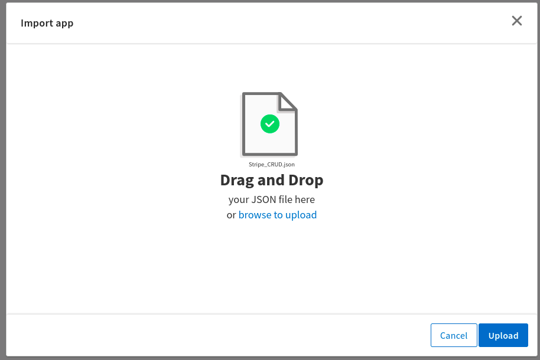
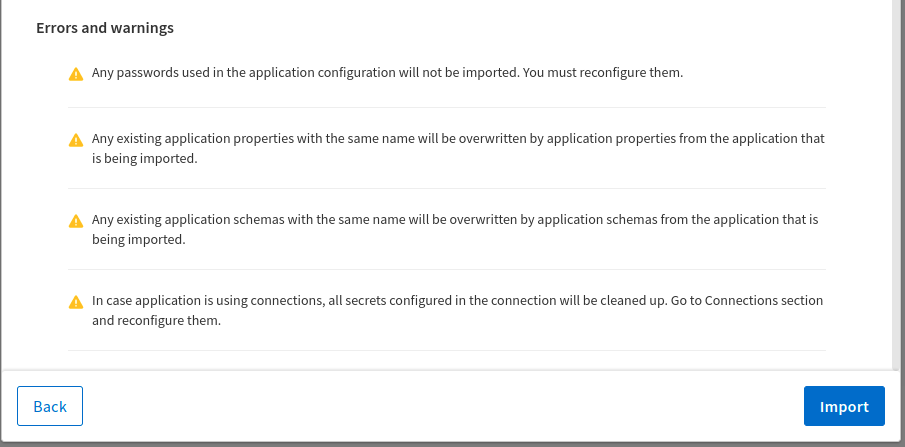
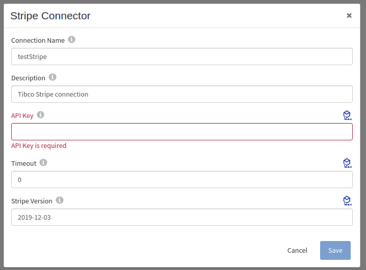
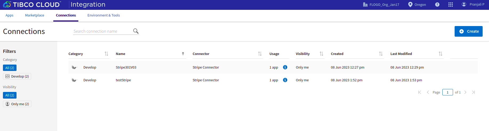
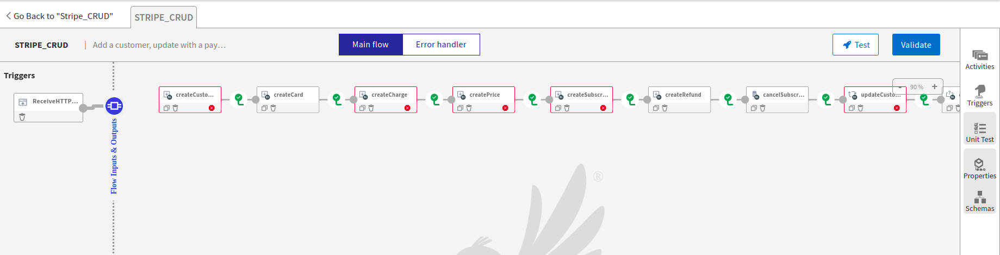
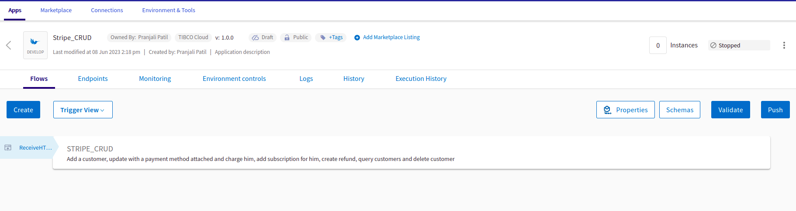
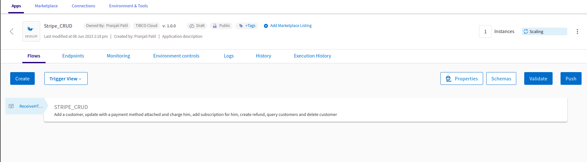
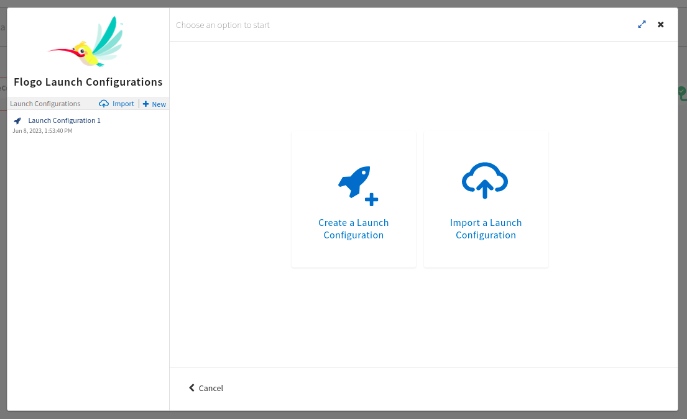
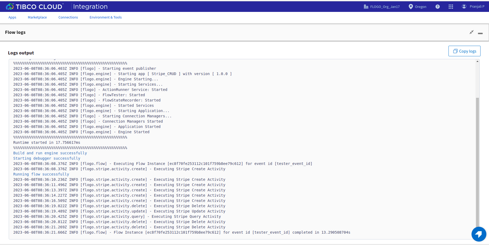

# Stripe App Example

## Description

This example demonstrate how we can create and use Stripe CRUD activities.
Stripe_CRUD app bascially contains 4 activities. The main purpose of these activities are to create data, update the data, query the data and then finally delete the data for Stripe.
The Stripe flow consist of Creating a Customer, Creating a Charge, Capturing a Charge, Creating a Subscription for the card, Creating a Refund, Cancelling Subscription, Querying Charge, Quering Account Balance, Updating Customer, Deleting Card & finally Deleting the Customer.

## Prerequisites

* Ensure that Flogo Connector for Stripe must be install.
* Ensure that you have an active Stripe account.

## Import the sample

1. Download the sample json file i.e., Stripe_CRUD.json.

2. Create a new empty app.

3. On the app details page, select Import app.

4. Now click on ‘browse to upload’ button and select the app.json from your machine that you want to import.

5. Click on Upload Button. The Import app dialog displays some generic errors and warnings as well as any specific errors or warnings pertaining to the app you are importing.

6. In Import App dialog, there are 2 options to import:

* Selective Import – If you are choosing this option then select trigger, flow and connection and click Next.

* Import all – If you are choosing this option then it will import all flows from the source app.

7. After importing app is done, in connection tab make sure to re-enter the password and click on connect button to establish the connection.

## Understanding the configuration

### The Connection

When you import the app you need to re-enter the API key and establish the connection.

In the connection, note that,
1. API Key - In this field we give the Sceret Key of the Stripe Account we want to use.
2. Timeout - If we want to set a connection timeout. Default value is 0
3. Stripe Version - Stripe Version with wich you want to run your flows.

### The Flow

If you go inside the app, you can see in flow we have 4 activities (Create, Update, Delete and Query)  that perform some operations.
Also in flow we have Log Message and Return Activity for getting the output.

### Run the application
For running the application, first you have to push the app and then scale up the app.
Then after sometime you can see your app in running status.

Once your app reaches to Running state, go to Endpoints and for GET/tasks, select 'Try it Out’ option and then click on execute.

Another option, If you want to test the sample in the Flow tester then follow below instructions:
 
in flow, click on Test Button -> create Launch configuration -> click Next button -> click on Run

## Outputs

1. Flow Tester

2. When hit endpoints

3. Sample Logs

## Troubleshooting

* If you do not see the Endpoint enabled, make sure your apps is in Running status.
* If you see test connection failed in connection tab, then check if the Stripe Version or the API key is correct or not.

## Contributing
If you want to build your own activities for Flogo please read the docs here, [Flogo-docs](https://tibcosoftware.github.io/flogo/)

If you want to showcase your project, check out [tci-awesome](https://github.com/TIBCOSoftware/tci-awesome)

You can also send an email to `tci@tibco.com`

## Feedback
If you have feedback, don't hesitate to talk to us!

* Submit feature requests on our [TCI Ideas](https://ideas.tibco.com/?project=TCI) or [FE Ideas](https://ideas.tibco.com/?project=FE) portal
* Ask questions on the [TIBCO Community](https://community.tibco.com/answers/product/344006)
* Send us a note at `tci@tibco.com`

## Help
Please visit our [TIBCO Cloud&trade; Integration documentation](https://integration.cloud.tibco.com/docs/) and TIBCO Flogo® Enterprise documentation on [docs.tibco.com](https://docs.tibco.com/) for additional information.

## License
This TCI Flogo SDK and Samples project is licensed under a BSD-type license. See [license.txt](license.txt).

