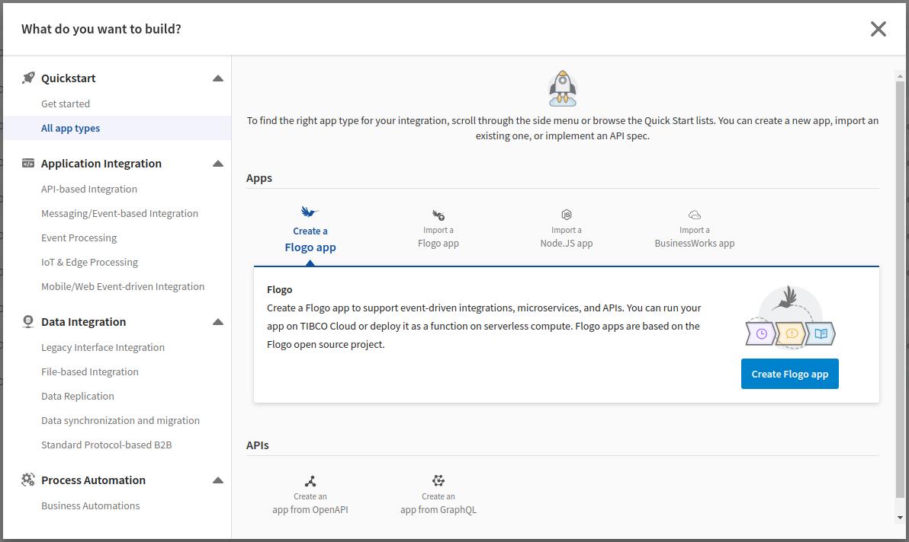
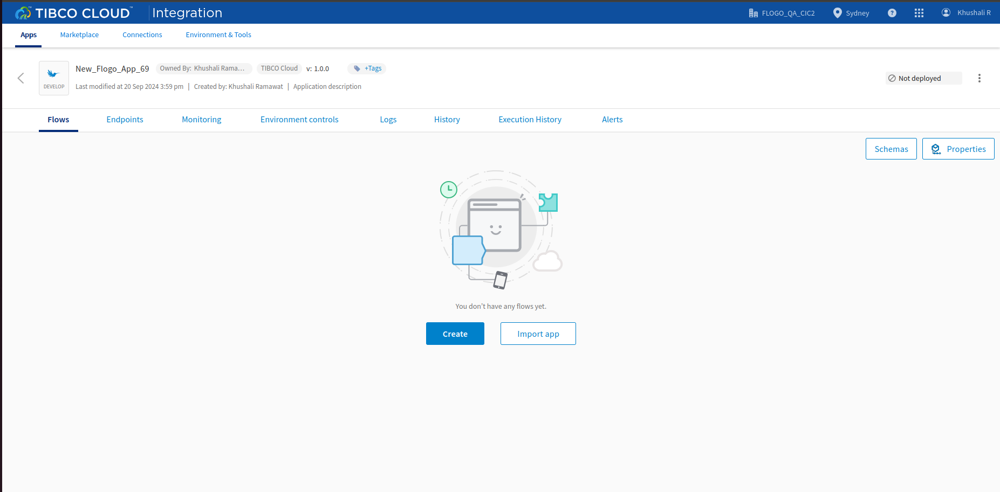

# OData with SAP S4 Hana Example

## Description

This example demonstrates how we can create SAP S4 Hana connection using OData connector and use all OData CRUD activities for SAP S4 Hana server.
OData app with SAP S4 Hana bascially contain 2 activities i.e. OData Query and OData Modify. OData Modify contains three operation i.e. Create, Update and Delete. 
The main purpose of these activities are:
a) To fetch SAP S4 Hana data using OData Query activity.
b) To create data in SAP S4 Hana server using Create operation of OData Modify activity.
c) To update data in SAP S4 Hana server using Update operation of OData Modify activity.
d) To delete data in SAP S4 Hana server using Delete operation of OData Modify activity.

## Prerequisites

1. Ensure that SAP S4 Hana services are up and running
  
## Import the sample

1. Download the sample json file i.e. ODataS4HanaCRUD.json.

2. Create a new empty app

3. On the app details page, select import app option.

4. Now click on ‘browse to upload’ button and select the app.json from your machine that you want to import.

5. Click on Upload Button. The Import app dialog displays some generic errors and warnings as well as any specific errors or warnings pertaining to the app you are importing.

6. In Import App dialog, there are 2 options for connection:

* Create new connection – If you are choosing this option then it will create new connection.

* Existing connections – If you are choosing this option then it will use existing connections from the environment.

7. After importing app is done, in connection tab make sure to re-enter the password and click on connect button to establish the connection.

## Understanding the configuration

### The Connection

When you import the app you need to re-enter the password and establish the connection.

In the connection, note that,
1. Root URL - In this field we give root URL of OData services (i.e. SAP S4 Hana, Dataverse).
2. Username - Username to connect to SAP S4 Hana.
3. Password - Password to connect to SAP S4 Hana.
4. Authorization Type - You can choose the authorization type from the following options:

		 	None: No Username and Password is required for aunthentication.
		 	Basic: Basic authentication using Username and Password.
		 	OAuth2: Access the token based client authentication by using OAuth 2.0 athentication service.
		 
Authorization type None 

Authorization type Basic

Authorization type OAuth2

Note: OData using SAP S4 Hana uses Basic Authentication type.

### The Flow

If you go inside the app, you can see in flow we have 2 activities (OData Query and OData Modify) that perform CRUD operations like: data fetching, inserting data, updating data and deleting data.

1. Using OData Query activity we are fetching data present at SAP S4 Hana 'A_ProductDescription' API service. 

Following is the configuration needed for OData Query Activity using SAP S4 Hana service.

Select SAP S4 Hana connection in Settings tab of OData Query activity.

Add Request Headers parameter for getting X-CSRF-Token value. (X-CSRF-Token value required for OData Modify activity execution)

Provide OData URI value for which you want to fetch data from SAP S4 Hana service. Here we are fetching data from SAP S4 Hana API 'A_ProductDescription'. 

Provide value for $select queryOptions. Here we are fetching data for provided properties like: Product, Language and ProductDescription

Provide value for $top queryOptions. Here we are fetching top 2 records from SAP S4 Hana API 'A_ProductDescription'by providing value as: 2

Provide 'fetch' value to the X-CSRF-Token header.

Provide Json Response Schema in Output Settings tab. Also add Response Headers parametres like: set-cookie and x-csrf-token

2. Using Create operation of OData Modify activity we are inserting data into SAP S4 Hana 'A_ProductDescription' API service. 

Following is the configuration needed for OData Modify Activity using Create operation.

Select SAP S4 Hana connection in Settings tab of OData Modify activity. Also select Create operation for inserting data into SAP S4 Hana service. By default Request Type application/json is selected.

Add Request Body Schema for which you want to insert data into SAP S4 Hana service. Also add Request Headers parameter for mapping X-CSRF-Token value from OData Query activity response.

Provide OData URI value for which you want to insert data into SAP S4 Hana service. Here we are inserting data into SAP S4 Hana API 'A_ProductDescription'.

Provide value for requestBody

Mapp x-csrf-token value of ODataQuery activity to the input of the x-csrf-token header of ODataModifyCreate activity. Similarly mapp set-cookie value of ODataQuery activity to the input of the Cookie header of ODataModifyCreate activity. Set Content-Type value as "application/json".

Provide Json Response Schema in Output Settings tab.

3. Using Update operation of OData Modify activity we are updating data into SAP S4 Hana 'A_ProductDescription' API service. 

Following is the configuration needed for OData Modify Activity using Update operation.

Select SAP S4 Hana connection in Settings tab of OData Modify activity. Also select Update operation for updating data into SAP S4 Hana service. By default Request Type application/json is selected.

Add Request Body Schema for which you want to update data into SAP S4 Hana service. Also add Request Headers parameter for mapping X-CSRF-Token value from OData Query activity response.

Provide OData URI value for which you want to update data into SAP S4 Hana service. Here we are updating ProductDescription property using ODataURI: "A_ProductDescription(Product='A001',Language='EN')"

Provide value for requestBody

Mapp x-csrf-token value of ODataQuery activity to the input of the x-csrf-token header of ODataModifyUpdat activity. Similarly mapp set-cookie value of ODataQuery activity to the input of the Cookie header of ODataModifyUpdat activity. Set Content-Type value as "application/json".

Provide Json Response Schema in Output Settings tab.

4. Using Delete operation of OData Modify activity we are deleting data from SAP S4 Hana 'A_ProductDescription' API service.

Following is the configuration needed for OData Modify Activity using Delete operation.

Select SAP S4 Hana connection in Settings tab of OData Modify activity. Also select Delete operation for deleting data from SAP S4 Hana service. By default Request Type application/json is selected.

Add Request Body Schema for which you want to delete data from SAP S4 Hana service. Also add Request Headers parameter for mapping X-CSRF-Token value from OData Query activity response.

Provide OData URI value for which you want to delete data from SAP S4 Hana service. Here we are deleting updated ProductDescription property value using ODataURI: "A_ProductDescription(Product='A001',Language='EN')"

Provide value for requestBody

Mapp x-csrf-token value of ODataQuery activity to the input of the x-csrf-token header of ODataModifyDelete activity. Similarly mapp set-cookie value of ODataQuery activity to the input of the Cookie header of ODataModifyDelete activity. Set Content-Type value as "application/json".

Provide Json Response Schema in Output Settings tab.

Also in flow we have Log Message for every activity output and in last Return Activity for getting all activity output.

### Run the application
For running the application, first you have to push the app and then scale up the app.
Then after sometime you can see your app goes in running state.

Once your app reaches to Running state, go to Endpoints and for get_allcrud, select 'Try it Out’ option and then click on execute.

Another option, If you want to test the sample in the Flow tester then follow below instructions:
 
In flow, click on Test Button -> create Launch configuration -> click Next button -> click on Run

## Outputs

1. Flow Tester

2. When hit endpoints

## Troubleshooting

* If you do not see the Endpoint enabled, make sure your apps is in Running status.
* If you see test connection failed for On-cloud connection in connection tab, then check Flogo DB Services is enabled or not and your public ip and TCI environment NAT ips are whitelisted or not.
* If you see test connection failed for On-premies connection in connection tab, then check Flogo DB Services is enabled or not and tibagent is started for oracle database server or not.
* If you are not able to fech the tables or table coloumns while typing a query, then make sure your connection should be establish successfully.
* While executing on-premise connection app from endpoint, make sure that accesskey should be selected in Hybride connectivity option from Environment controls tab and executing from flow tester make sure you have to select 'Using On-premise services' check box from flow launch configuration pop up.

## Contributing
If you want to build your own activities for Flogo please read the docs here.

If you want to showcase your project, check out [tci-awesome](https://github.com/TIBCOSoftware/tci-awesome)

You can also send an email to `tci@tibco.com`

## Feedback
If you have feedback, don't hesitate to talk to us!

* Submit feature requests on our [TCI Ideas](https://ideas.tibco.com/?project=TCI) or [FE Ideas](https://ideas.tibco.com/?project=FE) portal
* Ask questions on the [TIBCO Community](https://community.tibco.com/answers/product/344006)
* Send us a note at `tci@tibco.com`

## Help
Please visit our [TIBCO Cloud&trade; Integration documentation](https://integration.cloud.tibco.com/docs/) and TIBCO Flogo® Enterprise documentation on [docs.tibco.com](https://docs.tibco.com/) for additional information.

## License
This TCI Flogo SDK and Samples project is licensed under a BSD-type license. See [license.txt](license.txt).

