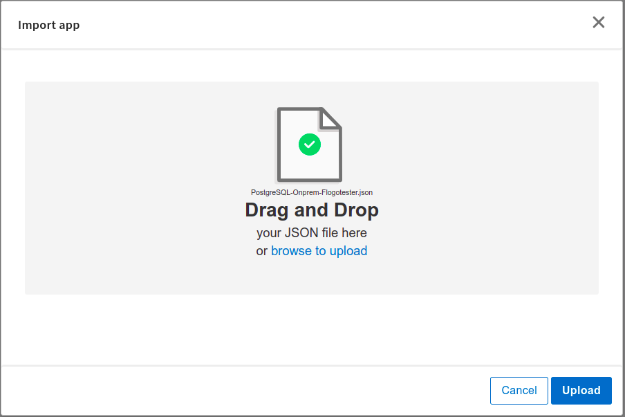
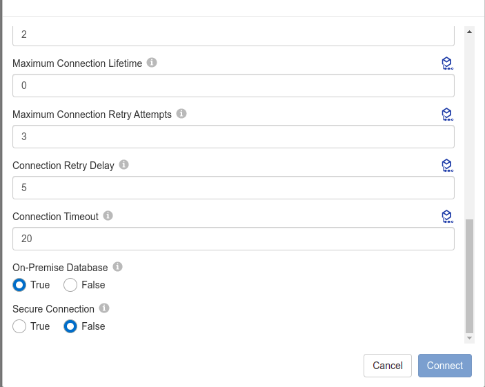
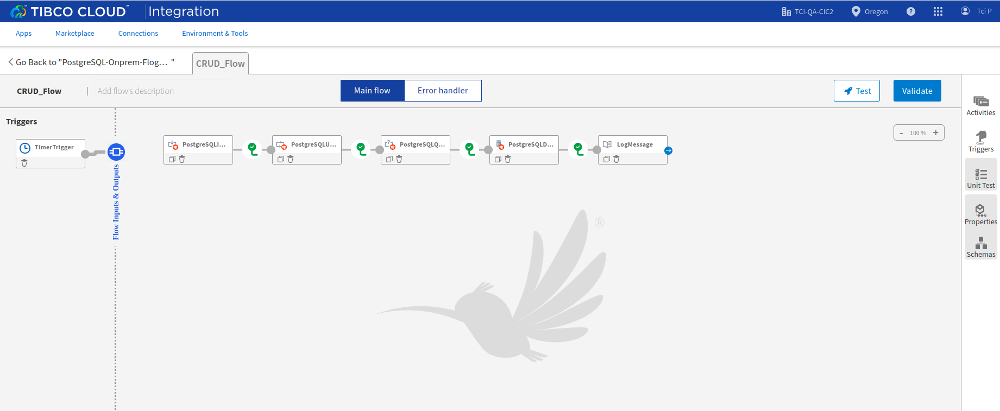
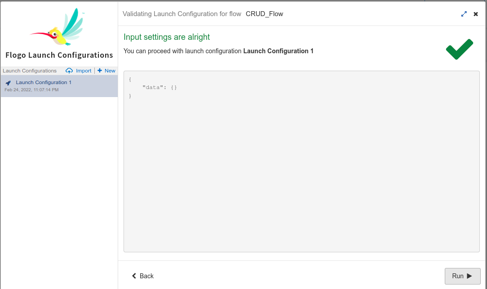
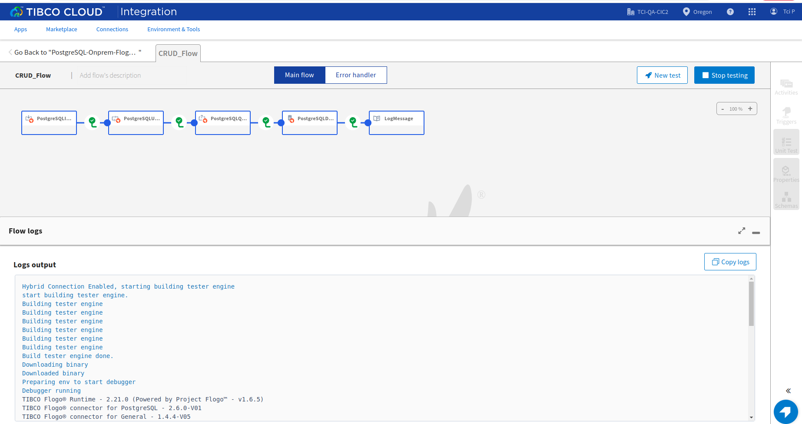

# App connecting to database running On-premise using flow tester

## Description

This sample demonstrates how to test flogo app having PostgreSQL on-premise connection using flow tester.

## Pre-requisites

1. Ensure that PostgreSQL DB is up and running on-premise.
2. User must have Admin access to enable/disable services via TCI Platform API.
3. Ensure that OAUTH Token is generated in order to use API.
4. User must download the latest tibagent.
5. Ensure that hybrid proxy must be enabled in your organization before (To enable the Hybrid proxy user just need to create agent in the current organization. This step should only perform when user see error message "Please enable hybrid proxy first" while enabling/disabling the serivce through Platform API.)

## Enable the dbservice

There are 2 ways to enable dbservice. One way is from UI using custom access key and another way is from Platform API using custom or system access key.
In this sample we are enabling dbservice from Platfrom API because we want to use the system access key so that single agent can be used with multiple services. 
Below is the API that we should invoke to enable the db service without passing the tunnelKey.

​## /v1/subscriptions/{subscriptionLocator}/dbservice 

 
## Enable the Flogotester

In order to check on-premise app using flow tester user first need to enable the flogotester service.
Below is the API that we should invoke to enable the flogotester

​​## /v1/subscriptions/{subscriptionLocator}/flogotester

## Create and Start the tibagent

Below are the steps to create and start an agent:

./tibagent configure agent <agent_name> 

./tibagent start agent --spec container_port:onpremise_host:onpremise_port <agent_name>

To know more about Hybrid agents. Please refer [here](https://integration.cloud.tibco.com/docs/#tci/using/hybrid-agent/agent-command-reference.html?TocPath=Using%2520TIBCO%2520Cloud%25E2%2584%25A2%2520Integration%257CUsing%2520the%2520TIBCO%2520Cloud%25E2%2584%25A2%2520Integration%2520-%2520Hybrid%2520Agent%257C_____5)

## Import the sample

1. Download the sample json file i.e., PostgreSQL-Onprem-Flogotester.json.

2. Create a new empty app

3. On the app details page, select import app option.

4. Now click on ‘browse to upload’ button and select the app.json from your machine that you want to import.

5. Click on Upload Button. The Import app dialog displays shows what Triggers is using, Flow name, Connection and some generic errors and warnings as well as any specific errors or warnings pertaining to the app you are importing.

6. After importing app is done, in connection tab make sure to re-enter the password and click on connect button to establish the connection.

## Understanding the configuration

### The Connection

When you import the app you need to re-enter the password and establish the connection.

In the connection, note that,
1. Host - In this field we give private ip of the on-premise system on which database is hosted.
2. On-premise "True" means that it establish connection to on-premise system.

### The Flow

If you go inside the app, you can see in flow we have 4 activities (Query,Insert, Update and Delete) that perform some operations.
Also in flow we have Log Message for getting the output.

### Run the application

In order to test the DBConnector on-premise app in flow tester we need to select the "Using on-premise services" checkbox in Flogo Launch configuration.
 
in flow, click on Test Button -> create Launch configuration -> Select "Using on-premise services" checkbox -> click Next button -> click on Run

## Outputs

Flow Tester

## Troubleshooting

* If PostgreSQL database is not up and running on on-premise system then we should see error while creating connection.
* If user don't have admin right and try to enable/disable service through Platform API then error "No permission to enable Flogo Tester" should appear.
* If there are no Hybrid Agents configured for the Organization before and you attempt to enable the service using the API, the following warning message is generated "Please enable hybrid proxy first". To solve this issue create Hybrid agent first.
* If flogotester service is not enabled using the API and we try to click "Using on-premise services" checkbox in flogo Launch Configuartion then we should see error "Flow tester service unreachable. To use this feature, Flow tester service must be enabled and running for your organization. Refer 'Flow Tester' documentation for more details."

## Contributing

If you want to build your own activities for Flogo please read the docs here. [Flogo-docs](https://tibcosoftware.github.io/flogo/)

If you want to showcase your project, check out [tci-awesome](https://github.com/TIBCOSoftware/tci-awesome)

You can also send an email to `tci@tibco.com`

## Feedback

If you have feedback, don't hesitate to talk to us!

* Submit feature requests on our [TCI Ideas](https://ideas.tibco.com/?project=TCI) or [FE Ideas](https://ideas.tibco.com/?project=FE) portal
* Ask questions on the [TIBCO Community](https://community.tibco.com/answers/product/344006)
* Send us a note at `tci@tibco.com`

## Help

Please visit our [TIBCO Cloud&trade; Integration documentation](https://integration.cloud.tibco.com/docs/) and TIBCO Flogo® Enterprise documentation on [docs.tibco.com](https://docs.tibco.com/) for additional information.

## License

This TCI Flogo SDK and Samples project is licensed under a BSD-type license. See [license.txt](license.txt).

