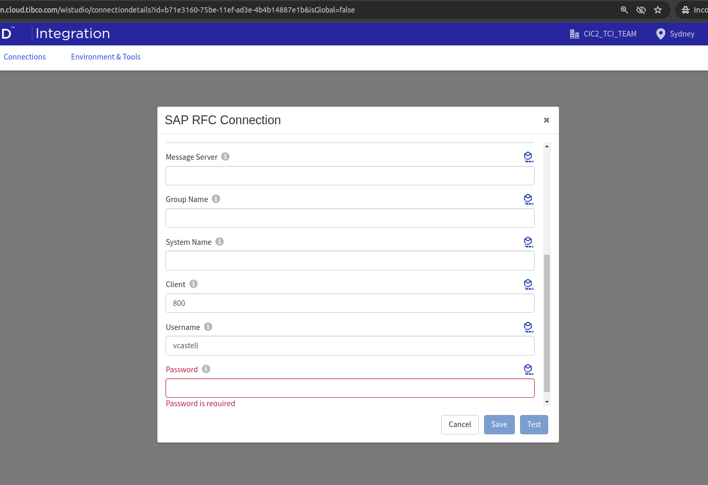
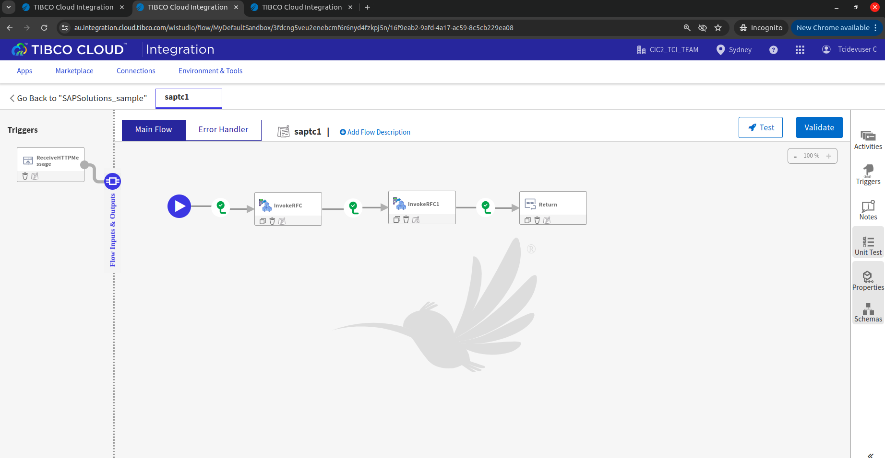
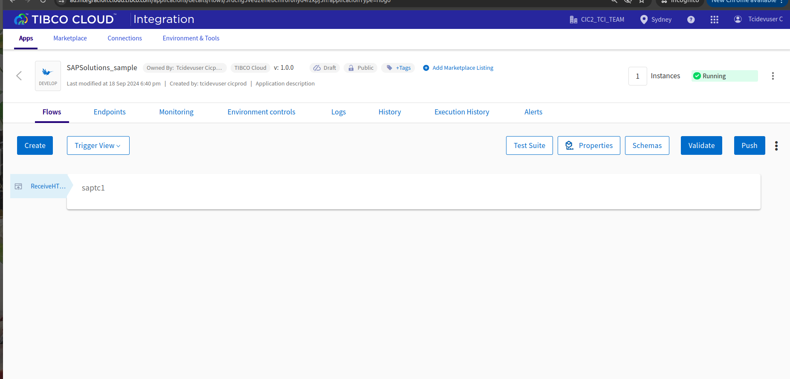
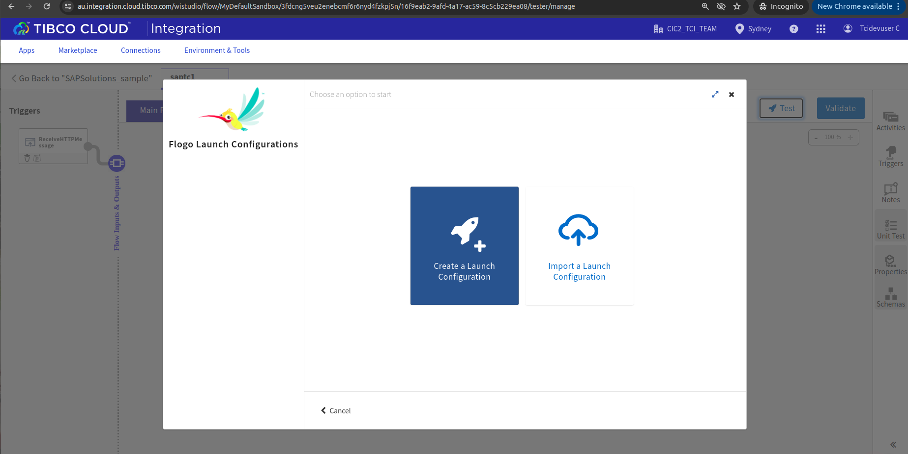
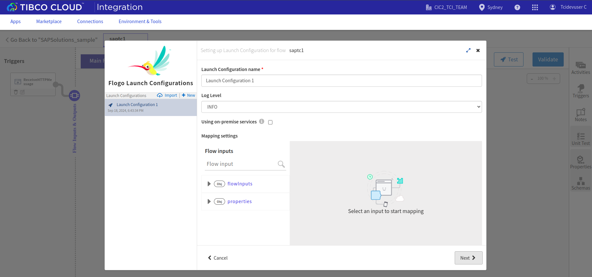
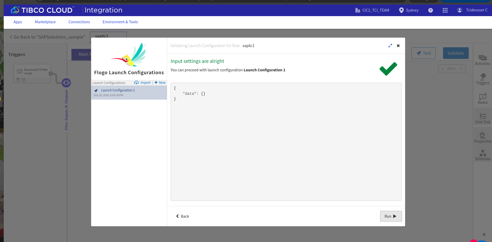
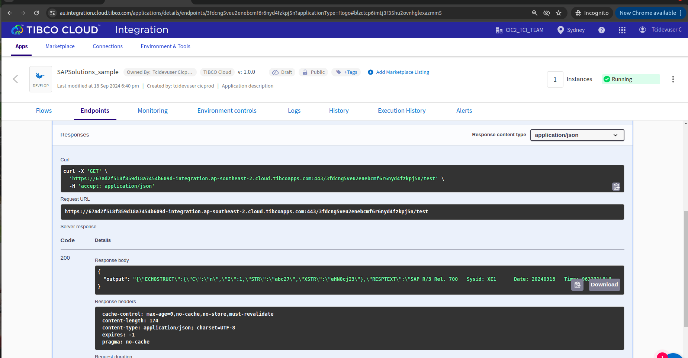

# SAP Solutions Example

## Description

This example demonstrates how we can create a SAP RFC connection using SAP Solutions connector and use the SAP Invoke RFC activity.The SAP Solutions connector provides the connection for SAP Server. The TIBCO Flogo® Connector for SAP Solutions is used to call SAP RFC/BAPI interfaces. The connector supports inbound Request/Reply protocol to the SAP system.

We have 1 SAP Invoke RFC activity.

## Prerequisites

1. Ensure that you have a SAP Server configured.

## Import the sample

1. Download the sample json file i.e., SAPSolutions_Sample.json.

2. Click on Create/Import from the UI.

3. From the same page, select import a Flogo app option.

4. Now click on ‘browse to upload’ button and select the app.json from your machine that you want to import.

5. After importing app is done, in connection tab make sure to enter password and click on test button to establish the connection.

## Understanding the configuration

### The Connection

When you import the app you need to enter the password and click on test to establish the connection.

In the connection, note that: 
1. Name: Unique name for the SAP connection.
2. Description: Brief description of the SAP connection.
3. Connection Type: The client connection type. The connector provides the following client connection types: Dedicated Application Server (Default) and Load Balancing.
4. Application server: The network name or IP address of the machine where the SAP system exists. Only required if Connection Type is Dedicated Application Server.
5. System Number: The SAP System number. Only required if Connection Type is Dedicated Application Server.
6. Client: The SAP Client number.
7. Username: The username used to log in to an SAP client.
8. Password: The password corresponding to the username.
9. Message Server: Host name of the message server. Only required if Connection Type is Load Balancing.
10. Group Name: Group name of the application servers. Only required if Connection Type is Load Balancing.
11. System Name: Name of the SAP system (R3NAME). Only required if Connection Type is Load Balancing.

### The Flow

If you go inside the app, you can see in flow where we have the SAP Invoke RFC Activity configured. 
1. We have first used the SAP Invoke RFC activity with the Z_TEST* filter and chosed the Z_TEST_INT4 rfc.
2. So the schema of the Z_TEST_INT4 rfc will be configured in the input tab, we need to populate appropriate values to the input.
3. Next we have used the SAP Invoke RFC activity with the STFC* filter and chosed the STFC_DEEP_STRUCTURE rfc.
2. So the schema of the STFC_DEEP_STRUCTURE rfc will be configured in the input tab, we need to populate appropriate values to the input.

### Run the application
For running the application, first you have to push the app and then scale up the app.
Then after sometime you can see your app in running status.

Another option, If you want to test the sample in the Flow tester then follow below instructions:
 
In flow, click on Test Button -> create Launch configuration -> click Next button -> click on Run

## Outputs

1. Flow Tester

2. Runtime Deployment

## Troubleshooting

* If you see test connection failed in connection tab, then check if your authorization code is recently generated.

## Contributing
If you want to build your own activities for Flogo please read the docs here.

If you want to showcase your project, check out [tci-awesome](https://github.com/TIBCOSoftware/tci-awesome)

You can also send an email to `tci@tibco.com`

## Feedback
If you have feedback, don't hesitate to talk to us!

* Submit feature requests on our [TCI Ideas](https://ideas.tibco.com/?project=TCI) or [FE Ideas](https://ideas.tibco.com/?project=FE) portal
* Ask questions on the [TIBCO Community](https://community.tibco.com/answers/product/344006)
* Send us a note at `tci@tibco.com`

## Help
Please visit our [TIBCO Cloud&trade; Integration documentation](https://integration.cloud.tibco.com/docs/) and TIBCO Flogo® Enterprise documentation on [docs.tibco.com](https://docs.tibco.com/) for additional information.

## License
This TCI Flogo SDK and Samples project is licensed under a BSD-type license. See [license.txt](license.txt).

