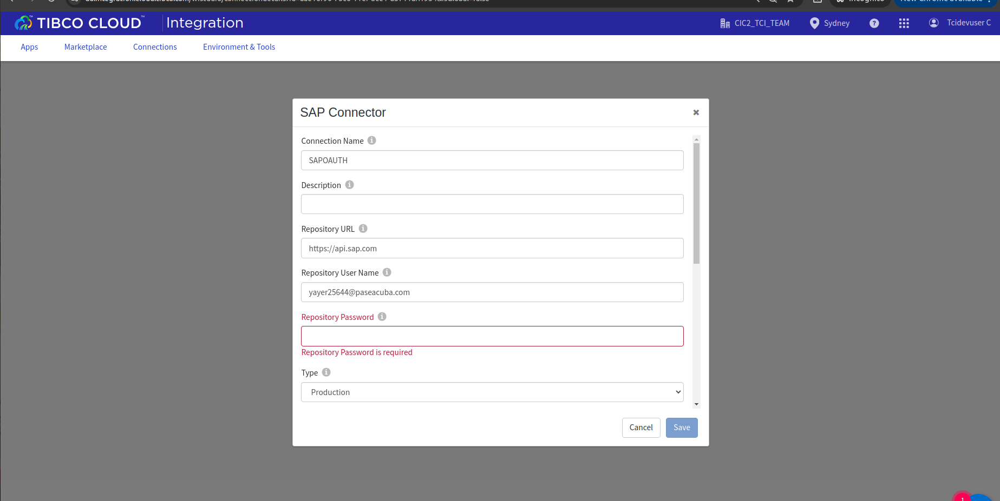
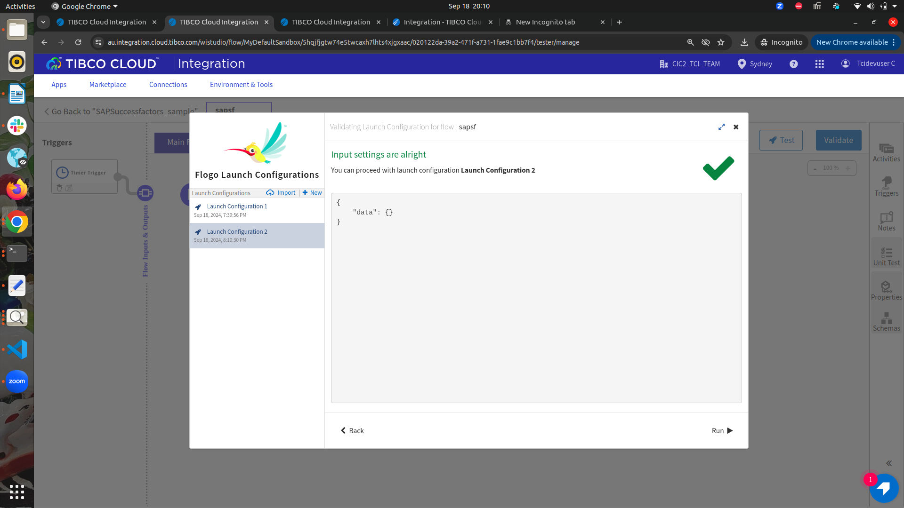

# SAP Successfactors Example

## Description

This example demonstrates how we can create a flow using the SAP connection and the SAP successfactors activities. The SAP SuccessFactors is a global provider of cloud-based human resource software and fully integrated human capital management (HCM) systems.
The Connector for SAP SuccessFactors requires TIBCO Flogo® Connector for SAP SuccessFactors to establish the connection with your SAP instance. It allows you to perform operations using services supported by SAP SuccessFactors. The connector supports the APIs for SAP SuccessFactors Employee Central.

We have 4 SAP Successfactors Activities as follows: 
1. SAP Successfactors Get
2. SAP Successfactors Create
3. SAP Successfactors Update
4. SAP Successfactors Delete

## Prerequisites

1. Ensure that you have access to the SAP SaaS Environment.

## Import the sample

1. Download the sample json file i.e., SAPSuccessfactors_Sample.json.

2. Click on Create/Import from the UI.

3. From the same page, select import a Flogo app option.

4. Now click on ‘browse to upload’ button and select the app.json from your machine that you want to import.

5. After importing app is done, in connection tab make sure to enter password and click on test button to establish the connection.

## Understanding the configuration

### The Connection

When you import the app you need to enter the password and click on test to establish the connection.
Here we have used the Production type with OAuth Authentication type.

In the connection, note that: 
1. Name: The unique name for the connection you are creating. This is displayed in the SAP Connection drop-down list for all the TIBCO Flogo® Connectors related to SAP cloud-based applications.
2. Description: Brief description of the SAP connection.
3. Repository URL: URL for discovery of metadata. Default is https://api.sap.com
4. Repository Username: User name for logging into the Repository URL.
5. Repository Password: Password for logging into the Repository URL.
6. Type: Specifies whether to use Sandbox available on Repository URL or Production available in specified Tenant URL.
7. Authentication Type: Specifies the type of authentication. Valid types are Basic Authentication and SSL Client Certificate.
6. Tenant URL: Specifies the URL of the tenant. Only if Type is Production.
7. Tenant Username: Specifies the user name of the tenant. Only if Type is Production and Authentication Type is Basic Authentication or SSL Client Certificate.
8. Tenant Password: Specifies the password of the tenant. Only if Type is Production and Authentication Type is Basic Authentication or SSL Client Certificate.
9. SSL Client Certificate: Specifies the SSL Client Certificate. Only if Type is Production and Authentication Type is SSL Client Certificate.
10. API Key: Specifies the API Key for the OAuth client application. Only if Type is Production and Authentication Type is OAuth.
11. User ID: Specifies the User ID to call the API. Only if Type is Production and Authentication Type is OAuth.
12. API URL: Specifies SAP SuccessFactors API URL for the tenant used in generating the SAML assertion. Only if Type is Production and Authentication Type is OAuth.
13. Company ID: Specifies SAP SuccessFactors Company ID. Only if Type is Production and Authentication Type is OAuth.
14. X.509 Certificate:	Specifies X.509 certificate containing private key for the SAP SuccessFactors tenant. Only if Type is Production and Authentication Type is OAuth.

### The Flow

If you go inside the app, you can see in flow where we have the SAP Successfactors Activities configured which basically deals with CRUD operations. 
1. First we have configured the SAP successfactors Get activity, passed the SAP connection to it and selected the API(ECEmployeeProfile) and selected the service(BackgroundCommunity) from the service drop down.
2. We have to provide the data to the input of the Get activity. For eg.: top = 10, means it will retrieve the top 10 records of the service mentioned.
3. Second we have the SAP Successfactors Update activity, we have took the record(backgroundElementId and UserID - mandatory fields) from the Get activity, and provided the fields that we want to update(For eg. Name).
4. Next we have configured the SAP Successfactors Delete Activity and passed the record(backgroundElementId and UserID - mandatory fields) from the Update activity.
5. At last we have the SAP Successfactor's create activity, we can map the UserID from the previous activity and provide Name for the new entry.

### Run the application
For running the application, first you have to push the app and then scale up the app.
Then after sometime you can see your app in running status.

Another option, If you want to test the sample in the Flow tester then follow below instructions:
 
In flow, click on Test Button -> create Launch configuration -> click Next button -> click on Run

## Outputs

1. Flow Tester

2. Runtime Deployment

## Troubleshooting

* If you see test connection failed in connection tab, then check if your authorization code is recently generated.

## Contributing
If you want to build your own activities for Flogo please read the docs here.

If you want to showcase your project, check out [tci-awesome](https://github.com/TIBCOSoftware/tci-awesome)

You can also send an email to `tci@tibco.com`

## Feedback
If you have feedback, don't hesitate to talk to us!

* Submit feature requests on our [TCI Ideas](https://ideas.tibco.com/?project=TCI) or [FE Ideas](https://ideas.tibco.com/?project=FE) portal
* Ask questions on the [TIBCO Community](https://community.tibco.com/answers/product/344006)
* Send us a note at `tci@tibco.com`

## Help
Please visit our [TIBCO Cloud&trade; Integration documentation](https://integration.cloud.tibco.com/docs/) and TIBCO Flogo® Enterprise documentation on [docs.tibco.com](https://docs.tibco.com/) for additional information.

## License
This TCI Flogo SDK and Samples project is licensed under a BSD-type license. See [license.txt](license.txt).

