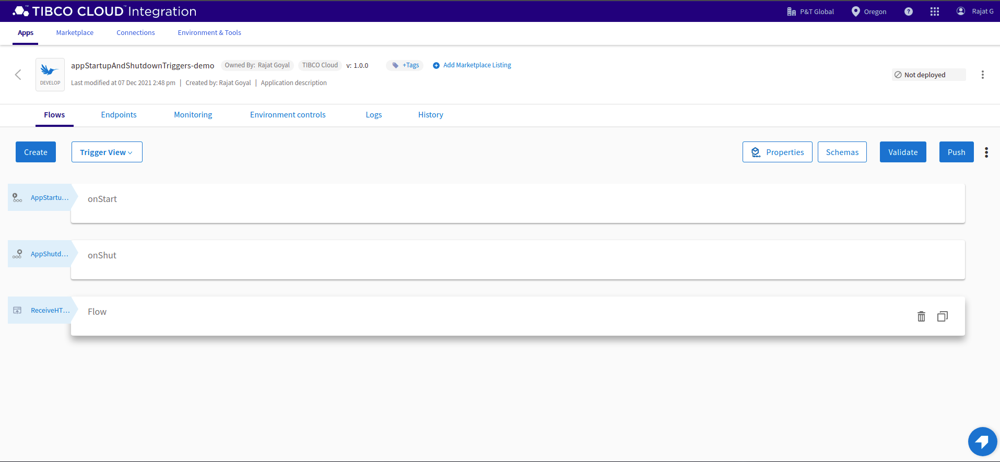
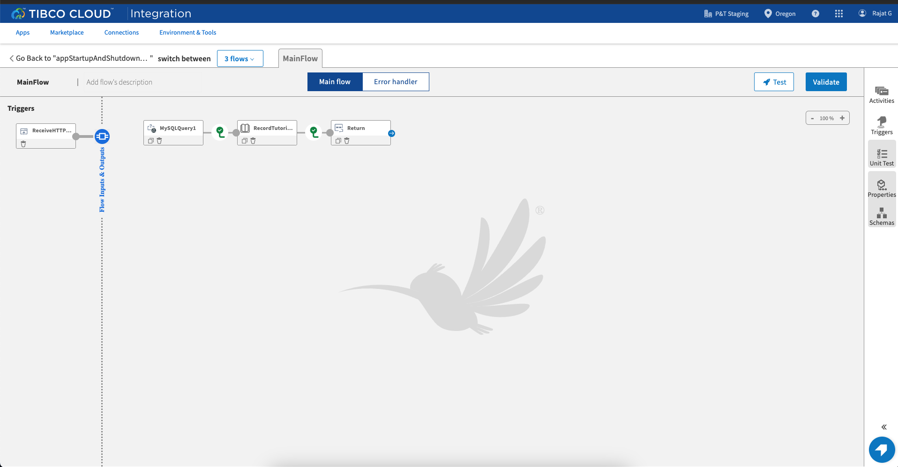
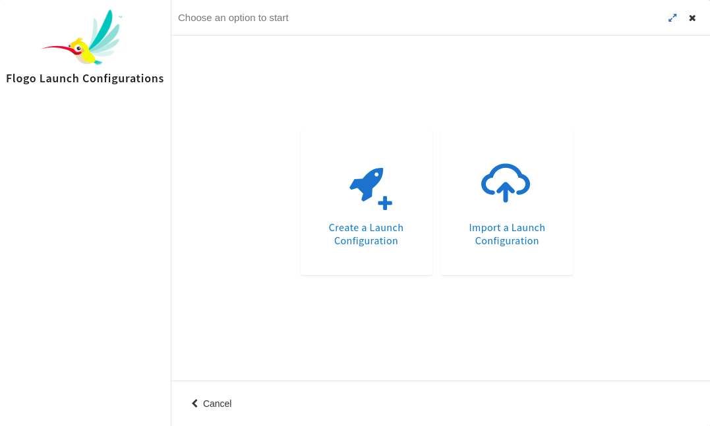
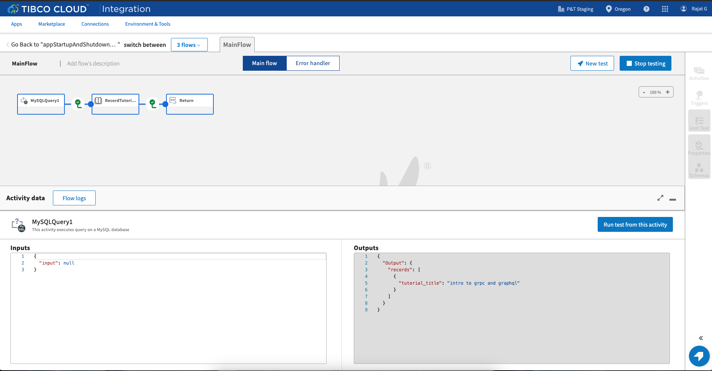
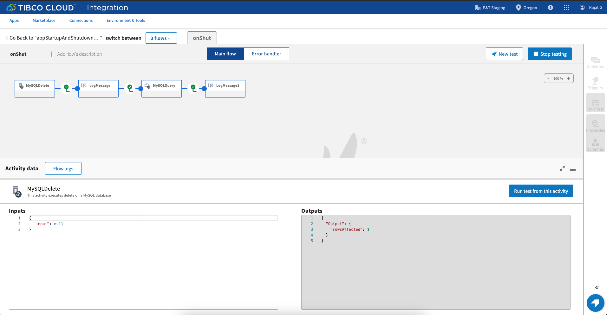

# App Startup and Shutdown Trigger Sample

# Description

This is app *Startup* and *Shutdown* trigger's sample.The app *Startup* trigger is invoked before other triggers in the app are started. It can be used to specify initialization logic that is specific to an app. The app *Shutdown* trigger is invoked after other triggers in the app are successfully stopped.This trigger can be used for cleaning up the data (For example, SharedData delete operation) or deleting tables from a database. In this sample, we are inserting values to a DB table in the app *Startup* trigger, Querying that data in the *mainFlow* and deleting that data table in the app *Shutdown* trigger flow. The database used is *MySQL*.

### *Note:-The app startup and shutdown triggers does not require any configurations.*

## Import the sample
1. Download the sample json file i.e., *appStartupAndShutdownTriggers-demo.json*.

2. Create a new empty app

3. On the app details page, select import app option.

4. Now click on ‘browse to upload’ button and select the app.json from your machine that you want to import.

5. Click on Upload Button. The Import app dialog displays some generic errors and warnings as well as any specific errors or warnings pertaining to the app you are importing.

6. You have the option to import all flows from the source app or selectively import flows.

7.  Click Next. If you had not selected a trigger in the previous dialog, the flows associated with that trigger are displayed. You have the option to select one or more of these flows such that the flows get imported as blank flows that are not attached to any trigger. By default, all flows are selected. Clear the check box for the flows that you do not want to import. If your flow(s) have subflows, and you select only the main flow but do not select the subflow, the main flow gets imported without the subflow. Click Next.

## Understanding the configuration

In the attached sample *appStartupAndShutdownTriggers-demo.json*, there is a flow *onStart*. The flow is executed before all the triggers in the app are started since it is attached with the *appStartup* trigger. As soon as the user scale their app, the activities inside the *onStart* flow gets executed. Here we are inserting the values in the DB table *tutorials_tbl_New* and logging the output of the activity in the flow.

In the second flow which is *MainFlow*, we are querying *tutorials_tbl_New* value to the table *tutorials_tbl_New* with the *tutorial_id* and using the result to log into the next activity and returning the same values to the trigger via return activity.

In the third flow which is *onShut*, The flow is executed after all the triggers in the app are stopped since it is attached with the *appShutDown* trigger. we are deleting the values from the table *tutorials_tbl_New* with the *tutorial_id*. Post that we are querying the data with the *tutorial_id* and we get a null value for the same.

### Run the application

To run the application, push the app to TIBCO Cloud and then scale up to 1 instance. Once your app is scaled, you can see your app in running status.

Once your app reaches to Running state, go to Endpoints and for GET/mysql option, select 'Try it Out’ option and then click on execute.

Another option, If you want to test the sample in the Flow tester then follow below instructions:
 
in flow, click on Test Button -> create Launch configuration -> provide values in path params and query params if any -> click Next button -> click on Run

## Outputs

1. Flow Tester 	

2. When hit endpoints

## Troubleshooting

* If you do not see the Endpoint enabled, make sure your apps is in Running status.
* If you see test connection failed in connection tab, then check your public ip if it is whitelisted or not.

## Contributing
If you want to build your own activities for Flogo please read the docs here.

If you want to showcase your project, check out [tci-awesome](https://github.com/TIBCOSoftware/tci-awesome)

You can also send an email to `tci@tibco.com`

## Feedback
If you have feedback, don't hesitate to talk to us!

* Submit feature requests on our [TCI Ideas](https://ideas.tibco.com/?project=TCI) or [FE Ideas](https://ideas.tibco.com/?project=FE) portal
* Ask questions on the [TIBCO Community](https://community.tibco.com/answers/product/344006)
* Send us a note at `tci@tibco.com`

## Help
Please visit our [TIBCO Cloud&trade; Integration documentation](https://integration.cloud.tibco.com/docs/) and TIBCO Flogo® Enterprise documentation on [docs.tibco.com](https://docs.tibco.com/) for additional information.

## License
This TCI Flogo SDK and Samples project is licensed under a BSD-type license. See [license.txt](license.txt).

