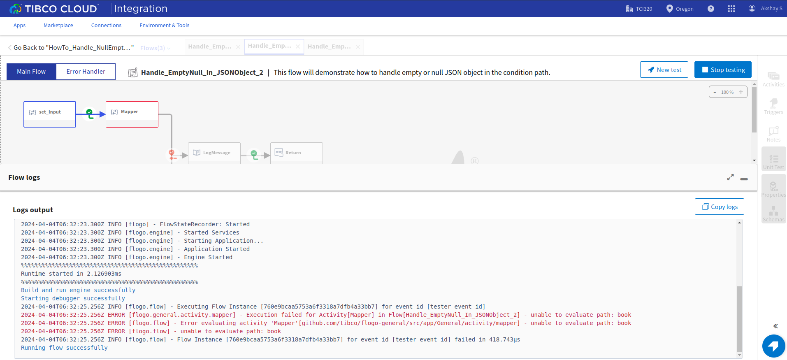

# Error Handling of null or empty JSON objects within condition paths. 

## Prerequisites
TIBCO Cloud™ Integration - latest version. 

## Overview
This Flogo application demonstrates 03 different techniques to handle null or empty JSON objects in complex arrays within the condition path. The flow also demonstrates the logic to check if an array is null or empty within the condition path. 

Effectively handling null or empty JSON objects within the condition paths is useful to ensure the right flows and transactions are executed during the service execution. The logic can be further enhanced by handling the null and empty objects for retry mechanism with an appropriate error message. 

## Steps to use the Flogo application: 
1. Download the Flogo application (JSON file) from [here.](https://github.com/TIBCOSoftware/tci-flogo/blob/master/samples/app-dev/Basic-Concepts/branching-errorhandling/flogo.sample.error_handling_emptyNullObjects/HowTo_Handle_NullEmptyJSON_ObjArray.json)
2. Login to TIBCO Cloud™ Integration with a valid subscription.
3. Steps to import the Flogo application (from step #1) is listed [here.](https://github.com/TIBCOSoftware/tci-flogo/blob/master/samples/app-dev/readme.md)
4. The imported Flogo app with 03 flows should look like shown below.
5. Every flow represents a way to check for null or empty JSON objects in the condition path. 

6. As shown in below screenshot with the help of error message in flowTester you can enhanced the handling of the null and empty objects.
7. For any additional information, please raise your queries or issues via the Issues section.

