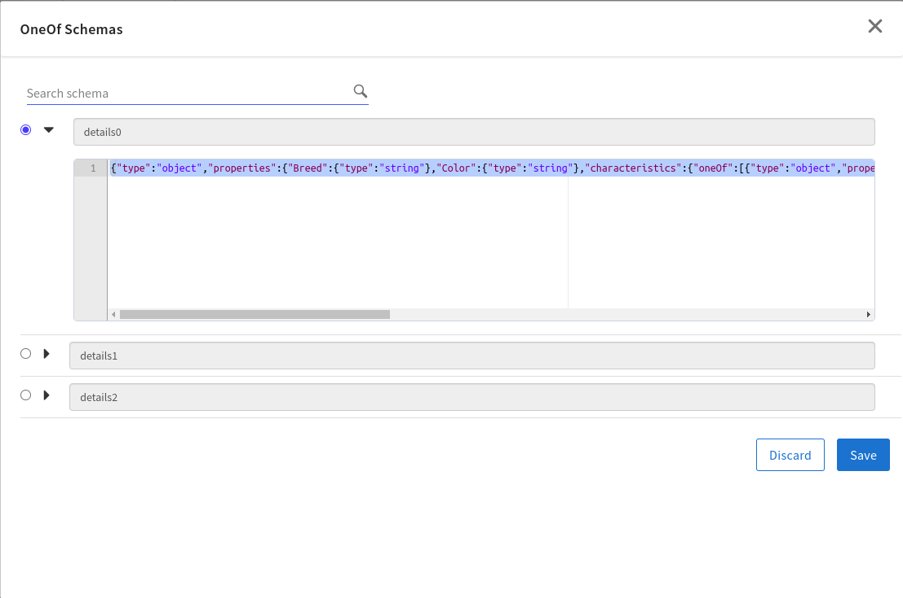
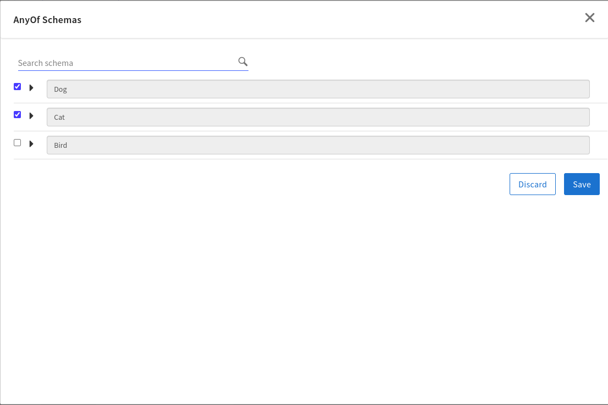

# oneOf-anyOf schema construct

# Description

In JSON Schema, the keywords anyOf and oneOf are used to specify that a data structure must validate against one or more specified schemas.
The oneOf keyword specifies that the data must validate against exactly one of the schemas listed. If it matches more than one, or none at all, the validation fails.
The anyOf keyword allows for validation against multiple schemas. If the data validates against at least one of the schemas listed in anyOf, it is considered valid.

## Import the sample
1. Download the sample json file i.e., *oneOf_anyOf_sample.json*.

2. Create a new empty app.

3. On the app details page, select Import app.

4. Browse on your machine or drag and drop the .json file for the app that you want to import.

5. Click Upload. The Import app dialog displays some generic errors and warnings as well as any specific errors or warnings pertaining to the app you are importing. It validates whether all the activities and triggers used in the app are available in the Extensions tab.

6. You have the option to import all flows from the source app or selectively import flows.

7. Click Next. If you had not selected a trigger in the previous dialog, the flows associated with that trigger are displayed. You have the option to select one or more of these flows such that the flows get imported as blank flows that are not attached to any trigger. By default, all flows are selected. Clear the check box for the flows that you do not want to import. If your flow(s) have subflows, and you select only the main flow but do not select the subflow, the main flow gets imported without the subflow. Click Next.

8. Click on *oneOfsampleflow* and click on mapper activity,navigate to input tab and expand all configurations.Click on oneOf schema and select the radio button corrosponding to needed schema.Save the configuration and verify that in mapper input tab,properties of selected schema are appeared in activity inputs.

9. Click on *anyOfsample* click on mapper activity,navigate to input tab and expand all configurations.Click on anyOf schema and select the checkboxes(multiple schemas can be selected) corrosponding to required schema.Save the configuration and verify that in mapper input tab,properties of selected schema are appeared in activity inputs.

10. Fill the mapper inputs and verify response in flow tester

**Note:- For oneOf schema we have used schema having oneOf keyword, similarly for anyOf .**
**Note:- Schema constructs can be used where schema is being used eg- Mapper and Invoke REST Service activity and Receive HTTP Message trigger.**
**Note:- Return and Reply to Trigger activity does not possess selecting oneOf-anyOf schema since it is driven by trigger reply of Receive HTTP Message .**
## Contributing
If you want to build your own activities for Flogo please read the docs here.

If you want to showcase your project, check out [tci-awesome](https://github.com/TIBCOSoftware/tci-awesome)

You can also send an email to `tci@tibco.com`

## Feedback
If you have feedback, don't hesitate to talk to us!

* Submit feature requests on our [TCI Ideas](https://ideas.tibco.com/?project=TCI) or [FE Ideas](https://ideas.tibco.com/?project=FE) portal
* Ask questions on the [TIBCO Community](https://community.tibco.com/answers/product/344006)
* Send us a note at `tci@tibco.com`

## Help
Please visit our [TIBCO Cloud&trade; Integration documentation](https://integration.cloud.tibco.com/docs/) and TIBCO Flogo® Enterprise documentation on [docs.tibco.com](https://docs.tibco.com/) for additional information.

## License
This TCI Flogo SDK and Samples project is licensed under a BSD-type license. See [license.txt](license.txt).
