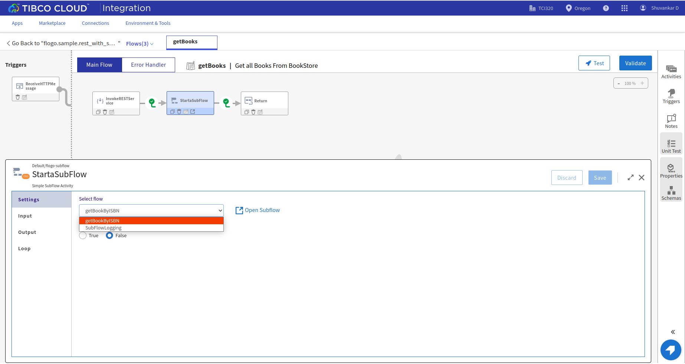
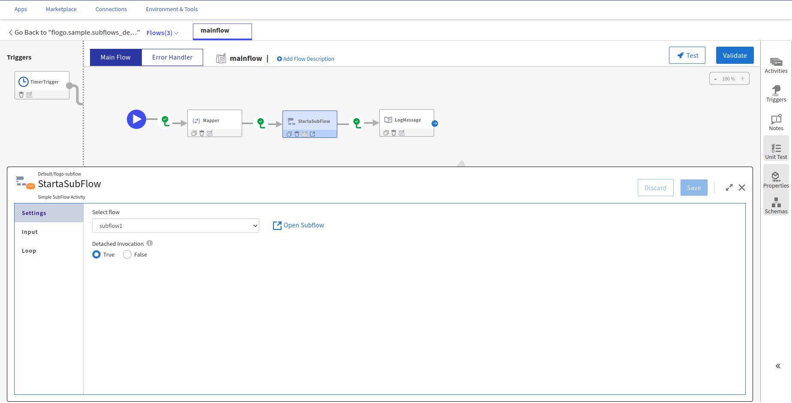
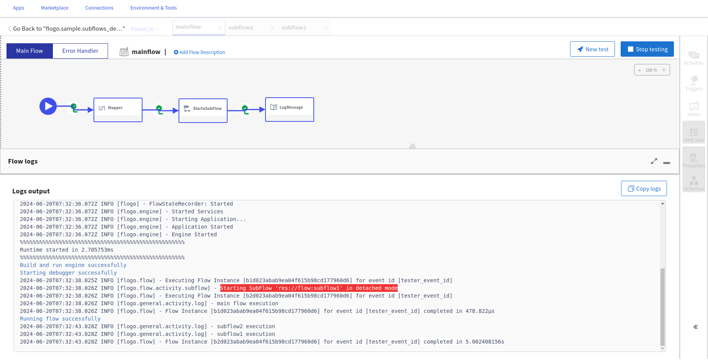

# Subflows Sample

This sample is modeled on sample BookStore application and invoke a REST API  at the backend that delivers sample JSON data. This backend REST API is hosted at - hosted at https://my-json-server.typicode.com/tibcosoftware/tci-flogo/Book

First you will need to upload Throw Error Extention from [github.com/TIBCOSoftware/flogo-contrib/activity/error](https://github.com/TIBCOSoftware/flogo-contrib/tree/master/activity/error)

If you run any of these samples locally using TIBCO Flogo® Enterprise -

1. To Get all Books - You will need to hit the url - http://localhost:9999/books/ 
2. To Get Book By ISBN - you will need to hit the url - http://localhost:9999/books/1451648537
3. If you want to test Error Handler, you can hit the above url with Invalid ISBN number like http://localhost:9999/books/999
4. You can check the sample JSON data for correct ISBN to be used while testing the samples - https://my-json-server.typicode.com/tibcosoftware/tci-flogo/Book

## Import a sample

1. Download the sample's .json file.

2. Create a new empty app.

3. On the app details page, select Import app.

4. Browse on your machine or drag and drop the .json file for the app that you want to import.

5. Click Upload. The Import app dialog displays some generic errors and warnings as well as any specific errors or warnings pertaining to the app you are importing. It validates whether all the activities and triggers used in the app are available in the Extensions tab.

6. You have the option to import all flows from the source app or selectively import flows.

7. Click Next. If you had not selected a trigger in the previous dialog, the flows associated with that trigger are displayed. You have the option to select one or more of these flows such that the flows get imported as blank flows that are not attached to any trigger. By default, all flows are selected. Clear the check box for the flows that you do not want to import. If your flow(s) have subflows, and you select only the main flow but do not select the subflow, the main flow gets imported without the subflow. Click Next.

8. Subflow configuration. On opening StartaSubFlow activity we can see in settings tab, we see list of available subflows , open subflow button and an option to set detached invocation to 
true/false

9. Opening a subflow. On selecting a subflow and saving it, upon clicking on Open Subflow button, it append the slected subflow to the right of current flow. We can also open or append a subflow 
by clicking on Open Subflow on StartaSubFlow activity tile.

10. Set Detached Invocation.Refer to app json "flogo.sample.subflows_detachedInvocation"
Setting detached invocation to True, subflow is invoked in fire and forget mode, in such case main flow will not wait for subflow completion. Since main flow is independent of subflow output, the Output tab is hidden upon setting detached invocation. Detached Invocation is set to False by default

In this case 'subflow1' is invoked in detached invocation True mode from mainflow. So mainflow will not wait for completion for subflow1 and will execute the activities ahead.Since subflow1 is invoked in detached True mode we will have 'Starting SubFlow 'res://flow:subflow1' in detached mode' printed in logs.

Upon encountering 'subflow1' in detached mode, the execution moves to completion of main flow and 'main flow execution' is printed followed by 'subflow2 execution' and 'subflow1 execution'.
Same can be understood by timestamp difference in logs.

## Contributing
If you want to build your own activities for Flogo please read the docs here.

If you want to showcase your project, check out [tci-awesome](https://github.com/TIBCOSoftware/tci-awesome)

You can also send an email to `tci@tibco.com`

## Feedback
If you have feedback, don't hesitate to talk to us!

* Submit feature requests on our [TCI Ideas](https://ideas.tibco.com/?project=TCI) or [FE Ideas](https://ideas.tibco.com/?project=FE) portal
* Ask questions on the [TIBCO Community](https://community.tibco.com/answers/product/344006)
* Send us a note at `tci@tibco.com`

## Help
Please visit our [TIBCO Cloud&trade; Integration documentation](https://integration.cloud.tibco.com/docs/) and TIBCO Flogo® Enterprise documentation on [docs.tibco.com](https://docs.tibco.com/) for additional information.

## License
This TCI Flogo SDK and Samples project is licensed under a BSD-type license. See [license.txt](license.txt).
