# JavaScript activity Sample- array.filter(), array.indexOf() and array.map()

## Description

This sample demonstate an example of JavaScript array.filter(), array.indexOf() and array.map() functions using flogo 'Execute JavaScript' activity.
The sample app takes two arrays in input parameters and filters first array based on the conditions- 1. elements that are present in second array, 2. elements that are not present in second array and then retruns the two new filtered arrays.

## Prerequisites

* Basic knowledge of JavaScript

## Import the sample

1. Download the sample's .json file 'array_filter_js.json'

2. Create a new empty app.

3. On the app details page, select Import app.

4. Browse on your machine or drag and drop the .json file for the app that you want to import.
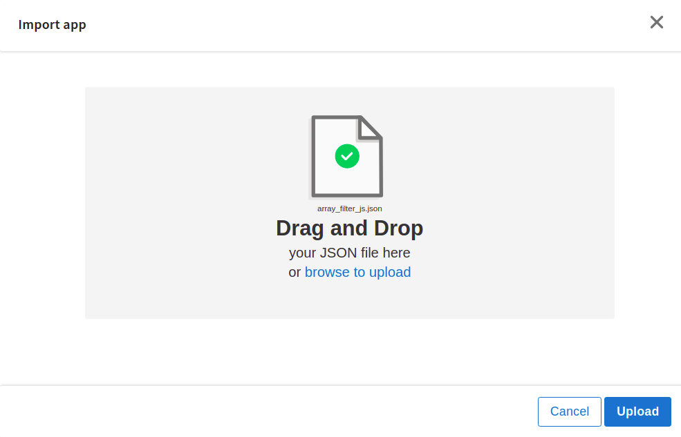

5. Click Upload. The Import app dialog displays some generic errors and warnings as well as any specific errors or warnings pertaining to the app you are importing. It validates whether all the activities and triggers used in the app are available in the Extensions tab.
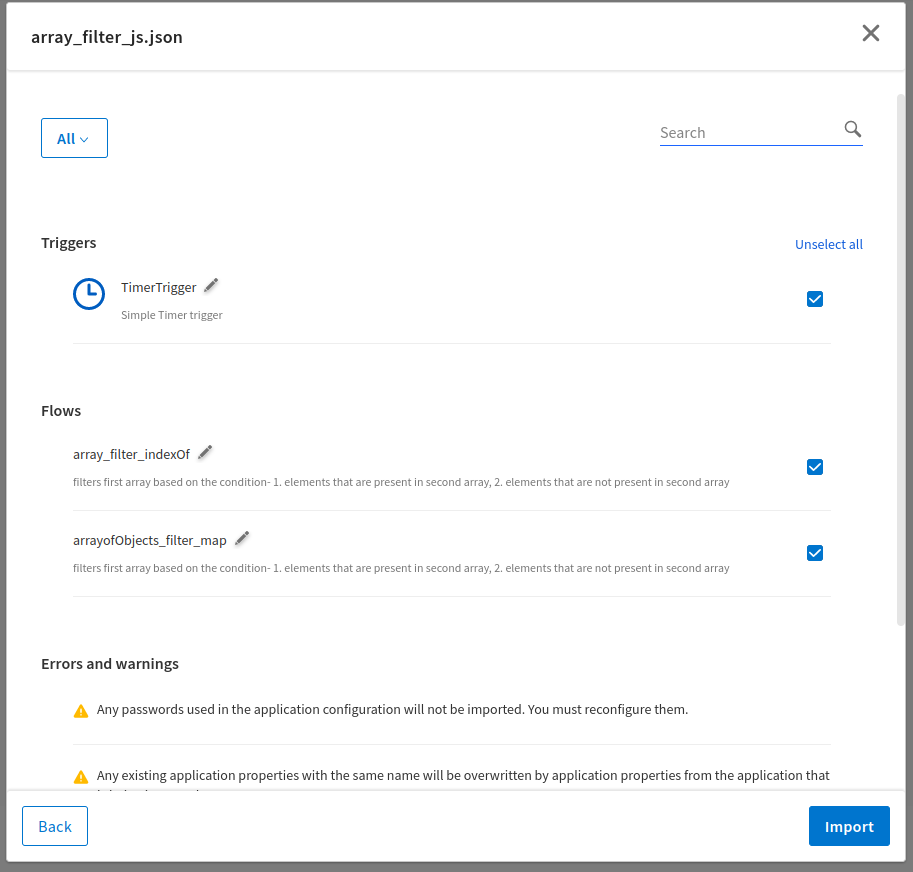

6. You have the option to import all flows from the source app or selectively import flows.

7. If you choose selective import, select the trigger, flow and connection. Click Next.

## Understanding the configuration

1. The first flow 'array_filter_indexOf' takes two integer arrays from the input parameters and use array.filter() function to filter the first array.
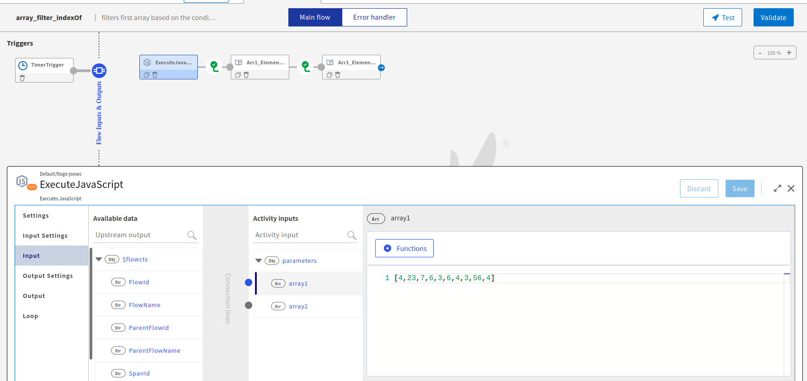
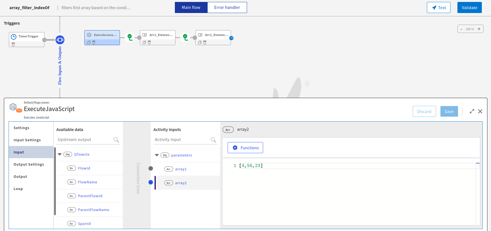

The First condition 'arr2.indexOf(e) > -1' expects index value of iterating elements in array2 to be greater than -1 that shows the element is present in array2 and the matching element is returned to a new array3.
In second condition 'arr2.indexOf(e) === -1', if index value is -1 that means the element is not present in array2 then retrun non matching element in new array4.
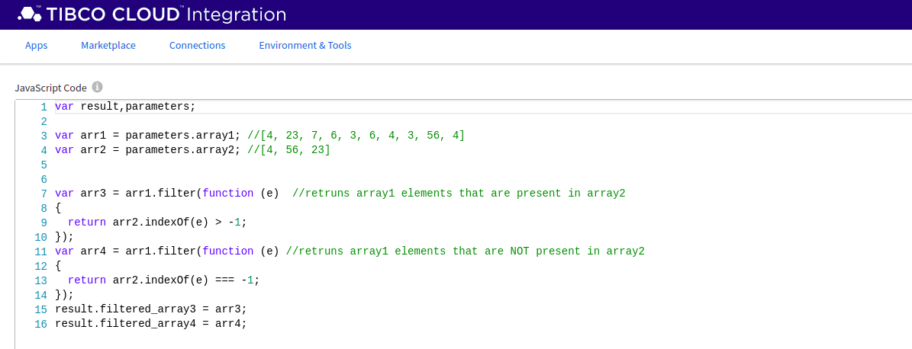
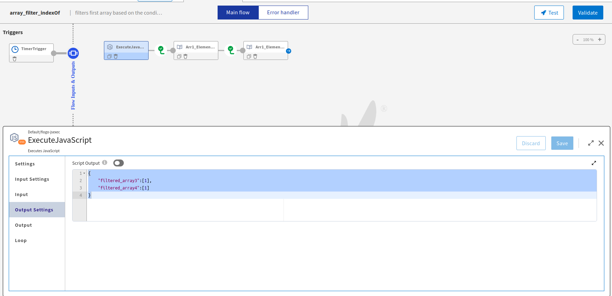
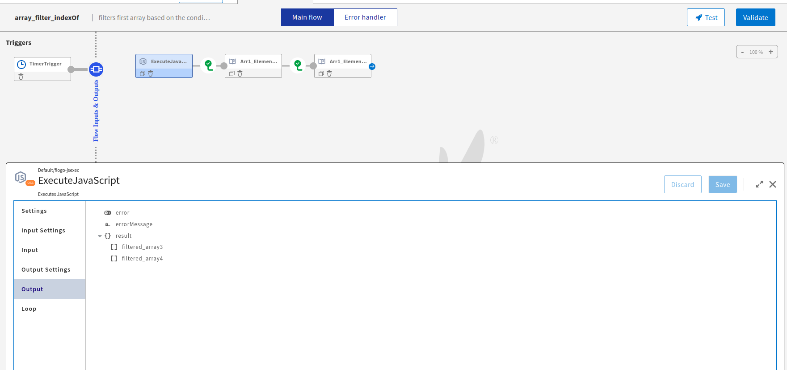

2. The second flow 'arrayofObjects_filter_map' does the same thing with different logic and inputs. It takes two array of objects coming from timer trigger in the input settings of js activity and stores the ids from the input array2 in a new array 'arrayofIds' using map() function. Then filters the first array with ids in 'arrayofIds' array. Based on the condition 'e.id === arrayofIds[i]' to be true or false, it stores the result in new arrays then print in logs.
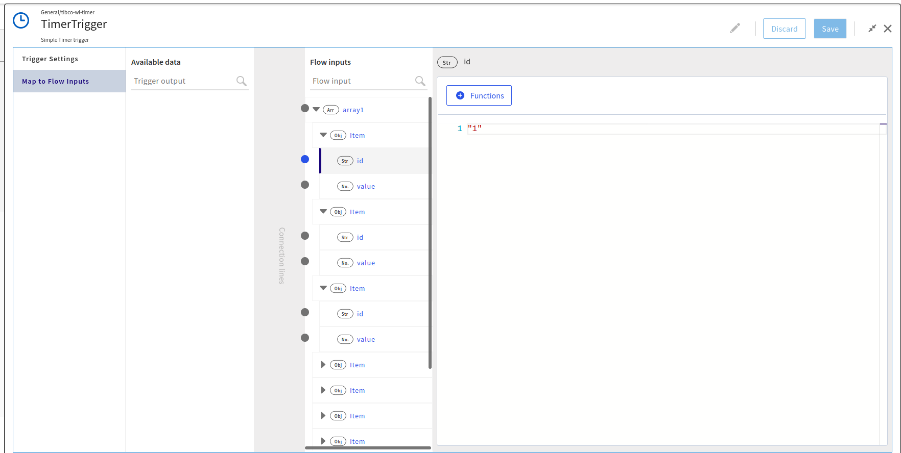
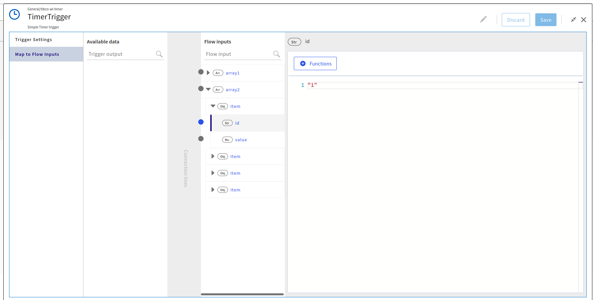
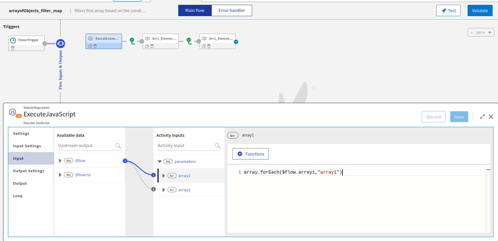
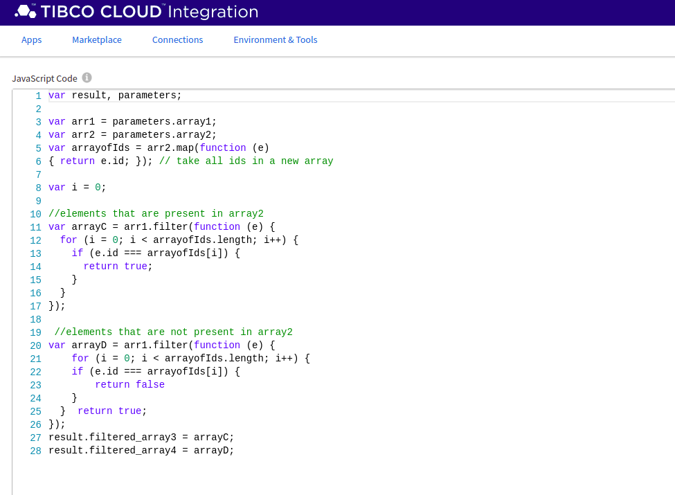

Note that, you must declare result and parameters variables to access input and output parameters in js code.

### Run the application
Once you are ready to run the application, you can use Push option and later run this app.
Once it reaches to Running state, go to Logs tab and check the results. It prints filerted arrays in log activities.

If you want to test the sample in the Flow tester, hit 'Test' button on top right corner and create a new launch configuration. First flow does not require any flow inputs.
To run the second flow in tester, use the input schema from 'input_schema_arrayFilter' text file in the launch configuration.

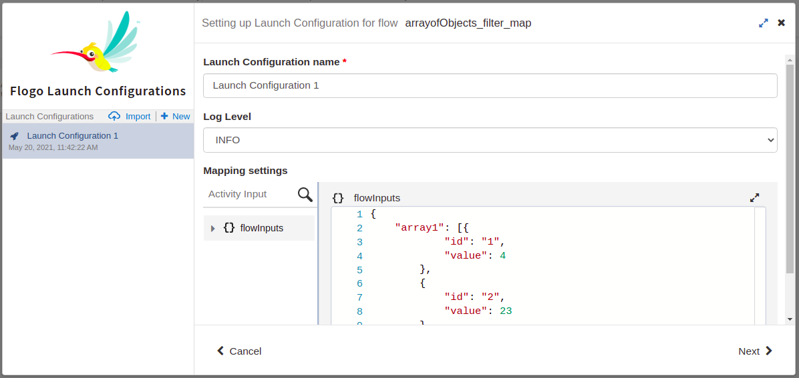
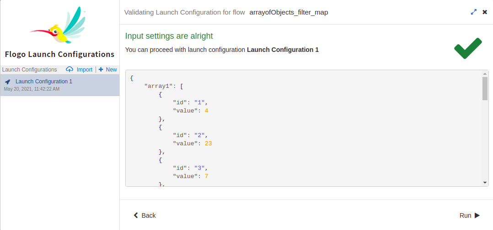

## Outputs

1. Flow Tester Logs
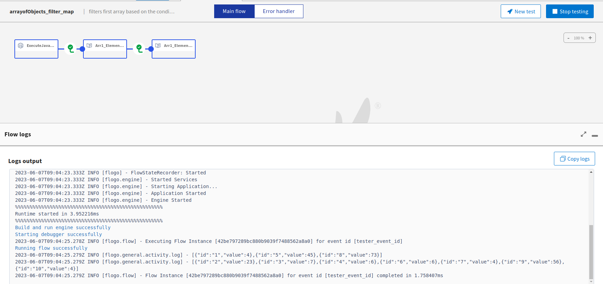

2. Application Logs
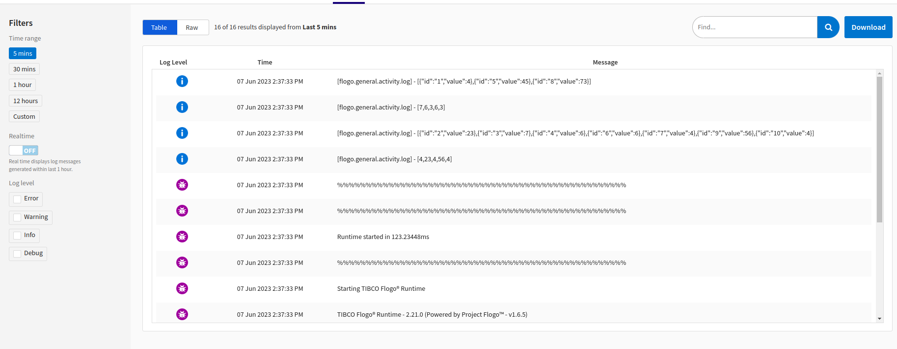

## Contributing
If you want to build your own activities for Flogo please read the docs here.

If you want to showcase your project, check out [tci-awesome](https://github.com/TIBCOSoftware/tci-awesome)

You can also send an email to `tci@tibco.com`

## Feedback
If you have feedback, don't hesitate to talk to us!

* Submit feature requests on our [TCI Ideas](https://ideas.tibco.com/?project=TCI) or [FE Ideas](https://ideas.tibco.com/?project=FE) portal
* Ask questions on the [TIBCO Community](https://community.tibco.com/answers/product/344006)
* Send us a note at `tci@tibco.com`

## Help
Please visit our [TIBCO Cloud&trade; Integration documentation](https://integration.cloud.tibco.com/docs/) and TIBCO Flogo® Enterprise documentation on [docs.tibco.com](https://docs.tibco.com/) for additional information.

## License
This TCI Flogo SDK and Samples project is licensed under a BSD-type license. See [license.txt](license.txt).
