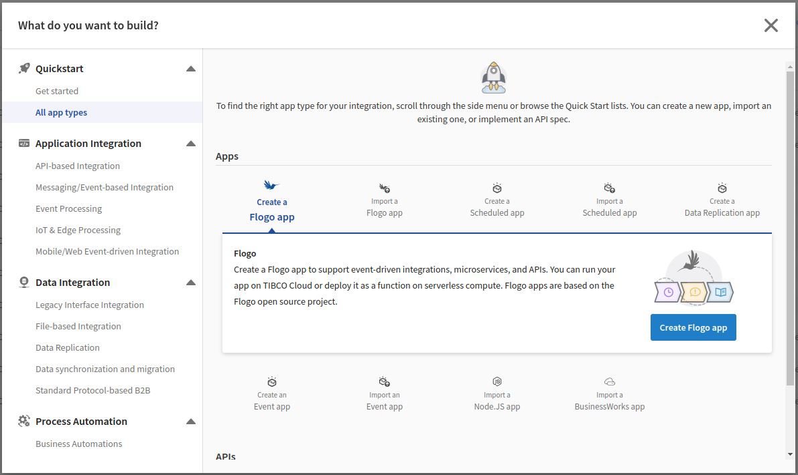

# JavaScript activity Sample- array.forEach()

## Description

This sample demonstate an example of JavaScript array.forEach() function using flogo 'Execute JavaScript' activity.
The flow invokes a rest service that returns an array of book objects. The 'Execute JavaScript' activity then returns the book details for those books which have signed attribute set as true using array.forEach() function.

## Prerequisites

* Basic knowledge of JavaScript

## Import the sample

1. Download the sample's .json file 'get_signedBooks_js.json'

2. Create a new empty app.

3. On the app details page, select Import app.

4. Browse on your machine or drag and drop the .json file for the app that you want to import.

5. Click Upload. The Import app dialog displays some generic errors and warnings as well as any specific errors or warnings pertaining to the app you are importing. It validates whether all the activities and triggers used in the app are available in the Extensions tab.

6. You have the option to import all flows from the source app or selectively import flows.

7. If you choose selective import, select the trigger and flow. Click Next.

## Understanding the configuration

The flow invokes a rest service that returns an array of book objects. The ExecuteJavaSript activity takes this array in input parameters and iterate over it using forEach() function. It pushes the book objects to a new array which satisfy the 'signed = true' condition then retruns the new array using result output parameter.
Note that, you must declare result and parameters variables to access input and output parameters in js code.

### Run the application
Once you are ready to run the application, you can use Push option and later run this app.
Once it reaches to Running state, go to Logs tab and check the results. It prints the signed books objects in the log activities.

If you want to test the sample in the Flow tester, hit 'Test' button on top right corner and create a new launch configuration. It does not require any flow inputs.

## Outputs

1. Flow tester Logs

3. Application Endpoint Response

3. Application Logs

## Contributing
If you want to build your own activities for Flogo please read the docs here.

If you want to showcase your project, check out [tci-awesome](https://github.com/TIBCOSoftware/tci-awesome)

You can also send an email to `tci@tibco.com`

## Feedback
If you have feedback, don't hesitate to talk to us!

* Submit feature requests on our [TCI Ideas](https://ideas.tibco.com/?project=TCI) or [FE Ideas](https://ideas.tibco.com/?project=FE) portal
* Ask questions on the [TIBCO Community](https://community.tibco.com/answers/product/344006)
* Send us a note at `tci@tibco.com`

## Help
Please visit our [TIBCO Cloud&trade; Integration documentation](https://integration.cloud.tibco.com/docs/) and TIBCO Flogo® Enterprise documentation on [docs.tibco.com](https://docs.tibco.com/) for additional information.

## License
This TCI Flogo SDK and Samples project is licensed under a BSD-type license. See [license.txt](license.txt).
