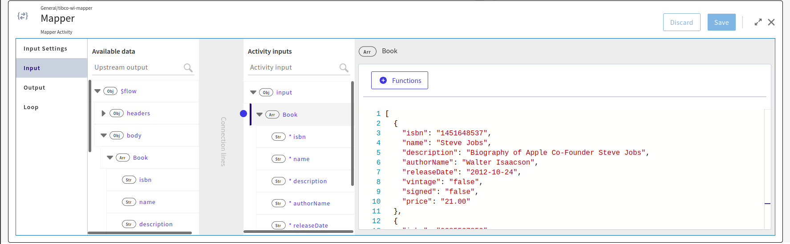
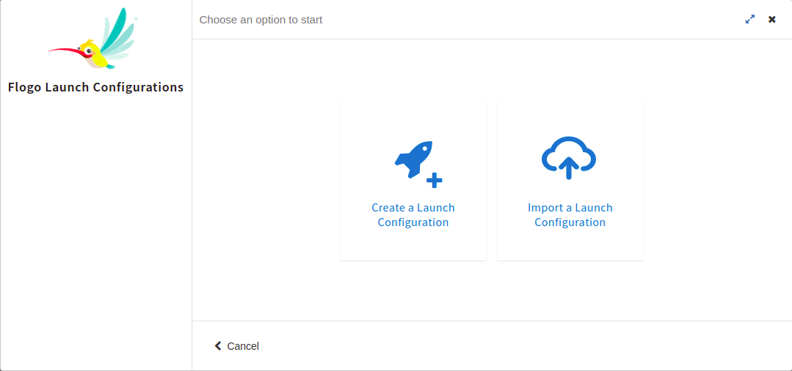

# FirstClassArrayForEach

## Description

Complex arrays are arrays of objects that can optionally contain nested arrays. You can map these arrays using the 3 available options - Configure with Items, Configure with Source and Configure with JSON.

## Prerequisites

* Access to Tibco Cloud Integration – Develop

## Understanding the configuration

1. Configure with Source
When mapping arrays of objects, you can filter the objects that are mapped by specifying a filter in the Filter by field when Configure with Source option is selected.
Specify the filter in the Filter by field. The Select Source value is the scope of the element that is mapped and the Loop name is the scoping variable.
To add the filter in the Filter by field, the Source name and the Loop name must be specified.

2. Configure with Items
When you use the Configure with Items option, you define an implicit scope consisting of everything available in the Available data. It is equivalent to creating an implicit array with a single object element consisting of everything in the Available data. Hence, the resulting length of the array is always one element.

3. Configure with JSON
There may be situations when you want to map an element within an array of objects to an output element that is not in an array or belongs to a non-matching array in the Available data. In such a situation, you must create an array with a single element. You do this by using the Configure with JSON option. When you use this option, it creates an array with an item having a single object element. The single object element treats everything in the Available data as the children of the newly created array object element.

## Import the sample

1. Download the FirstClassArrayForEach_AllThreeConfigurations.json file.'

2. Create a new empty app.

3. On the app details page, select Import app.

4. Browse on your machine or drag and drop the .json file for the app that you want to import.

5. Click Upload. The Import app dialog displays some generic errors and warnings as well as any specific errors or warnings pertaining to the app you are importing. It validates whether all the activities and triggers used in the app are available in the Extensions tab.

6. You have the option to import all flows from the source app or selectively import flows.

7. If you choose selective import, select the trigger, flow and connection. Click Next.

8. Click mapper activity you will see input schema in Input Settings.

9. Go to Inputs and expand Activity input and build array using any of the below options

### Run the application
Once you are ready to run the application, you can use Push option and later run this app.
Once it reaches to Running state, go to Logs tab and check the results. It prints filerted arrays in log activities.

If you want to test the sample in the Flow tester, hit 'Test' button on top right corner and create a new launch configuration. First flow does not require any flow inputs.
To run the second flow in tester, use the input schema from 'input_schema_arrayFilter' text file in the launch configuration.

1. Configure with Source

2. Configure with Item

3. Configure with JSON

## Outputs

1. Configure with Source

2. Configure with Item

3. Configure with JSON

## Contributing
If you want to build your own activities for Flogo please read the docs here.

If you want to showcase your project, check out [tci-awesome](https://github.com/TIBCOSoftware/tci-awesome)

You can also send an email to `tci@tibco.com`

## Feedback
If you have feedback, don't hesitate to talk to us!

* Submit feature requests on our [TCI Ideas](https://ideas.tibco.com/?project=TCI) or [FE Ideas](https://ideas.tibco.com/?project=FE) portal
* Ask questions on the [TIBCO Community](https://community.tibco.com/answers/product/344006)
* Send us a note at `tci@tibco.com`

## Help
Please visit our [TIBCO Cloud&trade; Integration documentation](https://integration.cloud.tibco.com/docs/) and TIBCO Flogo® Enterprise documentation on [docs.tibco.com](https://docs.tibco.com/) for additional information.

## License
This TCI Flogo SDK and Samples project is licensed under a BSD-type license. See [license.txt](license.txt).
