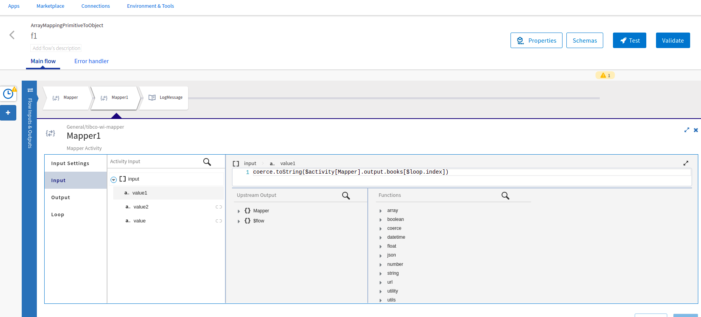

# $Loop.Index Sample.

## Description

This sample demonstates an example of accessing and mapping each element of primitive array to object array using $loop.index.

## Import the sample

1. Download the sample's .json file 'ArrayMappingPrimitiveToObject.json'

2. Create a new empty app.

3. On the app details page, select Import app.

4. Browse on your machine or drag and drop the .json file for the app that you want to import.

5. Click Upload. The Import app dialog displays some generic errors and warnings as well as any specific errors or warnings pertaining to the app you are importing. It validates whether all the activities and triggers used in the app are available in the Extensions tab.

6. You have the option to import all flows from the source app or selectively import flows.

7. If you choose selective import, select the trigger, flow and connection. Click Next.

## Understanding the configuration

1. The first mapper activity has in the flow has the integer primitive array.

2. The second mapper activity has the mapping of Object array to primitive array using array.foreach().

3. For the child element of the object array, we are accessing and mapping each element of primitive array using $loop.index as index.

4. The Log message simply prints the output of the previous mapper activity.

### Run the application
Once you are ready to run the application, you can use Push option and later run this app.
Once it reaches to Running state, go to Logs tab and check the results. 

If you want to test the sample in the Flow tester, hit 'Test' button on top right corner and create a new launch configuration, click on 'Next' and then 'Run' button. The flow does not require any flow inputs.

## Outputs

1. Flow Tester Logs

2. Application Logs

## Contributing
If you want to build your own activities for Flogo please read the docs here.

If you want to showcase your project, check out [tci-awesome](https://github.com/TIBCOSoftware/tci-awesome)

You can also send an email to `tci@tibco.com`

## Feedback
If you have feedback, don't hesitate to talk to us!

* Submit feature requests on our [TCI Ideas](https://ideas.tibco.com/?project=TCI) or [FE Ideas](https://ideas.tibco.com/?project=FE) portal
* Ask questions on the [TIBCO Community](https://community.tibco.com/answers/product/344006)
* Send us a note at `tci@tibco.com`

## Help
Please visit our [TIBCO Cloud&trade; Integration documentation](https://integration.cloud.tibco.com/docs/) and TIBCO Flogo® Enterprise documentation on [docs.tibco.com](https://docs.tibco.com/) for additional information.

## License
This TCI Flogo SDK and Samples project is licensed under a BSD-type license. See [license.txt](license.txt).
