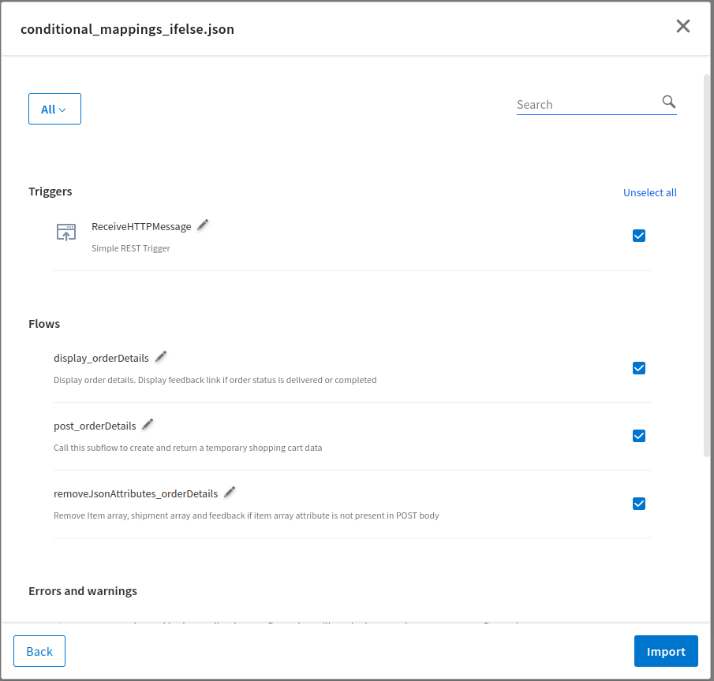
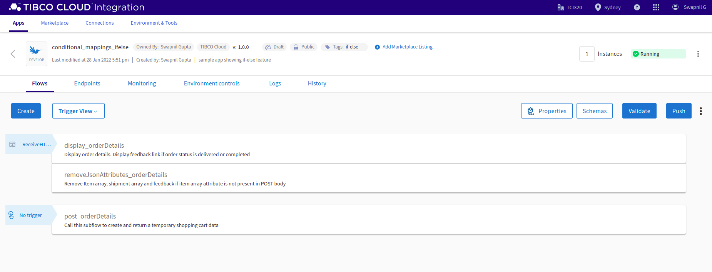
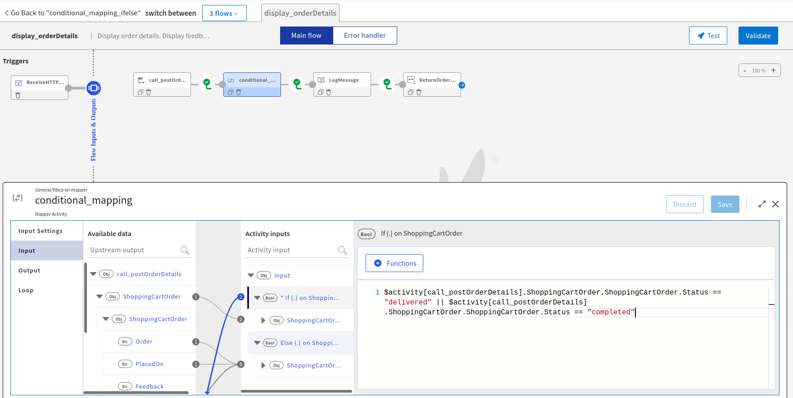
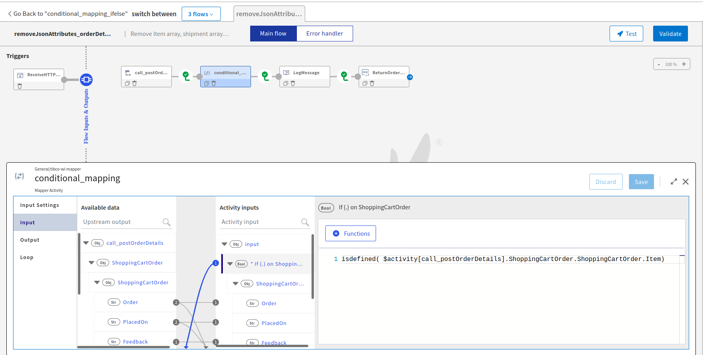

# Conditional Mappings Sample- if/else

## Description

This sample demonstrates an example of conditional data mappings using if-else blocks. The app contains two flows and a subflow. The subflow post the shopping order details using InvokeRestService activity and returns the created object containing shopping order details. The two flows are used to display these order details based on the following conditions-
1. if the order status is delivered or completed then display the feedback link to user otherwise feedback link should not be displayed in the output
2. if the input JSON (POST body) does not contain item array then we do not want to display certain attributes or json tags in the output (remove null value for the non-existing JSON keys)

## Prerequisites

* Access to Tibco Cloud Integration - Develop

## Import the sample

1. Download the sample's .json file 'conditional_mappings_ifelse.json'

2. Create a new empty app.

3. On the app details page, select Import app.

4. Browse on your machine or drag and drop the .json file for the app that you want to import.

5. Click Upload. The Import app dialog displays some generic errors and warnings as well as any specific errors or warnings pertaining to the app you are importing. It validates whether all the activities and triggers used in the app are available in the Extensions tab.

6. You have the option to import all flows from the source app or selectively import flows.

7. If you choose selective import, select the trigger and flow. Click Next.

## Understanding the configuration

* The app has two flows and one subflow. The subflow 'post_orderDetails' contains a invokeRestService activity to POST order details and returns the created data.
* The flow display_orderDetails calls this subflow to create an order with order details. To acheive the first objective of displaying feedback link based on the order status, we have added a condition on ShoppingCartOrder object using kebab menu in its input field in a mapper activity. The if condition is defined as '$activity[call_postOrderDetails].ShoppingCartOrder.ShoppingCartOrder.Status == "delivered" || $activity[call_postOrderDetails].ShoppingCartOrder.ShoppingCartOrder.Status == "completed"'.
If the condition matches, we show all attributes in output json along with feedback link. To remove 'feedback' attribute in output json we do not map it in else block.

* Similarly, to achieve the second objective to remove an attribute from output which is not present in POST body, we can use isdefined() function in if condition. In second flow 'removeJsonTags_orderDetails', we are checking if item[] attribute is present in POST body using the if condition 'isdefined( $activity[call_postOrderDetails].ShoppingCartOrder.ShoppingCartOrder.Item)'. If present or defined then display all order details else do not display item[], sheipment[] and feedback attributes in the output.

* We might think of ternary operator to achieve this but that would end up setting null or empty value "". So Feedback cannot be removed from output using this approach. It would show null or "". 
** $activity[call_postOrderDetails].ShoppingCartOrder.ShoppingCartOrder.Status == "delivered" ?  $activity[call_postOrderDetails].ShoppingCartOrder.ShoppingCartOrder.Feedback : null

## Run the application

Once you are ready to run the application, you can use Push option and then run this app.
Once it reaches to Running state, go to API tester and hit tryout the first endpoint. You can use below input JSON (Note that Status is 'pending'. You can also try with 'delivered' or 'completed'):
* {
  "ShoppingCartOrder": {
    "Order": "D01-8127020-6200600",
    "PlacedOn": "2017-10-21",
    "Feedback": "https://3err.bitly.com/feed",
    "Status": "pending",
    "Item": [
      {
        "Description": "A Product for Everyone",
        "Code": "D01-8127020-6200600-1-1",
        "Price": 13.69,
        "Quantity": 1
      }
    ],
    "Shipment": [
      {
        "Arriving": "2017-10-23",
        "DeliveryAddress": {
          "City": "Swindon",
          "County": "Wiltshire",
          "Line1": "76 Godwin Road",
          "Line2": "Stratton",
          "PostCode": "SN34XG"
        }
      }
    ]
  }
}

For second endpoint, you can use the below input JSON (Note that there is no Item[]):
* {
  "ShoppingCartOrder": {
    "Order": "D01-8127020-6200600",
    "PlacedOn": "2017-10-21",
    "Feedback": "https://3err.bitly.com/feed",
    "Status": "delivered",
    "Shipment": [
      {
        "Arriving": "2017-10-23",
        "DeliveryAddress": {
          "City": "Swindon",
          "County": "Wiltshire",
          "Line1": "76 Godwin Road",
          "Line2": "Stratton",
          "PostCode": "SN34XG"
        }
      }
    ]
  }
}

## Outputs

1. Output of first flow:

2. Endpoint Response for second flow

3. Application Logs for second flow

## Contributing
If you want to build your own activities for Flogo please read the docs here.

If you want to showcase your project, check out [tci-awesome](https://github.com/TIBCOSoftware/tci-awesome)

You can also send an email to `tci@tibco.com`

## Feedback
If you have feedback, don't hesitate to talk to us!

* Submit feature requests on our [TCI Ideas](https://ideas.tibco.com/?project=TCI) or [FE Ideas](https://ideas.tibco.com/?project=FE) portal
* Ask questions on the [TIBCO Community](https://community.tibco.com/answers/product/344006)
* Send us a note at `tci@tibco.com`

## Help
Please visit our [TIBCO Cloud&trade; Integration documentation-Conditional Mappings](https://integration.cloud.tibco.com/docs/index.html#Subsystems/flogo/flogo-all/conditional-mapping.html) for additional information.

## License
This TCI Flogo SDK and Samples project is licensed under a BSD-type license. See [license.txt](license.txt).
